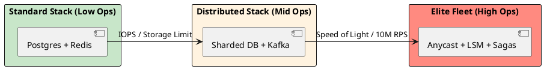

# 4.3: The Principal's Selection Matrix: Trade-offs at Scale

## Learning Objectives

After this module you can:
- Apply the "Conservation of Complexity" principle to justify every architectural choice with a quantified trade-off
- Use the two-phase bottleneck check (Disk IOPS vs Network RTT vs CPU Jitter) to select the right component
- Present a selection decision in a design review using the trade-off table format (Profit vs Tax)
- Explain why moving from Standard Stack to Distributed Stack is a one-way door and should be deferred
- Construct a selection rationale for any architecture question in a Staff/Principal interview

## Prerequisites

- Chs 4.1–4.2: SQL/NoSQL trade-offs and caching strategies — the matrix references these directly
- General awareness of Kafka, Redis, CDN, Anycast (deep dives in later chapters)

---

## The Critical Dialogue


**Student:** I feel like I'm drowning in choices. Every problem seems to have three different solutions. How do I keep the "Advantages and Disadvantages" straight in my head during a high-stakes design session?


**Principal:** You are looking for the **Architecture Cheat Sheet**. But a Principal doesn't "Memorize" lists; they understand the **Conservation of Complexity**. If you gain speed in one area, you pay for it with consistency in another. I've distilled our foundations into a single **Selection Matrix**. Use this to justify your weapon of choice.


---


## 1. The Architectural Selection Matrix


| Component | Best Use Case | Architectural Profit | Technical Tax |
| :--- | :--- | :--- | :--- |
| **SQL (B-Tree)** | Financial Ledgers, ACID. | Strong Integrity. | Hard to scale writes. |
| **NoSQL (LSM)** | Feeds, Logging, Metadata. | Infinite Write Throughput. | Eventual Consistency. |
| **Message Queue** | Task distribution, Emails. | Smart Broker Routing. | Throughput Bottleneck. |
| **Message Hub** | Event Sourcing, Analytics. | 1M+ RPS Replayability. | Consumer Logic Tax. |
| **L1 Cache** | Hot-keys (e.g. Current User). | Nanosecond speed. | Coherence Drift (Stale). |
| **L2 Cache** | Shared State (e.g. Cart). | Shared Truth for Fleet. | Network & Serial Tax. |
| **CDN (Edge)** | Video, Static Artifacts. | Absorbs 99% of traffic. | Invalidation complexity. |
| **Anycast BGP** | Global Edge Discovery. | Shortest-path routing. | BGP Hijacking risk. |


---


## 2. Decision Mechanics: Choosing the Poison


### 2.1 The "Two-Phase" Decision Rule
A Principal uses a two-step mental filter:
. **1. The Necessity Check:** Can I solve this in the **Engine Room** (Chapter 1) alone?
. **2. The Bottleneck Check:** Which law of physics am I hitting?
. . If it's **Disk IOPS**, use NoSQL.
. . If it's **Network RTT**, use Anycast/CDN.
. . If it's **CPU Jitter**, use Ring Buffers/Off-heap.


---


## 3. Visualizing the Complexity Stack


**What is it?**
The diagram shows the relationship between "Ease of Use" and "Scale Potential."


**Why do we use it?**
To prevent **Premature Optimization**. You should only move "Right" on this stack when the physics of your current layer forces you to.





---


## 4. Source Archaeology: Bottleneck Identification Tools

### 4.1 Identifying the Bottleneck Layer

```
Disk IOPS bottleneck indicators:
  iostat -x 1 → %util > 80%, await > 5ms
  pg_stat_bgwriter → buffers_checkpoint high (B-Tree write amplification)
  → Solution: LSM-based NoSQL (Cassandra, RocksDB) — sequential writes, no in-place update

Network RTT bottleneck indicators:
  tcpdump → SYN/ACK round trips on every request
  curl -w "%{time_connect} %{time_total}" https://api.example.com/
  → 250ms base latency London→Tokyo (speed of light)
  → Solution: CDN for static content, Anycast for API edge routing

CPU Jitter bottleneck indicators:
  async-profiler → safepoints visible in flamegraph (Ch 17.1)
  JFR event: GC → STW duration > 10ms
  → Solution: ZGC/Shenandoah, off-heap storage (Ch 3.2), Ring Buffers (LMAX Disruptor)
```

### 4.2 "Conservation of Complexity" — Where It Goes

```
Choosing a Message Hub (Kafka) over a Message Queue (RabbitMQ):

Architectural Profit: 1M+ RPS replayability, consumer lag independence
Technical Tax: Consumer group management, offset commit logic, exactly-once
              semantics need transactions (producer.initTransactions())
              Dead Letter Queue handling more complex

The complexity doesn't disappear — it moves from "broker routing" to "consumer logic"
A Principal explicitly decides: "I accept the consumer complexity, because broker
throughput limitation would require sharding RabbitMQ anyway at 500k msg/sec"
```

---

## 5. Code Lab

### Lab: Trade-off Documentation Template

```java
// The Selection Matrix is not just a theory concept — use it in code reviews and RFCs
// This is the format a Principal uses to document a technology choice:

/*
DECISION: Replace PostgreSQL full-text search with Elasticsearch for order search

PROFIT:
- Inverted index: full-text query time drops from 2,400ms to 12ms (200x)
- Faceted search without GROUP BY scans
- Near-real-time indexing (1s delay acceptable for search results)

TAX:
- Eventual consistency: 1s lag between write and searchable (explicitly acceptable)
- Dual-write complexity: orders written to PG + indexed to ES (risk: index drift)
- New operational component: ES cluster management, snapshots, memory tuning
- Synchronization recovery: if ES index corrupted, rebuild from PG takes 4 hours

BOTTLENECK HIT: CPU + IOPS on PG full-text GIN index scans at 500 queries/sec
ALTERNATIVE CONSIDERED: PG pg_trgm extension — rejected (still 800ms, not scalable)
REVERSAL COST: High (data migration back, re-tooling search clients) — one-way door
DECISION: Proceed. Dual-write with reconciliation job. Accept 1s staleness.
*/
```

---

## 6. Production Lens

### One-Way Door Decisions in Practice

```
Real-world migration costs (estimated from public post-mortems):

Standard Stack → Distributed Stack migrations:
PostgreSQL monolith → Cassandra shards
  Migration time: 14-18 months, 2 team-years
  Risk: data inconsistency during dual-write period
  Reversal cost: essentially impossible at scale

Redis Cluster → Kafka event sourcing
  Migration time: 6-9 months
  Risk: event ordering guarantees require consumer rewrite
  
Lesson: Each step right on the complexity stack adds:
  - 2-3x operational complexity (monitoring, runbooks, oncall playbooks)
  - 1 dedicated SRE per new component at scale
  - 6+ months of institutional knowledge to staff ramp-up

The "Standard Stack" (Postgres + Redis) handles:
  50M daily active users, 10K req/sec, 10TB data — without sharding
  Source: GitHub ran on MySQL monolith until 2021 (100M+ users)
```

---

## 7. Exercises

**1.** Why does a Principal prefer one component at 80% capability over two at 100%? Calculate the reliability impact: if each component has 99.9% uptime, what is the combined system uptime when they are in series? In parallel?

**2.** Why is CDN invalidation "expensive"? When you call Cloudflare's purge API for `report.pdf`, what must happen across all 300+ PoPs globally? Why does it take 30 seconds and why is eventual propagation acceptable?

**3.** If money were infinite, would we ever need Distributed Stack? Answer by considering speed-of-light latency (London to Tokyo = 250ms round trip), which is a physical limit that no amount of vertical scaling can overcome. Name one other physical limit that money cannot buy around.

**4. Coding challenge:** Implement an `ArchitectureSelectionAdvisor` that accepts a list of `Requirement` objects (requestsPerSecond, dataVolumeTB, consistencyRequired: boolean, globalRegions: int) and returns a `StackRecommendation` (STANDARD/DISTRIBUTED/ELITE) with an explanation string. Use the bottleneck thresholds from this module. Write unit tests for at least 5 scenarios.

**5.** The matrix lists "Message Hub" with "1M+ RPS Replayability" as profit. At what message rate does switching from RabbitMQ to Kafka become justified? Research Confluent's benchmarks — what is the max sustained throughput of a single RabbitMQ queue vs Kafka partition?

---

## Exercise Solutions

<details>
<summary>Exercise 1 — 80% capacity preferred; serial vs parallel reliability</summary>

**Why 80% over 100%:** A component at 100% capacity has no headroom to absorb traffic spikes, gradual load growth, or the failure of a peer component. When traffic doubles for 10 seconds (Black Friday flash sale), a 100% component collapses. An 80% component absorbs 20% spikes without degradation. This is the same reason CPU-based autoscaling triggers at 60-70% — you need time for new instances to start before the system is overloaded.

**Reliability calculations:**

**In series** (both components must be available): System uptime = A × B = 0.999 × 0.999 = **99.8%** downtime doubles to 17.5h/year.

**In parallel** (system available if either component is available): System downtime = (1-A) × (1-B) = 0.001 × 0.001 = 0.000001. System uptime = **99.9999%** — downtime drops to 31 seconds/year.

**Implication:** Adding components in series degrades reliability; adding in parallel improves it. A microservices architecture with many sequential service calls compounds downtime — a chain of 10 services at 99.9% each gives 99.0% system availability (87 hours/year downtime). Design for parallel/async paths wherever possible.

**Staff-level phrasing:** "Series reliability = product of uptimes (compounds failure); parallel reliability = 1 - product of failure rates (99.9999% for two 99.9% components); every synchronous service-to-service call in a chain multiplies downtime — prefer async/parallel to preserve SLA."

</details>

<details>
<summary>Exercise 2 — Why CDN cache invalidation takes 30 seconds</summary>

CDN invalidation is a **distributed cache invalidation problem** at global scale:

1. You call Cloudflare's purge API → the request reaches one central control plane
2. The control plane must notify all 300+ PoPs (Points of Presence) around the world
3. Each PoP has its own local cache — it must receive and process the invalidation signal, verify the version, and mark the entry as stale
4. The notification propagates via Cloudflare's internal backbone network (BGP-based WAN links with varying latency from 50ms to 250ms RTT between geographically distant PoPs)
5. Until a PoP receives the invalidation, it continues serving stale content

**Why 30 seconds:** Propagating to 300+ PoPs sequentially via WAN takes real network time. Even with parallel notification, tail latency (the slowest 1-2 PoPs) defines the "complete purge" time. Cloudflare guarantees 99% of PoPs purged within 30 seconds, not instantaneous.

**Why eventual propagation is acceptable:** During the 30-second window, users see at most a slightly stale version of `report.pdf`. For most content types (marketing pages, reports, images), this is not a correctness issue. The alternative — synchronous global invalidation — would make CDN purge latency hundreds of milliseconds and block your API call.

**Staff-level phrasing:** "CDN purge = notify 300+ PoPs via WAN backbone, each must invalidate its local cache; tail latency (slowest PoP) defines the 30s guarantee; eventual consistency is acceptable for most content — only true real-time correctness requirements justify the purge cost vs versioned URLs."

</details>

<details>
<summary>Exercise 3 — Speed-of-light constraint; physical limits money cannot overcome</summary>

**Speed of light argument:** London to Tokyo = ~9,500 km. Fiber optic light travels at ~200,000 km/s (66% of vacuum speed). Minimum one-way latency = 9,500 / 200,000 = ~47ms. Round trip = ~95ms. No vertical scaling (bigger machines, faster CPUs) reduces this — it is a physical constant.

Distributed architecture (CDN + Anycast + multi-region replicas) places a copy of the data at a Tokyo PoP, converting the 95ms London→Tokyo RTT into a <5ms local RTT. No single data center, no matter how powerful, can do this.

**One other physical limit money cannot buy around:**
**Disk I/O seek time on mechanical hard drives (~4-10ms per random access).** Spinning disk seek time is governed by the physics of magnetic head movement over rotating platters. No amount of money makes a HDD seek in 0.1ms — it requires replacing the mechanical disk with SSDs (which have their own physical limits: NAND write endurance, PCIe bus bandwidth). Similarly, **nuclear decay rates** (relevant for security timing attacks) and **thermal noise** (minimum amplifiable signal in electronics) are physical limits no budget overrides.

**Staff-level phrasing:** "Speed of light = 200,000 km/s in fiber: London→Tokyo is 95ms minimum regardless of hardware budget; only geographic distribution (CDN/multi-region) overcomes physics by moving data closer; secondary physical limit: spinning disk seek time (~4-10ms) — overcome by SSD, not by faster CPUs."

</details>

<details>
<summary>Exercise 4 — Coding challenge: ArchitectureSelectionAdvisor</summary>

```java
// Reference implementation (Java 21+)
public class ArchitectureSelectionAdvisor {

    public enum Stack { STANDARD, DISTRIBUTED, ELITE }
    public record Requirement(long requestsPerSecond, double dataVolumeTB,
                               boolean consistencyRequired, int globalRegions) {}
    public record StackRecommendation(Stack stack, String explanation) {}

    public StackRecommendation recommend(Requirement r) {
        // ELITE: > 500k RPS, > 1PB, global > 5 regions
        if (r.requestsPerSecond() > 500_000 || r.dataVolumeTB() > 1_000 || r.globalRegions() > 5) {
            return new StackRecommendation(Stack.ELITE,
                String.format("ELITE: %,d RPS / %.1f TB / %d regions exceeds Distributed Stack limits; " +
                    "requires custom sharding, geo-distributed consensus, and dedicated infra team.",
                    r.requestsPerSecond(), r.dataVolumeTB(), r.globalRegions()));
        }
        // DISTRIBUTED: > 10k RPS, > 10TB, or multiple regions with strict consistency
        if (r.requestsPerSecond() > 10_000 || r.dataVolumeTB() > 10 || r.globalRegions() > 1) {
            return new StackRecommendation(Stack.DISTRIBUTED,
                String.format("DISTRIBUTED: %,d RPS / %.1f TB / %d regions requires horizontal scaling, " +
                    "sharding, and geo-aware routing%s.",
                    r.requestsPerSecond(), r.dataVolumeTB(), r.globalRegions(),
                    r.consistencyRequired() ? " with strong consistency (Raft/Paxos)" : ""));
        }
        // STANDARD: everything else
        return new StackRecommendation(Stack.STANDARD,
            String.format("STANDARD: %,d RPS / %.1f TB / %d region — PostgreSQL + Redis handles this; " +
                "no sharding needed. Focus on single-region reliability first.",
                r.requestsPerSecond(), r.dataVolumeTB(), r.globalRegions()));
    }

    public static void main(String[] args) {
        var advisor = new ArchitectureSelectionAdvisor();
        // Test 5 scenarios
        assert advisor.recommend(new Requirement(1000, 0.5, true, 1)).stack() == Stack.STANDARD;
        assert advisor.recommend(new Requirement(50_000, 50, false, 1)).stack() == Stack.DISTRIBUTED;
        assert advisor.recommend(new Requirement(1_000_000, 500, false, 3)).stack() == Stack.ELITE;
        assert advisor.recommend(new Requirement(5_000, 5, true, 2)).stack() == Stack.DISTRIBUTED;
        assert advisor.recommend(new Requirement(8_000, 8, false, 1)).stack() == Stack.STANDARD;
        System.out.println("All 5 scenarios passed.");
    }
}
```

**Why this works:** The thresholds mirror the module's bottleneck analysis (10k RPS / 10TB for single-region Standard Stack). The advisor encodes the decision tree as a guard-clause chain — most permissive check last, most restrictive first. In a real advisor, each threshold would be configurable and justified by quantified infrastructure benchmarks.

**Common mistake:** Conflating `requestsPerSecond` with `requestsPerDay` — always check units. 10k RPS = 864M req/day; many services have 10M req/day = ~115 RPS, well within Standard Stack territory.

</details>

<details>
<summary>Exercise 5 — RabbitMQ vs Kafka: throughput threshold for switching</summary>

**Switch threshold:** Kafka becomes justified when you need sustained throughput above ~50,000–100,000 messages/second per topic OR when you require message replay (re-consumption of historical messages).

**Benchmarks:**
- **Single RabbitMQ queue:** ~50,000–100,000 msg/sec sustained for small messages (depends on persistence, acknowledgment mode, message size). With publisher confirms and per-message ack: ~20,000–40,000 msg/sec. Above this, RabbitMQ queue depth grows unboundedly under sustained load.
- **Single Kafka partition:** ~1,000,000 msg/sec for small messages (Confluent benchmarks show 1M+ msg/sec on a single broker with sequential writes). A partition is append-only sequential I/O — near-disk-bandwidth limited, not CPU limited.

**Beyond throughput — when Kafka is the ONLY option:**
- **Replay:** Kafka retains messages for configurable time (days/weeks). Consumers can rewind and re-process. RabbitMQ deletes messages after acknowledgment — no replay.
- **Fan-out to many consumers:** Multiple consumer groups can independently consume the same Kafka partition stream. In RabbitMQ, each consumer gets a separate copy of the message (exchange fan-out is expensive).
- **Event sourcing:** Kafka's immutable log is a natural fit for event sourcing — the log IS the source of truth.

**Staff-level phrasing:** "Switch from RabbitMQ to Kafka at ~50k–100k msg/sec sustained OR when you need replay/rewind capability — Kafka partition is sequential I/O-limited at ~1M msg/sec vs RabbitMQ's ~50k with acks; RabbitMQ wins for low-throughput, complex routing (exchange topology) and per-message TTL/DLQ patterns."

</details>

---

## 8. Summary / Flashcard

- **Every architectural choice is a trade-off, not a free upgrade**: moving from SQL to NoSQL gains write throughput but loses JOIN capability and strong consistency — the complexity doesn't disappear, it moves to the application layer
- **The two-phase bottleneck check prevents premature optimization**: identify WHICH physical law you are hitting (Disk IOPS, Network RTT, CPU Jitter) before selecting a component — most systems at 10K req/sec hit none of these with a Standard Stack
- **Standard Stack (Postgres + Redis) scales to 50M DAU, 10TB, 10K req/sec** without sharding: GitHub used MySQL monolith for 100M users; moving to Distributed Stack adds 2-3x operational complexity and 6+ months of institutional knowledge ramp-up
- **One-way door decisions require quantified justification**: migrating PostgreSQL to Cassandra takes 14-18 months and is practically irreversible at scale — document the exact bottleneck you hit, the alternative you rejected, and the reversal cost before committing
- **CDN/Anycast solves the speed-of-light constraint that money cannot**: London to Tokyo is 250ms minimum; Anycast routes users to the nearest PoP automatically via BGP, making the effective RTT sub-50ms regardless of origin server location
