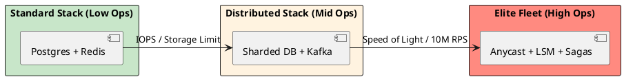

# 4.3: The Principal's Selection Matrix: Trade-offs at Scale

## The Critical Dialogue

**Student:** I feel like I'm drowning in choices. Every problem seems to have three different solutions. How do I keep the "Advantages and Disadvantages" straight in my head during a high-stakes design session?

**Principal:** You are looking for the **Architecture Cheat Sheet**. But a Principal doesn't "Memorize" lists; they understand the **Conservation of Complexity**. If you gain speed in one area, you pay for it with consistency in another. I've distilled our foundations into a single **Selection Matrix**. Use this to justify your weapon of choice.

---

## 1. The Architectural Selection Matrix

| Component | Best Use Case | Architectural Profit | Technical Tax |
| :--- | :--- | :--- | :--- |
| **SQL (B-Tree)** | Financial Ledgers, ACID. | Strong Integrity. | Hard to scale writes. |
| **NoSQL (LSM)** | Feeds, Logging, Metadata. | Infinite Write Throughput. | Eventual Consistency. |
| **Message Queue** | Task distribution, Emails. | Smart Broker Routing. | Throughput Bottleneck. |
| **Message Hub** | Event Sourcing, Analytics. | 1M+ RPS Replayability. | Consumer Logic Tax. |
| **L1 Cache** | Hot-keys (e.g. Current User). | Nanosecond speed. | Coherence Drift (Stale). |
| **L2 Cache** | Shared State (e.g. Cart). | Shared Truth for Fleet. | Network & Serial Tax. |
| **CDN (Edge)** | Video, Static Artifacts. | Absorbs 99% of traffic. | Invalidation complexity. |
| **Anycast BGP** | Global Edge Discovery. | Shortest-path routing. | BGP Hijacking risk. |

---

## 2. Decision Mechanics: Choosing the Poison

### 2.1 The "Two-Phase" Decision Rule
A Principal uses a two-step mental filter:
. **1. The Necessity Check:** Can I solve this in the **Engine Room** (Chapter 1) alone?
. **2. The Bottleneck Check:** Which law of physics am I hitting?
. . If it's **Disk IOPS**, use NoSQL.
. . If it's **Network RTT**, use Anycast/CDN.
. . If it's **CPU Jitter**, use Ring Buffers/Off-heap.

---

## 3. Visualizing the Complexity Stack

**What is it?**
The diagram shows the relationship between "Ease of Use" and "Scale Potential."

**Why do we use it?**
To prevent **Premature Optimization**. You should only move "Right" on this stack when the physics of your current layer forces you to.

---

## 🧠 Principal's Inquiry

. **The Failure Area:** Why does a Principal always prefer one component that does 80% of the job over two components that do 100%?

. **Cost of Invalidation:** Why is the "Technical Tax" of a CDN (Invalidation) often more expensive than the "Storage Tax"?

. **Horizontal vs Vertical:** If money was infinite, would we ever need to move from the "Standard Stack" to the "Elite Fleet"?

**Principal Summary:** Selection is the **Art of the Sacrifice**. We use the Selection Matrix to choose our trade-offs scientifically, ensuring our Global Ledger is built on calculated logic rather than architectural hope.
 Greenlanders use the type system to prove our software invariants.
