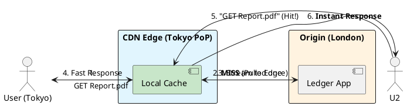

# 4.5: Content Delivery Physics: Push vs. Pull

## The Critical Dialogue

**Student:** I've sharded my database and added a global Redis cache. But users in Tokyo are still complaining that the PDF reports take 5 seconds to load from our London datacenter. Is the internet just "Slow"?

**Principal:** The internet isn't "Slow," but the **Speed of Light** is a constant. A round-trip from London to Tokyo takes ~250ms. If your report requires 20 TCP round-trips to transfer, you've already lost 5 seconds before the user's CPU even starts rendering. To reach Principal level, we must master **Content Delivery Physics**. We will move the "Heavy Data" to the **Edge** using a **CDN**.

---

## 1. The Requirement: Global Proximity

**The Problem:** The "Speed of Light Wall."
. **The Physics:** Data travels at ~200,000 km/s in fiber. Earth's circumference is 40,000 km.
. **The Goal:** Reduce the physical distance between the data and the user to < 500km.

---

## 2. Solution: CDN Models (Push vs. Pull)

A Principal chooses a CDN strategy based on the **Update Frequency** of the content.

### 2.1 The Pull Model (Origin-Shield)
**Mechanism:** The user requests a file from the CDN. If the CDN doesn't have it (Miss), it "Pulls" it from your server (The Origin) and caches it.
. **Best For:** High-volume, viral content.
. **Pros:** Low maintenance.

### 2.2 The Push Model (Proactive)
**Mechanism:** Your application actively "Pushes" new files to the CDN as soon as they are created.
. **Best For:** Critical updates where you cannot afford a "Miss".

---

## 3. Visualizing the Origin Shield

**What is it?**
The following diagram shows how a CDN PoP in Tokyo shields the London Origin from 99% of requests.

**Why do we use it?**
To achieve **Scale Invariance**. As 1,000,000 users in Tokyo join, the load on the London server remains constant at 1 request.

---

## 🧠 Principal's Inquiry

. **The TTL Dilemma:** If you set a `TTL` of 1 hour, what happens if you fix a typo in a Ledger report?

. **Purging Physics:** Why is a "Global Purge" of a CDN cache expensive and slow?

. **Invalidation vs Versioning:** Why do Big Tech companies prefer `report_v2.pdf` over invalidating `report.pdf`?

**Principal Summary:** Content Delivery is about **Geographic Caching**. We move from a central "Fortress" to a global "Grid" of edge nodes, ensuring our Ledger's artifacts are physically close to every user on earth.
 Greenlanders use the type system to prove our software invariants.
