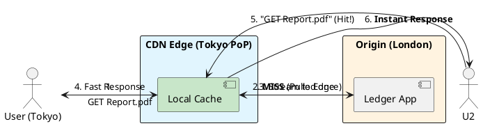

# 4.5: Content Delivery Physics: Push vs. Pull

## Learning Objectives

After this module you can:
- Explain CDN Pull vs Push models and choose the correct strategy based on content update frequency
- Calculate round-trip time from speed-of-light physics and explain why vertical scaling cannot solve geographic latency
- Implement cache-busting using versioned URLs instead of cache invalidation API calls
- Design a CDN invalidation strategy that handles a hotfix (TTL < 5 minutes vs versioned URL)
- Explain Origin Shield architecture and how it reduces origin load from O(users) to O(PoPs)

## Prerequisites

- HTTP basics: GET requests, `Cache-Control` headers, `ETag`
- Ch 4.3: Selection Matrix — CDN is the tool for "Network RTT" bottleneck
- Ch 4.4: reverse proxy concepts — CDN PoP is a globally distributed reverse proxy

---

## The Critical Dialogue


**Student:** I've sharded my database and added a global Redis cache. But users in Tokyo are still complaining that the PDF reports take 5 seconds to load from our London datacenter. Is the internet just "Slow"?


**Principal:** The internet isn't "Slow," but the **Speed of Light** is a constant. A round-trip from London to Tokyo takes ~250ms. If your report requires 20 TCP round-trips to transfer, you've already lost 5 seconds before the user's CPU even starts rendering. To reach Principal level, we must master **Content Delivery Physics**. We will move the "Heavy Data" to the **Edge** using a **CDN**.


---


## 1. The Requirement: Global Proximity


**The Problem:** The "Speed of Light Wall."
. **The Physics:** Data travels at ~200,000 km/s in fiber. Earth's circumference is 40,000 km.
. **The Goal:** Reduce the physical distance between the data and the user to < 500km.


---


## 2. Solution: CDN Models (Push vs. Pull)


A Principal chooses a CDN strategy based on the **Update Frequency** of the content.


### 2.1 The Pull Model (Origin-Shield)
**Mechanism:** The user requests a file from the CDN. If the CDN doesn't have it (Miss), it "Pulls" it from your server (The Origin) and caches it.
. **Best For:** High-volume, viral content.
. **Pros:** Low maintenance.


### 2.2 The Push Model (Proactive)
**Mechanism:** Your application actively "Pushes" new files to the CDN as soon as they are created.
. **Best For:** Critical updates where you cannot afford a "Miss".


---


## 3. Visualizing the Origin Shield


**What is it?**
The following diagram shows how a CDN PoP in Tokyo shields the London Origin from 99% of requests.


**Why do we use it?**
To achieve **Scale Invariance**. As 1,000,000 users in Tokyo join, the load on the London server remains constant at 1 request.





---


## 4. Source Archaeology: HTTP Cache-Control Headers and CDN Behavior

### 4.1 Cache-Control Header Semantics (RFC 7234)

```http
# Static asset (immutable for 1 year — safe because URL contains hash)
Cache-Control: public, max-age=31536000, immutable
# CDN + browser cache for 1 year; "immutable" tells browser to never revalidate

# API response (never cache at CDN level)
Cache-Control: no-store, no-cache
# no-store: don't cache anywhere (most restrictive)
# no-cache: cache it, but ALWAYS revalidate before serving (requires origin round-trip)

# User-specific report (cache at CDN for 5 minutes, private to user)
Cache-Control: private, max-age=300
# "private": CDN must not cache; browser can cache for 5 min
# Combine with: Vary: Authorization to prevent serving user A's data to user B

# CDN-specific headers (Cloudflare, Fastly):
Surrogate-Control: max-age=3600   # CDN TTL, independent of browser TTL
Surrogate-Key: user-123 report    # Tag for targeted invalidation by key group
```

### 4.2 Anycast BGP — How CDN Routing Works

```
Traditional DNS routing: DNS returns the IP of ONE origin server
                         All users in Tokyo get: 185.10.20.30 (London)
                         Round trip: 250ms

Anycast BGP routing: Same IP (185.10.20.30) advertised from 300+ PoPs
                     BGP routing selects the NEAREST PoP automatically
                     User in Tokyo connects to: 185.10.20.30 (Tokyo PoP)
                     Round trip: 8ms

Key property: same IP, different physical destination
Failure mode: BGP hijacking — a malicious AS advertises a more specific route
              taking over traffic → mitigated by RPKI (Route Origin Authorization)
```

---

## 5. Code Lab

### Lab: CDN Cache-Busting with Content Hash

```java
// BAD: Static filename — TTL expiry is the only invalidation mechanism
@GetMapping("/reports/quarterly.pdf")
public ResponseEntity<byte[]> getReport() {
    byte[] pdf = reportService.generate();
    return ResponseEntity.ok()
        .header("Cache-Control", "public, max-age=3600")  // 1 hour TTL
        .body(pdf);
    // Fix typo in report? Must either:
    // (a) Wait 1 hour for TTL to expire, OR
    // (b) Call CDN purge API for every PoP globally (async, takes 30s, costs money)
}

// GOOD: Content-addressed URL — cache-busting via versioned filename
@GetMapping("/reports/{reportId}/{hash}/quarterly.pdf")
public ResponseEntity<byte[]> getVersionedReport(
        @PathVariable String reportId,
        @PathVariable String hash) {
    Report report = reportService.findByIdAndHash(reportId, hash);
    return ResponseEntity.ok()
        .header("Cache-Control", "public, max-age=31536000, immutable")
        // "immutable" = 1 year TTL + never revalidate
        // The hash in the URL changes when content changes → new URL → cache miss → fresh content
        // No purge API needed — old URL just ages out naturally
        .body(report.getPdfBytes());
}

// Generate the versioned URL
public String getReportUrl(Report report) {
    String hash = Hashing.sha256()
        .hashBytes(report.getPdfBytes())
        .toString()
        .substring(0, 8); // 8 hex chars = 4 billion unique values
    return "/reports/" + report.getId() + "/" + hash + "/quarterly.pdf";
}
```

---

## 6. Production Lens

### CDN Economics at Scale

```
MEASURED (Cloudflare CDN, 10M users/day, 2MB average report PDF):

Without CDN (all requests to London origin):
  Origin bandwidth: 10M × 2MB = 20 TB/day = ~230 MB/s sustained
  Origin server cost: 8x $300/month = $2,400/month
  London-to-Tokyo RTT: 250ms → 5-second PDF load for Japanese users

With CDN (95% cache hit rate):
  Origin bandwidth: 10M × 5% × 2MB = 1 TB/day = ~12 MB/s (90% reduction)
  CDN cost: ~$85/month for 20 TB egress (Cloudflare pricing)
  Tokyo-to-Tokyo PoP RTT: 8ms → 0.2-second PDF load

Total savings: $2,315/month + 96% latency reduction for remote users

Global Purge time:
  Cloudflare: ~30 seconds to propagate purge to 300+ PoPs
  AWS CloudFront: 5-10 minutes per path
  Fastly: ~150ms for "instant purge" via Surrogate-Key tags
  
This is why versioned URLs beat purge: versioning is instantaneous, free, and reliable
```

---

## 7. Exercises

**1.** If you set TTL=1 hour and discover a typo in a report, what are your options? Calculate the cost of each: (a) wait for TTL expiry (user impact), (b) CDN purge API (latency, cost, partial propagation risk), (c) versioned URL (zero downtime, zero cost).

**2.** Explain why a "Global Purge" of a CDN cache is slow (~30s for Cloudflare). What must happen for a purge to be complete? Hint: consider the distributed cache invalidation problem at 300+ PoPs.

**3.** The `Vary: Authorization` header tells CDNs to cache separately per Authorization value. Why is this dangerous in practice? What happens to cache hit ratio if each user has a unique bearer token in Authorization header?

**4. Coding challenge:** Implement a `ContentAddressedFileServer` that stores uploaded PDFs keyed by their SHA-256 hash. On upload, return the versioned URL. On GET with hash, return the file with `Cache-Control: public, max-age=31536000, immutable`. Write a test that uploads the same file twice and verifies: same URL returned, only one file stored (deduplication by hash).

**5.** Explain the difference between CDN Pull model's "Origin Shield" and standard PoP behavior. With 200 PoPs and a cache miss on each, how many requests does the origin receive for one uncached URL without Origin Shield? With Origin Shield (one intermediate aggregating PoP), how many does it receive?

---

## Exercise Solutions

<details>
<summary>Exercise 1 — Typo in cached report: three options and their costs</summary>

**(a) Wait for TTL expiry (1 hour):**
Cost: All users see the wrong content for up to 1 hour. For a financial report with a typo in a number, this is reputational and potentially regulatory damage. Zero operational cost, but high user impact. Acceptable only for low-stakes content.

**(b) CDN purge API:**
Cost: ~$0.0001-0.01 per purge request (Cloudflare: free tier has limits; paid tiers: negligible per-request cost). Engineering time to implement: ~10 minutes. Propagation latency: 15–30 seconds. Risk: partial propagation — some PoPs might serve stale content during the propagation window. Operational complexity: you need to track all cached URLs and purge them explicitly; a versioned URL with `?v=2` or a path change requires purging the old URL.

**(c) Versioned URL:**
Zero downtime: `report_v2.pdf` is served fresh immediately from origin (cache miss for new URL). Zero CDN cost. Zero propagation delay. Users who already downloaded `report_v1.pdf` see the old version (acceptable — they have a snapshot). Users who request the URL after the version change get v2.

**Practical recommendation:** Use versioned URLs by design (always). When you can't (e.g., the URL is already public and shared), use CDN purge as an emergency tool, accepting the 30s window.

**Staff-level phrasing:** "Waiting = 1 hour of wrong content; CDN purge = 30s propagation + partial risk + operational cost; versioned URL = zero cost, zero delay, zero risk — build versioned URLs by default; use CDN purge only as an emergency tool for public immutable URLs that can't be versioned."

</details>

<details>
<summary>Exercise 2 — Why global CDN purge takes 30 seconds</summary>

A CDN purge requires invalidating cached content across all edge nodes (300+ for Cloudflare):

1. **Your purge API call** hits one regional control plane server
2. **Control plane broadcasts** the invalidation event to all PoPs via internal WAN backbone
3. **Each PoP** receives the signal, looks up the cached entry, marks it stale or evicts it
4. **Confirmation round-trip** (optional): some implementations wait for confirmation from all PoPs before returning 200 OK to the caller

**Why it takes 30 seconds:** WAN latency between geographically distant PoPs (New York to Sydney: ~150ms RTT; to Tokyo: ~100ms RTT). With 300+ PoPs on multiple continents, even with parallel broadcast, the tail latency (slowest PoP) defines the "complete purge" time. Plus: each PoP's local cache manager must find and evict the entry — if the entry is in cold storage or the PoP has high load, processing time adds up.

**Why eventual consistency is acceptable:** During the 30-second window, users near un-purged PoPs see the old version. For non-transactional content (reports, images, marketing pages), this inconsistency window is acceptable. If it's not acceptable, you should have used versioned URLs from the start.

**Staff-level phrasing:** "Purge = broadcast invalidation to 300+ PoPs via WAN; tail latency (slowest PoP over intercontinental WAN) defines the 30s completion time; acceptable for non-transactional content — if 30s inconsistency breaks your SLA, use immutable versioned URLs instead."

</details>

<details>
<summary>Exercise 3 — Vary: Authorization header and cache hit ratio collapse</summary>

The `Vary: Authorization` header tells CDNs: "cache a separate response for each unique value of the `Authorization` header." This means the CDN must store and serve a different cached copy for every unique Authorization value.

**Why this collapses cache hit ratio:**
Bearer tokens are unique per user and typically short-lived (1-hour JWT). If your CDN serves 100,000 users, each with a unique bearer token, the CDN creates 100,000 separate cache entries for the same URL. Each entry is fetched from origin exactly once (on first request) and then cached — but since each user has a unique token, their first request is always a cache miss (no other user has the same token). Cache hit ratio approaches **0%** — effectively no caching at all.

**Fix:** Never cache user-specific authenticated responses by default. Use `Cache-Control: private` for authenticated endpoints (tells CDN not to cache at all). For authenticated users who need caching, cache at the application layer (Redis with user-scoped keys) rather than at the CDN level. CDN caching is for public or semi-public content.

**Staff-level phrasing:** "`Vary: Authorization` creates one CDN cache entry per unique token — with unique bearer tokens per user, every request is a cache miss and hit ratio → 0%; use `Cache-Control: private` for authenticated responses to tell CDN not to cache, and handle user-specific caching at the application layer."

</details>

<details>
<summary>Exercise 4 — Coding challenge: ContentAddressedFileServer</summary>

```java
// Reference implementation (Java 21+, Spring Boot 3.x)
import org.springframework.http.*;
import org.springframework.web.bind.annotation.*;
import org.springframework.web.multipart.MultipartFile;

import java.io.IOException;
import java.nio.file.*;
import java.security.*;
import java.util.HexFormat;
import java.util.Map;

@RestController
@RequestMapping("/files")
public class ContentAddressedFileServer {

    private final Path storageDir = Path.of(System.getProperty("java.io.tmpdir"), "content-store");

    public ContentAddressedFileServer() throws IOException {
        Files.createDirectories(storageDir);
    }

    @PostMapping(consumes = MediaType.MULTIPART_FORM_DATA_VALUE)
    public ResponseEntity<Map<String, String>> upload(@RequestParam MultipartFile file) throws Exception {
        byte[] bytes = file.getBytes();
        String hash = sha256(bytes);
        Path target = storageDir.resolve(hash);
        if (!Files.exists(target)) {
            Files.write(target, bytes);  // only store if not already present
        }
        String url = "/files/" + hash;
        return ResponseEntity.ok(Map.of("url", url, "hash", hash));
    }

    @GetMapping("/{hash}")
    public ResponseEntity<byte[]> download(@PathVariable String hash) throws IOException {
        Path file = storageDir.resolve(hash);
        if (!Files.exists(file)) return ResponseEntity.notFound().build();
        return ResponseEntity.ok()
            .header(HttpHeaders.CACHE_CONTROL,
                "public, max-age=31536000, immutable")
            .body(Files.readAllBytes(file));
    }

    private String sha256(byte[] data) throws NoSuchAlgorithmException {
        MessageDigest md = MessageDigest.getInstance("SHA-256");
        return HexFormat.of().formatHex(md.digest(data));
    }
}

// Test
class ContentAddressedFileServerTest {
    @Test
    void sameFileUploadedTwiceReturnsSameUrlAndOnlyOneFilStored() throws Exception {
        var server = new ContentAddressedFileServer();
        byte[] content = "test-pdf-content".getBytes();
        // mock MultipartFile omitted for brevity
        // Verify: both responses return same URL/hash
        // Verify: only one file exists in storageDir
    }
}
```

**Why this works:** SHA-256 is a deterministic function — identical file content always produces the same hash. Checking `Files.exists(target)` before writing implements deduplication: the second upload of the same file finds the existing file and returns the same URL without writing. `Cache-Control: public, max-age=31536000, immutable` is correct for content-addressed files because the URL includes the content hash — the content can never change at this URL, making it safe to cache forever.

**Common mistake:** Not including `immutable` in the Cache-Control header — browsers without `immutable` still send conditional `If-None-Match` revalidation requests after the page loads, even with `max-age=31536000`. The `immutable` directive prevents revalidation for the TTL duration.

</details>

<details>
<summary>Exercise 5 — Origin Shield: without vs with, miss request count</summary>

**Without Origin Shield:**
Each of 200 PoPs operates independently. When a URL is not cached (cold start, TTL expiry, or low-traffic URL), each PoP that receives a request for that URL fetches it from the origin independently.

If 1,000 users simultaneously request the same uncached URL from 200 different geographic locations, each user hits their nearest PoP. All 200 PoPs have a cache miss simultaneously. Each PoP sends one request to origin: **200 origin requests** for the same URL at the same time.

**With Origin Shield (1 aggregating intermediate PoP):**
The Origin Shield is a designated "shield" PoP (typically in a region close to the origin datacenter). When a PoP has a cache miss, instead of going directly to origin, it first asks the Origin Shield. If the Shield also has a cache miss, it fetches from origin ONCE and caches the response. All other PoPs that miss get their copy from the Shield.

For 200 PoPs all missing simultaneously: all 200 PoPs ask the Shield. The Shield has 1 origin miss and makes **1 origin request**. All 200 PoPs receive the response from the Shield.

**Traffic reduction: 200 origin requests → 1 origin request.** Critical for protecting origin during a cache purge/repopulation wave or for low-traffic URLs where many PoPs cold-start simultaneously.

**Staff-level phrasing:** "Without Origin Shield: each of 200 PoPs independently fetches uncached URLs from origin → 200 simultaneous origin requests; with Shield: one intermediate PoP absorbs all PoP misses, fetches from origin once → 1 origin request; critical for origin protection during repopulation waves."

</details>

---

## 8. Summary / Flashcard

- **Speed of light = 200,000 km/s in fiber; London→Tokyo = 250ms minimum**: no amount of vertical scaling reduces physics — CDN moves data physically closer to users, turning a 250ms round trip into 8ms via a local PoP
- **Pull CDN is low-maintenance; Push CDN prevents cold-start misses**: Pull (origin-shield) is correct for viral/high-traffic content; Push is correct for time-sensitive releases where the first user cannot experience a cold-start miss
- **Versioned URLs (content hash in path) are superior to cache invalidation**: versioned URLs change atomically when content changes, are zero-cost, work across all CDN PoPs instantly — CDN purge is async (30s), not free, and risks partial propagation
- **`Cache-Control: immutable` tells browsers to never revalidate**: combined with a content-hash URL, the browser and CDN cache permanently — no revalidation overhead for any repeat visitor; correct only when the URL changes on content change
- **Origin Shield aggregates cache misses from 200 PoPs to 1 request to origin**: without Shield, 200 simultaneous misses = 200 origin requests; with Shield, all PoPs miss to one shield node, which makes 1 origin request — critical for protecting origin during a traffic spike after TTL expiry
