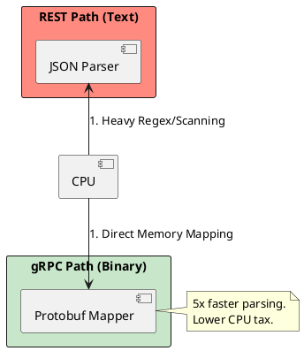

# 4.6: API Architectural Combat: REST, gRPC, and GraphQL

## The Critical Dialogue

**Student:** Everyone uses REST. It's the standard. But my mobile app team wants GraphQL, and the performance team wants gRPC for internal calls. Why can't we just pick one?

**Principal:** You're trying to use a **Universal Translator** for three different cultures. REST is a **Library** (Browseable); gRPC is a **Precision Laser** (Strict); GraphQL is a **Vending Machine** (Selectable). To reach Principal level, we must master the **Protocol Physics**. We move from "Sending JSON" to **Binary and Structural Efficiency**.

---

## 1. The Weaponry: API Styles

### 1.1 REST (The Resource-Based Standard)
. **Philosophy:** Data is a set of resources (`/orders/123`).
. **Best For:** Public APIs and browser-based clients.
. **Disadvantage:** "Over-fetching" (receiving fields you don't need).

### 1.2 gRPC (The High-Speed Binary)
. **Philosophy:** Remote Procedure Calls (calling a function on another server).
. **Protocol:** HTTP/2 (Binary).
. **Physics:** Uses **Protobuf**. It is ~5x faster than REST because binary data is smaller and easier for the CPU to parse than text-based JSON.

### 1.3 GraphQL (The Client-Centric Query)
. **Philosophy:** The client specifies *exactly* what it wants.
. **Best For:** Mobile apps on slow networks where one request must fetch data from 10 different sources.

---

## 2. Visualizing the Serialization Tax

**What is it?**
The diagram shows how the CPU handles a JSON string vs. a Protobuf binary message.

**Why do we use it?**
To justify the switch to gRPC for the high-frequency internal fleet. Binary mapping allows the CPU to skip the "Scanning" phase of JSON parsing.

---

## 🧠 Principal's Inquiry

. **The N+1 Attack:** How can a malicious user crash a GraphQL server with a single recursive query?

. **HTTP/3 (QUIC):** Why are companies like Google moving toward **UDP-based** protocols for global APIs?

. **Binary Contract:** Why is the `.proto` file in gRPC considered a "Single Source of Truth"?

**Principal Summary:** API Combat is about **Selecting the Right Fidelity**. We use gRPC for high-speed internal pipes, GraphQL for complex client needs, and REST for the global web, ensuring our protocols match the physics of the connection.
 Greenlanders use the type system to prove our software invariants.
