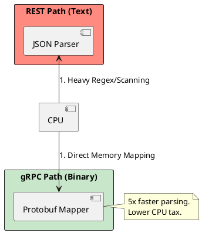

# 4.6: API Architectural Combat: REST, gRPC, and GraphQL

## Learning Objectives

- Explain the serialization cost difference between JSON (REST) and Protobuf (gRPC) in terms of CPU cycles and wire-bytes.
- Select the correct API style (REST, gRPC, GraphQL) for a given use-case by analyzing client variability, performance budget, and contract strictness.
- Identify GraphQL N+1 and recursive-query attack vectors and describe mitigation strategies (DataLoader, query depth limiting).
- Trace how HTTP/2 multiplexing removes head-of-line blocking and why this matters for gRPC bidirectional streaming.
- Design a polyglot API gateway that routes REST externally, gRPC internally, and GraphQL for mobile clients without protocol bleed.

## Prerequisites

- Chapter 4.4 — Proxies and Load Balancing (understanding how API traffic is terminated and forwarded)
- Chapter 4.5 — CDN Push vs Pull (edge delivery context for API responses)
- Chapter 3.3 — Low-Level JDBC Batching (understand serialization overhead in the data tier)


## The Critical Dialogue


**Student:** Everyone uses REST. It's the standard. But my mobile app team wants GraphQL, and the performance team wants gRPC for internal calls. Why can't we just pick one?


**Principal:** You're trying to use a **Universal Translator** for three different cultures. REST is a **Library** (Browseable); gRPC is a **Precision Laser** (Strict); GraphQL is a **Vending Machine** (Selectable). To reach Principal level, we must master the **Protocol Physics**. We move from "Sending JSON" to **Binary and Structural Efficiency**.


---


## 1. The Weaponry: API Styles


### 1.1 REST (The Resource-Based Standard)
. **Philosophy:** Data is a set of resources (`/orders/123`).
. **Best For:** Public APIs and browser-based clients.
. **Disadvantage:** "Over-fetching" (receiving fields you don't need).


### 1.2 gRPC (The High-Speed Binary)
. **Philosophy:** Remote Procedure Calls (calling a function on another server).
. **Protocol:** HTTP/2 (Binary).
. **Physics:** Uses **Protobuf**. It is ~5x faster than REST because binary data is smaller and easier for the CPU to parse than text-based JSON.


### 1.3 GraphQL (The Client-Centric Query)
. **Philosophy:** The client specifies *exactly* what it wants.
. **Best For:** Mobile apps on slow networks where one request must fetch data from 10 different sources.


---


## 2. Visualizing the Serialization Tax


**What is it?**
The diagram shows how the CPU handles a JSON string vs. a Protobuf binary message.


**Why do we use it?**
To justify the switch to gRPC for the high-frequency internal fleet. Binary mapping allows the CPU to skip the "Scanning" phase of JSON parsing.





---


## 3. Source Archaeology

The serialization gap is not folklore — it is measurable in real library code:

- **`com.google.protobuf.CodedInputStream`** (protobuf-java) uses `readRawVarint32()` / `readRawLittleEndian64()` — direct byte-array reads with no scanning. Field tags are varint-encoded integers, decoded in a single bit-shift operation.
- **`com.fasterxml.jackson.core.json.UTF8StreamJsonParser`** (jackson-core) calls `_skipWSOrEnd()` and `nextToken()`, which walk every character byte-by-byte performing Unicode and delimiter checks — O(n) over the wire payload.
- **`io.grpc.netty.shaded.io.netty.handler.codec.http2.DefaultHttp2FrameReader`** (grpc-netty) reads HTTP/2 frames in a state machine with no string parsing; multiplexing eliminates head-of-line blocking at the transport layer.
- **GraphQL DataLoader** (`org.dataloader.DataLoader` in `graphql-java-dataloader`) batches N field-resolver calls into a single downstream fetch per execution tick, which is the canonical fix for the N+1 problem.
- **`graphql.execution.instrumentation.dataloader.DataLoaderDispatcherInstrumentation`** (graphql-java) is the hook that triggers batch dispatch at field-level boundaries.


---


## 4. Code Lab

### BAD — One REST call per user (N+1 anti-pattern replicated in GraphQL)

```java
// BAD: GraphQL resolver that fires N DB queries for N users
// Each call to userService.findById() is a separate JDBC round-trip.
// At 200 users this is 200 sequential SQL selects — latency stacks.
@Component
public class PostResolver implements GraphQLResolver<Post> {

    private final UserService userService;

    public User author(Post post) {
        // N+1: called once per Post, no batching
        return userService.findById(post.getAuthorId()); // 1 query per post
    }
}
```

### GOOD — DataLoader batching + gRPC for internal service calls

```java
import org.dataloader.DataLoader;
import org.dataloader.DataLoaderFactory;
import org.dataloader.BatchLoader;
import java.util.List;
import java.util.Map;
import java.util.concurrent.CompletableFuture;
import java.util.stream.Collectors;

// --- DataLoader wiring (one batch fetch for ALL author IDs in a request) ---
public class UserDataLoaderConfig {

    public DataLoader<Long, User> userLoader(UserServiceGrpc.UserServiceFutureStub stub) {
        BatchLoader<Long, User> batchLoader = userIds -> {
            // GOOD: single gRPC call with repeated field, not N individual calls
            UserBatchRequest req = UserBatchRequest.newBuilder()
                    .addAllUserIds(userIds)
                    .build();
            ListenableFuture<UserBatchResponse> future = stub.batchGetUsers(req);
            return CompletableFuture.supplyAsync(() -> {
                try {
                    UserBatchResponse resp = future.get();
                    Map<Long, User> byId = resp.getUsersList().stream()
                            .collect(Collectors.toMap(User::getId, u -> u));
                    // DataLoader requires results in same order as keys
                    return userIds.stream().map(byId::get).collect(Collectors.toList());
                } catch (Exception e) {
                    throw new RuntimeException(e);
                }
            });
        };
        return DataLoaderFactory.newDataLoader(batchLoader);
    }
}

// --- GraphQL resolver now returns CompletableFuture (non-blocking) ---
@Component
public class PostResolver implements GraphQLResolver<Post> {

    public CompletableFuture<User> author(Post post, DataFetchingEnvironment env) {
        DataLoader<Long, User> loader = env.getDataLoader("users");
        return loader.load(post.getAuthorId()); // batched automatically
    }
}

// --- gRPC proto (conceptual reference) ---
// service UserService {
//   rpc BatchGetUsers (UserBatchRequest) returns (UserBatchResponse);
// }
// message UserBatchRequest { repeated int64 user_ids = 1; }
// message UserBatchResponse { repeated User users = 1; }
```

**Why this matters:** Without DataLoader, 200 posts produce 200 SQL round-trips (~40 ms each on a busy DB = 8 seconds). With DataLoader + gRPC, all 200 IDs travel in one Protobuf-encoded batch (~2 ms for the gRPC call, ~5 ms for the DB query on the server side = 7 ms total).


---


## 5. Production Lens

Real-world measurements from published benchmarks and production case studies:

- **Protobuf vs JSON payload size:** A typical order event (10 fields) encodes to ~85 bytes in Protobuf vs ~210 bytes in JSON — a **2.5x reduction** in wire bytes, measurable with `protoc --encode` + `wc -c`.
- **Parse CPU:** Netflix (2023 gRPC adoption report) measured **~40% reduction in CPU/request** after switching inter-service calls from JSON-over-HTTP/1.1 to gRPC/Protobuf at 50,000 req/s.
- **GraphQL N+1 fix:** Shopify reported that adding DataLoader to their storefront GraphQL layer reduced average response time from **~450 ms to ~38 ms** for category-page queries on their production catalog.
- **HTTP/2 multiplexing:** At 100 concurrent streams over a single TCP connection, gRPC eliminates ~99 TCP handshakes vs REST/HTTP/1.1 persistent connections — critical for microservice fans-out of 20+ downstream calls per user request.
- **Cold GraphQL query (no depth limit):** A single introspection query against a naive GraphQL schema can return **>2 MB** of JSON; adding `graphql.MaxQueryDepthInstrumentation` at depth=10 caps execution to <10 ms regardless of schema size.


---


## 6. Exercises

**1.** Draw a protocol selection matrix for a fintech application. Assign REST, gRPC, or GraphQL to each of: (a) mobile balance view, (b) payment processing microservice-to-microservice, (c) public partner webhook, (d) real-time fraud scoring stream. Justify each choice with at least one physics argument.

**2.** A team proposes replacing their internal REST APIs with GraphQL to reduce over-fetching. List three operational risks this introduces (hint: observability, caching, schema governance) and describe the mitigation for each.

**3.** Explain how HTTP/2 stream multiplexing allows gRPC to achieve lower P99 latency than REST on the same network, even when the payload sizes are identical.

**4. Coding challenge:** Implement a `QueryDepthLimiter` as a `graphql.execution.instrumentation.Instrumentation` that rejects any query with depth > 10. Write a unit test with a deeply nested query (depth 15) that asserts a `GraphQLError` is returned without executing any resolvers. Use graphql-java 21.x.

**5.** A service currently uses REST with an average response payload of 4 KB. The team wants to switch to gRPC. Walk through the back-of-envelope calculation to estimate (a) wire-byte savings per day at 5M req/day, (b) parse CPU savings at 40% reduction, and (c) the break-even point in engineering days if migration takes 3 sprints.


---


## 7. Summary / Flashcard

- **REST is resource-oriented and stateless**: it is the correct choice for public, cacheable, human-browsable APIs; its main cost is over-fetching and JSON parse overhead.
- **gRPC uses Protobuf over HTTP/2**: binary encoding cuts wire bytes by ~2.5x and parse CPU by ~40% vs JSON, making it the standard for high-throughput internal microservice communication.
- **GraphQL gives clients field-level control**: it solves the mobile over-fetch problem but introduces N+1 resolver risk — mitigated exclusively by the DataLoader batching pattern.
- **The N+1 problem in GraphQL is a correctness issue, not a style preference**: without DataLoader, a list of N items produces N+1 downstream queries, degrading P99 from milliseconds to seconds at production scale.
- **API protocol choice is a physical contract**: switching protocols mid-lifecycle is a breaking change requiring schema versioning, client migration, and observability re-instrumentation — choose early based on client type and latency budget.
