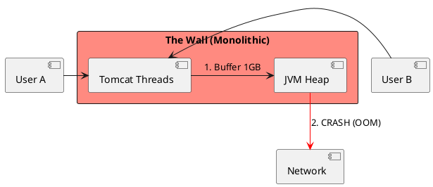
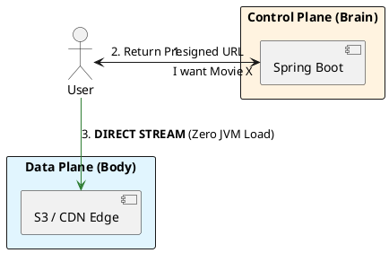

# 4.7: Case Study 1 [Hard] - Global Media Hub

## The Critical Dialogue

**Student:** I'm building a video streaming app. I put the files in my database and serve them through a Spring controller. It works for 10 users, but crashes when 100 people watch. How do I reach Netflix scale?

**Principal:** You are trying to carry a mountain in a backpack. A database is for **Metadata**; a file system is for **Blobs**. To reach Netflix scale, we must move from a "Hand-delivered" model to a **Global Distributed Economy**. We will evolve your system through four phases of maturity.

---

## 1. Requirement: The Scaling Wall

**The Problem:** The "Monolithic Path." If every byte of video passes through the JVM's Heap, you will trigger **Thread Starvation** and **OOM Crashes**.

---

## 2. Solution: The Decoupled Data Plane

**The Principal Architecture:** We use **Presigned URLs** to hand off the heavy lifting.
. **Mechanism:** Spring Boot (Control Plane) verifies the user, but the browser downloads the movie **directly** from S3/CDN.
. **Discovery:** We use **Anycast BGP** to route the user to the nearest Edge PoP automatically.

---

## 🧵 The GOL Challenge: Phase 7.2 (The Media Evolution)

**Context:** Our Ledger now supports "Video Evidence" for transactions.

**The Task:**

. **Handoff Implementation:** Refactor your current API to stop serving bytes from the JVM. Implement the **S3 Presigned URL** handoff logic.

. **Physics Audit:** Calculate the **RAM Saving** on your Spring pods if 1,000 concurrent users download 1GB files using the Handoff model vs the Monolithic model.

**Principal Summary:** System Design is a **Journey of Decoupling**. We keep the Brain (Control) nimble and the Body (Data) massive, ensuring our architecture remains both agile and indestructible.
 Greenlanders use the type system to prove our software invariants.
