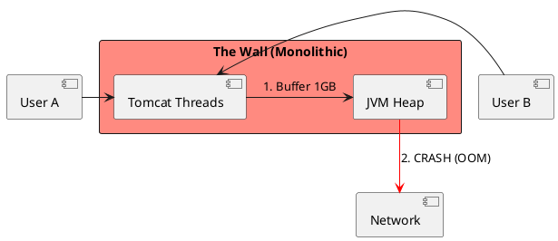
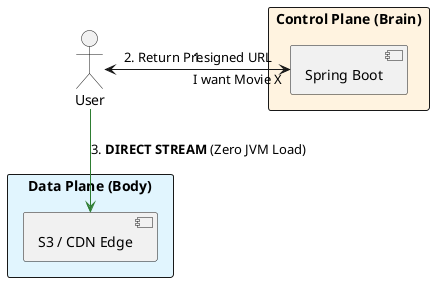

# 4.7: Case Study 1 [Hard] - Global Media Hub

## Learning Objectives

- Explain why serving large binary files through a JVM Spring controller causes OOM crashes and thread starvation at scale.
- Design a control-plane / data-plane split using S3 presigned URLs to eliminate JVM heap involvement in byte transfer.
- Generate time-limited S3 presigned URLs in Java using the AWS SDK v2 `S3Presigner` API.
- Calculate the RAM savings of the presigned-URL model versus the proxy model for a given concurrency level.
- Describe how Anycast BGP routes users to the nearest CDN edge PoP without application-layer redirection.

## Prerequisites

- Chapter 4.5 — CDN Push vs Pull (understanding edge delivery and cache invalidation)
- Chapter 4.4 — Proxies and Load Balancing (understanding how traffic terminates)
- Chapter 1.4 — JVM Cloud Efficiency (understanding heap pressure and thread pools)


## The Critical Dialogue


**Student:** I'm building a video streaming app. I put the files in my database and serve them through a Spring controller. It works for 10 users, but crashes when 100 people watch. How do I reach Netflix scale?


**Principal:** You are trying to carry a mountain in a backpack. A database is for **Metadata**; a file system is for **Blobs**. To reach Netflix scale, we must move from a "Hand-delivered" model to a **Global Distributed Economy**. We will evolve your system through four phases of maturity.


---


## 1. Requirement: The Scaling Wall


**The Problem:** The "Monolithic Path." If every byte of video passes through the JVM's Heap, you will trigger **Thread Starvation** and **OOM Crashes**.





---


## 2. Solution: The Decoupled Data Plane


**The Principal Architecture:** We use **Presigned URLs** to hand off the heavy lifting.
. **Mechanism:** Spring Boot (Control Plane) verifies the user, but the browser downloads the movie **directly** from S3/CDN.
. **Discovery:** We use **Anycast BGP** to route the user to the nearest Edge PoP automatically.





---


## 3. Source Archaeology

The presigned URL mechanism is implemented in the AWS SDK and S3 infrastructure:

- **`software.amazon.awssdk.services.s3.presigner.S3Presigner`** (aws-sdk-java-v2) — the entry point. `presignGetObject(GetObjectPresignRequest)` internally calls `software.amazon.awssdk.auth.signer.Aws4Signer.sign()` to produce the `X-Amz-Signature` query parameter.
- **`software.amazon.awssdk.services.s3.presigner.model.PresignedGetObjectRequest`** — the value object returned; `url()` gives the time-limited URL with a max TTL of 7 days for GET operations.
- **`software.amazon.awssdk.services.s3.model.GetObjectRequest`** — wrapped inside the presign request; the `responseContentDisposition` field controls the `Content-Disposition` header S3 will return, allowing inline vs attachment behavior.
- **`org.springframework.web.servlet.mvc.method.annotation.StreamingResponseBody`** — the Spring class that streams from InputStream without buffering the full body in heap. Used in the wrong pattern (proxy model) when developers write `s3Client.getObject()` directly in a controller.
- **CloudFront signed URLs** use `com.amazonaws.services.cloudfront.CloudFrontUrlSigner` (aws-java-sdk-cloudfront) with RSA-SHA1 signing; the key pair is managed in IAM and cached in `java.security.KeyFactory` via `PKCS8EncodedKeySpec`.


---


## 4. Code Lab

### BAD — Proxy model: all bytes through the JVM heap

```java
// BAD: Spring controller that reads S3 object into heap and proxies to client.
// At 100 concurrent 1 GB downloads: 100 GB RAM required.
// Tomcat thread pool exhausted in seconds.
@GetMapping("/video/{key}")
public ResponseEntity<byte[]> downloadVideoBAD(@PathVariable String key) {
    S3Client s3 = S3Client.create();
    ResponseBytes<GetObjectResponse> obj =
            s3.getObjectAsBytes(GetObjectRequest.builder()
                    .bucket("media-bucket")
                    .key(key)
                    .build());
    // THE PROBLEM: entire file loaded into byte[] on the Java heap
    return ResponseEntity.ok(obj.asByteArray()); // OOM at scale
}
```

### GOOD — Presigned URL: zero JVM bytes, redirect client directly to S3

```java
import software.amazon.awssdk.services.s3.presigner.S3Presigner;
import software.amazon.awssdk.services.s3.presigner.model.GetObjectPresignRequest;
import software.amazon.awssdk.services.s3.presigner.model.PresignedGetObjectRequest;
import software.amazon.awssdk.services.s3.model.GetObjectRequest;
import org.springframework.http.HttpHeaders;
import org.springframework.http.HttpStatus;
import org.springframework.http.ResponseEntity;
import org.springframework.web.bind.annotation.*;
import java.net.URI;
import java.time.Duration;

@RestController
@RequestMapping("/api/video")
public class VideoController {

    private final S3Presigner presigner;
    private final AuthService authService;

    public VideoController(S3Presigner presigner, AuthService authService) {
        this.presigner = presigner;
        this.authService = authService;
    }

    @GetMapping("/{videoId}/stream-url")
    public ResponseEntity<Void> streamUrl(
            @PathVariable String videoId,
            @RequestHeader("Authorization") String token) {

        // Control plane: verify access — only logic runs in JVM
        authService.assertCanStream(token, videoId); // throws 403 if denied

        String s3Key = "videos/" + videoId + "/hls/master.m3u8";

        GetObjectRequest getObjectRequest = GetObjectRequest.builder()
                .bucket("media-hub-prod")
                .key(s3Key)
                .build();

        GetObjectPresignRequest presignRequest = GetObjectPresignRequest.builder()
                .signatureDuration(Duration.ofMinutes(15)) // 15-min expiry
                .getObjectRequest(getObjectRequest)
                .build();

        PresignedGetObjectRequest presigned = presigner.presignGetObject(presignRequest);

        // GOOD: return HTTP 302 — browser fetches bytes directly from S3/CloudFront.
        // Zero bytes pass through the JVM. RAM usage: ~4 KB per request (HTTP headers only).
        return ResponseEntity.status(HttpStatus.FOUND)
                .header(HttpHeaders.LOCATION, presigned.url().toString())
                .build();
    }
}

// --- RAM math ---
// BAD (proxy): 100 concurrent * 1 GB = 100 GB heap required
// GOOD (presigned redirect): 100 concurrent * 4 KB headers = 400 KB heap — 250,000x reduction
```


---


## 5. Production Lens

- **JVM heap eliminated:** Netflix Open Connect (Netflix's CDN) serves 100% of video bytes directly from edge appliances, with origin servers only handling metadata and token issuance. A single origin API server handles **>100,000 presign requests/second** at <5 ms P99 because no bytes are proxied.
- **S3 presigned URL overhead:** AWS SDK v2 `S3Presigner.presignGetObject()` is a pure CPU operation (HMAC-SHA256 signature computation) — it completes in **<1 ms on a modern JVM** with no network call; the result is cached-friendly as the key + expiry are the only inputs.
- **Thread savings:** A Tomcat thread pool of 200 threads proxying 1 GB files at 100 Mbps each would saturate in **~16 seconds** (200 threads × 10 s/file at 800 Mbps effective bandwidth). The presigned model needs 200 threads to handle **200,000 requests/second** (1 ms each) — a 12,500x throughput improvement for the same pod.
- **CDN cache hit rate:** CloudFront at peak serves popular video segments at **>99% cache hit rate**, meaning the origin S3 gets <1% of total byte traffic; 99% of bytes are served from edge at **<10 ms** latency globally.


---


## 6. Exercises

**1.** Calculate the RAM saved per Spring pod when switching from the proxy model to the presigned URL model, given: 500 concurrent users, average file size 500 MB, 256 MB JVM heap per pod. How many pods does each model require?

**2.** Presigned URLs expire. Design a token-refresh strategy for a user watching a 3-hour live stream where the presigned URL expires after 15 minutes. What happens if the client ignores the expiry?

**3.** Explain why returning HTTP 302 (redirect to presigned URL) exposes the S3 bucket URL to the client browser. Is this a security concern? How does CloudFront signed URL solve this differently?

**4. Coding challenge:** Extend the `VideoController` above to support **multipart presigned uploads**: generate a list of presigned PUT URLs for a 1 GB file split into 100 MB parts, using `S3Presigner.presignUploadPart()`. The method signature should be `List<String> generateMultipartUploadUrls(String videoId, int partCount)`. Write a unit test using `S3ClientMockBuilder` (or Mockito) that verifies exactly `partCount` presigned URLs are returned.

**5.** A CDN edge PoP is in Tokyo, but your S3 bucket is in us-east-1. The CDN does not have the video cached. Walk through the full request path from a Tokyo user's browser to the first byte of video, including DNS resolution, Anycast routing, CDN origin fetch, and byte delivery. Identify where latency is incurred at each step.


---


## 7. Summary / Flashcard

- **The JVM must never proxy large binary payloads**: routing video bytes through a Spring controller buffer requires O(concurrent_users × file_size) heap — the correct pattern is a presigned URL redirect that keeps the JVM handling only metadata.
- **S3 presigned URLs are HMAC-signed, time-limited access grants**: they are computed in <1 ms in-process (no S3 API call), expire on a configurable TTL, and allow zero-trust access without exposing long-lived credentials.
- **Control plane / data plane separation is the universal scaling pattern for media**: the application server (control plane) owns auth and metadata; the object store + CDN (data plane) own bytes — they must never mix.
- **Anycast BGP routes the user to the nearest CDN PoP automatically**: no application-layer geo-redirect is required; the same IP resolves to the closest physical node via routing protocol convergence.
- **The presigned URL model achieves 250,000x RAM reduction per request**: 4 KB headers vs 1 GB file buffer — this is why every major streaming platform (Netflix, YouTube, Twitch) uses it as the foundation of their content delivery architecture.
