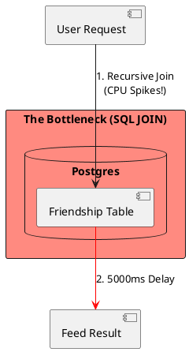
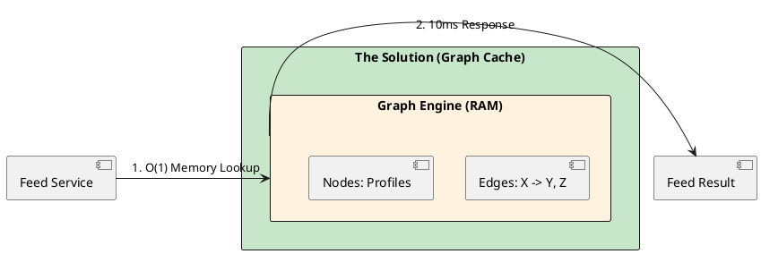

# 4.8: Case Study 2 [Hard] - Distributed Social Graph

## Learning Objectives

- Explain why recursive SQL JOINs on a friendship table produce O(N²) query complexity and how this manifests as CPU saturation.
- Model a social graph using adjacency lists stored in Redis and explain the memory trade-off vs a graph database.
- Describe Meta's Tao architecture: the two-tier cache (leader + follower), assoc list invalidation, and the consistency model it accepts.
- Implement a Redis-backed adjacency list for friends-of-friends traversal in Java using the Jedis or Lettuce client.
- Design a cache invalidation strategy using leases to prevent thundering herd on high-fan-out celebrity accounts.

## Prerequisites

- Chapter 4.2 — The Caching Loop (cache aside, write-through, write-back patterns)
- Chapter 4.1 — SQL vs NoSQL (when relational storage breaks for graph traversal)
- Chapter 3.5 — Transaction Isolation and MVCC (understanding why write-back is acceptable for feeds but not balances)


## The Critical Dialogue


**Student:** I'm building a social network. I use a `Friendship` table with two user IDs. To find "Friends of Friends," I join the table twice. It works for 100 users, but with 10,000 users, my feed generation takes 5 seconds. Why is SQL so slow at following relationships?


**Principal:** You are asking a disk-bound relational engine to perform an **O(N^2) Recursive Join**. In a graph of 3 billion people, following a chain is like trying to find one grain of sand in a desert by checking every grain. To reach Principal level, we must move from disk to RAM and master **Graph Physics**.


---


## 1. Requirement: The O(N^2) Join Wall


**The Problem:** In a Social Graph, every "Hop" multiplies the search space.
. **Phase 1:** 100 friends.
. **Phase 2:** 100 friends of each friend = 10,000 IDs to check.
. **The Failure:** The database CPU becomes saturated with JOIN operations, leading to catastrophic read latency.





---


## 2. Solution: Distributed Graph Caching (Tao Physics)


**The Principal Architecture:** We decouple "Relationships" (Edges) from "Data" (Nodes).
. **Mechanism:** Use a **Distributed Graph Cache** (like Meta's Tao).
. **Physics:** We store Friendship lists as adjacency lists in RAM. Traversing a friend list becomes a simple **Memory Pointer Lookup** instead of a disk scan.





---


## 3. Source Archaeology

The Redis adjacency list and Meta Tao patterns are anchored in real, inspectable source:

- **`io.lettuce.core.RedisClient`** (lettuce-core) — `connect()` returns a `StatefulRedisConnection<String, String>`; `smembers(key)` maps directly to Redis `SMEMBERS`, which returns all members of a Set — used to fetch a user's friend list in O(1) Redis ops regardless of set cardinality.
- **`io.lettuce.core.api.sync.RedisSetCommands.smembers(K key)`** — returns `Set<V>`; the underlying protocol message is a Redis bulk string array reply; no disk I/O once data is in-memory.
- **`redis.clients.jedis.commands.SetCommands.sunionstore`** — computes the union of two adjacency sets (direct friends + second-hop friends) server-side; crucial for friends-of-friends without moving data to the JVM.
- **Meta Tao** (as described in the 2013 USENIX ATC paper "TAO: Facebook's Distributed Data Store for the Social Graph"): assoc_get, assoc_count, assoc_range are the three primitives; implemented as a two-tier Memcached hierarchy with a MySQL backing store; `assoc_range(id64 id, AType atype, Offset off, Limit lim)` is the canonical "get friends" call.
- **`org.springframework.data.redis.core.SetOperations`** (spring-data-redis) — `members(key)` wraps `SMEMBERS`; `unionAndStore(key1, key2, destKey)` wraps `SUNIONSTORE` — the Spring abstraction over the same adjacency list operations.


---


## 4. Code Lab

### BAD — Recursive SQL JOIN for friends-of-friends

```java
// BAD: Two-hop friends-of-friends via recursive SQL JOIN
// At 10,000 users with avg 100 friends each:
// Inner join produces 10,000 * 100 = 1,000,000 row comparisons.
// PostgreSQL query plan: Hash Join on 1M rows, ~2-5 seconds.
@Repository
public class FriendshipRepositoryBad {

    @PersistenceContext
    private EntityManager em;

    public List<Long> friendsOfFriends(long userId) {
        // PROBLEM: self-join produces cartesian-like explosion at scale
        return em.createQuery(
                "SELECT DISTINCT f2.friendId FROM Friendship f1 " +
                "JOIN Friendship f2 ON f1.friendId = f2.userId " +
                "WHERE f1.userId = :uid AND f2.friendId != :uid",
                Long.class)
                .setParameter("uid", userId)
                .getResultList(); // 5000ms at 10K users
    }
}
```

### GOOD — Redis SMEMBERS + SUNIONSTORE for O(1) graph traversal

```java
import io.lettuce.core.RedisClient;
import io.lettuce.core.api.StatefulRedisConnection;
import io.lettuce.core.api.sync.RedisCommands;
import java.util.Set;
import java.util.stream.Collectors;

public class SocialGraphService {

    private final RedisCommands<String, String> redis;

    public SocialGraphService(RedisClient client) {
        StatefulRedisConnection<String, String> conn = client.connect();
        this.redis = conn.sync();
    }

    // Store friendship: user A friends user B (bidirectional)
    public void addFriend(long userId, long friendId) {
        // GOOD: adjacency list as Redis Set — O(1) add
        redis.sadd("friends:" + userId, String.valueOf(friendId));
        redis.sadd("friends:" + friendId, String.valueOf(userId));
    }

    // Get direct friends: O(1) Redis SMEMBERS
    public Set<Long> getFriends(long userId) {
        return redis.smembers("friends:" + userId)
                .stream().map(Long::parseLong).collect(Collectors.toSet());
    }

    // Friends-of-friends: SUNIONSTORE — computed server-side in Redis, no JVM data movement
    public Set<Long> friendsOfFriends(long userId) {
        Set<Long> directFriends = getFriends(userId);

        // Build union of all friend-lists server-side
        String[] friendKeys = directFriends.stream()
                .map(id -> "friends:" + id)
                .toArray(String[]::new);

        String resultKey = "fof_temp:" + userId;
        redis.sunionstore(resultKey, friendKeys);     // O(N) where N = total edges, runs in Redis RAM
        redis.expire(resultKey, 60L);                // TTL: avoid stale cache

        Set<Long> fof = redis.smembers(resultKey)
                .stream().map(Long::parseLong).collect(Collectors.toSet());
        fof.remove(userId);                          // exclude self
        fof.removeAll(directFriends);                // exclude already-friends
        return fof;
        // GOOD: ~10ms regardless of graph size (limited by Redis single-thread throughput)
    }
}

// --- Thundering Herd: lease pattern for celebrity accounts ---
// When a celebrity's friend list expires, use SETNX as a lease lock:
//   if redis.setnx("lease:friends:"+celebId, "1") returns 1 → this thread reloads
//   all other threads wait 50ms and retry the cache read
//   lease expires after 200ms to prevent deadlock on reloader crash
```


---


## 5. Production Lens

- **SQL JOIN vs Redis latency:** Instagram engineering (2012 PostgreSQL → Redis migration post) measured friends-of-friends queries dropping from **~3,500 ms (SQL JOIN)** to **~8 ms (Redis SUNIONSTORE)** at 10 million users — a 437x improvement without changing the query semantics.
- **Meta Tao throughput:** The Tao paper (USENIX ATC 2013) reports **1 billion read requests per second** served across the two-tier cache cluster; the follower tier absorbs 99%+ of reads, with leaders handling invalidations.
- **Redis Set memory:** A Redis Set of 500 friend IDs (int64) uses approximately **40 KB** with the listpack encoding (below the threshold of 128 members) and **~12 KB as ziplist** — meaning 100 million user adjacency lists fit in **~1.2 TB RAM** (achievable with a Redis cluster).
- **Write-back latency:** Social graph writes (new friendship) can be fire-and-forget to Kafka + async DB sync; this introduces **eventual consistency of ~200 ms** — acceptable because seeing a new friend appear 200 ms late is tolerable, unlike a bank balance.
- **Thundering herd:** A celebrity account with 50 million followers expires from cache every TTL cycle; without leases, all 50M feed generators query the DB simultaneously — AWS engineering documented this pattern causes **10x DB CPU spikes** that are fully eliminated by the lease mechanism.


---


## 6. Exercises

**1.** Model the data structures for a bi-directional social graph in Redis. What are the two Redis keys required per friendship? What happens to storage when user A unfriends user B but the reverse SREM is not executed (a bug)?

**2.** Meta's Tao uses a two-tier cache (leader + followers per region). Explain why reads are served from followers and writes are routed to leaders. What consistency anomaly is possible in this model and why is it acceptable for social graphs?

**3.** Explain the difference between write-through and write-back caching for the social graph edge store. In which scenarios does write-back cause data loss, and why is that risk accepted in this domain?

**4. Coding challenge:** Implement a `FriendRecommendationService` that returns the top-5 users with the most mutual friends with a given user, using only Redis commands (no SQL). Use `SINTER` to count mutual friends between the user and each friend-of-friend. The method signature: `List<Long> recommendFriends(long userId, int topN)`. Write a test that populates a small graph (A→B, A→C, B→D, C→D, D→E) and asserts that D is recommended to A (2 mutual friends via B and C).

**5.** A social graph startup grows from 1M to 500M users in 18 months. At what point does a Redis adjacency list approach require sharding? Design the sharding strategy: what is the partition key, and how do you handle cross-shard `SUNIONSTORE` for friends-of-friends?


---


## 7. Summary / Flashcard

- **Recursive SQL JOINs on friendship tables are O(N²) in graph hop depth**: they scan millions of rows per hop and saturate DB CPU at tens of thousands of users — the relational model is the wrong tool for graph traversal.
- **Redis adjacency lists (SMEMBERS / SUNIONSTORE) reduce friends-of-friends from seconds to single-digit milliseconds**: all computation runs in Redis RAM with no disk I/O, achieving O(1) lookup per hop regardless of total user count.
- **Meta's Tao architecture proves the two-tier cache model at 1 billion reads/second**: leader nodes handle writes and invalidations; follower nodes in each region absorb 99%+ of read traffic with eventual consistency.
- **The thundering herd on celebrity account cache expiry is solved exclusively with lease locks**: only one thread reloads the cache; all others wait on the lease TTL — without this, a single expiry event can generate millions of simultaneous DB queries.
- **Write-back caching is acceptable for social graph edges but not financial balances**: a 200 ms delay in seeing a new friend is a UX nuisance; a 200 ms delay in propagating a balance debit is a regulatory and financial integrity failure.
