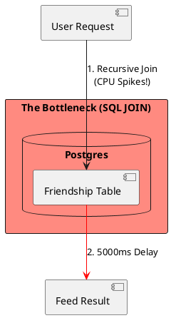
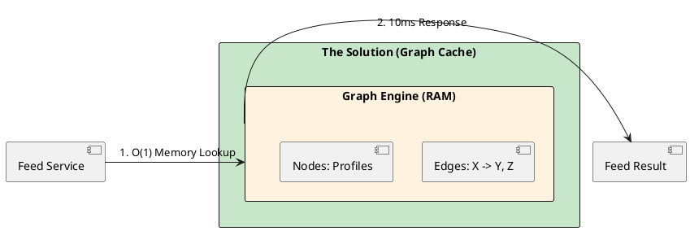

# 4.8: Case Study 2 [Hard] - Distributed Social Graph

## The Critical Dialogue

**Student:** I'm building a social network. I use a `Friendship` table with two user IDs. To find "Friends of Friends," I join the table twice. It works for 100 users, but with 10,000 users, my feed generation takes 5 seconds. Why is SQL so slow at following relationships?

**Principal:** You are asking a disk-bound relational engine to perform an **O(N^2) Recursive Join**. In a graph of 3 billion people, following a chain is like trying to find one grain of sand in a desert by checking every grain. To reach Principal level, we must move from disk to RAM and master **Graph Physics**.

---

## 1. Requirement: The O(N^2) Join Wall

**The Problem:** In a Social Graph, every "Hop" multiplies the search space.
. **Phase 1:** 100 friends.
. **Phase 2:** 100 friends of each friend = 10,000 IDs to check.
. **The Failure:** The database CPU becomes saturated with JOIN operations, leading to catastrophic read latency.

---

## 2. Solution: Distributed Graph Caching (Tao Physics)

**The Principal Architecture:** We decouple "Relationships" (Edges) from "Data" (Nodes).
. **Mechanism:** Use a **Distributed Graph Cache** (like Meta's Tao).
. **Physics:** We store Friendship lists as adjacency lists in RAM. Traversing a friend list becomes a simple **Memory Pointer Lookup** instead of a disk scan.

---

## 🧠 Principal's Inquiry

. **The Lease Mechanism:** How can a Principal use **Leases** to prevent a "Thundering Herd" when a popular user's friend list expires?

. **Write-Back Integrity:** Why is it acceptable to use **Write-Back Caching** for a social feed but not for a bank balance?

**Principal Summary:** Graph Architecture is about **Moving from Disk to Direct RAM Hops**. We hide O(N^2) complexity behind distributed caches to provide sub-millisecond feeds to billions.
 Greenlanders use the type system to prove our software invariants.
