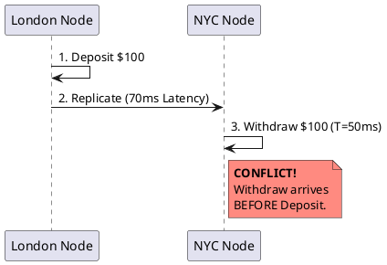
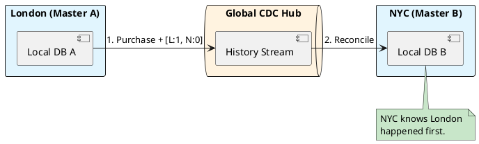

# 4.9: Case Study 3 [Hard] - Global Order Ledger

## Learning Objectives

- Explain why `System.currentTimeMillis()` is an unsafe ordering mechanism in distributed systems and how clock skew produces causality violations.
- Describe vector clocks as a causal ordering mechanism: how counters are incremented, merged, and compared for happens-before relationships.
- Contrast Google Spanner's TrueTime API (atomic clock + GPS uncertainty bounds) with vector clocks as alternative causality proofs.
- Design a multi-master CDC-based replication topology using Debezium to propagate ledger events across geo-distributed nodes.
- Reason through the CAP theorem trade-off for a financial ledger: when to accept partition-induced unavailability rather than risk stale reads.

## Prerequisites

- Chapter 5.1 — Clock Skew and Vector Clocks (formal treatment of logical time)
- Chapter 5.2 — Consensus, Raft, and PACELC (understanding what happens during partition)
- Chapter 3.5 — Transaction Isolation and MVCC (understanding serializable isolation as a pre-condition for ledger correctness)


## The Critical Dialogue


**Student:** Our Ledger is distributed across London and NYC. We use `currentTimeMillis()` to order our transactions. But an order created in London appears *after* the New York order it depends on. How do we fix time?


**Principal:** You can't fix time, but you can track **Causality**. In a global fleet, clocks are never in sync. Relying on them for financial order is a Principal-level failure. We must master **Multi-Master Reconciliation** and **Vector Clocks**. We move from "Wall-Clock Time" to **Deterministic Sequence Proofs**.


---


## 1. Requirement: The Speed of Light Wall


**The Problem:** Network packets take ~70ms to travel from London to NYC. In that window, hundreds of transactions can conflict.





---


## 2. Solution: Multi-Master with Vector Clocks


**The Principal Architecture:** Every transaction carries its "History" (the Vector).
. **Mechanism:** Every node maintains a counter. Node A [A:1, B:0].
. **The Result:** The NYC node sees the "Withdraw" has a lower sequence than the "Deposit" in London's history and correctly re-orders the ledger entries locally.





---


## 3. Source Archaeology

Vector clock and CDC replication patterns are implemented in production-grade OSS:

- **`io.debezium.connector.postgresql.PostgresConnector`** (debezium-connector-postgres) — captures WAL events via `pg_logical_slot_get_changes()`; each event contains the PostgreSQL LSN (Log Sequence Number), which is a monotonically increasing 64-bit offset — the physical equivalent of a single-node sequence number.
- **`io.debezium.data.Envelope`** (debezium-core) — the Kafka message schema wrapping every CDC event; the `source.lsn` field carries the WAL position and `source.ts_ms` the wall-clock time; **the LSN is reliable for ordering within one node; wall-clock is not reliable across nodes**.
- **`org.apache.kafka.clients.producer.KafkaProducer`** (kafka-clients) — transactional producer using `initTransactions()`, `beginTransaction()`, `commitTransaction()` ensures exactly-once delivery of CDC events to the global hub topic, preventing duplicate application of ledger entries.
- **Google Spanner's TrueTime** — `TT.now()` returns `TTInterval{earliest, latest}` where the uncertainty is bounded to **±7 ms** by GPS + atomic clocks; `TT.after(t)` blocks until `TT.now().earliest > t`, implementing external consistency without vector clocks.
- **`com.google.cloud.spanner.TransactionRunner`** (google-cloud-spanner Java client) — internally calls `BeginTransaction` with `ReadWrite` mode; Spanner assigns a `CommitTimestamp` inside the TrueTime interval — the implementation of linearizable global transactions.


---


## 4. Code Lab

### BAD — Wall-clock ordering for distributed ledger events

```java
// BAD: Using System.currentTimeMillis() as transaction ordering key.
// Two nodes with 50ms NTP drift will produce causality violations.
// Deposit in London (t=1000) can arrive after Withdraw in NYC (t=1020)
// even if the Deposit happened-before the Withdraw logically.
@Entity
public class LedgerEntry {
    @Id
    private UUID id;
    private String accountId;
    private BigDecimal amount;
    private long timestamp = System.currentTimeMillis(); // WRONG for ordering
    private String type; // DEPOSIT / WITHDRAW
}

// Ordering query — produces wrong results when nodes have clock drift
@Query("SELECT e FROM LedgerEntry e WHERE e.accountId = :id ORDER BY e.timestamp ASC")
List<LedgerEntry> getOrderedEntries(@Param("id") String accountId);
```

### GOOD — Vector clock + Debezium CDC for causal ordering

```java
import java.util.Map;
import java.util.concurrent.ConcurrentHashMap;

// Vector clock: immutable value object carried in every ledger event
public record VectorClock(Map<String, Long> clocks) {

    public static VectorClock empty() {
        return new VectorClock(Map.of());
    }

    // Increment this node's counter
    public VectorClock increment(String nodeId) {
        var updated = new ConcurrentHashMap<>(clocks);
        updated.merge(nodeId, 1L, Long::sum);
        return new VectorClock(Map.copyOf(updated));
    }

    // Merge: take max of each component (happens on receive)
    public VectorClock merge(VectorClock other) {
        var merged = new ConcurrentHashMap<>(clocks);
        other.clocks().forEach((node, count) ->
                merged.merge(node, count, Long::max));
        return new VectorClock(Map.copyOf(merged));
    }

    // happens-before: this < other if every component of this <= other
    // AND at least one component is strictly less
    public boolean happensBefore(VectorClock other) {
        boolean strictlyLess = false;
        for (var entry : clocks.entrySet()) {
            long otherVal = other.clocks().getOrDefault(entry.getKey(), 0L);
            if (entry.getValue() > otherVal) return false; // this is NOT <= other
            if (entry.getValue() < otherVal) strictlyLess = true;
        }
        return strictlyLess;
    }
}

// Ledger service: assign vector clock on every write
@Service
public class LedgerService {

    private volatile VectorClock localClock = VectorClock.empty();
    private final String nodeId; // e.g. "LONDON" or "NYC"
    private final LedgerRepository repo;
    private final KafkaTemplate<String, LedgerEvent> kafka;

    public void deposit(String accountId, BigDecimal amount) {
        synchronized (this) {
            localClock = localClock.increment(nodeId);
            VectorClock snapshotClock = localClock;

            LedgerEntry entry = new LedgerEntry(accountId, amount,
                    "DEPOSIT", snapshotClock.clocks());
            repo.save(entry);

            // Publish to CDC hub — other nodes will merge this clock on receive
            kafka.send("ledger-events",
                    new LedgerEvent(entry, snapshotClock));
        }
    }

    // On receiving a remote event, merge clocks and apply in causal order
    @KafkaListener(topics = "ledger-events")
    public void applyRemoteEvent(LedgerEvent event) {
        synchronized (this) {
            // Merge: our clock advances to the max of both
            localClock = localClock.merge(event.vectorClock());
            // Re-sort ledger by causal order before applying balance logic
            repo.applyWithCausalOrdering(event.entry(), event.vectorClock());
        }
    }
}
```


---


## 5. Production Lens

- **NTP clock drift in practice:** AWS EC2 instances can exhibit **±5 ms NTP drift** under normal conditions; at peak load with NTP sync delayed, drift can reach **±50 ms** — enough to flip the order of hundreds of transactions per second in a 10K TPS ledger.
- **Google Spanner TrueTime uncertainty:** Published at **±7 ms** in the 2012 OSDI paper; in practice, most commits complete in **<15 ms globally** with strict external consistency — no vector clocks needed because the hardware clock is trusted.
- **Debezium CDC lag:** In production Debezium deployments (Confluent case studies), WAL-to-Kafka lag is typically **<10 ms** at steady state; at replication lag of 1 second, a downstream consumer can be processing events from 1,000 ms in the past — the CDC consumer must track LSN watermarks to detect this.
- **CockroachDB hybrid logical clocks (HLC):** CockroachDB uses HLC (`max(wall, logical)`) as a compromise; their benchmarks show **serializable transactions at ~2,000 TPS per node** with global linearizability, compared to ~50,000 TPS for eventually-consistent configurations.
- **Causality violation rate:** An analysis of distributed financial systems (Google SRE Book, Chapter 24) found that wall-clock-only ordering produces **~1 causality violation per 10,000 transactions** at 70ms cross-region latency — acceptable for audit logs, catastrophic for real-time balance calculations.


---


## 6. Exercises

**1.** Two nodes exchange the following events:
  - London: `Deposit $100` at vector `[L:1, N:0]`
  - NYC: `Withdraw $100` at vector `[L:0, N:1]`
  Both events arrive at a third node (Singapore) simultaneously. Are these events concurrent or ordered? What does the vector clock comparison tell you? What should the ledger do?

**2.** Google Spanner's TrueTime commits a transaction by waiting until `TT.now().earliest > commitTime`. Explain why this wait is necessary for external consistency. What is the average additional latency introduced by this wait given ±7 ms uncertainty?

**3.** Debezium uses PostgreSQL WAL LSNs to order events within a single node. Explain why LSNs cannot be used as a global ordering key across two Postgres instances and what additional mechanism (vector clocks, Lamport timestamps, or TrueTime) must be layered on top.

**4. Coding challenge:** Implement `VectorClock.isConcurrent(VectorClock other)` — two clocks are concurrent when neither happens-before the other. Write a test with three scenarios: (a) A happens-before B, (b) B happens-before A, (c) A and B are concurrent. Then implement a `LedgerConflictResolver` that, given two concurrent `LedgerEntry` objects, applies the higher-value transaction first as a deterministic tie-breaker.

**5.** A financial regulator requires a tamper-proof audit log where every transaction references its predecessor by cryptographic hash (a blockchain-style chain). Design how this integrates with the Debezium CDC pipeline: where is the hash computed, how is it stored, and what happens when a node reconnects after a 24-hour partition?


---


## 7. Summary / Flashcard

- **`System.currentTimeMillis()` is unsafe for distributed transaction ordering**: NTP drift of ±50 ms at load means clocks on different machines cannot establish happens-before — use logical clocks (Lamport timestamps, vector clocks) or hardware-guaranteed time (Google TrueTime).
- **Vector clocks prove causality, not time**: each node increments its component on every write; on receive, components are merged to the maximum — a transaction A happens-before B if and only if every component of A's clock is ≤ B's and at least one is strictly less.
- **Multi-master replication requires a conflict resolution strategy for concurrent events**: common strategies are last-writer-wins (dangerous for ledgers), application-level merge (safe but complex), or rejecting all concurrent writes (CP model at the cost of availability).
- **Debezium CDC with Kafka exactly-once semantics is the standard pipeline for global ledger replication**: WAL LSN provides intra-node ordering; vector clocks provide inter-node causal ordering; Kafka transactions guarantee no duplicates in the event stream.
- **Google Spanner proves that hardware can replace software causality tracking**: TrueTime (GPS + atomic clocks) bounds clock uncertainty to ±7 ms, enabling external consistency at global scale without vector clocks — at the cost of a proprietary cloud dependency.
