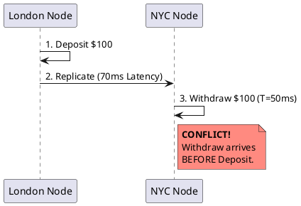
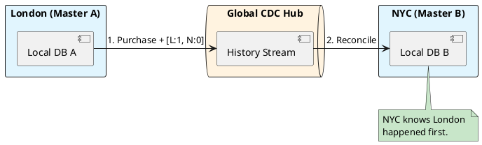

# 4.9: Case Study 3 [Hard] - Global Order Ledger

## The Critical Dialogue

**Student:** Our Ledger is distributed across London and NYC. We use `currentTimeMillis()` to order our transactions. But an order created in London appears *after* the New York order it depends on. How do we fix time?

**Principal:** You can't fix time, but you can track **Causality**. In a global fleet, clocks are never in sync. Relying on them for financial order is a Principal-level failure. We must master **Multi-Master Reconciliation** and **Vector Clocks**. We move from "Wall-Clock Time" to **Deterministic Sequence Proofs**.

---

## 1. Requirement: The Speed of Light Wall

**The Problem:** Network packets take ~70ms to travel from London to NYC. In that window, hundreds of transactions can conflict.

---

## 2. Solution: Multi-Master with Vector Clocks

**The Principal Architecture:** Every transaction carries its "History" (the Vector).
. **Mechanism:** Every node maintains a counter. Node A [A:1, B:0].
. **The Result:** The NYC node sees the "Withdraw" has a lower sequence than the "Deposit" in London's history and correctly re-orders the ledger entries locally.

---

## 🧠 Principal's Inquiry

. **TrueTime:** How does **Google Spanner** eliminate the need for Vector Clocks using Atomic Clocks?

. **The Ghost Balance:** If two regions are disconnected (Partition), should they still accept trades?

**Principal Summary:** Global Consistency is **Applied Physics**. We use Vector Clocks to prove causality and CDC to bridge the gap between continents, ensuring the GOL is accurate even when the clocks are liars.
 Greenlanders use the type system to prove our software invariants.
