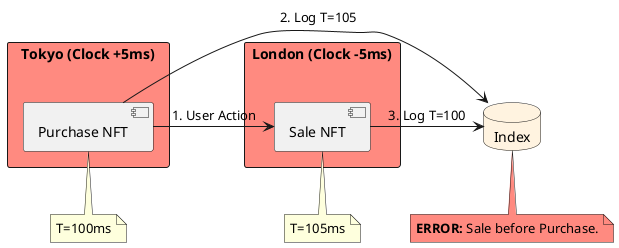

# 5.1: Clock Skew, Logical Time, and the Causality Crisis

## Learning Objectives

- Explain why `System.currentTimeMillis()` is unsafe for ordering distributed events and quantify the NTP jitter bound (~50 ms across continents)
- Implement a vector clock merge algorithm and derive the happened-before relation from it
- Compare Lamport timestamps, vector clocks, and Google TrueTime on correctness guarantees and operational cost
- Identify the O(N) payload bloat problem with vector clocks in large fleets and describe mitigation strategies (dotted version vectors, hybrid logical clocks)
- Apply Hybrid Logical Clocks (HLC) as a practical production substitute that bounds drift while preserving causality

## Prerequisites

- Chapter 4.1 — SQL vs. NoSQL (understanding of distributed databases and consistency models)
- Chapter 5.2 — Consensus/Raft (helpful context on how leaders enforce global order)
- Basic understanding of Java `ConcurrentHashMap` and `synchronized` semantics

---

## The Critical Dialogue


**Student:** Our Ledger is finally global. We have Anycast discovery and sharded databases. But we just had a "Double Spend" error. A user in Tokyo bought an NFT, then instantly sold it in London. Because of clock drift, the "Sale" appeared in the database 5ms *before* the "Purchase." How can we fix time?


**Principal:** You've hit the **Wall of Distributed Physics**. In a global fleet, there is no such thing as "Now." If your Ledger relies on `System.currentTimeMillis()`, you are building on a foundation of sand. To reach Principal level, we must move from physical clocks to **Logical Causality**. This is the only way to prevent financial corruption in a multi-region fleet.


---


## 1. The Requirement: The Sync Fallacy


**The Problem:** Hardware clocks drift independently. NTP attempts to sync them, but it has a physical limit of ~50ms jitter across continents.





---


## 2. Solution: Logical Time (Vector Clocks)


**The Principal Architecture:** Instead of asking the clock "What time is it?", every node tracks the "History" of observations.


### 2.1 The Vector Handshake
. **Mechanism:** Every node maintains an array of counters. 
. **Merge Physics:** When Node A sends a message to Node B, it sends its version of the "History" (the Vector). Node B merges this history, ensuring it can never process a message out of causal order.


```java
// Principal Level: Causal Ordering for the Global Ledger
public class CausalTracker {
    private final Map(String, Long) vector = new ConcurrentHashMap<>();
    private final String localNodeId;

    public CausalTracker(String nodeId) { this.localNodeId = nodeId; }

    public synchronized void recordEvent() {
        vector.merge(localNodeId, 1L, Long::sum);
    }

    public synchronized void observeRemote(Map(String, Long) remoteVector) {
        // Merge: Take the maximum of every known counter
        remoteVector.forEach((id, count) -> vector.merge(id, count, Math::max));
        recordEvent();
    }
}
```


---


## 3. Alternative Solution: Google TrueTime


**The Principal Architecture:** If we cannot trust the clock, we must **Wait for the Uncertainty to Expire**.


> [!abstract] The Physics: Spanner Wait
> . **Step 1:** Spanner nodes use Atomic Clocks to get an interval `[earliest, latest]`.
> . **Step 2:** Before committing a transaction at time $T$, the node **waits** for the uncertainty window to pass (e.g. 6ms).
> . **The Result:** This guarantees that $T$ is now definitely in the past for the entire planet.


---

## 4. Source Archaeology

Real implementations of logical time in production systems:

**CockroachDB Hybrid Logical Clock** — `pkg/util/hlc/hlc.go` (`Clock.Now()` returns `HLCTimestamp{WallTime, Logical}` where `WallTime` is NTP-anchored and `Logical` breaks ties). The `Update(ts HLCTimestamp)` method implements the HLC merge rule: `max(local.wall, remote.wall)` then increment logical if walls are equal.

**Cassandra Vector Clocks** — `org.apache.cassandra.db.context.CounterContext` uses a `ContextState` byte buffer encoding `(nodeId, clock, count)` triples. The `merge()` method calls `FBUtilities.compareUnsigned()` to perform the per-node max merge in O(N) where N = distinct writers.

**etcd Revision Counter** — `server/etcd.go` stores a global `revision int64` (Lamport-style) in the `mvcc.KV` store (`server/storage/mvcc/kvstore.go`). Every write increments it; every read returns the current revision, giving causal monotonicity without vector overhead — this is viable because etcd has a single Raft leader.

**MongoDB OpLog timestamp** — `repl/oplog_entry.h`, `OpTime` struct: `{Timestamp ts, long long term}`. The `Timestamp` is a `(seconds, increment)` pair — a stripped-down Lamport clock embedded in every replicated operation.

---

## 5. Code Lab

**BAD approach — trusting wall clock for causal ordering:**

```java
// BAD: Race condition between Tokyo and London clocks
public record LedgerEvent(String type, long wallTimeMs, String orderId) {}

public class NaiveLedger {
    private final List<LedgerEvent> log = new ArrayList<>();

    public void record(String type, String orderId) {
        // System.currentTimeMillis() can go backwards after NTP correction
        // Two nodes 10,000 km apart can differ by up to 50ms
        log.add(new LedgerEvent(type, System.currentTimeMillis(), orderId));
    }

    public boolean isPurchaseBeforeSale(String orderId) {
        // WRONG: relies on wall-clock timestamps from different machines
        long purchaseTs = log.stream()
            .filter(e -> e.type().equals("PURCHASE") && e.orderId().equals(orderId))
            .mapToLong(LedgerEvent::wallTimeMs).min().orElse(Long.MAX_VALUE);
        long saleTs = log.stream()
            .filter(e -> e.type().equals("SALE") && e.orderId().equals(orderId))
            .mapToLong(LedgerEvent::wallTimeMs).min().orElse(Long.MAX_VALUE);
        return purchaseTs < saleTs;  // Can be FALSE even when causally correct!
    }
}
```

**GOOD approach — Hybrid Logical Clock preserving causality:**

```java
import java.util.Map;
import java.util.concurrent.ConcurrentHashMap;
import java.util.concurrent.atomic.AtomicLong;

/**
 * Hybrid Logical Clock (HLC) — combines wall-clock readability with
 * Lamport-clock causal ordering. Modeled after CockroachDB's hlc.Clock.
 *
 * Invariant: hlc.WallTime >= System.currentTimeMillis() always holds.
 * On receive: hlc.WallTime = max(local.wall, remote.wall);
 *             if equal, hlc.Logical = max(local.logical, remote.logical) + 1
 */
public class HybridLogicalClock {

    private long wallMs;
    private int  logical;

    public HybridLogicalClock() {
        this.wallMs  = System.currentTimeMillis();
        this.logical = 0;
    }

    /** Call before sending a message. */
    public synchronized long[] now() {
        long physMs = System.currentTimeMillis();
        if (physMs > wallMs) {
            wallMs  = physMs;
            logical = 0;
        } else {
            logical++;  // wall didn't advance; bump logical to stay unique
        }
        return new long[]{wallMs, logical};
    }

    /** Call on receiving a message with timestamp [remoteWall, remoteLogical]. */
    public synchronized long[] receive(long remoteWall, int remoteLogical) {
        long physMs = System.currentTimeMillis();
        long newWall = Math.max(Math.max(wallMs, remoteWall), physMs);
        if (newWall == wallMs && newWall == remoteWall) {
            logical = Math.max(logical, remoteLogical) + 1;
        } else if (newWall == wallMs) {
            logical = logical + 1;
        } else if (newWall == remoteWall) {
            logical = remoteLogical + 1;
        } else {
            logical = 0;
        }
        wallMs = newWall;
        return new long[]{wallMs, logical};
    }

    /** Causal comparison: does timestamp A happen-before timestamp B? */
    public static boolean happensBefore(long[] a, long[] b) {
        if (a[0] != b[0]) return a[0] < b[0];  // wall time differs
        return a[1] < b[1];                     // same wall, compare logical
    }
}

// Demonstration
class HLCDemo {
    public static void main(String[] args) throws InterruptedException {
        HybridLogicalClock tokyo  = new HybridLogicalClock();
        HybridLogicalClock london = new HybridLogicalClock();

        // Tokyo records PURCHASE
        long[] purchaseTs = tokyo.now();
        System.out.printf("Purchase HLC: wall=%d logical=%d%n", purchaseTs[0], (long)purchaseTs[1]);

        // Simulate network: Tokyo sends to London (includes HLC ts)
        Thread.sleep(3);  // simulate ~50ms clock skew in miniature

        // London records SALE *after* receiving Tokyo's message
        long[] saleTs = london.receive(purchaseTs[0], (int)purchaseTs[1]);
        System.out.printf("Sale     HLC: wall=%d logical=%d%n", saleTs[0], (long)saleTs[1]);

        // Causal order is now GUARANTEED regardless of wall-clock drift
        System.out.println("Purchase happens-before Sale: " +
            HybridLogicalClock.happensBefore(purchaseTs, saleTs));  // always true
    }
}
```

---

## 6. Production Lens

**NTP jitter budget** — Google's internal measurements show inter-datacenter NTP offset up to 50 ms. TrueTime narrows this to ±7 ms (GPS/atomic-clock disciplined). CockroachDB's HLC bounds logical drift to the NTP error bound (default: `maxOffset=500ms`); if any node observes a clock jump exceeding `maxOffset`, the node panics and restarts rather than corrupt causal order.

**Vector clock payload overhead** — In a 5,000-pod fleet, a fully-materialized vector clock is a JSON object of ~5,000 entries ≈ 70 KB per message. Cassandra caps vector-clock growth using `CounterContext.total()` — contexts exceeding 1 MB trigger a compaction merge. Riak's dotted version vectors reduce average payload to <200 bytes by tracking only the "frontier" of concurrent writes.

**TrueTime commit wait** — Spanner's `TrueTime.now()` returns `[earliest, latest]` with a typical epsilon of 1–7 ms. The `commit wait` adds this epsilon before making the commit visible, costing ~4–7 ms per transaction — a deliberate latency sacrifice for external consistency. Measured throughput on a 2,000-node Spanner cluster: ~1 million reads/s, ~250,000 writes/s (Google Spanner paper, 2012).

---

## 7. Exercises

**1.** Explain in two sentences why Lamport timestamps are insufficient to determine if event A *caused* event B, whereas vector clocks can.

**2.** A fleet of 10,000 pods uses full vector clocks. Calculate the per-message overhead in bytes (assume 8-byte node ID + 8-byte counter per entry). At what point does this become a throughput bottleneck at 1M msgs/sec?

**3.** Google Spanner commits wait for the TrueTime uncertainty window. If epsilon is 7 ms, what is the maximum achievable writes/sec for a single-key hot row? How does this change if you use batching?

**4. Coding challenge:** Implement a `VectorClock` class in Java 21 with three methods: `tick()`, `send()` (returns a snapshot), and `merge(Map<String,Long> remote)`. Then write a unit test that proves: given events A→B→C on three nodes, `merge` correctly establishes that C's clock is strictly greater than A's clock in the relevant dimension. Use `ConcurrentHashMap` and ensure thread safety.

**5.** CockroachDB and TiDB both use HLC. Look up `cockroachdb/cockroach` `pkg/util/hlc/hlc.go` — what happens when `receive()` detects the remote wall time is more than `maxOffset` ahead of the local wall? Why is a node restart preferable to accepting the timestamp?

---

## 8. Summary / Flashcard

- `System.currentTimeMillis()` cannot establish causal order across data centers: NTP drift up to 50 ms means event timestamps from different machines are meaningless for ordering.
- A vector clock of size N stores one counter per node; two events are causally related only when one vector is component-wise ≤ the other — concurrent events have incomparable vectors.
- Hybrid Logical Clocks (HLC) bound logical time to within `maxOffset` of wall time, giving both human-readable timestamps and causality guarantees without O(N) per-message payload.
- Google Spanner's TrueTime solves clock skew with GPS/atomic hardware, trading 4–7 ms commit-wait latency for external consistency — the only production system with globally linearizable transactions at scale.
- In fleets too large for vector clocks, use dotted version vectors or a Raft-elected revision counter (etcd pattern) to achieve causal ordering with O(1) per-message overhead.

---

## Exercise Solutions

**Conceptual:**

<details>
<summary>Exercise 1 — Lamport timestamps vs. vector clocks for causality</summary>

Lamport timestamps give a total order consistent with causality: if A happened-before B, then `L(A) < L(B)`. But the converse is not guaranteed — `L(A) < L(B)` does not mean A caused B; two unrelated concurrent events on different nodes will still have different Lamport values, making them look causally ordered when they are not.

Vector clocks fix this by tracking one counter per node. Event A causally precedes event B if and only if A's vector is component-wise less than or equal to B's vector, with at least one component strictly less (`A[i] <= B[i]` for all i, `A[j] < B[j]` for some j). If neither vector dominates the other, the events are concurrent — a distinction Lamport timestamps cannot express.

**Staff-level phrasing:** "Lamport timestamps establish a consistent total order but cannot distinguish causality from coincidence; vector clocks encode the full causal history so concurrent events are provably incomparable, not just differently-ordered."

</details>

<details>
<summary>Exercise 2 — Vector clock payload overhead at scale</summary>

Each entry is 8-byte node ID + 8-byte counter = 16 bytes. For 10,000 pods: 10,000 × 16 = 160,000 bytes = 156 KB per message.

At 1,000,000 msgs/sec: 156 KB × 1,000,000 = 156 GB/sec of metadata alone. A 10 Gbps NIC saturates at 1.25 GB/sec, so the vector clock overhead exceeds a 100 Gbps link (~12.5 GB/sec) by over 12×. The system becomes network-bound on metadata before it sends a single byte of business payload.

The practical threshold: vector clocks are manageable for fleets up to ~100 nodes (100 × 16 = 1,600 bytes/message). Beyond that, use dotted version vectors (track only the write frontier, typically <20 entries regardless of fleet size) or promote a single Raft leader to act as a global revision counter, reducing per-message overhead to 8 bytes.

**Staff-level phrasing:** "Full vector clocks are O(N) per message; at 10,000 nodes and 1M msg/sec the metadata bandwidth alone exceeds any realistic NIC budget — production systems either cap the vector with dotted version vectors or elect a single sequencer to collapse the problem to O(1)."

</details>

<details>
<summary>Exercise 3 — TrueTime commit wait and single-key write throughput</summary>

With epsilon = 7 ms, each commit must wait 7 ms before becoming visible. A single-key hot row serializes all writes, so maximum throughput = 1 / 0.007 s ≈ **142 writes/sec** for a single key with no batching.

With batching: Spanner groups multiple mutations into one commit. If a single commit batch contains 1,000 mutations, the 7 ms wait is paid once for the entire batch, yielding 1,000 / 0.007 ≈ **142,000 effective writes/sec** — a 1,000× improvement. This is why Spanner's practical write throughput is 250,000 writes/sec at cluster scale: it relies almost entirely on batching to amortize the commit-wait cost.

The key insight is that TrueTime's commit wait is per-transaction, not per-row, so vertical batching (more rows per transaction) is the primary throughput lever.

**Staff-level phrasing:** "TrueTime's 7 ms commit wait caps a serialized hot key at ~142 writes/sec; batching amortizes the wait across thousands of mutations per transaction, which is why Spanner's write throughput scales with batch size, not raw hardware speed."

</details>

<details>
<summary>Exercise 5 — CockroachDB maxOffset and node restart on clock jump</summary>

In CockroachDB's `pkg/util/hlc/hlc.go`, when `receive()` detects that the remote wall time exceeds the local wall time by more than `maxOffset` (default 500 ms), the node calls `log.Fatal()` and terminates the process rather than accepting the timestamp.

A node restart is preferable because accepting a timestamp that is more than `maxOffset` ahead would violate the HLC invariant: `hlc.WallTime >= System.currentTimeMillis()` must hold within the `maxOffset` bound. If the node accepted the jump, it would advance its clock forward by hundreds of milliseconds, making its future timestamps appear to be in the past relative to other nodes — causality breaks permanently for all subsequent operations on that node.

By restarting, CockroachDB forces NTP to re-sync the hardware clock before the node rejoins the cluster. A crashed node that re-syncs is a temporary availability hit; a node with a corrupted HLC is a silent data corruption vector that is impossible to detect after the fact.

**Staff-level phrasing:** "When a clock jump exceeds maxOffset, CockroachDB panics and restarts rather than accepting the timestamp, because a corrupted HLC poisons every future causal comparison on that node — a brief availability hit is far cheaper than undetectable transaction ordering violations."

</details>

**Coding:**

<details>
<summary>Exercise 4 — Coding challenge: VectorClock with tick, send, merge</summary>

```java
// Java 21+ reference implementation
import java.util.HashMap;
import java.util.Map;
import java.util.concurrent.ConcurrentHashMap;

public class VectorClock {

    private final String nodeId;
    // ConcurrentHashMap for thread-safe reads; mutations are synchronized
    private final ConcurrentHashMap<String, Long> clock = new ConcurrentHashMap<>();

    public VectorClock(String nodeId) {
        this.nodeId = nodeId;
        clock.put(nodeId, 0L);
    }

    /** Increment this node's counter — call before recording a local event. */
    public synchronized void tick() {
        clock.merge(nodeId, 1L, Long::sum);
    }

    /**
     * Return an immutable snapshot to attach to an outgoing message.
     * Also ticks before sending (Lamport rule: send increments the clock).
     */
    public synchronized Map<String, Long> send() {
        tick();
        return Map.copyOf(clock);
    }

    /**
     * Merge a remote vector received in a message.
     * Rule: take the component-wise max, then tick for the receive event.
     */
    public synchronized void merge(Map<String, Long> remote) {
        remote.forEach((id, count) -> clock.merge(id, count, Math::max));
        tick();  // receiving is a local event
    }

    /** Returns a copy of the current vector for inspection. */
    public synchronized Map<String, Long> snapshot() {
        return Map.copyOf(clock);
    }

    /**
     * Returns true if this clock causally precedes other:
     * all components of this <= other, at least one strictly less.
     */
    public static boolean happensBefore(Map<String, Long> a, Map<String, Long> b) {
        // Every key in a must be <= corresponding value in b
        boolean atLeastOneLess = false;
        for (var entry : a.entrySet()) {
            long bVal = b.getOrDefault(entry.getKey(), 0L);
            if (entry.getValue() > bVal) return false;
            if (entry.getValue() < bVal) atLeastOneLess = true;
        }
        // Also check if b has keys not in a (means b is strictly greater in those)
        for (var entry : b.entrySet()) {
            if (!a.containsKey(entry.getKey()) && entry.getValue() > 0) {
                atLeastOneLess = true;
            }
        }
        return atLeastOneLess;
    }
}

// JUnit 5 test
import org.junit.jupiter.api.Test;
import static org.junit.jupiter.api.Assertions.*;

class VectorClockTest {

    @Test
    void givenCausalChainABC_mergeEstablishesThatCIsStrictlyAfterA() {
        // Three nodes: nodeA, nodeB, nodeC
        VectorClock clockA = new VectorClock("A");
        VectorClock clockB = new VectorClock("B");
        VectorClock clockC = new VectorClock("C");

        // Event on A
        Map<String, Long> msgFromA = clockA.send();   // A: {A=1}

        // B receives A's message (A → B)
        clockB.merge(msgFromA);                        // B: {A=1, B=1}
        Map<String, Long> msgFromB = clockB.send();    // B: {A=1, B=2}

        // C receives B's message (B → C, which transitively carries A → C)
        clockC.merge(msgFromB);                        // C: {A=1, B=2, C=1}

        Map<String, Long> snapshotA = msgFromA;        // snapshot of A at send time
        Map<String, Long> snapshotC = clockC.snapshot();

        // C must be strictly after A in the A dimension
        assertTrue(
            snapshotC.getOrDefault("A", 0L) >= snapshotA.getOrDefault("A", 0L),
            "C's A-component must be >= A's A-component"
        );
        assertTrue(
            VectorClock.happensBefore(snapshotA, snapshotC),
            "A must happen-before C"
        );
        assertFalse(
            VectorClock.happensBefore(snapshotC, snapshotA),
            "C must NOT happen-before A"
        );
    }
}
```

**Why this works:** The `merge()` method takes the component-wise max of every counter, which implements the Lamport merge rule. After C merges B's vector (which already contains A's contribution), C's vector is strictly greater than A's snapshot in the A-dimension — proving causal transitivity without any physical clock.

**Common mistake:** Forgetting to call `tick()` after `merge()`. Without the post-merge tick, two events on C that both receive the same remote message would have identical vectors — making them appear concurrent when they are actually ordered on C. The receive event itself must be a local event that increments C's own counter.

</details>
