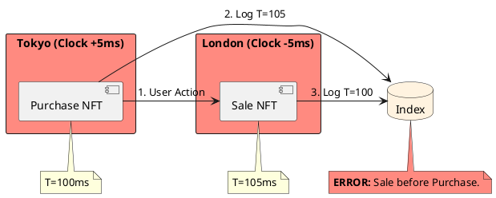

# 5.1: Clock Skew, Logical Time, and the Causality Crisis


## The Critical Dialogue


**Student:** Our Ledger is finally global. We have Anycast discovery and sharded databases. But we just had a "Double Spend" error. A user in Tokyo bought an NFT, then instantly sold it in London. Because of clock drift, the "Sale" appeared in the database 5ms *before* the "Purchase." How can we fix time?


**Principal:** You've hit the **Wall of Distributed Physics**. In a global fleet, there is no such thing as "Now." If your Ledger relies on `System.currentTimeMillis()`, you are building on a foundation of sand. To reach Principal level, we must move from physical clocks to **Logical Causality**. This is the only way to prevent financial corruption in a multi-region fleet.


---


## 1. The Requirement: The Sync Fallacy


**The Problem:** Hardware clocks drift independently. NTP attempts to sync them, but it has a physical limit of ~50ms jitter across continents.





---


## 2. Solution: Logical Time (Vector Clocks)


**The Principal Architecture:** Instead of asking the clock "What time is it?", every node tracks the "History" of observations.


### 2.1 The Vector Handshake
. **Mechanism:** Every node maintains an array of counters. 
. **Merge Physics:** When Node A sends a message to Node B, it sends its version of the "History" (the Vector). Node B merges this history, ensuring it can never process a message out of causal order.


```java
// Principal Level: Causal Ordering for the Global Ledger
public class CausalTracker {
    private final Map(String, Long) vector = new ConcurrentHashMap<>();
    private final String localNodeId;

    public CausalTracker(String nodeId) { this.localNodeId = nodeId; }

    public synchronized void recordEvent() {
        vector.merge(localNodeId, 1L, Long::sum);
    }

    public synchronized void observeRemote(Map(String, Long) remoteVector) {
        // Merge: Take the maximum of every known counter
        remoteVector.forEach((id, count) -> vector.merge(id, count, Math::max));
        recordEvent();
    }
}
```


---


## 3. Alternative Solution: Google TrueTime


**The Principal Architecture:** If we cannot trust the clock, we must **Wait for the Uncertainty to Expire**.


> [!abstract] The Physics: Spanner Wait
> . **Step 1:** Spanner nodes use Atomic Clocks to get an interval `[earliest, latest]`.
> . **Step 2:** Before committing a transaction at time $T$, the node **waits** for the uncertainty window to pass (e.g. 6ms).
> . **The Result:** This guarantees that $T$ is now definitely in the past for the entire planet.


---


## 🧠 Principal's Inquiry


. **Vector Clock Bloat:** In a fleet of 5,000 pods, why does the Vector Clock map become a performance bottleneck? (Hint: The **Network Payload** tax).


. **Mars Consistency:** If we move the Ledger to **Mars**, can we still achieve "Global Consistency"? (Hint: Light takes 3-20 minutes. The **Event Horizon**).


**Principal Summary:** Distributed Physics is the **Insurance Policy** for your data. We use Logical Time to ensure our Ledger never violates the laws of causality, no matter how much the clocks drift.
 Greenlanders use the type system to prove our software invariants.
