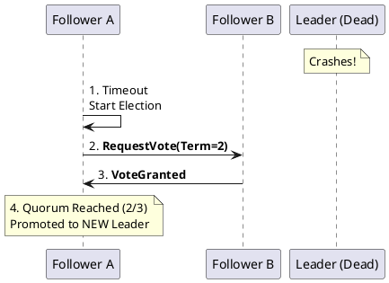

# 5.2: Distributed Consensus and the PACELC Law

## Learning Objectives

- Trace the Raft leader election protocol step-by-step: election timeout, RequestVote RPC, term monotonicity, and quorum requirement
- Explain why a quorum of `(N/2)+1` nodes is the minimum safe threshold and what happens to availability when you fall below it
- Distinguish CAP theorem from PACELC theorem and apply PACELC to classify real systems (etcd, Cassandra, DynamoDB, Spanner)
- Identify the difference between linearizability, sequential consistency, and eventual consistency at the API level
- Evaluate the latency cost of strong consistency (Raft leader round-trip) against the business risk of stale reads

## Prerequisites

- Chapter 5.1 — Clock Skew and Vector Clocks (logical time, happens-before)
- Chapter 5.4 — Network Partitions (quorum math, split-brain)
- Familiarity with Java `CompletableFuture` and basic RPC concepts

---

## The Critical Dialogue


**Student:** I'm using a Master-Slave setup for our Ledger. When the Master crashes, we manually promote a Slave. This causes 10 minutes of downtime. Why can't the database just decide who is the boss automatically?


**Principal:** You're asking for **Consensus**, the hardest problem in distributed systems. To reach Principal level, we must master the **Raft Consensus Algorithm** and the **PACELC Theorem**. We move from "Manual Failover" to **Algorithmic Sovereignty**.


---


## 1. The Requirement: Quorum and Consistency


**The Problem:** In a distributed Ledger, we cannot have two leaders (Split-Brain). 
. **The Majority Law:** Consensus requires a **Quorum**. If you have 3 nodes, you need 2 to agree. 
. **The Result:** If you lose 2 nodes, the system stops to protect integrity.


---


## 2. Solution: The Raft Consensus Algorithm


**The Principal Architecture:** Raft is the standard for deterministic consensus.


### 2.1 The Election Handshake
If the leader stops sending "Heartbeats," the followers start an election.
. **Terms:** Every election starts a new monotonic "Term."
. **Safety:** A candidate only becomes leader if its log is at least as up-to-date as the majority.





---


## 3. The Law: PACELC (Beyond CAP)


The CAP theorem only describes systems during a failure. A Principal uses **PACELC** to describe the system *always*.


> [!abstract] The Physics: PACELC (If P, then AC, else LC)
> . **P (Partition):** In a network split, choose **A (Availability)** or **C (Consistency)**.
> . **E (Else - Normal):** In normal operation, choose **L (Latency)** or **C (Consistency)**.
> . **The Ledger Choice:** We choose **PC/EC** (Consistency always). A "Social Feed" is **PA/EL**.


---

## 4. Source Archaeology

Real Raft and consensus implementations to read:

**etcd/raft** — `go.etcd.io/etcd/raft/v3/raft.go`: `stepCandidate()` handles vote tallying; `quorum()` returns `(len(r.prs.Voters)+1)/2`; `becomeLeader()` appends a no-op entry to fence out stale reads. `raft.go:Step()` is the core state-machine dispatcher — every message type maps to a handler via a function table.

**Apache Ratis** — `org.apache.ratis.server.impl.RaftServerImpl`: `handleRequestVoteAsync()` checks `lastEntry.getIndex() >= candidate.lastLogIndex` (log completeness check); `ServerState.updateStableTerm()` persists the term to stable storage before responding to any RPC — a requirement from the Raft safety proof.

**CockroachDB Raft** — wraps `etcd/raft`; `pkg/kv/kvserver/replica_raft.go` `(*Replica).propose()` is the write path: it encodes the command, calls `r.mu.internalRaftGroup.Propose()`, then waits on a proposal channel. Linearizable reads use `ReadIndex` (raft.go `ReadOnly`) — the leader confirms its lease before serving, avoiding a full round-trip.

**Kafka KRaft** — `core/src/main/scala/kafka/raft/KafkaRaftClient.scala`: `handleVoteRequest()` rejects votes for terms the broker has already seen. The `LeaderEpoch` concept maps directly to Raft's `term`. `KafkaMetadataLog` is the Raft log implementation backed by `UnifiedLog`.

---

## 5. Code Lab

**BAD approach — manual failover with no quorum check:**

```java
// BAD: Promoting a replica without verifying it has the latest log
// This creates Split-Brain: old leader may still be accepting writes
public class NaiveFailover {
    private volatile String currentLeader = "node-1";

    // Called by ops team after detecting node-1 is unresponsive
    public void promoteReplica(String nodeId) {
        // No check: is node-2's log up-to-date?
        // No check: is node-1 actually dead or just slow?
        // No fencing: node-1 may still hold client connections!
        currentLeader = nodeId;
        System.out.println("Promoted " + nodeId + " to leader");
        // Result: Two leaders, two divergent logs, data loss inevitable.
    }
}
```

**GOOD approach — Raft-style election with term fencing and quorum:**

```java
import java.util.Map;
import java.util.Set;
import java.util.concurrent.ConcurrentHashMap;
import java.util.concurrent.atomic.AtomicInteger;
import java.util.concurrent.atomic.AtomicLong;
import java.util.concurrent.atomic.AtomicReference;

/**
 * Simplified Raft election mechanics.
 * Models the safety properties from the Raft paper (Ongaro & Ousterhout, 2014):
 * - A node votes for at most one candidate per term (Election Safety).
 * - A candidate wins only if its log is at least as complete as the majority (Log Matching).
 * - Term monotonicity: nodes reject all RPCs with stale terms.
 */
public class RaftNode {

    public enum State { FOLLOWER, CANDIDATE, LEADER }

    private final String nodeId;
    private final int    clusterSize;
    private final AtomicLong              currentTerm = new AtomicLong(0);
    private final AtomicReference<String> votedFor    = new AtomicReference<>(null);
    private final AtomicReference<State>  state       = new AtomicReference<>(State.FOLLOWER);
    private volatile long lastLogIndex = 0;
    private volatile long lastLogTerm  = 0;

    public RaftNode(String nodeId, int clusterSize) {
        this.nodeId = nodeId;
        this.clusterSize = clusterSize;
    }

    /** Simulate receiving a RequestVote RPC from a candidate. */
    public record VoteRequest(String candidateId, long term, long lastLogIndex, long lastLogTerm) {}
    public record VoteResponse(long term, boolean granted) {}

    public VoteResponse handleVoteRequest(VoteRequest req) {
        long myTerm = currentTerm.get();

        // Rule 1: Reject stale terms immediately (term monotonicity)
        if (req.term() < myTerm) {
            return new VoteResponse(myTerm, false);
        }

        // Rule 2: If we see a higher term, revert to follower
        if (req.term() > myTerm) {
            currentTerm.set(req.term());
            votedFor.set(null);
            state.set(State.FOLLOWER);
            myTerm = req.term();
        }

        String alreadyVoted = votedFor.get();
        boolean canVote = (alreadyVoted == null || alreadyVoted.equals(req.candidateId()));

        // Rule 3: Candidate's log must be at least as complete as ours (§5.4 of Raft paper)
        boolean logOk = (req.lastLogTerm() > lastLogTerm) ||
                        (req.lastLogTerm() == lastLogTerm && req.lastLogIndex() >= lastLogIndex);

        if (canVote && logOk) {
            votedFor.set(req.candidateId());
            return new VoteResponse(myTerm, true);
        }
        return new VoteResponse(myTerm, false);
    }

    /**
     * Start an election. Returns true if this node wins (quorum of votes received).
     * In real Raft this is async; synchronous here for clarity.
     */
    public boolean startElection(Set<RaftNode> peers) {
        long newTerm = currentTerm.incrementAndGet();
        state.set(State.CANDIDATE);
        votedFor.set(nodeId);  // vote for self

        int votes = 1;  // self-vote
        VoteRequest req = new VoteRequest(nodeId, newTerm, lastLogIndex, lastLogTerm);

        for (RaftNode peer : peers) {
            VoteResponse resp = peer.handleVoteRequest(req);
            if (resp.term() > newTerm) {
                // Someone has a higher term — step down
                currentTerm.set(resp.term());
                state.set(State.FOLLOWER);
                votedFor.set(null);
                return false;
            }
            if (resp.granted()) votes++;
        }

        int quorum = (clusterSize / 2) + 1;
        if (votes >= quorum) {
            state.set(State.LEADER);
            System.out.printf("[%s] Won election for term %d with %d/%d votes (quorum=%d)%n",
                nodeId, newTerm, votes, clusterSize, quorum);
            return true;
        }
        state.set(State.FOLLOWER);
        return false;
    }
}

// Demonstration
class RaftDemo {
    public static void main(String[] args) {
        int N = 5;
        var nodes = java.util.List.of(
            new RaftNode("node-1", N),
            new RaftNode("node-2", N),
            new RaftNode("node-3", N),
            new RaftNode("node-4", N),
            new RaftNode("node-5", N)
        );

        // node-1 starts election after leader (node-0) times out
        var peers = new java.util.HashSet<>(nodes.subList(1, 5));
        boolean won = nodes.get(0).startElection(peers);
        // Won with 5/5 votes — quorum of 3 required, gets all 5
        System.out.println("Election won: " + won);
    }
}
```

---

## 6. Production Lens

**Raft election latency** — etcd's default `heartbeat-interval` is 100 ms, `election-timeout` is 1,000 ms. After a leader crash, worst-case election takes `election-timeout + network RTT` ≈ 1,100 ms. In practice, etcd documentation cites typical re-election in 500 ms on a healthy LAN cluster.

**Read latency cost of linearizability** — CockroachDB `ReadIndex` (avoid full log round-trip): linearizable reads cost one `ReadIndex` RPC to the leader + network RTT ≈ 1–5 ms intra-region. Without `ReadIndex`, every read is a Raft-replicated no-op: adds 5–15 ms. Follower reads (non-linearizable) are available in ~0.2 ms but may serve stale data up to the replication lag.

**PACELC system classification:**

| System | P choice | E choice | Typical write latency |
|---|---|---|---|
| etcd | Consistency | Consistency | 5–15 ms (Raft RTT) |
| Cassandra (W=1) | Availability | Latency | <1 ms gossip |
| DynamoDB (eventual) | Availability | Latency | 1–5 ms |
| Spanner | Consistency | Consistency | 10–100 ms (TrueTime wait) |
| CockroachDB | Consistency | Consistency | 5–20 ms |

---

## 7. Exercises

**1.** A 5-node Raft cluster loses two nodes simultaneously. Which partition can elect a leader? Prove it using the quorum formula `(N/2)+1`.

**2.** Explain "stale leader reads": why can a Raft leader serve a stale read immediately after an election even though it is the authoritative leader? What does `ReadIndex` do to prevent this?

**3.** PACELC classifies systems on two axes. Classify these: (a) MongoDB with `w:majority, readConcern:majority`; (b) Redis Sentinel; (c) Apache ZooKeeper. Justify each classification.

**4. Coding challenge:** Extend the `RaftNode` above to add a `AppendEntries` heartbeat handler. The handler must: (a) reject RPCs with stale terms; (b) reset an election timer on valid heartbeats; (c) update `currentTerm` if the leader has a higher term. Write a JUnit 5 test that proves a follower does NOT start an election while it is receiving valid heartbeats every 100 ms.

**5.** CockroachDB allows "follower reads" via `AS OF SYSTEM TIME follower_read_timestamp()`. What consistency level do these provide? In which business use cases is this acceptable for the Ledger?

---

## 8. Summary / Flashcard

- Raft guarantees safety through term monotonicity and log completeness: a candidate wins only if a quorum confirms it has the most complete log, making split-brain physically impossible.
- A quorum of `(N/2)+1` is the minimum overlap required: any two quorums share at least one node, so no two leaders can ever be simultaneously elected in different terms.
- CAP describes only partition behavior; PACELC adds the normal-operation trade-off: in the absence of partitions, every distributed system trades latency for consistency on every write.
- etcd and CockroachDB are PC/EC (always consistent); Cassandra with W=1 is PA/EL (always available); DynamoDB can be configured on either end of the spectrum.
- Linearizable reads via Raft `ReadIndex` cost one leader RTT (~5 ms intra-region); follower reads trade this latency for potential staleness bounded by replication lag.
