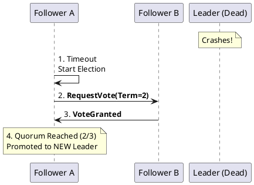

# 5.2: Distributed Consensus and the PACELC Law

## The Critical Dialogue

**Student:** I'm using a Master-Slave setup for our Ledger. When the Master crashes, we manually promote a Slave. This causes 10 minutes of downtime. Why can't the database just decide who is the boss automatically?

**Principal:** You're asking for **Consensus**, the hardest problem in distributed systems. To reach Principal level, we must master the **Raft Consensus Algorithm** and the **PACELC Theorem**. We move from "Manual Failover" to **Algorithmic Sovereignty**.

---

## 1. The Requirement: Quorum and Consistency

**The Problem:** In a distributed Ledger, we cannot have two leaders (Split-Brain). 
. **The Majority Law:** Consensus requires a **Quorum**. If you have 3 nodes, you need 2 to agree. 
. **The Result:** If you lose 2 nodes, the system stops to protect integrity.

---

## 2. Solution: The Raft Consensus Algorithm

**The Principal Architecture:** Raft is the standard for deterministic consensus.

### 2.1 The Election Handshake
If the leader stops sending "Heartbeats," the followers start an election.
. **Terms:** Every election starts a new monotonic "Term."
. **Safety:** A candidate only becomes leader if its log is at least as up-to-date as the majority.

---

## 3. The Law: PACELC (Beyond CAP)

The CAP theorem only describes systems during a failure. A Principal uses **PACELC** to describe the system *always*.

> [!abstract] The Physics: PACELC (If P, then AC, else LC)
> . **P (Partition):** In a network split, choose **A (Availability)** or **C (Consistency)**.
> . **E (Else - Normal):** In normal operation, choose **L (Latency)** or **C (Consistency)**.
> . **The Ledger Choice:** We choose **PC/EC** (Consistency always). A "Social Feed" is **PA/EL**.

---

## 🧠 Principal's Inquiry

. **The Split-Brain:** In a 5-node cluster split into groups of 3 and 2, which group can process orders? Why?

. **Linearizability:** How does Raft guarantee that a user never reads a "Stale" balance? (Hint: The **Read Quorum**).

**Principal Summary:** Consensus is about **Collective Truth**. We use Raft to ensure that even if the world is breaking, the Ledger only commits transactions verified by the majority.
 Greenlanders use the type system to prove our software invariants.
