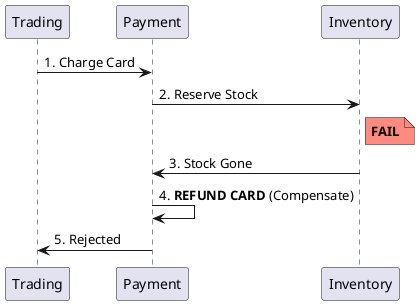

# 5.3: Distributed Sagas and Compensation Physics


## The Critical Dialogue


**Student:** We split our Ledger into `Trading` and `Payment`. If the card is charged but the stock is gone, my database `@Transactional` can't help me. How do I "Rollback" a network call?


**Principal:** You can't. In a distributed system, **Rollbacks are a Lie**. Once a message is sent or a card is charged, the world has changed. To reach Principal level, we must master the **Saga Pattern**. We don't "Undo" history; we issue a **Compensating Transaction** to mitigate the effect. We move from "Database Safety" to **Application-Level Consensus**.


---


## 1. The Requirement: Atomic Workflows across Boundaries


**The Problem:** Coordinating a process where each step has its own local database. 


### 1.1 The Compensating Transaction
A Saga is a sequence of local transactions. Each has a corresponding **Compensation**.
. **Forward Path:** `ChargeCard` -> `ReserveStock` -> `Settle`.
. **Backward Path:** `RefundCard` -> `ReleaseStock` -> `Fail`.





---


## 2. Solution: Choreography vs. Orchestration


### 2.1 Choreography (The Dance)
Each service emits an event, others listen.
. **Pros:** Fast, decoupled.
. **Cons:** No central visibility. "Event Spaghetti."


### 2.2 Orchestration (The Brain)
A central coordinator (e.g. **Temporal**) manages the state.
. **Pros:** Clear visibility.
. **Cons:** Coordinator is a single point of failure.


---


## 3. Principal Implementation: The Outbox Guard


To ensure our Saga never "Drops" an event, we use the **Transactional Outbox**.


```java
// Principal Level: Atomic Event Emission
public void chargeCard(Order order) {
    transactionTemplate.execute(status -> {
        paymentRepo.save(new Charge(order.id(), order.amount()));
        // The fact and the event are saved in ONE transaction
        outboxRepo.save(new OutboxEvent("PAYMENT_SUCCESS", order.id()));
        return null;
    });
}
```


---


## 🧠 Principal's Inquiry


. **Isolation Gap:** Sagas lack ACID "Isolation." What happens if a user checks their balance during a Saga, *after* the charge but *before* a potential refund?


. **Exactly-Once:** Why is it physically impossible to achieve "Exactly-Once" delivery? Why is **Idempotency** (Chapter 7.2) our only defense?


**Principal Summary:** Distributed Consistency is about **Business-level Fault Tolerance**. We use Sagas to ensure the Ledger is eventually consistent, even when the network is unreliable.
 Greenlanders use the type system to prove our software invariants.
