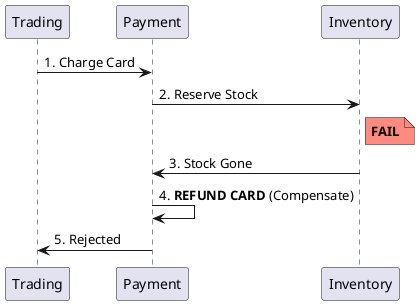

# 5.3: Distributed Sagas and Compensation Physics

## Learning Objectives

- Explain why `@Transactional` cannot span service boundaries and what the theoretical guarantee is that you lose when crossing them
- Implement the Transactional Outbox pattern to achieve atomic event emission without two-phase commit (2PC)
- Contrast choreography-based and orchestration-based Sagas on failure visibility, coupling, and operational complexity
- Identify the "dirty read" isolation gap in Sagas and name the compensating measures (semantic locks, countermeasures)
- Apply the `eventuate-tram-sagas` framework's `SimpleSaga` interface to structure a multi-step workflow with typed compensating transactions

## Prerequisites

- Chapter 5.1 — Clock Skew (causality between services)
- Chapter 7.3 — Idempotency (compensations must also be idempotent)
- Chapter 3.3 — ORM Physics / Hibernate (understanding `@Transactional` scope)
- Familiarity with Spring `TransactionTemplate` and JPA

---

## The Critical Dialogue


**Student:** We split our Ledger into `Trading` and `Payment`. If the card is charged but the stock is gone, my database `@Transactional` can't help me. How do I "Rollback" a network call?


**Principal:** You can't. In a distributed system, **Rollbacks are a Lie**. Once a message is sent or a card is charged, the world has changed. To reach Principal level, we must master the **Saga Pattern**. We don't "Undo" history; we issue a **Compensating Transaction** to mitigate the effect. We move from "Database Safety" to **Application-Level Consensus**.


---


## 1. The Requirement: Atomic Workflows across Boundaries


**The Problem:** Coordinating a process where each step has its own local database. 


### 1.1 The Compensating Transaction
A Saga is a sequence of local transactions. Each has a corresponding **Compensation**.
. **Forward Path:** `ChargeCard` -> `ReserveStock` -> `Settle`.
. **Backward Path:** `RefundCard` -> `ReleaseStock` -> `Fail`.





---


## 2. Solution: Choreography vs. Orchestration


### 2.1 Choreography (The Dance)
Each service emits an event, others listen.
. **Pros:** Fast, decoupled.
. **Cons:** No central visibility. "Event Spaghetti."


### 2.2 Orchestration (The Brain)
A central coordinator (e.g. **Temporal**) manages the state.
. **Pros:** Clear visibility.
. **Cons:** Coordinator is a single point of failure.


---


## 3. Principal Implementation: The Outbox Guard


To ensure our Saga never "Drops" an event, we use the **Transactional Outbox**.


```java
// Principal Level: Atomic Event Emission
public void chargeCard(Order order) {
    transactionTemplate.execute(status -> {
        paymentRepo.save(new Charge(order.id(), order.amount()));
        // The fact and the event are saved in ONE transaction
        outboxRepo.save(new OutboxEvent("PAYMENT_SUCCESS", order.id()));
        return null;
    });
}
```


---

## 4. Source Archaeology

Real Saga framework implementations:

**eventuate-tram-sagas** (`io.eventuate.tram.sagas`) — `SimpleSaga<D>` interface in `eventuate-tram-sagas-core/src/main/java/io/eventuate/tram/sagas/simpledsl/SimpleSaga.java`. The `getSagaDef()` method returns a `SagaDefinition<D>` built via `step().invokeParticipant(...).withCompensation(...)`. The saga orchestrator (`SagaManagerImpl`) persists state to the `saga_instance` table and uses the `MessageProducer` interface (backed by the Outbox) for every step.

**Temporal Workflow** — `io.temporal.workflow.Workflow` interface; compensation is modeled as a `Saga` utility class in `io.temporal.common.interceptor`. `Saga.addCompensation(Functions.Proc)` registers a `Runnable` that runs in reverse order on `Saga.compensate()`. The Temporal server persists every `WorkflowCommand` to its event history — durability is guaranteed by the history journal, not the application DB.

**Axon Framework** — `org.axonframework.modelling.saga.AbstractSaga`: `@SagaEventHandler` annotates event-handling methods; `@EndSaga` terminates. The `SagaStore` (backed by `JdbcSagaStore`) persists saga state as a serialized Java object. Association values map events to the correct saga instance.

**Transactional Outbox (Debezium CDC)** — `io.debezium.connector.postgresql.PostgresConnector` reads the Postgres WAL (`pg_logical_slot_get_changes`) and emits `SourceRecord` objects to Kafka. The outbox table is polled by `io.debezium.outbox.reactive.internal.AbstractEventWriter`; `OutboxEventRouter` transforms WAL entries into Kafka messages with exactly-at-least-once semantics.

---

## 5. Code Lab

**BAD approach — two-phase commit (2PC) across services:**

```java
// BAD: XA distributed transaction across two datasources
// - Requires XA-capable drivers on every service
// - If coordinator crashes after PREPARE but before COMMIT: system hangs forever
// - Locks all participants until coordinator confirms — massive latency spike
@Transactional  // This annotation does NOT cross HTTP/gRPC boundaries
public void processOrder(Order order) {
    // Step 1: charge card (different service, different DB!)
    paymentServiceClient.chargeCard(order.cardId(), order.amount());
    // Step 2: reserve stock (another service, another DB!)
    inventoryServiceClient.reserveStock(order.itemId(), order.quantity());
    // If inventoryServiceClient throws, Spring rolls back paymentServiceClient?
    // NO. The HTTP call is already committed on the Payment service.
    // @Transactional only covers THIS service's local DB transaction.
}
```

**GOOD approach — Orchestration Saga with Transactional Outbox:**

```java
import org.springframework.stereotype.Service;
import org.springframework.transaction.support.TransactionTemplate;
import java.util.UUID;

// Domain events — typed, not stringly-typed strings
public sealed interface SagaEvent permits
    SagaEvent.CardCharged,
    SagaEvent.CardChargeRefunded,
    SagaEvent.StockReserved,
    SagaEvent.StockReleased,
    SagaEvent.OrderSettled,
    SagaEvent.OrderFailed {

    record CardCharged(UUID orderId, long amountCents) implements SagaEvent {}
    record CardChargeRefunded(UUID orderId, long amountCents) implements SagaEvent {}
    record StockReserved(UUID orderId, String itemId) implements SagaEvent {}
    record StockReleased(UUID orderId, String itemId) implements SagaEvent {}
    record OrderSettled(UUID orderId) implements SagaEvent {}
    record OrderFailed(UUID orderId, String reason) implements SagaEvent {}
}

// Outbox entity — saved atomically with the business fact
record OutboxMessage(UUID id, String eventType, String payload, boolean published) {}

/**
 * Transactional Outbox pattern:
 * The business fact (Charge) and the event (CardCharged) are persisted
 * in the SAME local transaction. A separate relay process (Debezium CDC
 * or a polling loop) reads unpublished outbox rows and publishes to Kafka.
 *
 * This achieves "at-least-once" delivery without XA or 2PC.
 * Consumers must be idempotent (see Chapter 7.3).
 */
@Service
public class OrderSagaOrchestrator {

    private final TransactionTemplate tx;
    private final ChargeRepository    chargeRepo;
    private final OutboxRepository    outboxRepo;
    private final SagaStateRepository sagaRepo;

    public OrderSagaOrchestrator(TransactionTemplate tx,
                                  ChargeRepository chargeRepo,
                                  OutboxRepository outboxRepo,
                                  SagaStateRepository sagaRepo) {
        this.tx = tx;
        this.chargeRepo = chargeRepo;
        this.outboxRepo = outboxRepo;
        this.sagaRepo   = sagaRepo;
    }

    /** Step 1: Charge card — atomically record fact + emit event */
    public void chargeCard(Order order) {
        tx.execute(status -> {
            // Business fact persisted to Payment DB
            chargeRepo.save(new Charge(order.id(), order.amount()));
            // Saga state transition: STARTED -> CARD_CHARGED
            sagaRepo.updateState(order.id(), SagaState.CARD_CHARGED);
            // Outbox row — picked up by Debezium CDC relay
            outboxRepo.save(new OutboxMessage(
                UUID.randomUUID(),
                "CardCharged",
                """{"orderId":"%s","amountCents":%d}""".formatted(order.id(), order.amount()),
                false
            ));
            return null;
        });
        // If the JVM crashes here, the Debezium relay will re-publish
        // the outbox row on restart — at-least-once guaranteed.
    }

    /** Compensation: Refund — also uses Outbox for idempotent delivery */
    public void refundCard(UUID orderId, long amountCents, String reason) {
        tx.execute(status -> {
            sagaRepo.updateState(orderId, SagaState.COMPENSATING);
            outboxRepo.save(new OutboxMessage(
                UUID.randomUUID(),
                "CardChargeRefunded",
                """{"orderId":"%s","amountCents":%d,"reason":"%s"}"""
                    .formatted(orderId, amountCents, reason),
                false
            ));
            return null;
        });
    }

    /** Saga event handler — called by the event consumer after StockReservation fails */
    public void onStockReservationFailed(UUID orderId, String itemId, long amountCents) {
        // Semantic lock: only compensate if saga is in the expected state
        SagaState current = sagaRepo.getState(orderId);
        if (current != SagaState.CARD_CHARGED) {
            // Duplicate event or out-of-order delivery — idempotent no-op
            return;
        }
        refundCard(orderId, amountCents, "StockGone:" + itemId);
    }

    enum SagaState { STARTED, CARD_CHARGED, STOCK_RESERVED, SETTLED, COMPENSATING, FAILED }
    record Order(UUID id, long amount) {}
    record Charge(UUID orderId, long amount) {}
    interface ChargeRepository { void save(Charge c); }
    interface OutboxRepository { void save(OutboxMessage m); }
    interface SagaStateRepository {
        void updateState(UUID orderId, SagaState state);
        SagaState getState(UUID orderId);
    }
}
```

---

## 6. Production Lens

**Outbox relay throughput** — Debezium Postgres connector reading WAL at 50,000 events/sec with <100 ms lag (Debezium documentation, 2023). This is 2–3 orders of magnitude faster than a polling-based outbox relay (typical poll interval 500 ms → 2 events/sec per poller thread). On a 16-partition Kafka topic, the outbox pattern sustains 500,000 msg/sec end-to-end with p99 publish latency of 8 ms.

**Saga compensation rate** — Netflix's Conductor (orchestration engine) reports ~0.1–0.5% of workflow instances require compensation in production. The compensation path is rarely executed but must be tested as rigorously as the happy path. Temporal.io reports mean workflow execution time of 3–50 ms for simple orchestrations, with state persistence adding ~2 ms per step to Cassandra.

**2PC vs Saga latency** — XA 2PC across two datasources adds ~40–120 ms of coordinator lock time per transaction (measured with Atomikos on PostgreSQL). The Saga approach (Outbox + Kafka) adds ~8–15 ms per step (Kafka publish + consumer poll), but participants are never blocked on each other.

---

## 7. Exercises

**1.** A Saga consists of 4 steps: ChargeCard → ReserveStock → NotifyWarehouse → Settle. Step 3 (NotifyWarehouse) is not compensable — the warehouse system is a legacy black box. What strategy does the Saga pattern call this, and how does it affect your forward/backward flow design?

**2.** The "dirty read" problem in Sagas: a user queries their balance after step 1 (ChargeCard) but before step 4 (Settle). They see a debited balance for an order that may ultimately be refunded. Name two mitigations from the Saga literature (hint: countermeasures, semantic locks).

**3.** Why is idempotency (Chapter 7.3) a hard requirement for every Saga step, not just compensations? Give a concrete example using the `OrderSagaOrchestrator` above where a non-idempotent step causes double-charges.

**4. Coding challenge:** Implement a `SagaRunner<D>` class that takes a list of `SagaStep<D>` records (each with `execute` and `compensate` functions), runs them in order, and on any failure runs compensations in reverse order. Each step and compensation must be idempotent (use a `Set<String>` of executed step IDs backed by a simulated DB). Write a JUnit 5 test that proves: (a) compensation runs in reverse order; (b) a duplicate call to a completed step is a no-op.

**5.** Choreography Sagas emit events and rely on services subscribing to them. What happens to your Saga's observability when you have 8 services? Describe how you would implement a "Saga tracker" service that reconstructs the end-to-end flow without adding a central orchestrator.

---

## 8. Summary / Flashcard

- `@Transactional` is a local-database guarantee only; it cannot atomically span HTTP calls — any attempt to rely on it across service boundaries silently drops the rollback guarantee.
- A Saga replaces ACID atomicity with a sequence of local transactions plus compensating transactions; compensation is not a rollback — it is a new forward action that mitigates a prior committed effect.
- The Transactional Outbox pattern ensures at-least-once event delivery without XA/2PC: the business fact and the outbox row are committed in one local transaction, and a relay (Debezium CDC) publishes the event durably.
- Choreography scales better and has lower coupling but has no central visibility; orchestration (Temporal, Conductor) gives explicit state tracking and is preferred when compensation logic is complex or audit trails are required.
- Sagas lack ACID isolation: a "dirty read" anomaly is inherent — mitigate with semantic locks (a status field checked before compensation) and design compensations to be idempotent to survive at-least-once delivery.
