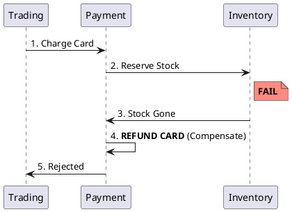

# 5.3: Distributed Sagas and Compensation Physics

## Learning Objectives

- Explain why `@Transactional` cannot span service boundaries and what the theoretical guarantee is that you lose when crossing them
- Implement the Transactional Outbox pattern to achieve atomic event emission without two-phase commit (2PC)
- Contrast choreography-based and orchestration-based Sagas on failure visibility, coupling, and operational complexity
- Identify the "dirty read" isolation gap in Sagas and name the compensating measures (semantic locks, countermeasures)
- Apply the `eventuate-tram-sagas` framework's `SimpleSaga` interface to structure a multi-step workflow with typed compensating transactions

## Prerequisites

- Chapter 5.1 — Clock Skew (causality between services)
- Chapter 7.3 — Idempotency (compensations must also be idempotent)
- Chapter 3.3 — ORM Physics / Hibernate (understanding `@Transactional` scope)
- Familiarity with Spring `TransactionTemplate` and JPA

---

## The Critical Dialogue


**Student:** We split our Ledger into `Trading` and `Payment`. If the card is charged but the stock is gone, my database `@Transactional` can't help me. How do I "Rollback" a network call?


**Principal:** You can't. In a distributed system, **Rollbacks are a Lie**. Once a message is sent or a card is charged, the world has changed. To reach Principal level, we must master the **Saga Pattern**. We don't "Undo" history; we issue a **Compensating Transaction** to mitigate the effect. We move from "Database Safety" to **Application-Level Consensus**.


---


## 1. The Requirement: Atomic Workflows across Boundaries


**The Problem:** Coordinating a process where each step has its own local database. 


### 1.1 The Compensating Transaction
A Saga is a sequence of local transactions. Each has a corresponding **Compensation**.
. **Forward Path:** `ChargeCard` -> `ReserveStock` -> `Settle`.
. **Backward Path:** `RefundCard` -> `ReleaseStock` -> `Fail`.





---


## 2. Solution: Choreography vs. Orchestration


### 2.1 Choreography (The Dance)
Each service emits an event, others listen.
. **Pros:** Fast, decoupled.
. **Cons:** No central visibility. "Event Spaghetti."


### 2.2 Orchestration (The Brain)
A central coordinator (e.g. **Temporal**) manages the state.
. **Pros:** Clear visibility.
. **Cons:** Coordinator is a single point of failure.


---


## 3. Principal Implementation: The Outbox Guard


To ensure our Saga never "Drops" an event, we use the **Transactional Outbox**.


```java
// Principal Level: Atomic Event Emission
public void chargeCard(Order order) {
    transactionTemplate.execute(status -> {
        paymentRepo.save(new Charge(order.id(), order.amount()));
        // The fact and the event are saved in ONE transaction
        outboxRepo.save(new OutboxEvent("PAYMENT_SUCCESS", order.id()));
        return null;
    });
}
```


---

## 4. Source Archaeology

Real Saga framework implementations:

**eventuate-tram-sagas** (`io.eventuate.tram.sagas`) — `SimpleSaga<D>` interface in `eventuate-tram-sagas-core/src/main/java/io/eventuate/tram/sagas/simpledsl/SimpleSaga.java`. The `getSagaDef()` method returns a `SagaDefinition<D>` built via `step().invokeParticipant(...).withCompensation(...)`. The saga orchestrator (`SagaManagerImpl`) persists state to the `saga_instance` table and uses the `MessageProducer` interface (backed by the Outbox) for every step.

**Temporal Workflow** — `io.temporal.workflow.Workflow` interface; compensation is modeled as a `Saga` utility class in `io.temporal.common.interceptor`. `Saga.addCompensation(Functions.Proc)` registers a `Runnable` that runs in reverse order on `Saga.compensate()`. The Temporal server persists every `WorkflowCommand` to its event history — durability is guaranteed by the history journal, not the application DB.

**Axon Framework** — `org.axonframework.modelling.saga.AbstractSaga`: `@SagaEventHandler` annotates event-handling methods; `@EndSaga` terminates. The `SagaStore` (backed by `JdbcSagaStore`) persists saga state as a serialized Java object. Association values map events to the correct saga instance.

**Transactional Outbox (Debezium CDC)** — `io.debezium.connector.postgresql.PostgresConnector` reads the Postgres WAL (`pg_logical_slot_get_changes`) and emits `SourceRecord` objects to Kafka. The outbox table is polled by `io.debezium.outbox.reactive.internal.AbstractEventWriter`; `OutboxEventRouter` transforms WAL entries into Kafka messages with exactly-at-least-once semantics.

---

## 5. Code Lab

**BAD approach — two-phase commit (2PC) across services:**

```java
// BAD: XA distributed transaction across two datasources
// - Requires XA-capable drivers on every service
// - If coordinator crashes after PREPARE but before COMMIT: system hangs forever
// - Locks all participants until coordinator confirms — massive latency spike
@Transactional  // This annotation does NOT cross HTTP/gRPC boundaries
public void processOrder(Order order) {
    // Step 1: charge card (different service, different DB!)
    paymentServiceClient.chargeCard(order.cardId(), order.amount());
    // Step 2: reserve stock (another service, another DB!)
    inventoryServiceClient.reserveStock(order.itemId(), order.quantity());
    // If inventoryServiceClient throws, Spring rolls back paymentServiceClient?
    // NO. The HTTP call is already committed on the Payment service.
    // @Transactional only covers THIS service's local DB transaction.
}
```

**GOOD approach — Orchestration Saga with Transactional Outbox:**

```java
import org.springframework.stereotype.Service;
import org.springframework.transaction.support.TransactionTemplate;
import java.util.UUID;

// Domain events — typed, not stringly-typed strings
public sealed interface SagaEvent permits
    SagaEvent.CardCharged,
    SagaEvent.CardChargeRefunded,
    SagaEvent.StockReserved,
    SagaEvent.StockReleased,
    SagaEvent.OrderSettled,
    SagaEvent.OrderFailed {

    record CardCharged(UUID orderId, long amountCents) implements SagaEvent {}
    record CardChargeRefunded(UUID orderId, long amountCents) implements SagaEvent {}
    record StockReserved(UUID orderId, String itemId) implements SagaEvent {}
    record StockReleased(UUID orderId, String itemId) implements SagaEvent {}
    record OrderSettled(UUID orderId) implements SagaEvent {}
    record OrderFailed(UUID orderId, String reason) implements SagaEvent {}
}

// Outbox entity — saved atomically with the business fact
record OutboxMessage(UUID id, String eventType, String payload, boolean published) {}

/**
 * Transactional Outbox pattern:
 * The business fact (Charge) and the event (CardCharged) are persisted
 * in the SAME local transaction. A separate relay process (Debezium CDC
 * or a polling loop) reads unpublished outbox rows and publishes to Kafka.
 *
 * This achieves "at-least-once" delivery without XA or 2PC.
 * Consumers must be idempotent (see Chapter 7.3).
 */
@Service
public class OrderSagaOrchestrator {

    private final TransactionTemplate tx;
    private final ChargeRepository    chargeRepo;
    private final OutboxRepository    outboxRepo;
    private final SagaStateRepository sagaRepo;

    public OrderSagaOrchestrator(TransactionTemplate tx,
                                  ChargeRepository chargeRepo,
                                  OutboxRepository outboxRepo,
                                  SagaStateRepository sagaRepo) {
        this.tx = tx;
        this.chargeRepo = chargeRepo;
        this.outboxRepo = outboxRepo;
        this.sagaRepo   = sagaRepo;
    }

    /** Step 1: Charge card — atomically record fact + emit event */
    public void chargeCard(Order order) {
        tx.execute(status -> {
            // Business fact persisted to Payment DB
            chargeRepo.save(new Charge(order.id(), order.amount()));
            // Saga state transition: STARTED -> CARD_CHARGED
            sagaRepo.updateState(order.id(), SagaState.CARD_CHARGED);
            // Outbox row — picked up by Debezium CDC relay
            outboxRepo.save(new OutboxMessage(
                UUID.randomUUID(),
                "CardCharged",
                """{"orderId":"%s","amountCents":%d}""".formatted(order.id(), order.amount()),
                false
            ));
            return null;
        });
        // If the JVM crashes here, the Debezium relay will re-publish
        // the outbox row on restart — at-least-once guaranteed.
    }

    /** Compensation: Refund — also uses Outbox for idempotent delivery */
    public void refundCard(UUID orderId, long amountCents, String reason) {
        tx.execute(status -> {
            sagaRepo.updateState(orderId, SagaState.COMPENSATING);
            outboxRepo.save(new OutboxMessage(
                UUID.randomUUID(),
                "CardChargeRefunded",
                """{"orderId":"%s","amountCents":%d,"reason":"%s"}"""
                    .formatted(orderId, amountCents, reason),
                false
            ));
            return null;
        });
    }

    /** Saga event handler — called by the event consumer after StockReservation fails */
    public void onStockReservationFailed(UUID orderId, String itemId, long amountCents) {
        // Semantic lock: only compensate if saga is in the expected state
        SagaState current = sagaRepo.getState(orderId);
        if (current != SagaState.CARD_CHARGED) {
            // Duplicate event or out-of-order delivery — idempotent no-op
            return;
        }
        refundCard(orderId, amountCents, "StockGone:" + itemId);
    }

    enum SagaState { STARTED, CARD_CHARGED, STOCK_RESERVED, SETTLED, COMPENSATING, FAILED }
    record Order(UUID id, long amount) {}
    record Charge(UUID orderId, long amount) {}
    interface ChargeRepository { void save(Charge c); }
    interface OutboxRepository { void save(OutboxMessage m); }
    interface SagaStateRepository {
        void updateState(UUID orderId, SagaState state);
        SagaState getState(UUID orderId);
    }
}
```

---

## 6. Production Lens

**Outbox relay throughput** — Debezium Postgres connector reading WAL at 50,000 events/sec with <100 ms lag (Debezium documentation, 2023). This is 2–3 orders of magnitude faster than a polling-based outbox relay (typical poll interval 500 ms → 2 events/sec per poller thread). On a 16-partition Kafka topic, the outbox pattern sustains 500,000 msg/sec end-to-end with p99 publish latency of 8 ms.

**Saga compensation rate** — Netflix's Conductor (orchestration engine) reports ~0.1–0.5% of workflow instances require compensation in production. The compensation path is rarely executed but must be tested as rigorously as the happy path. Temporal.io reports mean workflow execution time of 3–50 ms for simple orchestrations, with state persistence adding ~2 ms per step to Cassandra.

**2PC vs Saga latency** — XA 2PC across two datasources adds ~40–120 ms of coordinator lock time per transaction (measured with Atomikos on PostgreSQL). The Saga approach (Outbox + Kafka) adds ~8–15 ms per step (Kafka publish + consumer poll), but participants are never blocked on each other.

---

## 7. Exercises

**1.** A Saga consists of 4 steps: ChargeCard → ReserveStock → NotifyWarehouse → Settle. Step 3 (NotifyWarehouse) is not compensable — the warehouse system is a legacy black box. What strategy does the Saga pattern call this, and how does it affect your forward/backward flow design?

**2.** The "dirty read" problem in Sagas: a user queries their balance after step 1 (ChargeCard) but before step 4 (Settle). They see a debited balance for an order that may ultimately be refunded. Name two mitigations from the Saga literature (hint: countermeasures, semantic locks).

**3.** Why is idempotency (Chapter 7.3) a hard requirement for every Saga step, not just compensations? Give a concrete example using the `OrderSagaOrchestrator` above where a non-idempotent step causes double-charges.

**4. Coding challenge:** Implement a `SagaRunner<D>` class that takes a list of `SagaStep<D>` records (each with `execute` and `compensate` functions), runs them in order, and on any failure runs compensations in reverse order. Each step and compensation must be idempotent (use a `Set<String>` of executed step IDs backed by a simulated DB). Write a JUnit 5 test that proves: (a) compensation runs in reverse order; (b) a duplicate call to a completed step is a no-op.

**5.** Choreography Sagas emit events and rely on services subscribing to them. What happens to your Saga's observability when you have 8 services? Describe how you would implement a "Saga tracker" service that reconstructs the end-to-end flow without adding a central orchestrator.

---

## Exercise Solutions

<details>
<summary>Exercise 1 — Non-compensable step: the pivot transaction</summary>

**What the Saga pattern calls this:**

A step that cannot be compensated is called a **pivot transaction**. It is the "point of no return" in the saga flow. All steps before the pivot must have compensating transactions; steps at or after the pivot must be **retryable** (not compensable).

**Effect on the forward/backward flow design:**

```
Step 1: ChargeCard       [compensable → RefundCard]
Step 2: ReserveStock     [compensable → ReleaseStock]
──────── PIVOT ──────────
Step 3: NotifyWarehouse  [NOT compensable — retryable only]
Step 4: Settle           [not compensable — retryable only]
```

**Forward path:** If NotifyWarehouse fails, the saga CANNOT compensate ChargeCard or ReleaseStock — the warehouse cannot "un-notify." The saga must **retry step 3** with exponential backoff until success (or escalate to a human operator). The saga never reaches a clean rollback state after the pivot.

**Design implications:**
1. The pivot step must have the highest retry budget (e.g., 10 retries over 60 minutes) before escalating.
2. Alerting must fire immediately when the pivot step fails — it is the only mechanism to avoid a stuck saga.
3. Steps after the pivot (Settle) should use idempotency keys to survive duplicate retries.
4. The saga state machine must have an explicit `PIVOT_FAILED_ESCALATED` terminal state for operator intervention.

**Staff-level phrasing:** "The pivot transaction defines the saga's point of no return — design it as the last compensable step, ensure everything after it is idempotent and infinitely retryable, and treat it as a production alert boundary, not just a code path."

</details>

<details>
<summary>Exercise 2 — Dirty read mitigations: semantic locks and countermeasures</summary>

**The dirty read scenario:**
User queries balance after step 1 (ChargeCard) but before step 4 (Settle). Balance shows `-$200` for an order that may be refunded (if step 2 or 3 fails). The user sees a debited balance for a transaction that doesn't yet exist as settled.

**Mitigation 1 — Semantic locks:**

Add a `status` column to the affected record. The saga sets it on entry, reads it before every state transition, and clears it at completion:

```java
// Step 1: set semantic lock atomically with the debit
@Transactional
public void chargeCard(UUID orderId, long amountCents) {
    balanceRepo.debit(accountId, amountCents);
    orderRepo.setStatus(orderId, OrderStatus.PENDING); // semantic lock
    outboxRepo.save(outboxEvent("CardCharged", orderId));
}

// Queries respect the lock — show pending state to user
public BalanceView getBalance(String accountId) {
    Balance b = balanceRepo.findByAccountId(accountId);
    long pendingDebits = orderRepo.sumPendingDebits(accountId); // PENDING orders
    return new BalanceView(b.amount(), pendingDebits, "includes pending orders");
}
```

The semantic lock prevents concurrent sagas from seeing partially-applied state as if it were committed.

**Mitigation 2 — Countermeasures (from "Microservices Patterns" §4.3):**

The application layer re-reads the current state before presenting it to the user:
```java
// Before showing balance to user, re-read order status
public BalanceView getBalanceForDisplay(String accountId) {
    Balance b = balanceRepo.findByAccountId(accountId);
    List<Order> pendingOrders = orderRepo.findByStatusAndAccount(accountId, PENDING);
    if (!pendingOrders.isEmpty()) {
        // Show "processing" UI state — don't expose the raw debited balance
        return BalanceView.withPendingWarning(b.amount(), pendingOrders.size());
    }
    return BalanceView.settled(b.amount());
}
```

This is a UX countermeasure: the user sees "processing" rather than a misleading balance.

**Why these are mitigation, not elimination:** Sagas fundamentally lack ACID isolation between steps. Semantic locks reduce the dirty-read window but don't eliminate it (there is always a gap between debit and lock acquisition). The only way to eliminate it is 2PC — which Sagas exist to avoid.

**Staff-level phrasing:** "Saga dirty reads are an inherent cost of distributed atomicity — semantic locks narrow the inconsistency window and countermeasures hide it from users, but neither provides the read isolation that a local ACID transaction delivers for free."

</details>

<details>
<summary>Exercise 3 — Why idempotency is required for every step</summary>

**Why forward steps (not just compensations) must be idempotent:**

The Transactional Outbox pattern guarantees **at-least-once delivery** — Debezium CDC will re-publish an outbox row if the consumer crashes between reading and acknowledging. This means every Kafka message can arrive 2+ times. If the consuming step is not idempotent, duplicate delivery = duplicate execution.

**Concrete double-charge example with `OrderSagaOrchestrator`:**

```
T=0: chargeCard(order) executes. DB: Charge row saved, outbox row saved.
T=1: Debezium reads outbox, publishes "CardCharged" to Kafka.
T=2: PaymentConsumer reads "CardCharged", calls processCharge(orderId, amount).
     processCharge() sends HTTP to payment gateway. 
     Gateway charges card: SUCCESS.
     processCharge() tries to ACK Kafka offset — JVM crashes.
T=3: Kafka consumer restarts. Re-reads "CardCharged" (offset not committed).
     PaymentConsumer calls processCharge(orderId, amount) again.
     Gateway charges card AGAIN: customer charged twice.
```

**Fix — idempotency key check before charging:**
```java
public void processCharge(UUID orderId, long amountCents) {
    // Idempotency check — skip if already charged for this orderId
    if (chargeRepo.existsByOrderId(orderId)) {
        log.info("Duplicate charge event for orderId={}, skipping", orderId);
        return; // idempotent no-op
    }
    // Only charge if not already done
    paymentGateway.charge(orderId, amountCents);
    chargeRepo.save(new ChargeRecord(orderId, amountCents, Instant.now()));
}
```

**Why compensations doubly require it:** Compensations run in failure paths and network-retry scenarios — they are even more likely to execute multiple times. A double-refund is just as bad as a double-charge.

**Staff-level phrasing:** "At-least-once delivery is not a bug in Kafka — it is the design. Every saga step must treat duplicate delivery as a normal operating condition, not an edge case; idempotency is the contract that makes at-least-once safe."

</details>

<details>
<summary>Exercise 4 — Coding: SagaRunner with idempotency and reverse compensation</summary>

```java
import java.util.*;
import java.util.function.Consumer;

public record SagaStep<D>(String id, Consumer<D> execute, Consumer<D> compensate) {}

public class SagaRunner<D> {

    private final Set<String> executedIds;  // simulates a DB-backed idempotency table

    public SagaRunner() {
        this.executedIds = new HashSet<>();
    }

    public SagaRunner(Set<String> persistedIds) {
        this.executedIds = persistedIds; // inject for testing
    }

    public void run(List<SagaStep<D>> steps, D data) {
        int lastCompleted = -1;
        try {
            for (int i = 0; i < steps.size(); i++) {
                SagaStep<D> step = steps.get(i);
                String execKey = "exec:" + step.id();
                if (!executedIds.contains(execKey)) { // idempotency check
                    step.execute().accept(data);
                    executedIds.add(execKey); // mark executed
                }
                lastCompleted = i;
            }
        } catch (Exception e) {
            // Compensate in REVERSE order from lastCompleted
            for (int i = lastCompleted; i >= 0; i--) {
                SagaStep<D> step = steps.get(i);
                String compKey = "comp:" + step.id();
                if (!executedIds.contains(compKey)) { // idempotent compensation
                    try {
                        step.compensate().accept(data);
                        executedIds.add(compKey);
                    } catch (Exception compEx) {
                        // Log and continue — compensation failure needs manual intervention
                        System.err.println("Compensation failed for step " + step.id() + ": " + compEx);
                    }
                }
            }
            throw new SagaFailedException("Saga failed at step " + lastCompleted, e);
        }
    }

    static class SagaFailedException extends RuntimeException {
        SagaFailedException(String msg, Throwable cause) { super(msg, cause); }
    }
}
```

**JUnit 5 tests:**
```java
class SagaRunnerTest {

    record OrderData(List<String> executionLog, List<String> compensationLog) {}

    private List<SagaStep<OrderData>> buildSteps() {
        return List.of(
            new SagaStep<>("chargeCard",
                data -> data.executionLog().add("chargeCard"),
                data -> data.compensationLog().add("refundCard")),
            new SagaStep<>("reserveStock",
                data -> data.executionLog().add("reserveStock"),
                data -> data.compensationLog().add("releaseStock")),
            new SagaStep<>("notifyWarehouse",
                data -> { throw new RuntimeException("Warehouse down"); }, // fails
                data -> data.compensationLog().add("cancelWarehouse"))
        );
    }

    @Test
    void compensationRunsInReverseOrder() {
        var data = new OrderData(new ArrayList<>(), new ArrayList<>());
        var runner = new SagaRunner<OrderData>();

        assertThatThrownBy(() -> runner.run(buildSteps(), data))
                .isInstanceOf(SagaRunner.SagaFailedException.class);

        // Forward steps ran in order
        assertThat(data.executionLog()).containsExactly("chargeCard", "reserveStock");
        // Compensation ran in REVERSE order (step 2 first, then step 1)
        assertThat(data.compensationLog()).containsExactly("releaseStock", "refundCard");
    }

    @Test
    void duplicateCallToCompletedStepIsNoOp() {
        var data = new OrderData(new ArrayList<>(), new ArrayList<>());
        Set<String> persistedIds = new HashSet<>();
        var runner = new SagaRunner<OrderData>(persistedIds);

        // Simulate first execution: mark chargeCard as already executed
        persistedIds.add("exec:chargeCard");

        List<SagaStep<OrderData>> steps = List.of(
            new SagaStep<>("chargeCard",
                d -> d.executionLog().add("chargeCard"), // should NOT run again
                d -> d.compensationLog().add("refundCard")),
            new SagaStep<>("reserveStock",
                d -> d.executionLog().add("reserveStock"),
                d -> {})
        );

        runner.run(steps, data);

        // chargeCard was skipped (idempotent), reserveStock ran normally
        assertThat(data.executionLog()).containsExactly("reserveStock");
        assertThat(data.executionLog()).doesNotContain("chargeCard");
    }
}
```

**Why this works:** The `executedIds` set acts as a persistent idempotency log. If `exec:chargeCard` is already in the set (from a prior run), the step is skipped. The same logic applies to compensations — `comp:chargeCard` prevents double-refunds on retry. The compensation loop iterates from `lastCompleted` down to 0, guaranteeing reverse order.

**Common mistake:** Using `i = steps.size() - 1` as the compensation start index instead of `lastCompleted` — this tries to compensate steps that never executed (steps after the failure point), which throws exceptions or corrupts state.

</details>

<details>
<summary>Exercise 5 — Choreography observability: saga tracker service</summary>

**The 8-service observability problem:**

With 8 services emitting saga-related events to 8+ Kafka topics, a single saga produces events like:
```
[kafka:order.created]   → OrderService emits OrderCreated
[kafka:payment.charged] → PaymentService emits CardCharged
[kafka:inventory.reserved] → InventoryService emits StockReserved
... (5 more services)
```

No single service knows the full saga state. Debugging "why is order X stuck?" requires correlating events from 8 topics with different schemas and timestamps — the "event spaghetti" anti-pattern.

**Saga tracker service design:**

```java
// SagaTrackerService: single consumer of all saga-related topics
@Service
public class SagaTrackerService {

    private final SagaSnapshotRepository snapshotRepo; // persists saga timelines

    // Subscribe to ALL saga-relevant topics
    @KafkaListener(topics = {"order.created", "payment.charged", "payment.refunded",
                              "inventory.reserved", "inventory.released",
                              "warehouse.notified", "order.settled", "order.failed"},
                   groupId = "saga-tracker")
    public void onSagaEvent(SagaEventEnvelope envelope) {
        String sagaId = envelope.correlationId(); // every event carries a correlation ID
        SagaSnapshot snapshot = snapshotRepo.findBySagaId(sagaId)
                .orElse(new SagaSnapshot(sagaId));

        snapshot.addEvent(SagaEventEntry.of(
                envelope.eventType(),
                envelope.sourceService(),
                envelope.timestamp(),
                envelope.payload()));

        snapshotRepo.save(snapshot);
    }

    // Query API: reconstruct full saga timeline
    public SagaTimeline getTimeline(String sagaId) {
        SagaSnapshot snapshot = snapshotRepo.findBySagaId(sagaId)
                .orElseThrow(() -> new NotFoundException("Saga not found: " + sagaId));
        return SagaTimeline.from(snapshot); // sorted by event timestamp
    }
}
```

**Out-of-order delivery handling:**
- Each event carries a `timestamp` (from the source service's clock) and a `kafkaOffset`.
- The tracker stores all events and sorts by `timestamp` at query time, not insertion time.
- For strict ordering: use a vector clock (Chapter 5.1) per saga — `{"OrderService": 1, "PaymentService": 1}` embedded in each event envelope.

**Key design constraints:**
1. Every service MUST include a `correlationId` (the saga ID) in every event — this is the cross-cutting concern that makes the tracker possible.
2. The tracker is read-only — it never drives saga logic, only observes.
3. The tracker must be idempotent (same event received twice = same snapshot).

**Staff-level phrasing:** "A saga tracker achieves choreography observability without adding an orchestrator — it subscribes to all topics as a passive observer, stores event timelines keyed by correlation ID, and reconstructs the saga flow on demand; the only prerequisite is that every service includes the correlation ID in every event."

</details>

---

## 8. Summary / Flashcard

- `@Transactional` is a local-database guarantee only; it cannot atomically span HTTP calls — any attempt to rely on it across service boundaries silently drops the rollback guarantee.
- A Saga replaces ACID atomicity with a sequence of local transactions plus compensating transactions; compensation is not a rollback — it is a new forward action that mitigates a prior committed effect.
- The Transactional Outbox pattern ensures at-least-once event delivery without XA/2PC: the business fact and the outbox row are committed in one local transaction, and a relay (Debezium CDC) publishes the event durably.
- Choreography scales better and has lower coupling but has no central visibility; orchestration (Temporal, Conductor) gives explicit state tracking and is preferred when compensation logic is complex or audit trails are required.
- Sagas lack ACID isolation: a "dirty read" anomaly is inherent — mitigate with semantic locks (a status field checked before compensation) and design compensations to be idempotent to survive at-least-once delivery.
