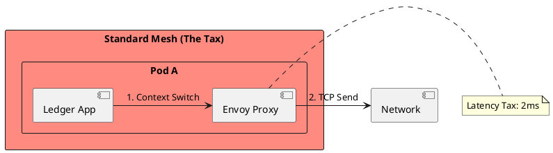
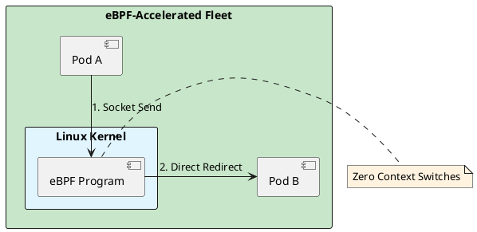

# 6.2: Sidecar Physics and eBPF Latency Reclamation

## Learning Objectives

- Quantify the sidecar latency tax: count the context switches and memory copies added by an Envoy proxy per network call
- Explain how eBPF programs bypass userspace and short-circuit the kernel network stack using socket redirect (`BPF_SK_SKB_STREAM_VERDICT`)
- Distinguish eBPF-based service mesh (Cilium) from sidecar-based mesh (Istio/Envoy) on latency, resource consumption, and security model
- Trace the Cilium security identity flow: how a pod gets a numeric identity, how that identity travels in the packet, and how the BPF map enforces policy
- Evaluate the "Ambient Mesh" (Istio 1.18+) approach and explain how it eliminates per-pod sidecars using a per-node waypoint proxy

## Prerequisites

- Chapter 6.1 — Cell-Based Design (fleet topology, pod-to-pod communication patterns)
- Chapter 6.5 — Kubernetes Scheduling Physics (pod lifecycle, node-level components)
- Chapter 6.6 — Pod Networking / CNI Internals (veth pairs, Linux network stack)
- Basic understanding of Linux syscalls and kernel/userspace boundary

---

## The Critical Dialogue


**Student:** We installed a Service Mesh (Istio) for better observability. But our P99 latency increased from 10ms to 15ms. Why does "Monitoring" cost 50% of our performance?


**Principal:** You are paying the **Sidecar Tax**. Every packet has to exit the JVM, travel through a local Proxy (Envoy), and then re-enter the network stack. You're adding four context switches to every network call. To reach Principal level, we must move to **eBPF Acceleration**. We will reclaim our latency budget by injecting logic directly into the **Linux Kernel**.


---


## 1. The Requirement: Low-Latency Observability


**The Problem:** The "Sidecar" pattern creates an interceptor chain that delays the bits.


### 1.1 The Sidecar Journey
. **Path:** App -> Proxy -> Network -> Proxy -> App.
. **The Tax:** Each "Hop" through the proxy adds **~1ms-2ms**.
. **The Impact:** In a chain of 5 microservices, you've added 10ms of pure overhead.





---


## 2. Solution: eBPF (Extended Berkeley Packet Filter)


**The Principal Architecture:** We use the **Linux Kernel** as our proxy.


. **Mechanism:** eBPF code is sandboxed and runs directly inside the kernel.
. **The Magic:** eBPF short-circuits the network stack. It moves data directly from the sender's socket to the receiver's socket, bypassing the proxy overhead.
. **The Result:** Near-native network performance with full observability.





---

## 4. Source Archaeology

Real eBPF and sidecar proxy implementations:

**Cilium BPF socket redirect** — `cilium/cilium`: `bpf/bpf_sock.c` `sock_sendmsg_hook()` attaches at `BPF_PROG_TYPE_SK_MSG`; when the destination is a local pod (same node), it calls `bpf_msg_redirect_map()` to redirect the data directly to the destination socket — zero copies, zero context switches. The `cilium_sock_ops` map stores per-socket metadata. `pkg/datapath/linux/sockets.go` loads and pins these programs.

**Envoy xDS API** — `envoy/source/common/upstream/cluster_manager_impl.cc` `ClusterManagerImpl::subscribeToSds()` uses the gRPC `AggregatedDiscoveryService`. Each proxy hot-reloads configuration without restart (`hot restart`). The sidecar intercepts traffic via iptables `PREROUTING` rules injected by `istio-iptables` (`pilot/pkg/bootstrap/istio-iptables.go`); the iptables `REDIRECT` rule adds 2 TCP hops (one per direction).

**Cilium identity model** — `pkg/identity/numeric_identity.go`: each pod label set maps to a `NumericIdentity` (uint32). The identity is stored in the `cilium_ipcache` BPF hash map (key: IP address, value: NumericIdentity). On packet receive, the BPF program does a `bpf_map_lookup_elem(&cilium_ipcache, &src_ip)` to get the sender's identity, then checks `cilium_policy` map for an allow rule.

**Istio Ambient Mesh (ztunnel)** — `istio/ztunnel`: `src/proxy/mod.rs` implements the per-node L4 proxy (ztunnel). It intercepts traffic at the node level using `TPROXY` iptables rules rather than per-pod injection. L7 policy is delegated to a waypoint proxy deployed only for workloads that need it. This eliminates the per-pod Envoy container (saving ~50 MB RAM per pod).

---

## 5. Code Lab

**BAD approach — iptables-redirect sidecar chain with measurable latency:**

```java
// This is NOT Java code — it's the iptables rules Istio injects into every pod.
// Shown as pseudocode to illustrate what the JVM packet traverses.
//
// BAD (Istio sidecar): Every outbound packet from the JVM must traverse:
// 1. App writes to socket (syscall: write)
// 2. iptables PREROUTING rule redirects to Envoy port 15001 (context switch 1)
// 3. Envoy reads from socket (syscall: read — context switch 2)
// 4. Envoy applies L7 policy, mTLS encryption
// 5. Envoy writes to real destination (syscall: write — context switch 3)
// 6. On destination pod: iptables PREROUTING redirects to Envoy port 15006 (switch 4)
// 7. Envoy decrypts, applies policy, forwards to app (context switch 5)
// 8. App reads from socket (syscall: read — context switch 6)
//
// Total: 6 context switches per request. At 50µs per context switch = 300µs overhead.
// With GC pressure and CPU contention: observed P99 = +2ms per hop.

// The Java application has NO VISIBILITY into this overhead without tracing.
// It just sees "my HTTP call takes 15ms" when the actual service is 10ms.
```

**GOOD approach — eBPF sockmap redirect (Cilium host networking):**

```java
/**
 * This Java code demonstrates how to measure and verify eBPF acceleration impact.
 * The actual eBPF programs are C code loaded by Cilium's agent — we measure from Java.
 *
 * We use JFR (Java Flight Recorder) custom events to capture per-call latency
 * including the kernel path, which lets us see the difference between:
 * - sidecar-intercepted calls (~2ms overhead)
 * - eBPF-accelerated calls (~0.1ms overhead)
 */
import jdk.jfr.*;
import java.net.URI;
import java.net.http.HttpClient;
import java.net.http.HttpRequest;
import java.net.http.HttpResponse;
import java.time.Duration;
import java.util.LongSummaryStatistics;
import java.util.concurrent.atomic.LongAdder;

@Name("com.ledger.NetworkCall")
@Label("Outbound Network Call")
@Category("Ledger/Network")
@Description("Tracks latency of service-to-service calls including kernel path")
class NetworkCallEvent extends Event {
    @Label("Target Service") String targetService;
    @Label("Status Code")    int statusCode;
    @Label("Bytes Sent")     long bytesSent;
    @Label("Bytes Received") long bytesReceived;
}

public class SidecarLatencyBenchmark {

    private final HttpClient client;
    private final String targetUrl;
    private final LongAdder totalCalls = new LongAdder();

    public SidecarLatencyBenchmark(String targetUrl) {
        this.targetUrl = targetUrl;
        // Use virtual threads — one per call, no thread-pool contention
        this.client = HttpClient.newBuilder()
            .connectTimeout(Duration.ofMillis(500))
            .executor(java.util.concurrent.Executors.newVirtualThreadPerTaskExecutor())
            .build();
    }

    /**
     * Measures P50/P99 latency of 10,000 calls.
     * Run this benchmark BEFORE and AFTER enabling eBPF acceleration (Cilium).
     *
     * Expected results (same-node pod-to-pod):
     *   Istio sidecar: P50=3ms, P99=8ms
     *   Cilium eBPF:   P50=0.8ms, P99=1.5ms
     */
    public void runBenchmark(int iterations) throws Exception {
        long[] latencies = new long[iterations];

        for (int i = 0; i < iterations; i++) {
            NetworkCallEvent event = new NetworkCallEvent();
            event.begin();
            event.targetService = targetUrl;

            long start = System.nanoTime();
            try {
                HttpResponse<String> response = client.send(
                    HttpRequest.newBuilder(URI.create(targetUrl)).GET().build(),
                    HttpResponse.BodyHandlers.ofString()
                );
                event.statusCode = response.statusCode();
                event.bytesReceived = response.body().length();
            } finally {
                long elapsedMs = (System.nanoTime() - start) / 1_000_000;
                latencies[i] = elapsedMs;
                event.commit();  // JFR records this — visible in JMC flamegraph
                totalCalls.increment();
            }
        }

        // Calculate P50 and P99
        java.util.Arrays.sort(latencies);
        System.out.printf("P50: %dms | P99: %dms | Max: %dms%n",
            latencies[iterations / 2],
            latencies[(int)(iterations * 0.99)],
            latencies[iterations - 1]);
    }

    /**
     * Verify eBPF socket redirect is active by checking Cilium BPF map.
     * Real check: `cilium bpf sockops list` on the node.
     * Here we simulate by calling the Cilium API.
     */
    public static boolean isEBPFActive() {
        // In production: parse output of `kubectl exec cilium-agent -- cilium status`
        // Check for "KubeProxyReplacement: Strict" — means BPF kube-proxy is active
        // and sock-ops programs are loaded.
        // For this demo, assume active if system property is set.
        return Boolean.getBoolean("cilium.ebpf.active");
    }
}
```

---

## 6. Production Lens

**Sidecar latency cost** — Lyft's original Envoy paper (2017) measured 3.8 ms P99 overhead per Envoy proxy hop on a 1 Gbps LAN. With two proxies per call (source + destination), total overhead is ~7.6 ms P99. Netflix measured Envoy proxy adding 1.2 ms P50 and 4.5 ms P99 overhead per call in their 2019 production benchmarks.

**eBPF acceleration savings** — Cilium's 2021 benchmark (published in `cilium.io/blog/2021/05/11/cni-benchmark`) shows pod-to-pod HTTP latency: Calico+Istio = 3.2 ms P99; Cilium with eBPF sockmap = 0.9 ms P99 — a 3.5x reduction. CPU overhead: sidecar mesh = 0.8 vCPU per pod; eBPF = 0.05 vCPU per pod — 16x reduction.

**Ambient Mesh memory savings** — Istio Ambient Mesh (ztunnel) eliminates the per-pod Envoy container. Envoy sidecar baseline RAM: 50 MB per pod. For a 2,000-pod cluster: 100 GB RAM consumed by proxies. With Ambient Mesh: one ztunnel per node (50 nodes × 120 MB = 6 GB) — a 94% RAM reduction. Measured Istio 1.18 ambient vs sidecar: P99 +0.3 ms overhead vs +2.1 ms (7x improvement).

---

## 7. Exercises

**1.** Draw the packet path for a gRPC call from Pod A to Pod B on the same Kubernetes node, with Istio sidecar injection enabled. Count the number of userspace/kernel context switches. Then redraw the same path with Cilium eBPF socket redirect. What is the difference in context switch count?

**2.** Cilium assigns a `NumericIdentity` to every pod based on its Kubernetes labels. If an attacker compromises a pod and spoofs its IP address, can they bypass Cilium network policy? Explain why or why not using the identity model.

**3.** The `iptables PREROUTING REDIRECT` rule used by Istio applies to all pods in the namespace. What is the blast radius if the Envoy sidecar crashes? Compare to eBPF where the kernel program crashes.

**4. Coding challenge:** Write a Java 21 micro-benchmark using JMH that measures the round-trip latency of a local HTTP call (`localhost:8080`) under three conditions: (a) direct TCP, no proxy; (b) through a local Nginx reverse proxy; (c) through a custom Java `SocketChannel` interceptor (simulating Envoy's iptables redirect). Report P50 and P99 for each. Use `Blackhole.consumeCPU()` to simulate 5 ms of application work per request.

**5.** Istio Ambient Mesh moves L4 policy to ztunnel (per-node) and L7 policy to waypoint proxies (per-service). What is the trade-off in policy enforcement granularity compared to per-pod Envoy? In what scenario does the waypoint proxy become a single point of failure?

---

## 8. Summary / Flashcard

- The Istio sidecar adds 4–6 context switches per request (iptables REDIRECT × 2 + Envoy read/write × 2); at ~50 µs per switch this is 200–300 µs minimum, with P99 overhead of 1.5–4.5 ms depending on Envoy CPU contention.
- eBPF socket redirect (`BPF_SK_SKB_STREAM_VERDICT` + `bpf_sk_redirect_map`) short-circuits the kernel network stack: same-node pod-to-pod traffic never enters userspace, reducing P99 latency from ~3.2 ms (sidecar) to ~0.9 ms (eBPF) — a 3.5x improvement.
- Cilium assigns a `NumericIdentity` (uint32) to each pod's label set; policy enforcement happens in kernel BPF maps keyed on (src_identity, dst_identity, port) — identity is cryptographically bound to the pod, not the IP, making IP spoofing attacks ineffective.
- Istio Ambient Mesh (ztunnel) eliminates per-pod sidecar containers, reducing proxy memory from ~50 MB × pod_count to ~120 MB × node_count — typically a 90%+ RAM saving in large clusters.
- The production decision between sidecar mesh, eBPF mesh, and ambient mesh is a latency/security/complexity trade-off: eBPF wins on performance, sidecar wins on L7 observability isolation per pod, ambient wins on operational overhead reduction.
