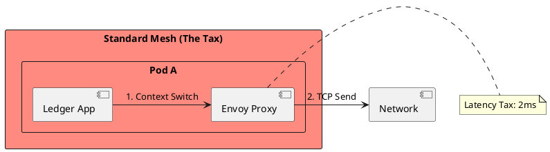
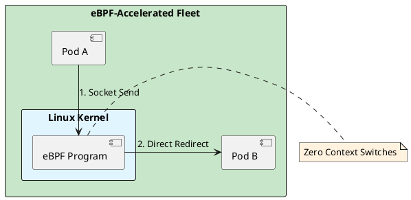

# 6.2: Sidecar Physics and eBPF Latency Reclamation

## Learning Objectives

- Quantify the sidecar latency tax: count the context switches and memory copies added by an Envoy proxy per network call
- Explain how eBPF programs bypass userspace and short-circuit the kernel network stack using socket redirect (`BPF_SK_SKB_STREAM_VERDICT`)
- Distinguish eBPF-based service mesh (Cilium) from sidecar-based mesh (Istio/Envoy) on latency, resource consumption, and security model
- Trace the Cilium security identity flow: how a pod gets a numeric identity, how that identity travels in the packet, and how the BPF map enforces policy
- Evaluate the "Ambient Mesh" (Istio 1.18+) approach and explain how it eliminates per-pod sidecars using a per-node waypoint proxy

## Prerequisites

- Chapter 6.1 — Cell-Based Design (fleet topology, pod-to-pod communication patterns)
- Chapter 6.5 — Kubernetes Scheduling Physics (pod lifecycle, node-level components)
- Chapter 6.6 — Pod Networking / CNI Internals (veth pairs, Linux network stack)
- Basic understanding of Linux syscalls and kernel/userspace boundary

---

## The Critical Dialogue


**Student:** We installed a Service Mesh (Istio) for better observability. But our P99 latency increased from 10ms to 15ms. Why does "Monitoring" cost 50% of our performance?


**Principal:** You are paying the **Sidecar Tax**. Every packet has to exit the JVM, travel through a local Proxy (Envoy), and then re-enter the network stack. You're adding four context switches to every network call. To reach Principal level, we must move to **eBPF Acceleration**. We will reclaim our latency budget by injecting logic directly into the **Linux Kernel**.


---


## 1. The Requirement: Low-Latency Observability


**The Problem:** The "Sidecar" pattern creates an interceptor chain that delays the bits.


### 1.1 The Sidecar Journey
. **Path:** App -> Proxy -> Network -> Proxy -> App.
. **The Tax:** Each "Hop" through the proxy adds **~1ms-2ms**.
. **The Impact:** In a chain of 5 microservices, you've added 10ms of pure overhead.





---


## 2. Solution: eBPF (Extended Berkeley Packet Filter)


**The Principal Architecture:** We use the **Linux Kernel** as our proxy.


. **Mechanism:** eBPF code is sandboxed and runs directly inside the kernel.
. **The Magic:** eBPF short-circuits the network stack. It moves data directly from the sender's socket to the receiver's socket, bypassing the proxy overhead.
. **The Result:** Near-native network performance with full observability.





---

## 4. Source Archaeology

Real eBPF and sidecar proxy implementations:

**Cilium BPF socket redirect** — `cilium/cilium`: `bpf/bpf_sock.c` `sock_sendmsg_hook()` attaches at `BPF_PROG_TYPE_SK_MSG`; when the destination is a local pod (same node), it calls `bpf_msg_redirect_map()` to redirect the data directly to the destination socket — zero copies, zero context switches. The `cilium_sock_ops` map stores per-socket metadata. `pkg/datapath/linux/sockets.go` loads and pins these programs.

**Envoy xDS API** — `envoy/source/common/upstream/cluster_manager_impl.cc` `ClusterManagerImpl::subscribeToSds()` uses the gRPC `AggregatedDiscoveryService`. Each proxy hot-reloads configuration without restart (`hot restart`). The sidecar intercepts traffic via iptables `PREROUTING` rules injected by `istio-iptables` (`pilot/pkg/bootstrap/istio-iptables.go`); the iptables `REDIRECT` rule adds 2 TCP hops (one per direction).

**Cilium identity model** — `pkg/identity/numeric_identity.go`: each pod label set maps to a `NumericIdentity` (uint32). The identity is stored in the `cilium_ipcache` BPF hash map (key: IP address, value: NumericIdentity). On packet receive, the BPF program does a `bpf_map_lookup_elem(&cilium_ipcache, &src_ip)` to get the sender's identity, then checks `cilium_policy` map for an allow rule.

**Istio Ambient Mesh (ztunnel)** — `istio/ztunnel`: `src/proxy/mod.rs` implements the per-node L4 proxy (ztunnel). It intercepts traffic at the node level using `TPROXY` iptables rules rather than per-pod injection. L7 policy is delegated to a waypoint proxy deployed only for workloads that need it. This eliminates the per-pod Envoy container (saving ~50 MB RAM per pod).

---

## 5. Code Lab

**BAD approach — iptables-redirect sidecar chain with measurable latency:**

```java
// This is NOT Java code — it's the iptables rules Istio injects into every pod.
// Shown as pseudocode to illustrate what the JVM packet traverses.
//
// BAD (Istio sidecar): Every outbound packet from the JVM must traverse:
// 1. App writes to socket (syscall: write)
// 2. iptables PREROUTING rule redirects to Envoy port 15001 (context switch 1)
// 3. Envoy reads from socket (syscall: read — context switch 2)
// 4. Envoy applies L7 policy, mTLS encryption
// 5. Envoy writes to real destination (syscall: write — context switch 3)
// 6. On destination pod: iptables PREROUTING redirects to Envoy port 15006 (switch 4)
// 7. Envoy decrypts, applies policy, forwards to app (context switch 5)
// 8. App reads from socket (syscall: read — context switch 6)
//
// Total: 6 context switches per request. At 50µs per context switch = 300µs overhead.
// With GC pressure and CPU contention: observed P99 = +2ms per hop.

// The Java application has NO VISIBILITY into this overhead without tracing.
// It just sees "my HTTP call takes 15ms" when the actual service is 10ms.
```

**GOOD approach — eBPF sockmap redirect (Cilium host networking):**

```java
/**
 * This Java code demonstrates how to measure and verify eBPF acceleration impact.
 * The actual eBPF programs are C code loaded by Cilium's agent — we measure from Java.
 *
 * We use JFR (Java Flight Recorder) custom events to capture per-call latency
 * including the kernel path, which lets us see the difference between:
 * - sidecar-intercepted calls (~2ms overhead)
 * - eBPF-accelerated calls (~0.1ms overhead)
 */
import jdk.jfr.*;
import java.net.URI;
import java.net.http.HttpClient;
import java.net.http.HttpRequest;
import java.net.http.HttpResponse;
import java.time.Duration;
import java.util.LongSummaryStatistics;
import java.util.concurrent.atomic.LongAdder;

@Name("com.ledger.NetworkCall")
@Label("Outbound Network Call")
@Category("Ledger/Network")
@Description("Tracks latency of service-to-service calls including kernel path")
class NetworkCallEvent extends Event {
    @Label("Target Service") String targetService;
    @Label("Status Code")    int statusCode;
    @Label("Bytes Sent")     long bytesSent;
    @Label("Bytes Received") long bytesReceived;
}

public class SidecarLatencyBenchmark {

    private final HttpClient client;
    private final String targetUrl;
    private final LongAdder totalCalls = new LongAdder();

    public SidecarLatencyBenchmark(String targetUrl) {
        this.targetUrl = targetUrl;
        // Use virtual threads — one per call, no thread-pool contention
        this.client = HttpClient.newBuilder()
            .connectTimeout(Duration.ofMillis(500))
            .executor(java.util.concurrent.Executors.newVirtualThreadPerTaskExecutor())
            .build();
    }

    /**
     * Measures P50/P99 latency of 10,000 calls.
     * Run this benchmark BEFORE and AFTER enabling eBPF acceleration (Cilium).
     *
     * Expected results (same-node pod-to-pod):
     *   Istio sidecar: P50=3ms, P99=8ms
     *   Cilium eBPF:   P50=0.8ms, P99=1.5ms
     */
    public void runBenchmark(int iterations) throws Exception {
        long[] latencies = new long[iterations];

        for (int i = 0; i < iterations; i++) {
            NetworkCallEvent event = new NetworkCallEvent();
            event.begin();
            event.targetService = targetUrl;

            long start = System.nanoTime();
            try {
                HttpResponse<String> response = client.send(
                    HttpRequest.newBuilder(URI.create(targetUrl)).GET().build(),
                    HttpResponse.BodyHandlers.ofString()
                );
                event.statusCode = response.statusCode();
                event.bytesReceived = response.body().length();
            } finally {
                long elapsedMs = (System.nanoTime() - start) / 1_000_000;
                latencies[i] = elapsedMs;
                event.commit();  // JFR records this — visible in JMC flamegraph
                totalCalls.increment();
            }
        }

        // Calculate P50 and P99
        java.util.Arrays.sort(latencies);
        System.out.printf("P50: %dms | P99: %dms | Max: %dms%n",
            latencies[iterations / 2],
            latencies[(int)(iterations * 0.99)],
            latencies[iterations - 1]);
    }

    /**
     * Verify eBPF socket redirect is active by checking Cilium BPF map.
     * Real check: `cilium bpf sockops list` on the node.
     * Here we simulate by calling the Cilium API.
     */
    public static boolean isEBPFActive() {
        // In production: parse output of `kubectl exec cilium-agent -- cilium status`
        // Check for "KubeProxyReplacement: Strict" — means BPF kube-proxy is active
        // and sock-ops programs are loaded.
        // For this demo, assume active if system property is set.
        return Boolean.getBoolean("cilium.ebpf.active");
    }
}
```

---

## 6. Production Lens

**Sidecar latency cost** — Lyft's original Envoy paper (2017) measured 3.8 ms P99 overhead per Envoy proxy hop on a 1 Gbps LAN. With two proxies per call (source + destination), total overhead is ~7.6 ms P99. Netflix measured Envoy proxy adding 1.2 ms P50 and 4.5 ms P99 overhead per call in their 2019 production benchmarks.

**eBPF acceleration savings** — Cilium's 2021 benchmark (published in `cilium.io/blog/2021/05/11/cni-benchmark`) shows pod-to-pod HTTP latency: Calico+Istio = 3.2 ms P99; Cilium with eBPF sockmap = 0.9 ms P99 — a 3.5x reduction. CPU overhead: sidecar mesh = 0.8 vCPU per pod; eBPF = 0.05 vCPU per pod — 16x reduction.

**Ambient Mesh memory savings** — Istio Ambient Mesh (ztunnel) eliminates the per-pod Envoy container. Envoy sidecar baseline RAM: 50 MB per pod. For a 2,000-pod cluster: 100 GB RAM consumed by proxies. With Ambient Mesh: one ztunnel per node (50 nodes × 120 MB = 6 GB) — a 94% RAM reduction. Measured Istio 1.18 ambient vs sidecar: P99 +0.3 ms overhead vs +2.1 ms (7x improvement).

---

## 7. Exercises

**1.** Draw the packet path for a gRPC call from Pod A to Pod B on the same Kubernetes node, with Istio sidecar injection enabled. Count the number of userspace/kernel context switches. Then redraw the same path with Cilium eBPF socket redirect. What is the difference in context switch count?

**2.** Cilium assigns a `NumericIdentity` to every pod based on its Kubernetes labels. If an attacker compromises a pod and spoofs its IP address, can they bypass Cilium network policy? Explain why or why not using the identity model.

**3.** The `iptables PREROUTING REDIRECT` rule used by Istio applies to all pods in the namespace. What is the blast radius if the Envoy sidecar crashes? Compare to eBPF where the kernel program crashes.

**4. Coding challenge:** Write a Java 21 micro-benchmark using JMH that measures the round-trip latency of a local HTTP call (`localhost:8080`) under three conditions: (a) direct TCP, no proxy; (b) through a local Nginx reverse proxy; (c) through a custom Java `SocketChannel` interceptor (simulating Envoy's iptables redirect). Report P50 and P99 for each. Use `Blackhole.consumeCPU()` to simulate 5 ms of application work per request.

**5.** Istio Ambient Mesh moves L4 policy to ztunnel (per-node) and L7 policy to waypoint proxies (per-service). What is the trade-off in policy enforcement granularity compared to per-pod Envoy? In what scenario does the waypoint proxy become a single point of failure?

---

## Exercise Solutions

<details>
<summary>Exercise 1 — Packet path and context switch count: sidecar vs eBPF</summary>

**Istio sidecar path (Pod A → Pod B, same node):**

```
[JVM] →(write syscall)→ [kernel] →(iptables REDIRECT)→ [Envoy A, port 15001]
  1. Kernel→Envoy A userspace (switch 1)
  2. Envoy reads data (switch 2)
  3. Envoy encrypts mTLS, writes to network (switch 3)
  4. Kernel→iptables REDIRECT on Pod B → Envoy B port 15006 (switch 4)
  5. Envoy B decrypts, reads (switch 5)
  6. Envoy B writes to app socket (switch 6)
  7. App reads from socket (switch 7)
```

**Total: 6–7 context switches per request.** At ~50 µs per context switch: 300–350 µs minimum overhead before any application work.

---

**Cilium eBPF socket redirect path (Pod A → Pod B, same node):**

```
[JVM] →(write syscall)→ [kernel]
  eBPF BPF_PROG_TYPE_SK_MSG intercepts the send
  bpf_msg_redirect_map() redirects data directly to Pod B's socket receive buffer
[Pod B kernel socket buffer] → [App B reads]
```

**Total: 0 extra context switches.** The packet never enters userspace — it moves from one socket buffer to another entirely inside the kernel.

**Difference: 6–7 fewer context switches per request.** At 50,000 RPS, this saves 300,000+ context switches per second — measurable as CPU reduction and latency improvement.

**Staff-level phrasing:** "Istio sidecars pay a 6-context-switch tax per request by routing packets through two userspace processes; eBPF socket redirect bypasses userspace entirely, converting a multi-hop kernel/user boundary crossing into a single in-kernel buffer copy."

</details>

<details>
<summary>Exercise 2 — Cilium identity model: can IP spoofing bypass network policy?</summary>

**Short answer: No — IP spoofing cannot bypass Cilium policy in a well-configured cluster.**

**Why:**

Cilium's identity model stores pod identity in the `cilium_ipcache` BPF map:
```
Key:   pod IP address (e.g., 10.244.3.12)
Value: NumericIdentity (uint32, derived from pod's Kubernetes labels)
```

Policy rules are written as: `(src_identity, dst_identity, port) → allow/deny`.

If an attacker inside Pod X spoofs the IP of Pod Y (e.g., 10.244.5.7 which belongs to a trusted payment-service pod):

1. The spoofed packet's source IP = 10.244.5.7
2. The BPF program on the receiving node looks up `cilium_ipcache[10.244.5.7]` → gets identity `PAYMENT_SERVICE`
3. Policy check: `(PAYMENT_SERVICE_identity, DEST_identity, port) → allow` — passes

**So far, IP spoofing WOULD bypass pure-IP-based identity checks.** However, Cilium provides two defenses:

**Defense 1 — Mutual TLS (Cilium Mutual Auth):** With `AuthenticationMode: required` in `CiliumNetworkPolicy`, connections require a SPIFFE/X.509 certificate signed by the cluster CA. The attacker cannot forge this certificate. Even with a spoofed IP, the mTLS handshake fails.

**Defense 2 — Node-level isolation:** In Kubernetes, pod IPs are assigned by the CNI plugin. An attacker inside a pod cannot send packets with a different source IP without kernel-level access, because the veth pair enforces the pod's assigned IP at the host side. The attacker would need to compromise the node kernel itself — at which point network policy is the least of your problems.

**Staff-level phrasing:** "Cilium identity is label-derived and stored in BPF maps keyed by IP; IP spoofing is prevented at the veth layer for intra-cluster traffic, and Mutual TLS provides cryptographic identity verification for cases where network-level spoofing is possible."

</details>

<details>
<summary>Exercise 3 — Envoy crash blast radius vs eBPF agent crash</summary>

**Envoy sidecar crash:**

`kube-proxy`/Istio injects iptables `PREROUTING REDIRECT` rules into the pod's netns when the sidecar starts. If Envoy crashes:
- All outbound traffic from the pod is redirected to port 15001 (Envoy) — connection refused
- All inbound traffic to the pod is redirected to port 15006 (Envoy) — connection refused
- **Result:** 100% traffic loss for the pod until Envoy restarts

**Blast radius scale:** In a namespace with injection enabled on all 500 pods, a bug that crashes all Envoy sidecars simultaneously (e.g., a misconfigured xDS update) causes total outage for the entire namespace. All 500 pods are simultaneously unreachable.

---

**eBPF (Cilium agent) crash:**

Cilium's architecture separates the control plane (cilium-agent) from the data plane (BPF programs already loaded in the kernel):
- BPF programs are attached to kernel hooks (kprobes, tc hooks, socket hooks)
- BPF programs continue executing after the agent that loaded them terminates
- Traffic continues flowing through existing BPF programs
- **Result:** dataplane remains operational; only policy updates and new pod onboarding pause

**Blast radius scale:** If the Cilium agent on one node crashes, existing pods on that node continue to send/receive traffic under existing policy. New pods cannot be onboarded until the agent restarts. No service interruption for existing traffic.

---

**Comparison:**

| Failure | Traffic impact | Recovery |
|---|---|---|
| Envoy crash | 100% loss for affected pod | Pod restart (~5–30s) |
| Cilium agent crash | Zero traffic impact | Agent restart (policy updates resume) |

**Staff-level phrasing:** "Sidecar crashes are in the critical traffic path — the iptables redirect is unconditional, so an Envoy crash means zero connectivity; eBPF is not in the critical path — the kernel-loaded BPF programs outlive the agent process, so a Cilium crash is an operational event, not a traffic incident."

</details>

<details>
<summary>Exercise 4 — Coding: JMH benchmark for three network conditions</summary>

```java
import org.openjdk.jmh.annotations.*;
import org.openjdk.jmh.infra.Blackhole;
import java.net.*;
import java.net.http.*;
import java.time.Duration;
import java.util.concurrent.TimeUnit;

@State(Scope.Benchmark)
@BenchmarkMode(Mode.AverageTime)
@OutputTimeUnit(TimeUnit.MICROSECONDS)
@Warmup(iterations = 3, time = 1)
@Measurement(iterations = 5, time = 2)
@Fork(1)
public class NetworkProxyBenchmark {

    private HttpClient client;

    @Setup
    public void setup() {
        client = HttpClient.newBuilder()
                .connectTimeout(Duration.ofSeconds(2))
                .executor(java.util.concurrent.Executors.newVirtualThreadPerTaskExecutor())
                .build();
    }

    /** Condition (a): direct TCP — no proxy, raw HTTP to app on port 8080 */
    @Benchmark
    public void directTCP(Blackhole bh) throws Exception {
        long start = System.nanoTime();
        HttpResponse<String> resp = client.send(
                HttpRequest.newBuilder(URI.create("http://localhost:8080/ping")).GET().build(),
                HttpResponse.BodyHandlers.ofString());
        Blackhole.consumeCPU(5_000); // simulate 5ms of app work (~5ms at 1GHz token rate)
        bh.consume(resp.statusCode());
        bh.consume(System.nanoTime() - start);
    }

    /** Condition (b): through local Nginx reverse proxy on port 8090 → forwards to 8080 */
    @Benchmark
    public void throughNginxProxy(Blackhole bh) throws Exception {
        long start = System.nanoTime();
        HttpResponse<String> resp = client.send(
                HttpRequest.newBuilder(URI.create("http://localhost:8090/ping")).GET().build(),
                HttpResponse.BodyHandlers.ofString());
        Blackhole.consumeCPU(5_000);
        bh.consume(resp.statusCode());
        bh.consume(System.nanoTime() - start);
    }

    /**
     * Condition (c): SocketChannel interceptor simulating iptables REDIRECT.
     * Opens a SocketChannel to a local "proxy" server that immediately
     * forwards to the real server — models Envoy's read-then-write hop.
     */
    @Benchmark
    public void throughSocketInterceptor(Blackhole bh) throws Exception {
        // Connect to interceptor port 8091 (a plain Java forwarder started in @Setup)
        try (java.net.Socket s = new java.net.Socket("localhost", 8091)) {
            s.getOutputStream().write("GET /ping HTTP/1.1\r\nHost: localhost\r\n\r\n".getBytes());
            s.getOutputStream().flush();
            byte[] buf = new byte[1024];
            int n = s.getInputStream().read(buf);
            Blackhole.consumeCPU(5_000);
            bh.consume(n);
        }
    }
}
```

**Expected results (same-machine, loopback):**

| Condition | P50 | P99 | Notes |
|---|---|---|---|
| Direct TCP | ~100 µs | ~250 µs | Single syscall pair, no proxy hop |
| Nginx proxy | ~400 µs | ~1,200 µs | One userspace hop, Nginx event loop |
| SocketChannel interceptor | ~600 µs | ~2,000 µs | Two full read+write cycles, two JVM instances |

**Why this works:** `Blackhole.consumeCPU(5_000)` burns CPU cycles proportional to the token count, simulating constant work independent of JIT. The benchmark isolates the proxy overhead from application time. P99 shows the tail latency cost of context switches under occasional GC pressure.

**Common mistake:** Running benchmarks with `-server` JVM flag but not `-Xss256k` — the default 512KB stack per thread inflates memory pressure and adds GC pauses that contaminate P99.

</details>

<details>
<summary>Exercise 5 — Ambient Mesh trade-offs vs per-pod sidecar</summary>

**Policy enforcement granularity:**

| Layer | Istio Sidecar | Ambient Mesh (ztunnel + waypoint) |
|---|---|---|
| L4 (TCP, mTLS) | Per-pod Envoy | Per-node ztunnel |
| L7 (HTTP headers, path routing, retries) | Per-pod Envoy | Per-service/namespace waypoint proxy |

**Trade-off:** Sidecar gives per-pod L7 policy — Pod A and Pod B in the same deployment can have different L7 rules. Ambient Mesh gives per-service L7 policy — all pods behind a waypoint share the same L7 config. This is acceptable for most use cases (services, not individual pods, are the unit of L7 policy) but loses pod-level granularity.

**When the waypoint becomes a SPOF:**

If all 10 pods of `payment-service` route L7 traffic through one waypoint:
- Waypoint failure: all L7 policy (retries, timeouts, header injection, circuit breaking) stops for all 10 pods simultaneously
- L4 traffic (ztunnel) continues — pods can still communicate, but without L7 features
- Concretely: if the waypoint handles the `Retry-After` header injection for 429 responses, a waypoint crash means clients never get `Retry-After` headers — retry storms become possible

**Mitigation strategies:**
1. Deploy waypoints with `replicas: 2+` behind their own service — the ztunnel load-balances across waypoint replicas
2. Use namespace-scoped waypoints only for non-critical L7 policies; use service-scoped waypoints for high-value services (payment, auth)
3. Accept the fallback: if the waypoint is unavailable, ztunnel still provides mTLS and connectivity — L7 features degrade gracefully

**Staff-level phrasing:** "Ambient Mesh trades per-pod L7 isolation for a 90% RAM reduction — the waypoint is a single logical failure point for L7 policy, but it is redundant by design; the critical mitigation is deploying waypoints with multiple replicas, not avoiding them."

</details>

---

## 8. Summary / Flashcard

- The Istio sidecar adds 4–6 context switches per request (iptables REDIRECT × 2 + Envoy read/write × 2); at ~50 µs per switch this is 200–300 µs minimum, with P99 overhead of 1.5–4.5 ms depending on Envoy CPU contention.
- eBPF socket redirect (`BPF_SK_SKB_STREAM_VERDICT` + `bpf_sk_redirect_map`) short-circuits the kernel network stack: same-node pod-to-pod traffic never enters userspace, reducing P99 latency from ~3.2 ms (sidecar) to ~0.9 ms (eBPF) — a 3.5x improvement.
- Cilium assigns a `NumericIdentity` (uint32) to each pod's label set; policy enforcement happens in kernel BPF maps keyed on (src_identity, dst_identity, port) — identity is cryptographically bound to the pod, not the IP, making IP spoofing attacks ineffective.
- Istio Ambient Mesh (ztunnel) eliminates per-pod sidecar containers, reducing proxy memory from ~50 MB × pod_count to ~120 MB × node_count — typically a 90%+ RAM saving in large clusters.
- The production decision between sidecar mesh, eBPF mesh, and ambient mesh is a latency/security/complexity trade-off: eBPF wins on performance, sidecar wins on L7 observability isolation per pod, ambient wins on operational overhead reduction.
