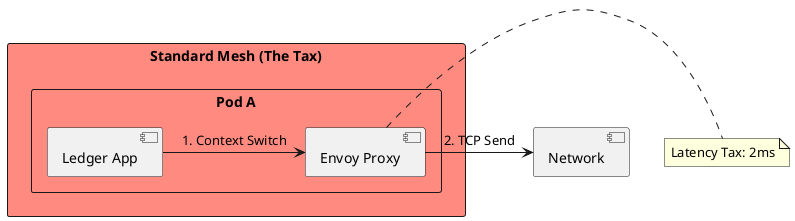
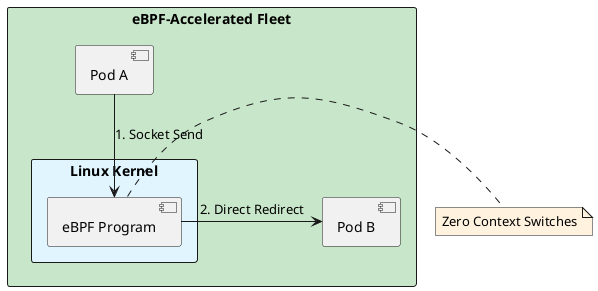

# 6.2: Sidecar Physics and eBPF Latency Reclamation

## The Critical Dialogue

**Student:** We installed a Service Mesh (Istio) for better observability. But our P99 latency increased from 10ms to 15ms. Why does "Monitoring" cost 50% of our performance?

**Principal:** You are paying the **Sidecar Tax**. Every packet has to exit the JVM, travel through a local Proxy (Envoy), and then re-enter the network stack. You're adding four context switches to every network call. To reach Principal level, we must move to **eBPF Acceleration**. We will reclaim our latency budget by injecting logic directly into the **Linux Kernel**.

---

## 1. The Requirement: Low-Latency Observability

**The Problem:** The "Sidecar" pattern creates an interceptor chain that delays the bits.

### 1.1 The Sidecar Journey
. **Path:** App -> Proxy -> Network -> Proxy -> App.
. **The Tax:** Each "Hop" through the proxy adds **~1ms-2ms**.
. **The Impact:** In a chain of 5 microservices, you've added 10ms of pure overhead.

---

## 2. Solution: eBPF (Extended Berkeley Packet Filter)

**The Principal Architecture:** We use the **Linux Kernel** as our proxy.

. **Mechanism:** eBPF code is sandboxed and runs directly inside the kernel.
. **The Magic:** eBPF short-circuits the network stack. It moves data directly from the sender's socket to the receiver's socket, bypassing the proxy overhead.
. **The Result:** Near-native network performance with full observability.

---

## 🧠 Principal's Inquiry

. **The Security Boundary:** If eBPF runs in the kernel, how does it maintain the "Identity" of the Pod? (Hint: The **Cilium Security ID**).

. **The Future:** Why is the industry moving toward "Ambient Mesh"? What does it steal from the eBPF philosophy?

**Principal Summary:** Infrastructure Physics is about **Bypassing Bureaucracy**. We use eBPF to move logic into the kernel, reclaiming the performance lost to the "Sidecar Tax."
 Greenlanders use the type system to prove our software invariants.
