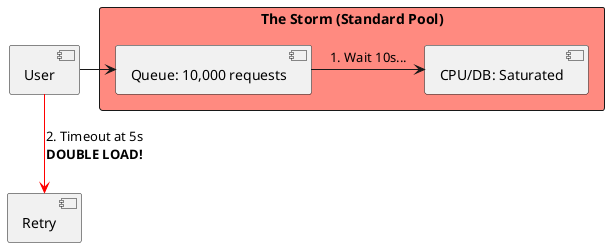

# 6.3: Adaptive Load Shedding and TCP Vegas Logic


## The Critical Dialogue


**Student:** Our Ledger is under heavy load. The service is slowing down for everyone. Should we just increase our "Max Thread Pool" to handle the queue?


**Principal:** You're about to commit **Systemic Suicide**. In a failing system, a queue is a **Death Trap**. If you increase the thread pool, you are just increasing the number of people fighting for a saturated resource (the DB or CPU). To reach Principal level, we must master **Adaptive Load Shedding**. We move from "Sustaining Everyone" to **Disciplined Rejection**.


---


## 1. The Requirement: Little's Law and the Latency Wall


**The Problem:** Latency is mathematically tied to queue depth.


### 1.1 The Math of Overload
. **Little's Law:** $L = \lambda * W$ (Load = Arrival Rate * Wait Time).
. **The Result:** If you let 10,000 requests in ($L$), every user will wait **10 seconds** ($W$) regardless of how fast your code is. They will timeout at 5s and **Retry**, doubling your load (**Retry Storm**).





---


## 2. Solution: Adaptive Limits (TCP Vegas)


**The Principal Architecture:** We don't use fixed pools. We use **Dynamic Gates** based on latency.


. **Mechanism:** Monitor the P99 latency.
. **The Logic:** If latency increases, **Lower** the `MAX_CONCURRENCY` limit. Reject traffic at the "Front Door" in 1ms instead of letting it wait for 10s.
. **The Result:** Accepted users stay fast; the failing backend is given air to recover.


```java
// Principal Level: Weighted Load Shedding
public class PriorityShedder {
    private final AtomicInteger inflight = new AtomicInteger(0);
    private volatile int dynamicLimit = 1000;

    public boolean tryAcquire(Order order) {
        // 1. Gold Path: VIPs always allowed
        if (order.amount() > 10000) return true;

        // 2. Adaptive Gate: Shed low-value traffic
        if (inflight.get() >= dynamicLimit) return false;

        inflight.incrementAndGet();
        return true;
    }
}
```


---


## 🧠 Principal's Inquiry


. **The 429 vs 503:** Why is it better to return a `429` (Client Error) than a `503` (Service Unavailable)?


. **Retry Jitter:** Why must every retry include **Exponential Backoff** and **Random Jitter**?


**Principal Summary:** Reliability is about **Disciplined Rejection**. We use Adaptive Limits to protect the "Gold Path," ensuring the system survives even when the world tries to overwhelm it.
 Greenlanders use the type system to prove our software invariants.
