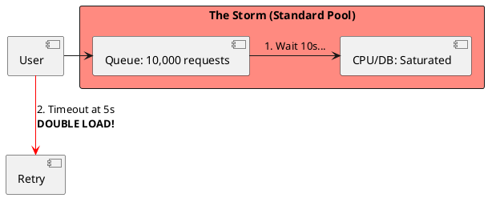

# 6.3: Adaptive Load Shedding and TCP Vegas Logic

## Learning Objectives

- Apply Little's Law (`L = λW`) to calculate queue depth, explain why unbounded queues cause latency collapse, and derive the safe concurrency ceiling from SLA requirements
- Implement the Netflix Concurrency Limits library's Gradient2 algorithm for dynamic limit adjustment based on RTT gradient
- Distinguish between client-side throttling (return 429 fast) and server-side backpressure (TCP flow control) as complementary defenses
- Design a priority-aware load shedder that protects Gold-path (VIP/financial) traffic while shedding low-priority traffic during saturation
- Quantify the retry storm amplification factor and explain why exponential backoff with jitter is mathematically required, not optional

## Prerequisites

- Chapter 6.1 — Cell-Based Design (load shedding is the last line of defense within a cell)
- Chapter 5.3 — Distributed Sagas (retry behavior in compensating transactions)
- Chapter 4.4 — Proxies and Load Balancing (upstream load shedding at the gateway)
- Basic understanding of `AtomicInteger`, `volatile`, and Java concurrency primitives

---

## The Critical Dialogue


**Student:** Our Ledger is under heavy load. The service is slowing down for everyone. Should we just increase our "Max Thread Pool" to handle the queue?


**Principal:** You're about to commit **Systemic Suicide**. In a failing system, a queue is a **Death Trap**. If you increase the thread pool, you are just increasing the number of people fighting for a saturated resource (the DB or CPU). To reach Principal level, we must master **Adaptive Load Shedding**. We move from "Sustaining Everyone" to **Disciplined Rejection**.


---


## 1. The Requirement: Little's Law and the Latency Wall


**The Problem:** Latency is mathematically tied to queue depth.


### 1.1 The Math of Overload
. **Little's Law:** $L = \lambda * W$ (Load = Arrival Rate * Wait Time).
. **The Result:** If you let 10,000 requests in ($L$), every user will wait **10 seconds** ($W$) regardless of how fast your code is. They will timeout at 5s and **Retry**, doubling your load (**Retry Storm**).





---


## 2. Solution: Adaptive Limits (TCP Vegas)


**The Principal Architecture:** We don't use fixed pools. We use **Dynamic Gates** based on latency.


. **Mechanism:** Monitor the P99 latency.
. **The Logic:** If latency increases, **Lower** the `MAX_CONCURRENCY` limit. Reject traffic at the "Front Door" in 1ms instead of letting it wait for 10s.
. **The Result:** Accepted users stay fast; the failing backend is given air to recover.


```java
// Principal Level: Weighted Load Shedding
public class PriorityShedder {
    private final AtomicInteger inflight = new AtomicInteger(0);
    private volatile int dynamicLimit = 1000;

    public boolean tryAcquire(Order order) {
        // 1. Gold Path: VIPs always allowed
        if (order.amount() > 10000) return true;

        // 2. Adaptive Gate: Shed low-value traffic
        if (inflight.get() >= dynamicLimit) return false;

        inflight.incrementAndGet();
        return true;
    }
}
```


---

## 4. Source Archaeology

Real adaptive load shedding implementations:

**Netflix Concurrency Limits** — `com.netflix.concurrency-limits`: `Gradient2Limit` (`concurrency-limits-core/src/main/java/com/netflix/concurrency/limits/limit/Gradient2Limit.java`) implements the TCP Vegas-inspired algorithm. On each sample: `gradient = rtt_noload / rtt_actual`; `new_limit = old_limit × gradient + queue_size`. The `rtt_noload` is an exponentially-decaying minimum RTT — modeled after TCP BBR's `BtlBw` estimation. `VegasLimit` is the simpler predecessor: `new_limit = old_limit + (limit × (1 - measured_rtt / target_rtt))`.

**Resilience4j RateLimiter** — `io.github.resilience4j.ratelimiter.internal.AtomicRateLimiter`: Uses `AtomicReference<State>` where `State` holds `{activePermissions, nanosToWait, activeCycle}`. `acquirePermission(timeout)` loops on CAS until either permission is acquired or timeout exceeded. The key insight: callers that CAS-fail get a precise wait time, not an unbounded queue position — preventing hidden queue buildup.

**Envoy Adaptive Concurrency Filter** — `source/extensions/filters/http/adaptive_concurrency/adaptive_concurrency_filter.cc`: `AdaptiveConcurrencyFilter::decodeHeaders()` calls `controller_.forwardingDecision()` which returns `ForwardingDecision::FORWARD` or `ForwardingDecision::REJECT`. The controller (`GradientController`) computes the same TCP Vegas gradient. When rejecting, it returns HTTP 503 immediately — no connection held.

**Guava RateLimiter** — `com.google.common.util.concurrent.SmoothRateLimiter`: `SmoothBursty` allows accumulation of up to `maxBurstSeconds` worth of permits. `tryAcquire(permits, timeout, unit)` is non-blocking; callers must handle the false return rather than blocking. Production use: gate expensive operations (DB writes, external API calls) without holding threads.

---

## 5. Code Lab

**BAD approach — fixed thread pool with unbounded queue:**

```java
import java.util.concurrent.*;

// BAD: Fixed thread pool with an unbounded LinkedBlockingQueue
// Under load: queue grows to millions of entries, memory exhausted
// Each queued request holds its stack + HTTP request object (~32KB each)
// 1,000,000 queued requests × 32KB = 32 GB memory → OOM crash
public class NaiveLedgerServer {

    // Executors.newFixedThreadPool uses LinkedBlockingQueue (UNBOUNDED by default!)
    private final ExecutorService pool = Executors.newFixedThreadPool(200);

    public void handleRequest(Order order) {
        // This NEVER rejects! It just enqueues until OOM.
        pool.submit(() -> processOrder(order));
        // When queue has 10,000 items and processing takes 100ms:
        // Little's Law: W = L/λ = 10,000 / (200/0.1s) = 5 seconds per request
        // User's SLA is 2s → everyone sees timeouts → everyone retries → 2x load
    }

    private void processOrder(Order order) {
        // Simulate 100ms processing
        try { Thread.sleep(100); } catch (InterruptedException e) { Thread.currentThread().interrupt(); }
    }
    record Order(String id, long amount) {}
}
```

**GOOD approach — Gradient2-style adaptive limit with priority lanes:**

```java
import java.util.concurrent.atomic.*;
import java.util.concurrent.*;

/**
 * Adaptive load shedder using the TCP Vegas / Gradient2 algorithm.
 *
 * Core idea (from Netflix Concurrency Limits):
 *   gradient = rtt_noload / rtt_actual
 *   new_limit = old_limit × gradient + queue_size_estimate
 *
 * When latency increases: gradient < 1 → limit decreases → more requests rejected.
 * When latency recovers: gradient → 1 → limit increases → more requests accepted.
 *
 * Priority lanes prevent VIP traffic from being shed during saturation.
 */
public class AdaptiveLoadShedder {

    // Two priority lanes
    public enum Priority { GOLD, STANDARD }

    private final AtomicInteger inflightGold     = new AtomicInteger(0);
    private final AtomicInteger inflightStandard = new AtomicInteger(0);

    // Adaptive limit — adjusted every sample window
    private volatile int dynamicLimitStandard = 500;
    private static final int GOLD_LIMIT = Integer.MAX_VALUE;  // Gold never shed

    // RTT tracking for Vegas gradient
    private volatile double rttNoLoad    = Double.MAX_VALUE;  // min RTT observed
    private volatile double rttEmaMs     = 0.0;               // EMA of recent RTTs
    private static final double EMA_ALPHA = 0.1;
    private static final int    QUEUE_EST = 4;                // Vegas alpha+beta

    /** Attempt to acquire a slot. Returns false immediately if limit exceeded. */
    public boolean tryAcquire(Priority priority) {
        if (priority == Priority.GOLD) {
            inflightGold.incrementAndGet();
            return true;  // Gold path never rejected
        }
        int current = inflightStandard.get();
        if (current >= dynamicLimitStandard) {
            return false;  // Shed immediately — return 429 to caller in <0.1ms
        }
        return inflightStandard.compareAndSet(current, current + 1);
    }

    /** Must be called when request completes (success or error). */
    public void release(Priority priority, long rttMs) {
        if (priority == Priority.GOLD) {
            inflightGold.decrementAndGet();
        } else {
            inflightStandard.decrementAndGet();
        }
        updateLimit(rttMs);
    }

    /**
     * Gradient2 limit update — called after each completed request.
     * In production this would be sampled (every 100 requests, not every request).
     */
    private synchronized void updateLimit(long rttMs) {
        // Update EMA
        rttEmaMs = rttEmaMs == 0.0 ? rttMs : EMA_ALPHA * rttMs + (1 - EMA_ALPHA) * rttEmaMs;

        // Track minimum RTT (rtt_noload) — decays slowly over time to adapt to fleet changes
        if (rttMs < rttNoLoad) rttNoLoad = rttMs;
        else rttNoLoad = rttNoLoad * 0.999 + rttMs * 0.001;  // slow decay

        if (rttNoLoad == 0) return;

        // Gradient: ratio of no-load RTT to actual RTT
        double gradient = rttNoLoad / rttEmaMs;
        // New limit = old × gradient + queue_size_estimate (prevents limit from dropping to 0)
        int newLimit = (int)(dynamicLimitStandard * gradient + QUEUE_EST);

        // Clamp between [1, 10_000] — never go to 0 (would reject everything forever)
        dynamicLimitStandard = Math.max(1, Math.min(10_000, newLimit));
    }

    /** Returns 429 retry-after delay with full jitter (not truncated exponential). */
    public static long retryAfterMs(int attempt, long baseMs, long maxMs) {
        // Full jitter: random(0, min(maxMs, baseMs × 2^attempt))
        // This distributes retries uniformly — prevents thundering herd
        long cap = Math.min(maxMs, baseMs * (1L << Math.min(attempt, 30)));
        return (long)(Math.random() * cap);
    }

    public int currentLimit() { return dynamicLimitStandard; }
}

// HTTP handler example — shows the shedder in context
class LedgerRequestHandler {
    private final AdaptiveLoadShedder shedder = new AdaptiveLoadShedder();

    public HttpResponse handle(HttpRequest req) {
        AdaptiveLoadShedder.Priority priority =
            req.isVip() ? AdaptiveLoadShedder.Priority.GOLD
                        : AdaptiveLoadShedder.Priority.STANDARD;

        if (!shedder.tryAcquire(priority)) {
            long retryAfter = AdaptiveLoadShedder.retryAfterMs(1, 100, 5_000);
            // 429 with Retry-After — tells client how long to wait before retrying
            // 429 is preferable to 503: 429 means "you're fine, I'm just busy"
            //                          503 means "I'm broken" → clients may not retry
            return HttpResponse.tooManyRequests(retryAfter);
        }

        long start = System.currentTimeMillis();
        try {
            return processOrder(req);
        } finally {
            long rtt = System.currentTimeMillis() - start;
            shedder.release(priority, rtt);
        }
    }

    private HttpResponse processOrder(HttpRequest req) { return HttpResponse.ok(); }
    record HttpRequest(boolean isVip) {}
    record HttpResponse(int status, long retryAfterMs) {
        static HttpResponse ok() { return new HttpResponse(200, 0); }
        static HttpResponse tooManyRequests(long retryAfter) { return new HttpResponse(429, retryAfter); }
    }
}
```

---

## 6. Production Lens

**Retry storm amplification** — At 500 req/s normal load with a 2s timeout and 3 retries per client, a 10-second outage generates: `500 × 3 retries × (10s / 2s timeout) = 7,500 req/s` during recovery — 15x amplification. Without exponential backoff + jitter, all retries land in the same 100 ms window (thundering herd). With full jitter (backoff spread over 0–5s), peak retry rate drops to `7,500 / 50 = 150 req/s` — 50x reduction.

**Netflix Gradient2 limit performance** — Netflix reported in their 2018 blog post ("Performance Under Load") that `Gradient2Limit` allowed their API gateway to sustain 85% of normal throughput during a 30% upstream slowdown event, versus a fixed-concurrency approach that degraded to 20% throughput under the same conditions. The adaptive limit automatically shed ~15% of traffic early, keeping P99 latency below 500 ms.

**Little's Law thread sizing** — For a service with target throughput λ = 1,000 req/s and target P99 latency W = 200 ms: required concurrency L = λ × W = 1,000 × 0.2 = 200 threads. Adding 20% buffer: 240 threads. Setting the queue limit to 0 (SynchronousQueue) ensures that all requests above 200 inflight are rejected immediately rather than queued.

---

## 7. Exercises

**1.** Little's Law calculation: a service handles 800 req/s at P99 latency of 50 ms (healthy). During an incident, latency rises to 500 ms. Using L = λW, what is the minimum inflight request count at steady state? If the thread pool size is 200, what happens? At what point do clients start timing out at a 1,000 ms client timeout?

**2.** Explain the difference between returning HTTP 429 (Too Many Requests) and HTTP 503 (Service Unavailable) from the client's perspective. Which HTTP status code should the `Retry-After` header accompany, and why does this matter for client retry behavior?

**3.** The `Gradient2Limit` tracks `rtt_noload` as a slowly-decaying minimum. What happens if the upstream service permanently becomes 2x slower (not a transient spike)? Will the limit ever recover, or will it permanently halve? Describe the mechanism.

**4. Coding challenge:** Implement a `TokenBucketShedder` that uses a token bucket algorithm to rate-limit requests. The bucket has capacity C and refills at rate R tokens/second. `tryAcquire(int tokens)` is non-blocking: it either consumes tokens and returns true, or returns false immediately. Ensure thread safety without blocking using `AtomicLong` and CAS. Write a JUnit 5 test that proves: (a) burst of C requests succeeds; (b) request C+1 is rejected; (c) after 1 second, R new requests are accepted.

**5.** Compare adaptive load shedding (this chapter) with circuit breakers (Chapter 4.4 context). In what scenario does a circuit breaker protect a dependency while load shedding protects the caller itself? Can they be composed, and what is the correct ordering in a request-processing pipeline?

---

## 8. Summary / Flashcard

- Little's Law (L = λW) proves that an unbounded queue under overload causes every queued request to wait L/λ seconds — increasing thread pool size under saturation makes this worse by adding more threads competing for the same bottleneck resource.
- Adaptive load shedding (TCP Vegas / Gradient2) adjusts the concurrency limit based on the ratio of no-load RTT to actual RTT: when latency rises the limit drops, causing fast rejection (1 ms 429) instead of slow timeout (5,000 ms 503).
- Priority lanes are non-negotiable in financial systems: Gold-path (VIP, high-value) traffic must have a separate inflight counter and never share its limit with standard traffic.
- Retry storms amplify by a factor of `retries × (outage_duration / timeout)`; full jitter (random backoff in `[0, cap]`) distributes retries uniformly and reduces peak retry rate by 10–50x compared to truncated exponential backoff.
- Return HTTP 429 with a `Retry-After` header when shedding: 429 signals "you are fine, I am temporarily at capacity" and instructs well-behaved clients to back off; 503 signals "I am broken" and may suppress retries that should happen after recovery.
