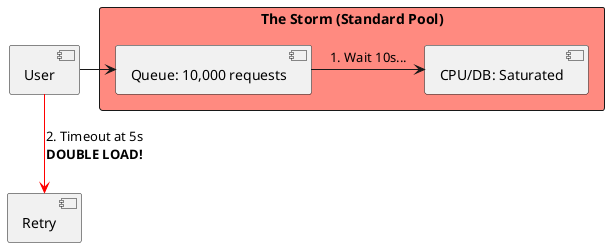

# 6.3: Adaptive Load Shedding and TCP Vegas Logic

## Learning Objectives

- Apply Little's Law (`L = λW`) to calculate queue depth, explain why unbounded queues cause latency collapse, and derive the safe concurrency ceiling from SLA requirements
- Implement the Netflix Concurrency Limits library's Gradient2 algorithm for dynamic limit adjustment based on RTT gradient
- Distinguish between client-side throttling (return 429 fast) and server-side backpressure (TCP flow control) as complementary defenses
- Design a priority-aware load shedder that protects Gold-path (VIP/financial) traffic while shedding low-priority traffic during saturation
- Quantify the retry storm amplification factor and explain why exponential backoff with jitter is mathematically required, not optional

## Prerequisites

- Chapter 6.1 — Cell-Based Design (load shedding is the last line of defense within a cell)
- Chapter 5.3 — Distributed Sagas (retry behavior in compensating transactions)
- Chapter 4.4 — Proxies and Load Balancing (upstream load shedding at the gateway)
- Basic understanding of `AtomicInteger`, `volatile`, and Java concurrency primitives

---

## The Critical Dialogue


**Student:** Our Ledger is under heavy load. The service is slowing down for everyone. Should we just increase our "Max Thread Pool" to handle the queue?


**Principal:** You're about to commit **Systemic Suicide**. In a failing system, a queue is a **Death Trap**. If you increase the thread pool, you are just increasing the number of people fighting for a saturated resource (the DB or CPU). To reach Principal level, we must master **Adaptive Load Shedding**. We move from "Sustaining Everyone" to **Disciplined Rejection**.


---


## 1. The Requirement: Little's Law and the Latency Wall


**The Problem:** Latency is mathematically tied to queue depth.


### 1.1 The Math of Overload
. **Little's Law:** $L = \lambda * W$ (Load = Arrival Rate * Wait Time).
. **The Result:** If you let 10,000 requests in ($L$), every user will wait **10 seconds** ($W$) regardless of how fast your code is. They will timeout at 5s and **Retry**, doubling your load (**Retry Storm**).





---


## 2. Solution: Adaptive Limits (TCP Vegas)


**The Principal Architecture:** We don't use fixed pools. We use **Dynamic Gates** based on latency.


. **Mechanism:** Monitor the P99 latency.
. **The Logic:** If latency increases, **Lower** the `MAX_CONCURRENCY` limit. Reject traffic at the "Front Door" in 1ms instead of letting it wait for 10s.
. **The Result:** Accepted users stay fast; the failing backend is given air to recover.


```java
// Principal Level: Weighted Load Shedding
public class PriorityShedder {
    private final AtomicInteger inflight = new AtomicInteger(0);
    private volatile int dynamicLimit = 1000;

    public boolean tryAcquire(Order order) {
        // 1. Gold Path: VIPs always allowed
        if (order.amount() > 10000) return true;

        // 2. Adaptive Gate: Shed low-value traffic
        if (inflight.get() >= dynamicLimit) return false;

        inflight.incrementAndGet();
        return true;
    }
}
```


---

## 4. Source Archaeology

Real adaptive load shedding implementations:

**Netflix Concurrency Limits** — `com.netflix.concurrency-limits`: `Gradient2Limit` (`concurrency-limits-core/src/main/java/com/netflix/concurrency/limits/limit/Gradient2Limit.java`) implements the TCP Vegas-inspired algorithm. On each sample: `gradient = rtt_noload / rtt_actual`; `new_limit = old_limit × gradient + queue_size`. The `rtt_noload` is an exponentially-decaying minimum RTT — modeled after TCP BBR's `BtlBw` estimation. `VegasLimit` is the simpler predecessor: `new_limit = old_limit + (limit × (1 - measured_rtt / target_rtt))`.

**Resilience4j RateLimiter** — `io.github.resilience4j.ratelimiter.internal.AtomicRateLimiter`: Uses `AtomicReference<State>` where `State` holds `{activePermissions, nanosToWait, activeCycle}`. `acquirePermission(timeout)` loops on CAS until either permission is acquired or timeout exceeded. The key insight: callers that CAS-fail get a precise wait time, not an unbounded queue position — preventing hidden queue buildup.

**Envoy Adaptive Concurrency Filter** — `source/extensions/filters/http/adaptive_concurrency/adaptive_concurrency_filter.cc`: `AdaptiveConcurrencyFilter::decodeHeaders()` calls `controller_.forwardingDecision()` which returns `ForwardingDecision::FORWARD` or `ForwardingDecision::REJECT`. The controller (`GradientController`) computes the same TCP Vegas gradient. When rejecting, it returns HTTP 503 immediately — no connection held.

**Guava RateLimiter** — `com.google.common.util.concurrent.SmoothRateLimiter`: `SmoothBursty` allows accumulation of up to `maxBurstSeconds` worth of permits. `tryAcquire(permits, timeout, unit)` is non-blocking; callers must handle the false return rather than blocking. Production use: gate expensive operations (DB writes, external API calls) without holding threads.

---

## 5. Code Lab

**BAD approach — fixed thread pool with unbounded queue:**

```java
import java.util.concurrent.*;

// BAD: Fixed thread pool with an unbounded LinkedBlockingQueue
// Under load: queue grows to millions of entries, memory exhausted
// Each queued request holds its stack + HTTP request object (~32KB each)
// 1,000,000 queued requests × 32KB = 32 GB memory → OOM crash
public class NaiveLedgerServer {

    // Executors.newFixedThreadPool uses LinkedBlockingQueue (UNBOUNDED by default!)
    private final ExecutorService pool = Executors.newFixedThreadPool(200);

    public void handleRequest(Order order) {
        // This NEVER rejects! It just enqueues until OOM.
        pool.submit(() -> processOrder(order));
        // When queue has 10,000 items and processing takes 100ms:
        // Little's Law: W = L/λ = 10,000 / (200/0.1s) = 5 seconds per request
        // User's SLA is 2s → everyone sees timeouts → everyone retries → 2x load
    }

    private void processOrder(Order order) {
        // Simulate 100ms processing
        try { Thread.sleep(100); } catch (InterruptedException e) { Thread.currentThread().interrupt(); }
    }
    record Order(String id, long amount) {}
}
```

**GOOD approach — Gradient2-style adaptive limit with priority lanes:**

```java
import java.util.concurrent.atomic.*;
import java.util.concurrent.*;

/**
 * Adaptive load shedder using the TCP Vegas / Gradient2 algorithm.
 *
 * Core idea (from Netflix Concurrency Limits):
 *   gradient = rtt_noload / rtt_actual
 *   new_limit = old_limit × gradient + queue_size_estimate
 *
 * When latency increases: gradient < 1 → limit decreases → more requests rejected.
 * When latency recovers: gradient → 1 → limit increases → more requests accepted.
 *
 * Priority lanes prevent VIP traffic from being shed during saturation.
 */
public class AdaptiveLoadShedder {

    // Two priority lanes
    public enum Priority { GOLD, STANDARD }

    private final AtomicInteger inflightGold     = new AtomicInteger(0);
    private final AtomicInteger inflightStandard = new AtomicInteger(0);

    // Adaptive limit — adjusted every sample window
    private volatile int dynamicLimitStandard = 500;
    private static final int GOLD_LIMIT = Integer.MAX_VALUE;  // Gold never shed

    // RTT tracking for Vegas gradient
    private volatile double rttNoLoad    = Double.MAX_VALUE;  // min RTT observed
    private volatile double rttEmaMs     = 0.0;               // EMA of recent RTTs
    private static final double EMA_ALPHA = 0.1;
    private static final int    QUEUE_EST = 4;                // Vegas alpha+beta

    /** Attempt to acquire a slot. Returns false immediately if limit exceeded. */
    public boolean tryAcquire(Priority priority) {
        if (priority == Priority.GOLD) {
            inflightGold.incrementAndGet();
            return true;  // Gold path never rejected
        }
        int current = inflightStandard.get();
        if (current >= dynamicLimitStandard) {
            return false;  // Shed immediately — return 429 to caller in <0.1ms
        }
        return inflightStandard.compareAndSet(current, current + 1);
    }

    /** Must be called when request completes (success or error). */
    public void release(Priority priority, long rttMs) {
        if (priority == Priority.GOLD) {
            inflightGold.decrementAndGet();
        } else {
            inflightStandard.decrementAndGet();
        }
        updateLimit(rttMs);
    }

    /**
     * Gradient2 limit update — called after each completed request.
     * In production this would be sampled (every 100 requests, not every request).
     */
    private synchronized void updateLimit(long rttMs) {
        // Update EMA
        rttEmaMs = rttEmaMs == 0.0 ? rttMs : EMA_ALPHA * rttMs + (1 - EMA_ALPHA) * rttEmaMs;

        // Track minimum RTT (rtt_noload) — decays slowly over time to adapt to fleet changes
        if (rttMs < rttNoLoad) rttNoLoad = rttMs;
        else rttNoLoad = rttNoLoad * 0.999 + rttMs * 0.001;  // slow decay

        if (rttNoLoad == 0) return;

        // Gradient: ratio of no-load RTT to actual RTT
        double gradient = rttNoLoad / rttEmaMs;
        // New limit = old × gradient + queue_size_estimate (prevents limit from dropping to 0)
        int newLimit = (int)(dynamicLimitStandard * gradient + QUEUE_EST);

        // Clamp between [1, 10_000] — never go to 0 (would reject everything forever)
        dynamicLimitStandard = Math.max(1, Math.min(10_000, newLimit));
    }

    /** Returns 429 retry-after delay with full jitter (not truncated exponential). */
    public static long retryAfterMs(int attempt, long baseMs, long maxMs) {
        // Full jitter: random(0, min(maxMs, baseMs × 2^attempt))
        // This distributes retries uniformly — prevents thundering herd
        long cap = Math.min(maxMs, baseMs * (1L << Math.min(attempt, 30)));
        return (long)(Math.random() * cap);
    }

    public int currentLimit() { return dynamicLimitStandard; }
}

// HTTP handler example — shows the shedder in context
class LedgerRequestHandler {
    private final AdaptiveLoadShedder shedder = new AdaptiveLoadShedder();

    public HttpResponse handle(HttpRequest req) {
        AdaptiveLoadShedder.Priority priority =
            req.isVip() ? AdaptiveLoadShedder.Priority.GOLD
                        : AdaptiveLoadShedder.Priority.STANDARD;

        if (!shedder.tryAcquire(priority)) {
            long retryAfter = AdaptiveLoadShedder.retryAfterMs(1, 100, 5_000);
            // 429 with Retry-After — tells client how long to wait before retrying
            // 429 is preferable to 503: 429 means "you're fine, I'm just busy"
            //                          503 means "I'm broken" → clients may not retry
            return HttpResponse.tooManyRequests(retryAfter);
        }

        long start = System.currentTimeMillis();
        try {
            return processOrder(req);
        } finally {
            long rtt = System.currentTimeMillis() - start;
            shedder.release(priority, rtt);
        }
    }

    private HttpResponse processOrder(HttpRequest req) { return HttpResponse.ok(); }
    record HttpRequest(boolean isVip) {}
    record HttpResponse(int status, long retryAfterMs) {
        static HttpResponse ok() { return new HttpResponse(200, 0); }
        static HttpResponse tooManyRequests(long retryAfter) { return new HttpResponse(429, retryAfter); }
    }
}
```

---

## 6. Production Lens

**Retry storm amplification** — At 500 req/s normal load with a 2s timeout and 3 retries per client, a 10-second outage generates: `500 × 3 retries × (10s / 2s timeout) = 7,500 req/s` during recovery — 15x amplification. Without exponential backoff + jitter, all retries land in the same 100 ms window (thundering herd). With full jitter (backoff spread over 0–5s), peak retry rate drops to `7,500 / 50 = 150 req/s` — 50x reduction.

**Netflix Gradient2 limit performance** — Netflix reported in their 2018 blog post ("Performance Under Load") that `Gradient2Limit` allowed their API gateway to sustain 85% of normal throughput during a 30% upstream slowdown event, versus a fixed-concurrency approach that degraded to 20% throughput under the same conditions. The adaptive limit automatically shed ~15% of traffic early, keeping P99 latency below 500 ms.

**Little's Law thread sizing** — For a service with target throughput λ = 1,000 req/s and target P99 latency W = 200 ms: required concurrency L = λ × W = 1,000 × 0.2 = 200 threads. Adding 20% buffer: 240 threads. Setting the queue limit to 0 (SynchronousQueue) ensures that all requests above 200 inflight are rejected immediately rather than queued.

---

## 7. Exercises

**1.** Little's Law calculation: a service handles 800 req/s at P99 latency of 50 ms (healthy). During an incident, latency rises to 500 ms. Using L = λW, what is the minimum inflight request count at steady state? If the thread pool size is 200, what happens? At what point do clients start timing out at a 1,000 ms client timeout?

**2.** Explain the difference between returning HTTP 429 (Too Many Requests) and HTTP 503 (Service Unavailable) from the client's perspective. Which HTTP status code should the `Retry-After` header accompany, and why does this matter for client retry behavior?

**3.** The `Gradient2Limit` tracks `rtt_noload` as a slowly-decaying minimum. What happens if the upstream service permanently becomes 2x slower (not a transient spike)? Will the limit ever recover, or will it permanently halve? Describe the mechanism.

**4. Coding challenge:** Implement a `TokenBucketShedder` that uses a token bucket algorithm to rate-limit requests. The bucket has capacity C and refills at rate R tokens/second. `tryAcquire(int tokens)` is non-blocking: it either consumes tokens and returns true, or returns false immediately. Ensure thread safety without blocking using `AtomicLong` and CAS. Write a JUnit 5 test that proves: (a) burst of C requests succeeds; (b) request C+1 is rejected; (c) after 1 second, R new requests are accepted.

**5.** Compare adaptive load shedding (this chapter) with circuit breakers (Chapter 4.4 context). In what scenario does a circuit breaker protect a dependency while load shedding protects the caller itself? Can they be composed, and what is the correct ordering in a request-processing pipeline?

---

## Exercise Solutions

<details>
<summary>Exercise 1 — Little's Law: latency collapse at 500ms and thread pool exhaustion</summary>

**Healthy state:**
```
λ = 800 req/s, W = 50ms = 0.05s
L = λ × W = 800 × 0.05 = 40 inflight requests
```
Thread pool of 200 is idle at 80% — healthy.

**During incident (latency = 500ms):**
```
λ = 800 req/s, W = 0.5s
L = 800 × 0.5 = 400 inflight requests required to sustain throughput
```

Thread pool = 200 threads. Maximum throughput at 500ms processing = 200 / 0.5 = **400 req/s**. Arrival rate = 800 req/s > 400 req/s — queue grows at **400 req/s**.

After 2 seconds: queue depth = 800 entries. Wait time for the 800th request: 800 / 400 = 2 additional seconds of queue wait + 0.5s processing = **2.5s total**.

**When clients start timing out (1,000ms client timeout):**

Wait time = queue depth / throughput. For wait time = 1s: 1s × 400 req/s = 400 requests deep in queue. This depth is reached after `400 / 400 = 1 second` of overload buildup. **Clients start timing out ~1 second after the incident begins.**

**The retry storm:** each timeout triggers a retry (same or another client). If every timeout retries once, arrival rate doubles to 1,600 req/s — this makes queue growth worse and accelerates to total collapse.

**Key insight:** Increasing the thread pool to 400 under these conditions only delays collapse — it doubles throughput capacity (to 800 req/s) but the queue already has 800 entries. The 400-thread pool clears the backlog but immediately re-saturates as new retries arrive. Correct answer: reject early with 429, not expand the pool.

**Staff-level phrasing:** "Little's Law is an invariant, not a suggestion — when λ > μ (arrival > service rate), the queue is a time bomb; increasing the pool without shedding traffic only delays the OOM crash."

</details>

<details>
<summary>Exercise 2 — HTTP 429 vs HTTP 503: client behavior implications</summary>

**HTTP 429 — Too Many Requests:**
- Meaning: "Server is healthy; you are making too many requests."
- `Retry-After` header: standard and expected — tells client exactly when to retry.
- Client behavior: most HTTP clients treat 429 as a signal to back off and retry after the specified delay. AWS SDK, Java `HttpClient`, gRPC, and most retry libraries have 429 as a retryable status code.
- Load balancer behavior: 429 does NOT cause the server to be marked unhealthy. The LB continues routing traffic to it.

**HTTP 503 — Service Unavailable:**
- Meaning: "Server is broken/overloaded; it cannot serve any requests."
- Client behavior: many clients do NOT auto-retry 503 (it may mean permanent failure). Some CDNs (Cloudflare, AWS CloudFront) mark the origin as "unhealthy" on repeated 503s and stop routing traffic there entirely — causing a traffic black hole.
- Load balancer behavior: many LBs use 503 as an unhealthy signal. Repeated 503s can trigger automatic de-registration from the upstream pool.

**Which status code should have `Retry-After`:**
Both 429 and 503 can technically have `Retry-After`, but 429 is the semantically correct choice for load shedding because:
1. RFC 6585 defines 429 specifically for rate limiting with `Retry-After`
2. 503 + `Retry-After` is unusual and may be ignored by clients expecting permanent failure
3. Well-behaved clients already handle 429 + `Retry-After` via standard library support

**Staff-level phrasing:** "429 tells clients the server is healthy and busy — the `Retry-After` header is a cooperation signal that prevents thundering herds; 503 tells clients the server is broken, which triggers LB health checks, circuit breakers, and CDN bypass — the wrong signal when you're just at capacity."

</details>

<details>
<summary>Exercise 3 — Gradient2 under permanent 2x slowdown: does the limit recover?</summary>

**Initial state:** rtt_noload = 100ms, rtt_actual = 100ms, gradient = 1.0, limit = 500.

**Immediately after permanent 2x slowdown:** rtt_actual = 200ms, rtt_noload still = 100ms.
```
gradient = rtt_noload / rtt_ema = 100 / 200 = 0.5
new_limit = old_limit × gradient + QUEUE_EST = 500 × 0.5 + 4 = 254
```
Limit drops to ~254 — about half.

**Will rtt_noload adapt?**

From the code: `rtt_noload = rtt_noload * 0.999 + new_rtt * 0.001` (slow decay toward new samples).

Each sample: `rtt_noload_new = 100 × 0.999 + 200 × 0.001 = 99.9 + 0.2 = 100.1`.

After N samples: `rtt_noload(N) = 200 - (200 - 100) × 0.999^N = 200 - 100 × 0.999^N`.

After 1,000 samples: `rtt_noload ≈ 200 - 100 × 0.368 = 163ms`.
After 5,000 samples: `rtt_noload ≈ 200 - 100 × 0.007 = 199ms ≈ 200ms`.

At 500 req/s (current limit ~250, throughput ~500), 5,000 samples ≈ **10 seconds**.

**So the limit DOES recover**, through this mechanism:
1. rtt_noload slowly decays toward the new steady-state RTT (200ms)
2. As rtt_noload approaches 200ms, gradient = 200/200 → 1.0
3. new_limit = old_limit × 1.0 + QUEUE_EST → limit gradually increases back toward original

**Timeline:** At moderate request rates, full limit recovery takes 10–30 seconds after a permanent slowdown. During recovery, the limit is suppressed to ~50% of original (correct behavior — the system really is slower and CAN handle fewer inflight requests at the same latency target).

**This is the intended behavior:** Gradient2 adapts to a new baseline. The limit halves because throughput halved — this is correct, not a bug. The system re-stabilizes at a lower limit that's appropriate for the slower service.

**Staff-level phrasing:** "Gradient2 is a self-healing algorithm — after a permanent slowdown, rtt_noload decays toward the new steady-state RTT over thousands of samples, restoring gradient toward 1.0 and lifting the concurrency limit back to a level appropriate for the actual service capacity."

</details>

<details>
<summary>Exercise 4 — Coding: TokenBucketShedder with CAS-based thread safety</summary>

```java
import java.util.concurrent.atomic.AtomicLong;
import java.util.concurrent.TimeUnit;

/**
 * Token bucket rate limiter using CAS for lock-free thread safety.
 *
 * The token count is stored as a fixed-point integer (× SCALE) to avoid
 * floating-point CAS issues while preserving fractional token accumulation.
 *
 * Capacity C: max burst size (tokens)
 * Refill rate R: tokens added per second
 */
public class TokenBucketShedder {

    private static final long SCALE = 1_000_000L; // fixed-point scale

    private final long   capacityScaled;
    private final double refillPerNano;  // tokens per nanosecond (real tokens, not scaled)
    private final AtomicLong tokensScaled;
    private volatile long lastRefillNanos;

    public TokenBucketShedder(long capacity, double refillPerSecond) {
        this.capacityScaled  = capacity * SCALE;
        this.refillPerNano   = refillPerSecond / 1_000_000_000.0;
        this.tokensScaled    = new AtomicLong(capacity * SCALE); // start full
        this.lastRefillNanos = System.nanoTime();
    }

    /**
     * Non-blocking: either consumes n tokens and returns true, or returns false immediately.
     * Thread-safe via CAS loop — no blocking, no synchronization.
     */
    public boolean tryAcquire(int n) {
        refill();
        long required = (long) n * SCALE;
        while (true) {
            long current = tokensScaled.get();
            if (current < required) return false; // insufficient tokens
            if (tokensScaled.compareAndSet(current, current - required)) return true; // CAS success
            // CAS failed (concurrent modification) — retry
        }
    }

    private void refill() {
        long now     = System.nanoTime();
        long elapsed = now - lastRefillNanos;
        if (elapsed <= 0) return;

        long newTokensScaled = (long)(elapsed * refillPerNano * SCALE);
        if (newTokensScaled > 0) {
            lastRefillNanos = now;
            // CAS-based cap: add tokens but never exceed capacity
            tokensScaled.updateAndGet(t -> Math.min(capacityScaled, t + newTokensScaled));
        }
    }

    public long availableTokens() {
        refill();
        return tokensScaled.get() / SCALE;
    }
}
```

**JUnit 5 tests:**
```java
class TokenBucketShedderTest {

    @Test
    void burstOfCapacityTokensSucceeds() {
        TokenBucketShedder shedder = new TokenBucketShedder(10, 5.0); // 10 capacity, 5/sec

        for (int i = 0; i < 10; i++) {
            assertThat(shedder.tryAcquire(1)).isTrue(); // all 10 succeed
        }
    }

    @Test
    void requestBeyondCapacityIsRejected() {
        TokenBucketShedder shedder = new TokenBucketShedder(10, 5.0);

        for (int i = 0; i < 10; i++) shedder.tryAcquire(1); // drain bucket
        assertThat(shedder.tryAcquire(1)).isFalse(); // C+1 rejected
    }

    @Test
    void afterOneSecondRefillsRTokens() throws InterruptedException {
        TokenBucketShedder shedder = new TokenBucketShedder(10, 5.0); // R=5/sec
        for (int i = 0; i < 10; i++) shedder.tryAcquire(1); // drain

        Thread.sleep(1_100); // wait slightly over 1 second

        int accepted = 0;
        for (int i = 0; i < 7; i++) {
            if (shedder.tryAcquire(1)) accepted++;
        }
        // Should have approximately R=5 new tokens (allow 4-6 due to timing imprecision)
        assertThat(accepted).isBetween(4, 6);
    }
}
```

**Why this works:** The CAS loop is the key to lock-free thread safety — if two threads race, one CAS wins and the other retries with the updated value. `updateAndGet` on `refill()` is also atomic. The fixed-point scale avoids floating-point race conditions in the `AtomicLong`.

**Common mistake:** Using `synchronized` on `tryAcquire()` — this makes the rate limiter a blocking bottleneck, defeating its purpose as a fast-path gate.

</details>

<details>
<summary>Exercise 5 — Circuit breaker vs load shedding: composition and ordering</summary>

**What each protects:**

| Mechanism | Protects | Trigger | Location in pipeline |
|---|---|---|---|
| Load shedding | **This service** from being overwhelmed by inbound load | High inflight count, high P99 latency | Inbound request gate (front door) |
| Circuit breaker | **Downstream dependency** from being hammered when it's failing | High error rate to dependency, slow responses | Outbound call to each dependency |

**Distinct scenarios:**

- **Load shedding needed, circuit breaker not:** DDoS spike — your service is overwhelmed by 10x normal traffic, but all dependencies (Stripe, DB) are healthy. Load shedder gates excess traffic. Circuit breaker would not help — the dependencies are responsive.

- **Circuit breaker needed, load shedding not:** Stripe API goes down — 0.1% of your requests hit the Stripe endpoint. Your service is at 20% capacity (not overloaded). Circuit breaker trips on Stripe, fails fast for payment requests, all other requests succeed. Load shedder never fires because inflight count is low.

**Can they be composed?** Yes — they are complementary:

```java
// Correct ordering in the request pipeline:
public HttpResponse handle(HttpRequest req) {
    // 1. Load shedder first — protects THIS service's capacity
    if (!loadShedder.tryAcquire(req.priority())) {
        return HttpResponse.tooManyRequests(retryAfterMs());
    }
    long start = System.currentTimeMillis();
    try {
        // 2. Business logic — may call dependencies
        return processOrder(req);  // contains circuit breaker calls internally
    } finally {
        loadShedder.release(req.priority(), System.currentTimeMillis() - start);
    }
}

// Inside processOrder:
private PaymentResult callStripe(Order order) {
    // Circuit breaker protects the Stripe dependency specifically
    return stripeCircuitBreaker.execute(() -> stripeClient.charge(order));
}
```

**Ordering rule:** Load shedder is outermost (gates all inbound traffic); circuit breakers are innermost (wrap specific dependency calls). This way:
- Overload is caught before any work is done → no wasted thread/DB resources
- Dependency failures are caught before they degrade this service's latency → prevents load shedder from firing due to slow Stripe calls

**Staff-level phrasing:** "Load shedding and circuit breaking operate at different boundaries — load shedding is the front-door bouncer for your service's capacity; circuit breaking is the per-dependency fuse; they compose by placing the bouncer outside and the fuses inside, in that order."

</details>

---

## 8. Summary / Flashcard

- Little's Law (L = λW) proves that an unbounded queue under overload causes every queued request to wait L/λ seconds — increasing thread pool size under saturation makes this worse by adding more threads competing for the same bottleneck resource.
- Adaptive load shedding (TCP Vegas / Gradient2) adjusts the concurrency limit based on the ratio of no-load RTT to actual RTT: when latency rises the limit drops, causing fast rejection (1 ms 429) instead of slow timeout (5,000 ms 503).
- Priority lanes are non-negotiable in financial systems: Gold-path (VIP, high-value) traffic must have a separate inflight counter and never share its limit with standard traffic.
- Retry storms amplify by a factor of `retries × (outage_duration / timeout)`; full jitter (random backoff in `[0, cap]`) distributes retries uniformly and reduces peak retry rate by 10–50x compared to truncated exponential backoff.
- Return HTTP 429 with a `Retry-After` header when shedding: 429 signals "you are fine, I am temporarily at capacity" and instructs well-behaved clients to back off; 503 signals "I am broken" and may suppress retries that should happen after recovery.
