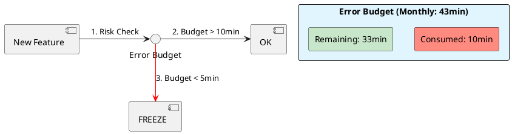

# 6.4: SLO Math and Error Budget Physics

## The Critical Dialogue

**Student:** We have an SLA of 99.9 percent availability. This month, we had a 10-minute outage. My manager is panicking, but 10 minutes out of a whole month seems tiny. Is it really that bad?

**Principal:** You are looking at the **Clock**, not the **Budget**. In high-stakes engineering, availability is a **Consumable Resource**. 99.9% means you only have **43 minutes** of downtime per month. You've burned 25% of your total budget in one morning. To reach Principal level, we must master **SLO Math**. We move from "Feeling safe" to **Calculating the Burn Rate**.

---

## 1. The Requirement: Defining Success

**The Problem:** Without clear SLOs, engineers either over-engineer for 100% availability (impossible) or ignore 1% error rates (catastrophic).

### 1.1 The Math of "The Nines"
. **99.9%:** 43 minutes/month.
. **99.99%:** 4 minutes/month. (Principal/Banking level).

---

## 2. Solution: Error Budgets and Burn Rates

**The Principal Architecture:** We treat reliability as a budget. If the budget is full, we ship features. If the budget is empty, we freeze all deployments and focus on stability.

. **Burn Rate:** If your Ledger's error rate is 2%, you will burn your entire monthly budget in **36 hours**.
. **The SRE Command:** When the burn rate exceeds 2.0, the team triggers a "Feature Freeze."

---

## 🧠 Principal's Inquiry

. **The 100% Myth:** Why is aiming for 100% availability actually **Bad** for a business? (Hint: The **Innovation Tax**).

. **Window Size:** Why should a Principal use a **28-day Rolling Window** instead of a calendar month?

**Principal Summary:** Reliability is **Strategic Finance**. We use SLO Math to quantify the risk of every deployment, ensuring the Global Ledger is as stable as necessary, but as agile as possible.
 Greenlanders use the type system to prove our software invariants.
