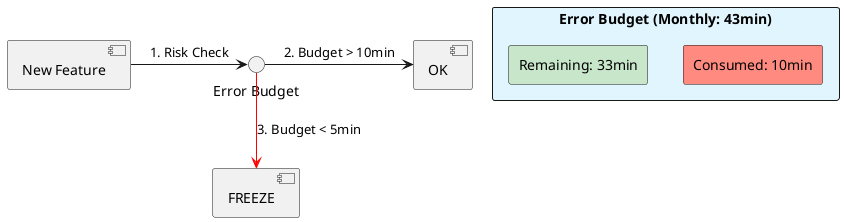

# 6.4: SLO Math and Error Budget Physics

## Learning Objectives

- Convert availability percentages to concrete time budgets (minutes/month) and explain why each additional "nine" is exponentially harder to achieve
- Calculate burn rate from an error rate and predict time-to-budget-exhaustion, then set Prometheus alerting rules on multi-window burn rate
- Distinguish between SLI (measured metric), SLO (target bound), and SLA (contractual consequence) and explain why confusing them produces bad engineering decisions
- Design a 28-day rolling error budget with fast-burn and slow-burn alert thresholds using the Google SRE Workbook formulas
- Apply error budgets as a deployment decision gate: derive the "feature freeze" trigger condition from first principles

## Prerequisites

- Chapter 6.1 — Cell-Based Design (blast radius quantification feeds into SLO budget consumption)
- Chapter 6.3 — Adaptive Load Shedding (load shedding is the operational response to burn-rate alerts)
- Basic understanding of Prometheus query language (PromQL) and time-series metrics

---

## The Critical Dialogue


**Student:** We have an SLA of 99.9 percent availability. This month, we had a 10-minute outage. My manager is panicking, but 10 minutes out of a whole month seems tiny. Is it really that bad?


**Principal:** You are looking at the **Clock**, not the **Budget**. In high-stakes engineering, availability is a **Consumable Resource**. 99.9% means you only have **43 minutes** of downtime per month. You've burned 25% of your total budget in one morning. To reach Principal level, we must master **SLO Math**. We move from "Feeling safe" to **Calculating the Burn Rate**.


---


## 1. The Requirement: Defining Success


**The Problem:** Without clear SLOs, engineers either over-engineer for 100% availability (impossible) or ignore 1% error rates (catastrophic).


### 1.1 The Math of "The Nines"
. **99.9%:** 43 minutes/month.
. **99.99%:** 4 minutes/month. (Principal/Banking level).


---


## 2. Solution: Error Budgets and Burn Rates


**The Principal Architecture:** We treat reliability as a budget. If the budget is full, we ship features. If the budget is empty, we freeze all deployments and focus on stability.


. **Burn Rate:** If your Ledger's error rate is 2%, you will burn your entire monthly budget in **36 hours**.
. **The SRE Command:** When the burn rate exceeds 2.0, the team triggers a "Feature Freeze."





---

## 4. Source Archaeology

Real SLO tracking and alerting implementations:

**Google SRE Workbook burn-rate formulas** — The multi-window burn-rate alerting model (`sre.google/workbook/alerting-on-slos`) uses two windows to eliminate false positives: a short window (1h) detects fast burns; a long window (6h) confirms they are sustained. The formula: `burn_rate = (1 - SLO_target) × budget_fraction / time_fraction`. For SLO=99.9% (error_budget=0.1%), a 2% error rate = burn_rate of `0.02/0.001 = 20x` — exhausts budget in `30 days / 20 = 36 hours`.

**Prometheus alerting rules** — `prometheus/prometheus/rules/examples/`: The standard SLO alerting pattern uses `rate(http_requests_total{code=~"5.."}[5m]) / rate(http_requests_total[5m])` for the error ratio SLI. `prometheus-operator/kube-prometheus` ships a `SLORules` custom resource that generates multi-burn-rate alerts from a declarative SLO definition.

**Sloth SLO framework** — `slok/sloth`: `pkg/prometheus/api/v1/recorder.go` generates Prometheus recording rules from SLO YAML (`SLO.yaml`). The `slo-rules` generator creates `slo:sli_error:ratio_rate5m`, `slo:sli_error:ratio_rate30m`, `slo:sli_error:ratio_rate1h`, `slo:sli_error:ratio_rate2h`, `slo:sli_error:ratio_rate6h` recording rules — all derived from a single SLI definition.

**OpenSLO specification** — `OpenSLO/OpenSLO`: defines `SLO.spec.budgetingMethod` (`Occurrences` vs `Timeslices`). `Occurrences` counts bad events vs total events; `Timeslices` counts minutes in violation vs total minutes. The difference matters: a 1-minute complete outage vs 1% errors spread over 100 minutes have the same `Occurrences` budget consumption but very different user experience.

---

## 5. Code Lab

**BAD approach — binary uptime monitoring without error budget awareness:**

```java
// BAD: Only tracking "is it up?" — loses all nuance
// This approach:
// - Treats 0.1% error rate (50 errors/min, 50,000 req/min) as "green"
// - Treats a 60-second timeout (100% unavailable) as "red"
// - No burn-rate calculation, so no early warning before budget exhaustion
// - Calendar-month windows cause cliff-edge resets (everyone rushes to deploy on the 1st)

public class NaiveUptimeMonitor {
    private volatile boolean isHealthy = true;
    private long downtimeMinutes = 0;
    private static final long SLA_MINUTES = 43; // 99.9% × 30 days

    public void onHealthCheck(boolean healthy) {
        if (!healthy) {
            downtimeMinutes++;  // Counts minutes, not errors — misses partial degradation
            isHealthy = false;
        } else {
            isHealthy = true;
        }
        // "GREEN" status even with 1% error rate spread over millions of requests
    }

    public boolean isWithinSLA() {
        return downtimeMinutes < SLA_MINUTES;
        // This is true right up until the 43rd minute — zero early warning
    }
}
```

**GOOD approach — rolling error budget with multi-window burn-rate alerting:**

```java
import java.time.Duration;
import java.time.Instant;
import java.util.*;
import java.util.concurrent.ConcurrentLinkedDeque;
import java.util.concurrent.atomic.LongAdder;

/**
 * Rolling 28-day error budget calculator with multi-window burn-rate alerting.
 *
 * Modeled after Google SRE Workbook Chapter 5 ("Alerting on SLOs").
 * Uses two burn-rate windows to balance alert sensitivity vs. false positives:
 *   - Fast window (1h): detects severe incidents quickly
 *   - Slow window (6h): confirms sustained degradation
 *
 * Alert thresholds (from the Workbook):
 *   - Page immediately: burn_rate >= 14.4x (exhausts 2% of budget in 1h)
 *   - Page (slow): burn_rate >= 6x over 6h (exhausts 5% of budget in 24h)
 *   - Ticket: burn_rate >= 1x over 3d (normal consumption)
 */
public class ErrorBudgetTracker {

    private static final Duration BUDGET_WINDOW   = Duration.ofDays(28);
    private static final double   SLO_TARGET      = 0.999;              // 99.9%
    private static final double   ERROR_BUDGET    = 1.0 - SLO_TARGET;  // 0.001 = 0.1%

    // Sliding windows of request observations
    // Each entry: (timestamp, isError)
    private final Deque<RequestSample> samples = new ConcurrentLinkedDeque<>();
    private final LongAdder totalRequests = new LongAdder();
    private final LongAdder totalErrors   = new LongAdder();

    record RequestSample(Instant timestamp, boolean isError) {}
    record BurnRateReport(double rate1h, double rate6h, AlertLevel level) {}
    enum AlertLevel { OK, TICKET, PAGE_SLOW, PAGE_IMMEDIATELY }

    /** Record each request outcome. Call from request handler. */
    public void record(boolean isError) {
        totalRequests.increment();
        if (isError) totalErrors.increment();
        samples.addLast(new RequestSample(Instant.now(), isError));
        pruneOldSamples();
    }

    /** Calculate burn rate over a given window. */
    public double burnRate(Duration window) {
        Instant cutoff = Instant.now().minus(window);
        long total  = 0;
        long errors = 0;
        for (RequestSample s : samples) {
            if (s.timestamp().isAfter(cutoff)) {
                total++;
                if (s.isError()) errors++;
            }
        }
        if (total == 0) return 0.0;
        double errorRatio = (double) errors / total;
        // Burn rate = how much faster than "normal" we're consuming the budget
        // At SLO target (0.1% errors): burn_rate = 1.0 (consuming budget at normal speed)
        // At 2% errors: burn_rate = 0.02 / 0.001 = 20.0 (consuming 20× faster)
        return errorRatio / ERROR_BUDGET;
    }

    /** Returns remaining error budget as a fraction (1.0 = full, 0.0 = exhausted). */
    public double remainingBudgetFraction() {
        Instant cutoff = Instant.now().minus(BUDGET_WINDOW);
        long total  = 0;
        long errors = 0;
        for (RequestSample s : samples) {
            if (s.timestamp().isAfter(cutoff)) {
                total++;
                if (s.isError()) errors++;
            }
        }
        if (total == 0) return 1.0;
        double observedErrorRate = (double) errors / total;
        double allowedErrors = ERROR_BUDGET * total;
        double actualErrors  = observedErrorRate * total;
        double consumed = Math.min(1.0, actualErrors / allowedErrors);
        return 1.0 - consumed;
    }

    /** Multi-window burn-rate alert — mirrors the Google SRE Workbook thresholds. */
    public BurnRateReport evaluate() {
        double r1h = burnRate(Duration.ofHours(1));
        double r6h = burnRate(Duration.ofHours(6));

        AlertLevel level;
        if (r1h >= 14.4 && r6h >= 14.4) {
            // 14.4× burn = exhausts 2% of 28-day budget in 1 hour → page immediately
            level = AlertLevel.PAGE_IMMEDIATELY;
        } else if (r1h >= 6.0 && r6h >= 6.0) {
            // 6× burn = exhausts 5% of budget in ~4 hours → page (slow)
            level = AlertLevel.PAGE_SLOW;
        } else if (r1h >= 1.0) {
            // Burning at ≥ normal rate → create a ticket
            level = AlertLevel.TICKET;
        } else {
            level = AlertLevel.OK;
        }
        return new BurnRateReport(r1h, r6h, level);
    }

    private void pruneOldSamples() {
        Instant cutoff = Instant.now().minus(BUDGET_WINDOW);
        while (!samples.isEmpty() && samples.peekFirst().timestamp().isBefore(cutoff)) {
            samples.pollFirst();
        }
    }
}

// Prometheus PromQL equivalents (for reference — put these in your alert rules):
// Fast-burn rate (1h window):
//   (
//     rate(http_requests_total{status=~"5.."}[1h]) /
//     rate(http_requests_total[1h])
//   ) / 0.001 >= 14.4
//
// Slow-burn confirmation (6h window):
//   (
//     rate(http_requests_total{status=~"5.."}[6h]) /
//     rate(http_requests_total[6h])
//   ) / 0.001 >= 14.4
//
// Feature freeze gate:
//   (sum_over_time(error_budget_remaining[28d]) / 28) < 0.10
//   → remaining budget < 10% → block all non-emergency deployments
```

---

## 6. Production Lens

**Error budget math — "the nines":**

| SLO | Monthly budget | Weekly budget | Daily budget |
|---|---|---|---|
| 99% | 432 min | 100 min | 14.4 min |
| 99.5% | 216 min | 50 min | 7.2 min |
| 99.9% | 43 min | 10 min | 1.44 min |
| 99.95% | 21 min | 5 min | 0.72 min |
| 99.99% | 4.3 min | 1 min | 8.6 sec |

**Burn rate time-to-exhaustion** (99.9% SLO, 28-day window = 40.32 min budget):

| Error rate | Burn rate | Time to exhaustion |
|---|---|---|
| 0.1% | 1× | 28 days (normal) |
| 0.5% | 5× | 5.6 days |
| 1.0% | 10× | 67 hours |
| 2.0% | 20× | 33 hours |
| 10% | 100× | 6.7 hours |
| 100% (full outage) | 1000× | 40 min |

**Prometheus alerting latency** — The multi-window burn-rate alert (1h + 6h) detects a 14.4× burn event within 5 minutes of sustained errors (Prometheus scrape interval 15s × evaluation interval 1 min). False positive rate reported by Google: <0.5% of alerts are spurious with dual-window approach vs. ~8% with single-window.

---

## 7. Exercises

**1.** Calculate the error budget for a service with SLO 99.95% over a 28-day rolling window. An incident causes 100% error rate for 3 minutes. What percentage of the monthly budget is consumed? How many such incidents are within budget per month?

**2.** Your burn rate is 14.4× over the last 1 hour. Using the formula `time_to_exhaustion = budget_remaining / burn_rate`, calculate how long until the budget is exhausted if the current error rate continues, assuming you started the window with 100% budget and this burn rate started 1 hour ago.

**3.** Explain the difference between `Occurrences` and `Timeslices` budgeting methods. Give an example where they produce the same budget consumption and an example where they diverge. Which is preferable for a payment API and why?

**4. Coding challenge:** Write a PromQL-equivalent Java function `computeBurnRate(List<RequestSample> samples, Duration window, double sloTarget)` that returns the burn rate for the given window. Then write a `generateAlertRules(double sloTarget)` method that returns a `List<AlertRule>` containing the four standard multi-burn-rate alert definitions from the Google SRE Workbook (1h/5m, 6h/30m, 3d/6h, 3d/1d windows with their respective burn-rate thresholds). Use records for `AlertRule`.

**5.** The "100% availability myth": why does pushing from 99.9% to 99.99% SLO require more than 10× the engineering investment? Name three specific engineering changes required (beyond simple redundancy) and estimate the marginal cost of each.

---

## Exercise Solutions

<details>
<summary>Exercise 1 — 99.95% SLO: 3-minute outage budget consumption</summary>

**Error budget calculation:**

```
SLO = 99.95% → error_budget_fraction = 1 - 0.9995 = 0.0005 = 0.05%
28-day window = 28 × 24 × 60 = 40,320 minutes
Monthly error budget = 40,320 × 0.0005 = 20.16 minutes
```

**3-minute outage at 100% error rate:**

```
Budget consumed = 3 minutes / 20.16 minutes = 14.88% ≈ 15%
```

A single 3-minute outage consumes **~15% of the monthly error budget.**

**How many such incidents are within budget?**

```
Max incidents = floor(20.16 / 3) = floor(6.72) = 6 incidents
```

**6 full incidents** before budget exhaustion. The 7th would require 42 minutes total — exceeding the 20.16-minute budget.

**Practical implication:** At 99.95% SLO, a weekly ~3-minute outage (6 per month) is within budget. But a single 20-minute outage exhausts the entire monthly budget. The engineering implication: reduce incident *duration* (faster detection + response) more than incident *frequency* — a 10-minute outage wastes 2.5× more budget than two 2-minute ones.

**Staff-level phrasing:** "At 99.95% SLO, you have 20 minutes/month — 6 incidents of 3 minutes each are within budget, but each additional minute of duration costs 5% of your budget; faster MTTR is worth more than preventing incidents."

</details>

<details>
<summary>Exercise 2 — Burn rate 14.4×: time to budget exhaustion</summary>

**Setup:**
```
SLO = 99.9% → error_budget_fraction = 0.001
28-day budget = 40,320 min × 0.001 = 40.32 min = 2,419 seconds
Burn rate = 14.4× (started 1 hour ago, 100% budget at start)
```

**Budget consumed in first 1 hour:**

At 14.4× burn, you consume budget 14.4× faster than normal:
```
Normal consumption rate = 1 hour / (28 days × 24 hrs) = 1/672 of budget per hour
At 14.4× burn: 14.4 / 672 = 2.14% consumed in first hour
Remaining budget = 100% - 2.14% = 97.86%
```

**Time to exhaustion from now (at sustained 14.4× burn):**

Total time to exhaust 100% at 14.4× = 28 days / 14.4 = 1.944 days = **46.7 hours**.
We've already used 1 hour → **45.7 hours remaining until exhaustion**.

Alternatively: `remaining / burn_rate = 0.9786 × 28 days / 14.4 = 1.905 days = **45.7 hours**`.

**Why this is an emergency:**

The Google SRE Workbook fast-burn threshold (14.4×) is calibrated so that: if this burn rate persists for 2% of the budget window (0.02 × 28 days = 13.4 hours), you've consumed 2% × 14.4 = 28.8% of the budget — still recoverable. But you have 45+ hours until exhaustion, so there's time to respond. The alert exists to catch this with 45 hours of runway, not 1 hour.

**Staff-level phrasing:** "14.4× burn rate triggers immediate paging because it exhausts the 28-day budget in under 47 hours — enough runway to respond, not enough to sleep on."

</details>

<details>
<summary>Exercise 3 — Occurrences vs Timeslices: same and divergent examples</summary>

**Definitions:**
- **Occurrences:** `bad_events / total_events`. Budget = fraction of individual requests that were bad.
- **Timeslices:** `bad_minutes / total_minutes`. Budget = fraction of time windows where error rate exceeded the SLO target.

---

**Example where they produce the same consumption:**

Constant 0.5% error rate over an entire 28-day window (SLO = 99.9%, target = 0.1%):
- Occurrences: 0.5% error rate = 5× error budget → consumes 5× normal budget
- Timeslices: every minute has 0.5% errors > 0.1% threshold → every minute is "bad" → 100% of timeslices are "bad"
- Both agree: this system is violating its SLO

Simpler same-consumption case: 0% errors for 27 days, 100% errors for 1 day. Both methods count the same "failure time."

---

**Example where they diverge:**

**Scenario:** 1 second of 100% error rate (e.g., a brief restart) followed by 59 seconds of 0% errors. This happens once.

At 60,000 req/min:
- Occurrences: 1,000 bad requests / 60,000 total = 1.67% error rate for that minute. Budget: 1.67% / 0.1% = 16.7× budget for that minute.
- Timeslices: That 1-minute window had errors → 1 bad minute out of 40,320 minutes = 0.002% of timeslices bad.

**Occurrences penalizes high-volume brief spikes more harshly. Timeslices penalizes sustained mild degradation more.**

---

**Which is preferable for a payment API?**

**Occurrences** — because users of a payment API care about the fraction of their transactions that fail, not how many clock-minutes had some errors. If 1,000 payments failed in one second, that is 1,000 impacted customers regardless of whether it happened in 1 second or spread across 59 minutes. Timeslices would under-penalize a brief but high-impact spike.

**Staff-level phrasing:** "Occurrences measures user impact in proportion to the number of affected requests; Timeslices measures operational time in violation — for payment APIs where each failure is a customer incident, Occurrences is the correct model."

</details>

<details>
<summary>Exercise 4 — Coding: computeBurnRate() and generateAlertRules()</summary>

```java
import java.time.*;
import java.util.List;

public record RequestSample(Instant timestamp, boolean isError) {}
public record AlertRule(String name, Duration longWindow, Duration shortWindow,
                        double burnRateThreshold, String severity) {}

public class SloAlertEngine {

    /**
     * Computes burn rate over a given window.
     * burn_rate = observed_error_rate / error_budget_rate
     * At SLO target, burn_rate = 1.0 (consuming budget at sustainable pace).
     * At 10× error rate, burn_rate = 10.0 (exhausting budget 10× faster).
     */
    public static double computeBurnRate(List<RequestSample> samples,
                                          Duration window,
                                          double sloTarget) {
        Instant cutoff = Instant.now().minus(window);
        long total  = 0;
        long errors = 0;

        for (RequestSample s : samples) {
            if (s.timestamp().isAfter(cutoff)) {
                total++;
                if (s.isError()) errors++;
            }
        }

        if (total == 0) return 0.0;

        double errorRate   = (double) errors / total;
        double errorBudget = 1.0 - sloTarget;          // e.g. 0.001 for 99.9%

        return errorRate / errorBudget;
    }

    /**
     * Generates the four standard multi-burn-rate alert rules from the Google SRE Workbook
     * (Chapter 5, Table 5.1). The thresholds are calibrated for a 28-day rolling window.
     *
     * Rule rationale:
     * - 14.4× for 1h: exhausts 2% of 28d budget in 1h → page immediately
     * - 6.0× for 6h:  exhausts 5% of 28d budget in ~4.7h → page (slower)
     * - 3.0× for 3d:  exhausts ~30% of budget → create ticket
     * - 1.0× for 3d:  consuming at or above normal rate → create ticket
     */
    public static List<AlertRule> generateAlertRules(double sloTarget) {
        return List.of(
            // Fast-burn: 1-hour long window, 5-minute short window for confirmation
            new AlertRule(
                "slo-fast-burn-page",
                Duration.ofHours(1),
                Duration.ofMinutes(5),
                14.4,
                "page-immediately"
            ),
            // Medium-burn: 6-hour long window, 30-minute short window
            new AlertRule(
                "slo-medium-burn-page",
                Duration.ofHours(6),
                Duration.ofMinutes(30),
                6.0,
                "page"
            ),
            // Slow-burn: 3-day long window, 6-hour short window
            new AlertRule(
                "slo-slow-burn-ticket",
                Duration.ofDays(3),
                Duration.ofHours(6),
                3.0,
                "ticket"
            ),
            // Steady-burn: 3-day long window, 1-day short window — catching slow drift
            new AlertRule(
                "slo-steady-burn-ticket",
                Duration.ofDays(3),
                Duration.ofDays(1),
                1.0,
                "ticket"
            )
        );
    }
}
```

**How to use these rules:**

Each `AlertRule` maps to a Prometheus alert condition:
```
# Fast-burn rule in PromQL:
(
  rate(http_requests_total{status=~"5.."}[1h]) /
  rate(http_requests_total[1h])
) / (1 - sloTarget) >= 14.4
AND
(
  rate(http_requests_total{status=~"5.."}[5m]) /
  rate(http_requests_total[5m])
) / (1 - sloTarget) >= 14.4
```

The dual-window AND condition eliminates false positives from brief spikes — the long window must confirm the short window's signal.

**Common mistake:** Using single-window alerting (only the 1h window without the 5m confirmation) — this generates false positives from GC pauses or brief traffic dips that temporarily inflate error ratios.

</details>

<details>
<summary>Exercise 5 — Why 99.9% → 99.99% requires 10× engineering investment</summary>

**The 10× investment gap explained:**

99.9% allows **43 minutes/month** of downtime. 99.99% allows **4.3 minutes/month**. The difference: every planned maintenance event, rolling restart, or deployment that was previously "within budget" is now a budget crisis.

**Three specific engineering changes required:**

---

**Change 1: Zero-downtime deployments (blue/green or canary)**

At 99.9%: a rolling deployment that causes 30 seconds of increased error rate per pod restart across 10 pods = ~5 minutes → within budget.
At 99.99%: that same deployment consumes the *entire monthly budget* in one deploy.

Required change: true blue/green deployment with traffic switching, connection draining (`terminationGracePeriodSeconds > request timeout`), and health-check gating. **Cost estimate: $50–100K engineering** (rewrite deployment pipelines, add pre-production canary gates, update CI/CD).

---

**Change 2: Multi-AZ/multi-region active-active with automatic failover**

At 99.9%: a single-AZ outage lasting 20 minutes is within budget.
At 99.99%: ANY AZ outage > 2 minutes exhausts ~47% of the monthly budget. Human-initiated failover (10–15 minutes) is not acceptable.

Required change: cross-AZ database replication with sub-100ms failover, global load balancing (Route53 health checks with <60s TTL), automated failover testing via chaos engineering. **Cost estimate: $200–400K/year in infrastructure + $100–200K engineering**.

---

**Change 3: Dependency isolation — every synchronous call must have a circuit breaker and SLA degradation path**

At 99.9%: if Stripe is down for 30 minutes, that's within your monthly budget (barely).
At 99.99%: Stripe being down for 5 minutes exhausts your budget. You cannot have ANY synchronous dependency without a circuit breaker + fallback.

Required change: audit every outbound HTTP/gRPC call, wrap each with a circuit breaker + timeout + fallback response (cache, graceful degradation, queued-for-retry). For a payment API this means: failed payments must be queued for async retry, not synchronously failed. **Cost estimate: $75–150K engineering** per service.

---

**The compound effect:**

99.99% doesn't just require three changes — it requires ALL three simultaneously. A zero-downtime deploy still causes a budget crisis if a dependency goes down during the canary. The changes must be combined and continuously validated.

**Staff-level phrasing:** "Each additional nine requires solving a fundamentally different class of failure: 99.9% is about avoiding crashes; 99.99% is about eliminating every operational event that takes >30 seconds — deployments, failovers, and dependency failures all become budget-threatening incidents that require proactive engineering investment, not reactive fixes."

</details>

---

## 8. Summary / Flashcard

- 99.9% SLO = 43 minutes downtime budget per month; 99.99% = 4.3 minutes — each additional nine is ~10× harder to achieve and requires fundamentally different architecture, not just more redundancy.
- Burn rate = observed\_error\_rate / error\_budget\_fraction; a 2% error rate against a 0.1% budget burns 20× faster than sustainable, exhausting a 28-day budget in ~33 hours.
- Multi-window burn-rate alerting (1h fast window + 6h slow window) eliminates false positives: page immediately at 14.4× sustained burn (exhausts 2% of budget in 1h), page slow at 6× burn, create ticket at 1× burn.
- Error budgets make deployment risk quantifiable: if remaining budget < 10%, freeze non-emergency deployments — this is an engineering decision derived from math, not a management escalation.
- Use a 28-day rolling window, not a calendar month: rolling windows prevent "cliff-edge" resets where teams rush to deploy on the 1st of the month after budget refills, and more accurately reflect recent system behavior.
