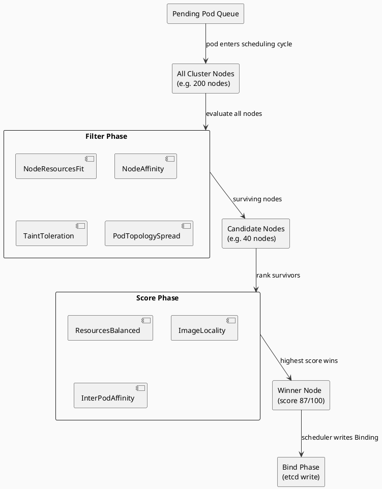
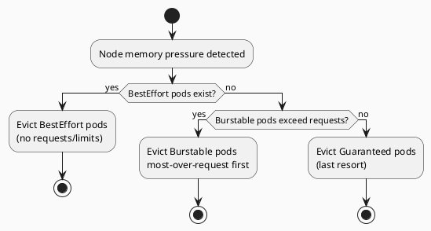

# 6.5 Kubernetes Scheduling Physics

---

## 1. LEARNING OBJECTIVES

By the end of this module you will be able to:

- Trace a pod through the Kubernetes scheduler pipeline (Filter → Score → Bind) and name the predicates that eliminate nodes at each stage
- Calculate correct memory limits for a Java 21 application by accounting for heap AND all off-heap JVM regions
- Classify pods into their QoS tier and predict eviction order under memory pressure
- Design taint/toleration and pod affinity rules to isolate workloads and spread replicas across failure domains
- Diagnose an OOMKilled container by reading `kubectl describe pod` output and correcting the resource spec

---

## 2. PREREQUISITES

| Dependency | Where to find it |
|---|---|
| Basic Kubernetes objects (Pod, Deployment, Node) | Chapter 6 intro |
| Linux process memory model (VSZ vs RSS) | Chapter 17 – Performance Engineering |
| JVM memory regions (heap, metaspace, code cache) | Chapter 01 – Core Java, JVM Internals section |
| Container cgroups and OOM killer | Chapter 6.2 – Sidecar Physics |

---

## 3. THE CRITICAL DIALOGUE

**Student:** My Java pod keeps getting OOMKilled. The heap is only 2 GB and I gave the container a 4 GB memory limit. That should be more than enough, right?

**Principal:** How did you set the heap?

**Student:** `-Xmx2g`. So the JVM can never use more than 2 GB.

**Principal:** `-Xmx` controls the heap. The JVM is not only heap. Walk me through what else is living inside that container process.

**Student:** ...there's metaspace for class metadata?

**Principal:** Yes. What else?

**Student:** Thread stacks? But those are tiny.

**Principal:** Each thread gets a stack. How many threads does your Spring Boot app create under load? Tomcat default thread pool is 200. At 512 KB per stack that's 100 MB before you even start a request. Keep going.

**Student:** I guess there's the JIT compiler... and maybe NIO buffers?

**Principal:** The JIT code cache (`-XX:ReservedCodeCacheSize`, default 240–512 MB on modern JVMs), metaspace (unbounded by default unless you set `-XX:MaxMetaspaceSize`), direct byte buffers if you use Netty or NIO (common in Spring WebFlux, gRPC clients, any JDBC driver), thread stacks, and the JVM internal overhead itself. On a Spring Boot app with a moderate number of dependencies and 200 Tomcat threads, off-heap easily reaches 1–1.5 GB. Your 4 GB limit leaves only 2 GB headroom for 1.5 GB of off-heap. When traffic spikes and Netty allocates more direct buffers, you breach 4 GB and the Linux OOM killer terminates the process.

**Student:** So I should just set a bigger limit?

**Principal:** Set a limit you can *justify*. Measure first: run the app under load, capture RSS with `kubectl top pod` and cross-reference with JVM NativeMemoryTracking. Then set `limit = -Xmx + measured_off_heap + 20% safety margin`. Blind over-provisioning wastes cluster capacity and pushes you to BestEffort QoS, which gets evicted first.

**Student:** What's the right formula?

**Principal:** A practical starting point for a standard Spring Boot app: `memory limit = Xmx + 30% of Xmx`. So with `-Xmx2g` you'd set the limit to `2 GB * 1.3 = 2.6 GB`, round up to `2.7 GB` for safety. For apps with heavy Netty use (reactive stacks, gRPC) add an extra 20%: `Xmx * 1.5`. Always set `memory request = memory limit` to get Guaranteed QoS. The scheduler places your pod on a node that can honour the request; the limit prevents runaway allocation.

---

## 4. THEORY + DIAGRAMS

### 4.1 The Scheduler Pipeline

The `kube-scheduler` runs a three-phase pipeline for every unscheduled pod.

```
PodQueue → Filter Phase → Score Phase → Bind Phase
              (predicates)   (priorities)   (etcd write)
```

**Filter Phase — eliminate unfit nodes**

Each node is evaluated against every active predicate plugin. If any predicate returns `false`, the node is removed from consideration entirely. Key predicates:

| Predicate Plugin | What it checks |
|---|---|
| `NodeResourcesFit` | Node has enough allocatable CPU and memory for the pod's **requests** |
| `NodeAffinity` | Pod's `nodeAffinity` rules match node labels |
| `TaintToleration` | Pod tolerates every taint on the node |
| `PodTopologySpread` | Placing pod here would not violate `topologySpreadConstraints` |
| `NodeUnschedulable` | Node is not cordoned |
| `VolumeBinding` | Required PVCs can be bound to volumes available on this node |

**Score Phase — rank surviving nodes**

Surviving nodes receive scores from priority plugins (default 0–100). Final score is a weighted sum.

| Priority Plugin | What it favours |
|---|---|
| `NodeResourcesBalancedAllocation` | Nodes where CPU and memory utilisation are balanced (avoids hotspots) |
| `ImageLocality` | Nodes that already have the container image cached |
| `InterPodAffinity` | Co-location with pods matching affinity rules |
| `NodePreferAvoidPods` | Respects `scheduler.alpha.kubernetes.io/preferAvoidPods` annotations |

**Bind Phase**

The scheduler writes a `Binding` object to etcd assigning the pod to the highest-scoring node. The kubelet on that node then creates the container.



### 4.2 Requests vs Limits — the distinction that matters

**Request** = what the scheduler uses for placement decisions. A pod with `memory: 2Gi` request will only be placed on a node where `allocatable_memory - sum_of_existing_requests >= 2Gi`. The node may actually have 6 Gi free in RSS terms — it doesn't matter. The scheduler works with accounting, not live utilisation.

**Limit** = the cgroup ceiling enforced at runtime.
- CPU limit: enforced by CFS bandwidth throttle. Pod does not die; it is slowed.
- Memory limit: enforced by cgroup OOM killer. When RSS exceeds the limit, the kernel kills the process with `SIGKILL`. This appears as `OOMKilled: true` in pod status.

### 4.3 QoS Classes and Eviction Order

Kubernetes assigns every pod a QoS class based on its resource spec.

| QoS Class | Condition | Eviction priority (1 = first to die) |
|---|---|---|
| BestEffort | No requests AND no limits set | 1 — evicted first |
| Burstable | Requests set but < limits, OR only some containers have requests | 2 |
| Guaranteed | Every container has requests AND limits, AND requests == limits for both CPU and memory | 3 — last to be evicted |

Under node memory pressure, the kubelet evicts BestEffort pods first, then Burstable, then Guaranteed. For production Java services you almost always want Guaranteed QoS.



### 4.4 Taints and Tolerations

A **taint** is a key-value pair on a node with an effect:
- `NoSchedule` — new pods without a matching toleration will not be scheduled here
- `PreferNoSchedule` — soft version; scheduler tries to avoid placing pods here
- `NoExecute` — existing pods without a matching toleration are evicted; future pods are not scheduled

Kubernetes adds system taints automatically:
- `node.kubernetes.io/not-ready:NoExecute` — added when a node fails its health check; pods without a toleration are evicted after `tolerationSeconds` (default 300s)
- `node.kubernetes.io/unreachable:NoExecute` — similar, for network partitions

**Isolating a workload on dedicated nodes:**

```yaml
# Label the dedicated node pool
# kubectl label node gpu-node-1 workload=ml-inference

# Taint the dedicated nodes so regular pods don't land here
# kubectl taint node gpu-node-1 dedicated=ml-inference:NoSchedule

# The pod that IS allowed to run there
tolerations:
  - key: "dedicated"
    operator: "Equal"
    value: "ml-inference"
    effect: "NoSchedule"
nodeSelector:
  workload: ml-inference
```

### 4.5 Pod Affinity and Anti-Affinity

Anti-affinity spreads replicas across failure domains (zones, racks). If two replicas land in the same zone and that zone fails, you lose 50% capacity. Anti-affinity prevents this.

```yaml
affinity:
  podAntiAffinity:
    requiredDuringSchedulingIgnoredDuringExecution:   # hard rule
      - labelSelector:
          matchLabels:
            app: payment-service
        topologyKey: topology.kubernetes.io/zone       # "spread across zones"
```

`requiredDuring...` is a hard constraint — if no spread is possible (e.g. only one zone exists), the pod stays Pending. For less critical services use `preferredDuring...` which is a soft constraint.

---

## 5. SOURCE ARCHAEOLOGY

### 5.1 Kubernetes Scheduler Framework Interface

The plugin interface that every predicate and priority implements lives at:

```
kubernetes/pkg/scheduler/framework/interface.go
```

The `FilterPlugin` interface:

```go
// FilterPlugin is an interface for Filter plugins. These plugins are called
// during the filter phase of the scheduling cycle.
type FilterPlugin interface {
    Plugin
    // Filter is called by the scheduling framework.
    // All FilterPlugins should return "Success" to declare that
    // the given node fits the pod. If Filter doesn't return "Success",
    // it will return "Unschedulable", "UnschedulableAndUnresolvable" or "Error".
    Filter(ctx context.Context, state *CycleState, p *v1.Pod, nodeInfo *NodeInfo) *Status
}
```

The `ScorePlugin` interface:

```go
type ScorePlugin interface {
    Plugin
    // Score is called on each filtered node. It must return success and an integer
    // indicating the rank of the node. All scoring plugins must return success or
    // the pod will be rejected.
    Score(ctx context.Context, state *CycleState, p *v1.Pod, nodeName string) (int64, *Status)
    ScoreExtensions() ScoreExtensions
}
```

Key insight from reading this source: plugins communicate via `CycleState`, a per-scheduling-cycle key-value store. This is how the Filter phase can pass precomputed data to the Score phase without re-reading the pod spec.

### 5.2 Reading kubectl describe node

The output of `kubectl describe node <name>` shows the scheduler's view of allocatable resources:

```
Capacity:
  cpu:                8
  memory:             32Gi
Allocatable:
  cpu:                7800m          # 8 cores - reserved for system daemons
  memory:             30Gi           # 32Gi - kubelet/OS reservation
Allocated resources:
  Resource           Requests    Limits
  --------           --------    ------
  cpu                3200m (41%) 6000m (76%)
  memory             12Gi  (40%) 20Gi  (66%)
```

The scheduler places pods based on **Requests**, not Limits. In this example, a new pod requesting `4 CPU / 20 Gi` would be rejected by `NodeResourcesFit` because `7800m - 3200m = 4600m` CPU is available but `30Gi - 12Gi = 18Gi` memory is available — less than the 20 Gi request.

---

## 6. CODE LAB

### Lab 6.5-A: Correct Pod Spec for a Java 21 Spring Boot Application

**Scenario:** Spring Boot 3 app, `-Xmx2g`, ~150 Tomcat threads, uses gRPC client (Netty-based, allocates direct buffers).

**Off-heap budget calculation:**

| Region | Estimate | How to set |
|---|---|---|
| Heap | 2048 MB | `-Xmx2g` |
| Metaspace | ~256 MB | `-XX:MaxMetaspaceSize=256m` |
| Code cache | ~256 MB | `-XX:ReservedCodeCacheSize=256m` |
| Thread stacks (150 threads × 512 KB) | ~75 MB | `-Xss512k` |
| Direct buffers (Netty gRPC) | ~512 MB | `-XX:MaxDirectMemorySize=512m` |
| JVM runtime overhead | ~100 MB | — |
| **Total off-heap** | **~1199 MB** | |
| **Total process** | **~3247 MB** | |
| **Limit (+ 10% safety)** | **~3600 MB** | |

```yaml
apiVersion: apps/v1
kind: Deployment
metadata:
  name: payment-service
  namespace: production
spec:
  replicas: 3
  selector:
    matchLabels:
      app: payment-service
  template:
    metadata:
      labels:
        app: payment-service
      annotations:
        # Document the off-heap math for the next person
        memory-budget: "heap=2g,metaspace=256m,codecache=256m,directbuf=512m,stacks=75m,overhead=100m"
    spec:
      containers:
        - name: app
          image: company/payment-service:1.4.2
          env:
            - name: JAVA_OPTS
              value: >-
                -Xms2g
                -Xmx2g
                -XX:MaxMetaspaceSize=256m
                -XX:ReservedCodeCacheSize=256m
                -XX:MaxDirectMemorySize=512m
                -Xss512k
                -XX:+UseG1GC
                -XX:+ExitOnOutOfMemoryError
                -XX:NativeMemoryTracking=summary
          resources:
            requests:
              cpu: "1"
              memory: "3600Mi"
            limits:
              cpu: "2"
              memory: "3600Mi"   # request == limit → Guaranteed QoS
          livenessProbe:
            httpGet:
              path: /actuator/health/liveness
              port: 8080
            initialDelaySeconds: 30
            periodSeconds: 10
            failureThreshold: 3
          readinessProbe:
            httpGet:
              path: /actuator/health/readiness
              port: 8080
            initialDelaySeconds: 15
            periodSeconds: 5
      affinity:
        podAntiAffinity:
          requiredDuringSchedulingIgnoredDuringExecution:
            - labelSelector:
                matchLabels:
                  app: payment-service
              topologyKey: topology.kubernetes.io/zone
```

**Why `request == limit`:** Sets Guaranteed QoS. The kubelet will not evict this pod under memory pressure unless absolutely necessary. The scheduler guarantees a node with 3600 Mi free capacity before placing it.

**Why `-XX:+ExitOnOutOfMemoryError`:** Without this, a JVM that runs out of heap throws `OutOfMemoryError` and may continue running in a degraded state (stuck threads, half-processed requests). With this flag, the JVM exits cleanly on OOM and Kubernetes restarts it. Failing fast is better than limping.

### Lab 6.5-B: Diagnosing OOMKilled

```bash
# Step 1: see that the pod was OOMKilled
kubectl describe pod payment-service-7d4b9f-xkp2n -n production

# Relevant output:
# Containers:
#   app:
#     Last State: Terminated
#       Reason:   OOMKilled
#       Exit Code: 137
#       Started:  Mon, 12 May 2025 09:14:32 +0000
#       Finished: Mon, 12 May 2025 09:22:11 +0000

# Step 2: check what the limit was at time of kill
# kubectl get pod ... -o jsonpath='{.spec.containers[0].resources}'
# {"limits":{"memory":"4Gi"},"requests":{"memory":"4Gi"}}

# Step 3: get NativeMemoryTracking data before it dies
# Add -XX:NativeMemoryTracking=summary to JAVA_OPTS, then:
kubectl exec -it payment-service-7d4b9f-xkp2n -- \
  jcmd 1 VM.native_memory summary

# Typical output showing the problem:
# Native Memory Tracking:
#   Total: reserved=6.2GB, committed=4.1GB    ← committed exceeds limit!
#   Java Heap (reserved=2.0GB, committed=2.0GB)
#   Class (reserved=1.1GB, committed=256MB)   ← metaspace not capped
#   Code (reserved=240MB, committed=240MB)
#   GC (reserved=400MB, committed=400MB)
#   Thread (reserved=512MB, committed=512MB)  ← 1000 threads × 512KB
#   Internal (reserved=100MB, committed=100MB)
#   Other (reserved=1.8GB, committed=512MB)   ← uncapped direct buffers
```

---

## 7. PRODUCTION LENS

### Incident: Payment Service OOMKilled Every 6 Hours

**Date:** Q3 (anonymised)
**Service:** Java 11 Spring Boot payment processor, migrated to Kubernetes 6 months prior

**Symptoms:**
- Pod restarted every 4–6 hours with `OOMKilled` (exit code 137)
- `-Xmx4g`, Kubernetes memory limit `4Gi`
- No heap OutOfMemoryError in logs — GC logs showed heap staying under 3.5 GB

**Root cause analysis:**

The team had set the Kubernetes limit equal to the heap size. They reasoned: "The JVM can't use more than 4 GB heap, so 4 GB limit is fine."

What they missed:

```
Actual process memory breakdown at time of kill:
  Heap:              3.8 GB  (near -Xmx4g under load spike)
  Metaspace:         512 MB  (no MaxMetaspaceSize set; 400 classes loaded from hot-reload)
  Direct buffers:    800 MB  (Kafka client + JDBC driver using NIO, no MaxDirectMemorySize)
  Thread stacks:     200 MB  (~400 threads, Xss512k)
  Code cache:        240 MB  (default)
  JVM internal:       80 MB
  ─────────────────────────
  Total RSS:         5.63 GB → OOM kill at 4 GB limit
```

**Fix applied:**

```
-Xmx2g                         # reduced heap
-XX:MaxMetaspaceSize=256m       # capped metaspace
-XX:MaxDirectMemorySize=512m    # capped direct buffers
-XX:ReservedCodeCacheSize=256m  # explicit code cache
-Xss256k                        # reduced stack (sufficient for this app)
memory limit: 3.5Gi             # 2g heap + ~1.3g off-heap + 10% margin
memory request: 3.5Gi           # Guaranteed QoS
```

**Outcome:** Zero OOMKill events in subsequent 90 days. Memory usage stabilised at 2.8–3.1 GB RSS under peak load.

**Lesson:** The `-Xmx` flag is not a process memory cap. The Kubernetes memory limit IS the process memory cap. These must be set together with explicit knowledge of off-heap usage.

---

## 8. EXERCISES

**Exercise 1 — Off-heap budget calculation**
You are deploying a Java 17 service that uses Spring WebFlux (Netty-based, reactive), a gRPC client, and Caffeine cache. Expected heap: `-Xmx1g`. The app has 50 virtual threads plus Netty's event loop threads. Calculate the minimum safe memory limit and write the complete `resources` block in YAML. Justify each number.

**Exercise 2 — QoS classification**
Classify each of the following pod specs into BestEffort, Burstable, or Guaranteed, and rank them in eviction order:
- Pod A: `requests: {memory: 1Gi}`, no limits
- Pod B: `requests: {cpu: 500m, memory: 2Gi}`, `limits: {cpu: 1, memory: 2Gi}`
- Pod C: no resources block at all
- Pod D: `requests: {cpu: 200m}`, `limits: {cpu: 400m, memory: 1Gi}`

**Exercise 3 — Taint/toleration isolation**
Your cluster has 3 high-memory nodes (`r6g.4xlarge`, 128 GB RAM) reserved for ML inference workloads. Write the `kubectl taint` command to isolate them, then write a pod spec snippet for an ML inference pod with the correct toleration and a `requiredDuringScheduling` nodeAffinity that pins it to those nodes. Also write the anti-affinity rule to spread 3 replicas across different nodes.

**Exercise 4 — Scheduler filter debugging**
A pod stays in `Pending` state. `kubectl describe pod` shows:
```
Events:
  Warning  FailedScheduling  0/8 nodes are available:
    3 node(s) had untolerated taint {dedicated: gpu},
    2 node(s) had taint {node.kubernetes.io/not-ready: NoExecute},
    2 node(s) Insufficient memory,
    1 node(s) didn't match Pod's node affinity/selector.
```
Which Filter predicates eliminated which nodes? What is the minimum change to the pod spec to get it scheduled?

**Exercise 5 — Native Memory Tracking**
Enable `NativeMemoryTracking=summary` on a local Spring Boot app (any project you have), run a load test with `k6` or `jmeter`, and capture the output of `jcmd 1 VM.native_memory summary` at peak load. Identify which region is the largest non-heap consumer and document whether a cap flag exists for it.

---

## Exercise Solutions

<details>
<summary>Exercise 1 — Off-heap budget for Spring WebFlux + gRPC + Caffeine</summary>

**App profile:** Spring WebFlux (Netty-based), gRPC client, Caffeine cache, `-Xmx1g`, 50 virtual threads.

**Virtual thread note:** Virtual threads do NOT consume a native stack when parked (unmounted from carrier thread). The 50 virtual threads contribute negligible stack memory. The Netty event loop threads (4–8 per CPU) DO have native stacks.

| Memory region | Estimate | Reasoning |
|---|---|---|
| Heap | 1,024 MB | `-Xmx1g` |
| Metaspace | 256 MB | `-XX:MaxMetaspaceSize=256m` — cap it, default is unbounded |
| Code cache | 256 MB | `-XX:ReservedCodeCacheSize=256m` — JIT-compiled methods |
| Direct buffers (Netty WebFlux + gRPC) | 512 MB | Two heavy Netty users: `-XX:MaxDirectMemorySize=512m` |
| Netty event loop threads: 2×CPU (assume 4 cores = 8 threads) × 512KB | ~4 MB | Negligible |
| Virtual thread carrier threads: 4 × 512KB | ~2 MB | Negligible |
| JVM internal overhead | ~100 MB | GC metadata, JVM itself |
| **Total off-heap** | **~1,130 MB** | |
| **Total process** | **~2,154 MB** | |
| **With 15% safety margin** | **~2,477 MB → 2,500 MB** | |

**YAML resources block:**
```yaml
resources:
  requests:
    cpu: "500m"
    memory: "2500Mi"  # request == limit → Guaranteed QoS
  limits:
    cpu: "1"
    memory: "2500Mi"
```

**JAVA_OPTS:**
```
-Xms1g -Xmx1g
-XX:MaxMetaspaceSize=256m
-XX:ReservedCodeCacheSize=256m
-XX:MaxDirectMemorySize=512m
-Xss256k
-XX:+UseG1GC
-XX:+ExitOnOutOfMemoryError
-XX:NativeMemoryTracking=summary
```

**Why `request == limit`:** Sets Guaranteed QoS — evicted last under node memory pressure. The scheduler guarantees a node with 2,500 Mi allocatable before placing the pod.

**Staff-level phrasing:** "For a Netty-heavy reactive app, budget 500MB+ for direct buffers — these are allocated outside the heap and invisible to `-Xmx`; cap them with `-XX:MaxDirectMemorySize` or the container will OOMKill with no heap OutOfMemoryError in the logs."

</details>

<details>
<summary>Exercise 2 — QoS classification and eviction order</summary>

**Classification rules:**
- **Guaranteed:** ALL containers have CPU AND memory in both requests AND limits, AND `request == limit` for each resource
- **BestEffort:** NO containers have any requests or limits
- **Burstable:** everything else

| Pod | Spec | QoS | Reason |
|---|---|---|---|
| A | `requests: {memory: 1Gi}`, no limits | Burstable | Has memory request but no limits; missing CPU entirely |
| B | `requests: {cpu: 500m, memory: 2Gi}`, `limits: {cpu: 1, memory: 2Gi}` | Burstable | cpu request (500m) ≠ cpu limit (1000m) — not Guaranteed |
| C | No resources block | BestEffort | No requests, no limits |
| D | `requests: {cpu: 200m}`, `limits: {cpu: 400m, memory: 1Gi}` | Burstable | Missing memory request; cpu request ≠ cpu limit |

**Eviction order under memory pressure (1 = evicted first):**

1. **Pod C** (BestEffort — evicted unconditionally first)
2. **Pod D** (Burstable — has no memory request, treated as 0 memory request, so always "over request" by any real usage)
3. **Pod A** (Burstable — has memory request but no limit; usage over the request triggers eviction)
4. **Pod B** (Burstable — has both request and limit for memory, closest to Guaranteed)

**Note on Pod B:** It would be Guaranteed if `requests.cpu = limits.cpu`. Change `requests.cpu: 500m` to `requests.cpu: "1"` (or `limits.cpu: "500m"`) to achieve Guaranteed QoS.

**Staff-level phrasing:** "For production Java services, Guaranteed QoS is the only acceptable choice — set `requests == limits` for BOTH cpu AND memory on EVERY container; the scheduler's placement guarantee is meaningless if the node OOM-kills your pod because a Burstable neighbor spiked."

</details>

<details>
<summary>Exercise 3 — Taint/toleration for ML inference node isolation</summary>

**Taint the 3 high-memory nodes:**
```bash
kubectl taint node r6g-4xlarge-node-1 dedicated=ml-inference:NoSchedule
kubectl taint node r6g-4xlarge-node-2 dedicated=ml-inference:NoSchedule
kubectl taint node r6g-4xlarge-node-3 dedicated=ml-inference:NoSchedule

# Label the nodes so nodeAffinity can select them
kubectl label node r6g-4xlarge-node-1 workload=ml-inference
kubectl label node r6g-4xlarge-node-2 workload=ml-inference
kubectl label node r6g-4xlarge-node-3 workload=ml-inference
```

**Pod spec for ML inference with toleration, nodeAffinity, and anti-affinity:**
```yaml
spec:
  tolerations:
    - key: dedicated
      operator: Equal
      value: ml-inference
      effect: NoSchedule             # matches the taint

  affinity:
    nodeAffinity:
      requiredDuringSchedulingIgnoredDuringExecution:
        nodeSelectorTerms:
          - matchExpressions:
              - key: workload
                operator: In
                values: [ml-inference]  # only schedule on labeled ML nodes

    podAntiAffinity:
      requiredDuringSchedulingIgnoredDuringExecution:
        - labelSelector:
            matchLabels:
              app: ml-inference         # don't co-locate replicas of this app
          topologyKey: kubernetes.io/hostname  # spread across different nodes
```

**Why both taint AND nodeAffinity:**
- Taint prevents random pods from landing on ML nodes
- `nodeAffinity` ensures ML pods ONLY land on ML nodes (not on general nodes that happen to have capacity)
- Without nodeAffinity: a ML pod tolerates the taint but may still be scheduled on any general node if the scheduler finds a better score there

**Anti-affinity key:** `kubernetes.io/hostname` (not `topology.kubernetes.io/zone`) because you want replicas on *different nodes*, not just different zones. With 3 replicas and 3 ML nodes, each replica gets its own node — optimal for high-memory workloads that might each use 64+ GB.

</details>

<details>
<summary>Exercise 4 — Scheduler filter debugging: why 0/8 nodes available</summary>

**Interpreting the FailedScheduling events:**

| Count | Message | Filter Plugin | Fix |
|---|---|---|---|
| 3 nodes | `untolerated taint {dedicated: gpu}` | `TaintToleration` | Add `tolerations` for `dedicated=gpu:NoSchedule` if pod should run on GPU nodes; or remove the taint from those nodes |
| 2 nodes | `taint {node.kubernetes.io/not-ready: NoExecute}` | `TaintToleration` (system taint) | Wait for nodes to recover, or remove them from the cluster; cannot fix in pod spec |
| 2 nodes | `Insufficient memory` | `NodeResourcesFit` | Reduce pod's memory request, or add more nodes |
| 1 node | `didn't match Pod's node affinity/selector` | `NodeAffinity` | Update pod's `nodeAffinity` rules to match the node's labels, or remove the nodeSelector constraint |

**Minimum change to get the pod scheduled:**

The 3 `dedicated=gpu` nodes are the largest group (3/8). If the pod is intended for GPU nodes:
```yaml
tolerations:
  - key: dedicated
    operator: Equal
    value: gpu
    effect: NoSchedule
```

This unblocks 3 nodes. Check if those 3 nodes have sufficient memory (if not, you'll see a new `Insufficient memory` event for fewer nodes). If the pod is NOT a GPU workload, the taint is correct — the pod should not run on GPU nodes, and you should focus on the 2 memory-insufficient general nodes by reducing memory request.

**Overall assessment:** This pod has conflicting scheduling constraints. The nodeAffinity rule (1 node eliminated) combined with insufficient memory (2 nodes eliminated) and not-ready nodes (2 eliminated) leaves only the 3 GPU-tainted nodes, which the pod can't tolerate. Fix the nodeAffinity constraint first (it was added intentionally — check what label it requires vs what the available general nodes have).

</details>

<details>
<summary>Exercise 5 — Native Memory Tracking: procedure and common findings</summary>

**How to enable and capture NMT:**

```bash
# Add to JAVA_OPTS before starting the app:
-XX:NativeMemoryTracking=summary

# After app is running under load (find JVM pid with: ps aux | grep java):
jcmd <pid> VM.native_memory summary scale=MB
```

**What the output looks like (Spring Boot + Netty, 2GB heap):**

```
Native Memory Tracking:
Total: reserved=4847MB, committed=3214MB

-         Java Heap (reserved=2048MB, committed=2048MB)
-             Class (reserved=1024MB, committed=58MB)    ← metaspace ~58MB committed
-              Code (reserved=512MB,  committed=71MB)    ← JIT code cache
-              GColl (reserved=372MB, committed=372MB)   ← G1GC remembered sets
-              Thread (reserved=308MB, committed=308MB)  ← 600 threads × 512KB
-            Internal (reserved=83MB,  committed=83MB)
-               Other (reserved=500MB, committed=174MB)  ← OFTEN the surprise
```

**Typical largest non-heap consumer for WebFlux/Netty apps: Direct buffers**

These appear under `Other` or under a separate `Direct Buffers` section. They are allocated via `ByteBuffer.allocateDirect()` and do NOT appear in NMT output for older JVMs — check `/proc/<pid>/status` → `VmRSS` minus NMT `committed` = unaccounted native memory (often direct buffers).

**Flag to cap it:**
```
-XX:MaxDirectMemorySize=512m
```

**For thread stacks:** If `Thread (committed)` is unexpectedly large, reduce with:
```
-Xss256k  # reduce per-thread stack from 512KB to 256KB
```

**For metaspace:** If `Class (committed)` exceeds expectations:
```
-XX:MaxMetaspaceSize=256m
```

**Key finding pattern:** Run under load, capture NMT at peak RSS. If `VmRSS` > NMT `committed`, the gap is direct buffers not tracked by NMT. This gap is what causes OOMKill without any heap OutOfMemoryError in the logs.

</details>

---

## 9. SUMMARY / FLASHCARD

- **Scheduler pipeline:** Filter (predicates eliminate nodes) → Score (priorities rank survivors) → Bind (etcd write assigns pod to node); the scheduler uses resource **requests**, not actual utilisation, for placement decisions.
- **Requests vs limits:** `request` is the scheduler's placement guarantee; `limit` is the cgroup enforcement ceiling — CPU over-limit throttles, memory over-limit kills; always set both explicitly for production Java services.
- **JVM off-heap is real memory:** `-Xmx` caps only the heap; metaspace, direct buffers, JIT code cache, and thread stacks all consume RSS outside `-Xmx`; a safe limit formula is `Xmx * 1.3` for standard apps, `Xmx * 1.5` for Netty-heavy apps.
- **QoS and eviction:** Guaranteed (`request == limit`) is evicted last; BestEffort (no requests/limits) is evicted first; for production services always target Guaranteed by setting `memory request == memory limit`.
- **Taints and anti-affinity together:** Taints prevent unwanted pods from landing on reserved nodes; pod anti-affinity with `topologyKey: zone` ensures replicas are spread across failure domains — use both for production-grade scheduling.
