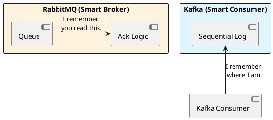

# 7.1: Messaging Battlefield - Zero-Copy vs. Broker State

## The Critical Dialogue

**Student:** My team is arguing about Kafka and RabbitMQ. They both send messages. Does it really matter which one I pick?

**Principal:** You're not picking a "Message Sender"; you're picking an **Economic and Physical Model** for your data. RabbitMQ is a **Bureaucrat** (smart broker); Kafka is a **Librarian** (immutable log). To build a Ledger that processes 1M views per second, you need **Replayable Throughput**, not "Instant Routing." To reach Principal level, we must choose the weapon that fits our specific battle.

---

## 1. The Weaponry: Messaging Archetypes

### 1.1 RabbitMQ: The Smart Broker (The Bureaucrat)
**What is it?**
A traditional broker that tracks the state of every message (Sent, Acked, Deleted).
. **The Physics:** The broker must update its internal state every time a consumer reads. This creates **Management Overhead** that caps throughput at ~100k msgs/sec.

### 1.2 Kafka: The Immutable Log (The Librarian)
**What is it?**
An append-only disk structure. It doesn't track consumers; it just keeps writing.
. **The Physics:** Consumers track their own place (**Offset**). This allows Kafka to serve 1,000 consumers without extra load.
. **The Speed:** Kafka uses **Sequential I/O** and the **Zero-Copy** `sendfile()` system call.

---

## 2. Source Archaeology: Kafka's Zero-Copy Physics

A Principal knows why Kafka destroys RabbitMQ in raw throughput.

> [!abstract] The Mechanics: sendfile() and Page Cache
. **Standard Path:** Disk -> Kernel Buffer -> User Space (JVM) -> Socket Buffer -> NIC. (Two copies).
. **Zero-Copy Path:** Disk -> Kernel Page Cache -> NIC.
. **The Audit:** By using `FileChannel.transferTo()`, Kafka never touches the data in Java's User Space. It moves bits directly from disk cache to the network card.

---

## 3. Visualizing the Battle: Logic in Broker vs Consumer

---

## 🧠 Principal's Inquiry

. **The Rebalance Jitter:** What happens to your "Top 10" calculation when a new Kafka consumer joins the group? (Hint: The **Stop-the-World** rebalance).

. **Backpressure:** How does RabbitMQ handle a "Fast Producer / Slow Consumer" problem compared to Kafka?

**Principal Summary:** Architectural Combat is about **Matching the Weapon to the Physics**. We use Kafka for high-throughput replayability and RabbitMQ for complex task routing.
 Greenlanders use the type system to prove our software invariants.
