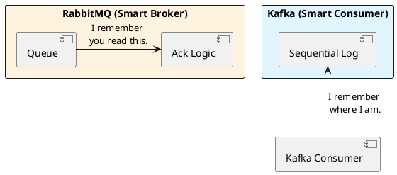

# 7.1: Messaging Battlefield - Zero-Copy vs. Broker State

## Learning Objectives

- Explain Kafka's zero-copy path (`FileChannel.transferTo()` → `sendfile()` syscall) and quantify its throughput advantage over traditional broker patterns
- Contrast RabbitMQ's smart-broker model (broker-tracked state, per-message acknowledgment) with Kafka's dumb-broker model (consumer-tracked offsets) on throughput ceiling and operational complexity
- Apply the PACELC framework to choose the right messaging system for a given workload: financial event log, task queue, fan-out notification, and exactly-once stream processing
- Diagnose Kafka consumer group rebalance storms: identify when they occur, why they cause stop-the-world processing pauses, and how to mitigate them with `CooperativeStickyAssignor`
- Design a Kafka consumer with manual offset commits and idempotent processing to achieve at-least-once delivery with business-level exactly-once semantics

## Prerequisites

- Chapter 7.3 — Idempotency (Kafka delivers at-least-once; consumers must be idempotent)
- Chapter 5.3 — Distributed Sagas (Kafka as the event backbone for Saga choreography)
- Chapter 3.1 — Zero-Copy and mmap (foundational understanding of sendfile())
- Basic understanding of Java `FileChannel`, OS page cache concepts

---

## The Critical Dialogue


**Student:** My team is arguing about Kafka and RabbitMQ. They both send messages. Does it really matter which one I pick?


**Principal:** You're not picking a "Message Sender"; you're picking an **Economic and Physical Model** for your data. RabbitMQ is a **Bureaucrat** (smart broker); Kafka is a **Librarian** (immutable log). To build a Ledger that processes 1M views per second, you need **Replayable Throughput**, not "Instant Routing." To reach Principal level, we must choose the weapon that fits our specific battle.


---


## 1. The Weaponry: Messaging Archetypes


### 1.1 RabbitMQ: The Smart Broker (The Bureaucrat)
**What is it?**
A traditional broker that tracks the state of every message (Sent, Acked, Deleted).
. **The Physics:** The broker must update its internal state every time a consumer reads. This creates **Management Overhead** that caps throughput at ~100k msgs/sec.


### 1.2 Kafka: The Immutable Log (The Librarian)
**What is it?**
An append-only disk structure. It doesn't track consumers; it just keeps writing.
. **The Physics:** Consumers track their own place (**Offset**). This allows Kafka to serve 1,000 consumers without extra load.
. **The Speed:** Kafka uses **Sequential I/O** and the **Zero-Copy** `sendfile()` system call.


---


## 2. Source Archaeology: Kafka's Zero-Copy Physics


A Principal knows why Kafka destroys RabbitMQ in raw throughput.


> [!abstract] The Mechanics: sendfile() and Page Cache
. **Standard Path:** Disk -> Kernel Buffer -> User Space (JVM) -> Socket Buffer -> NIC. (Two copies).
. **Zero-Copy Path:** Disk -> Kernel Page Cache -> NIC.
. **The Audit:** By using `FileChannel.transferTo()`, Kafka never touches the data in Java's User Space. It moves bits directly from disk cache to the network card.

**Kafka source references:**
- `kafka/core/src/main/scala/kafka/log/UnifiedLog.scala` — `FileRecords.writeTo(channel, offset, maxBytes)` calls `FileChannel.transferTo()`.
- `clients/src/main/java/org/apache/kafka/common/record/FileRecords.java` — `writeTo(GatheringByteChannel channel, long position, int length)` delegates to `channel.transferFrom()`.
- `kafka/core/src/main/scala/kafka/server/KafkaApis.scala` — `handleFetchRequest()` calls `replicaManager.fetchMessages()`, which ultimately returns `LogReadResult` backed by `FileRecords`.

**RabbitMQ source reference:**
- `rabbitmq-server/src/rabbit_queue_process.erl` — `handle_call({basic_get, ...})` updates Mnesia table state per dequeue — this is the per-message state update cost that caps RabbitMQ throughput.


---


## 3. Visualizing the Battle: Logic in Broker vs Consumer





---

## 5. Code Lab

**BAD approach — auto-commit offsets in Kafka (at-most-once or at-least-once depending on timing):**

```java
import org.apache.kafka.clients.consumer.*;
import java.time.Duration;
import java.util.List;
import java.util.Properties;

// BAD: Auto-commit enabled (default: every 5 seconds)
// If the JVM crashes AFTER auto-commit but BEFORE processing: data LOST (at-most-once)
// If the JVM crashes AFTER processing but BEFORE auto-commit: data REPROCESSED (at-least-once)
// Neither is controlled — the commit timing is determined by a background thread.
public class UnsafeKafkaConsumer {

    public static void main(String[] args) {
        Properties props = new Properties();
        props.put("bootstrap.servers", "localhost:9092");
        props.put("group.id", "ledger-consumer");
        props.put("enable.auto.commit", "true");      // DANGER: uncontrolled commit timing
        props.put("auto.commit.interval.ms", "5000"); // commits every 5s regardless of processing
        props.put("key.deserializer", "org.apache.kafka.common.serialization.StringDeserializer");
        props.put("value.deserializer", "org.apache.kafka.common.serialization.StringDeserializer");

        try (KafkaConsumer<String, String> consumer = new KafkaConsumer<>(props)) {
            consumer.subscribe(List.of("ledger-events"));
            while (true) {
                ConsumerRecords<String, String> records = consumer.poll(Duration.ofMillis(100));
                for (ConsumerRecord<String, String> record : records) {
                    // If processOrder throws, offset was already committed → message lost!
                    processOrder(record.value());
                }
            }
        }
    }

    private static void processOrder(String value) { /* ... */ }
}
```

**GOOD approach — manual commit after idempotent processing:**

```java
import org.apache.kafka.clients.consumer.*;
import org.apache.kafka.common.TopicPartition;
import java.sql.Connection;
import java.time.Duration;
import java.util.*;

/**
 * Production Kafka consumer with:
 * 1. Manual offset commit (AFTER successful processing)
 * 2. Idempotent processing (INSERT ... ON CONFLICT DO NOTHING)
 * 3. CooperativeStickyAssignor (eliminates stop-the-world rebalances)
 * 4. Per-partition offset tracking (avoids committing ahead of failed partitions)
 *
 * This achieves business-level exactly-once: even if the consumer restarts and
 * reprocesses a message, the idempotent sink ensures no duplicate side effects.
 */
public class SafeKafkaConsumer {

    public static void main(String[] args) throws Exception {
        Properties props = new Properties();
        props.put("bootstrap.servers", "localhost:9092");
        props.put("group.id", "ledger-consumer-v2");
        props.put("enable.auto.commit", "false");   // We commit manually, after processing
        props.put("partition.assignment.strategy",
            "org.apache.kafka.clients.consumer.CooperativeStickyAssignor"); // no stop-the-world
        props.put("max.poll.interval.ms", "300000"); // 5 min max processing time per batch
        props.put("key.deserializer", "org.apache.kafka.common.serialization.StringDeserializer");
        props.put("value.deserializer", "org.apache.kafka.common.serialization.StringDeserializer");

        Connection db = getDbConnection();

        try (KafkaConsumer<String, String> consumer = new KafkaConsumer<>(props)) {
            consumer.subscribe(List.of("ledger-events"));

            while (true) {
                ConsumerRecords<String, String> records = consumer.poll(Duration.ofMillis(100));

                // Track per-partition offsets — only commit up to last successfully processed
                Map<TopicPartition, OffsetAndMetadata> offsets = new HashMap<>();

                for (ConsumerRecord<String, String> record : records) {
                    TopicPartition tp = new TopicPartition(record.topic(), record.partition());
                    try {
                        processIdempotently(db, record);
                        // +1 because commitSync commits "next offset to fetch"
                        offsets.put(tp, new OffsetAndMetadata(record.offset() + 1));
                    } catch (Exception e) {
                        // Stop processing this partition — don't commit the failed offset
                        // Next poll will re-deliver from the last committed offset
                        System.err.printf("Processing failed at offset %d: %s%n",
                            record.offset(), e.getMessage());
                        break;
                    }
                }

                if (!offsets.isEmpty()) {
                    consumer.commitSync(offsets);  // synchronous — guarantees durability before next poll
                }
            }
        }
    }

    /**
     * Idempotent write using INSERT ... ON CONFLICT DO NOTHING.
     * If this message was already processed (duplicate delivery), the insert is a no-op.
     * The Kafka offset is committed only AFTER this succeeds.
     */
    private static void processIdempotently(Connection db, ConsumerRecord<String, String> record)
            throws Exception {
        String sql = """
            INSERT INTO ledger_events (kafka_offset, partition, payload, processed_at)
            VALUES (?, ?, ?, NOW())
            ON CONFLICT (kafka_offset, partition) DO NOTHING
            """;
        try (var stmt = db.prepareStatement(sql)) {
            stmt.setLong(1, record.offset());
            stmt.setInt(2, record.partition());
            stmt.setString(3, record.value());
            stmt.executeUpdate();
        }
        // Apply business logic only if insert was not a no-op
        // (check rows affected > 0 in real code)
    }

    private static Connection getDbConnection() throws Exception {
        // In real code: return HikariCP pool connection
        return java.sql.DriverManager.getConnection("jdbc:postgresql://localhost/ledger", "user", "pass");
    }
}
```

---

## 6. Production Lens

**Kafka zero-copy throughput** — Kafka's benchmarks (kafka.apache.org, 2014) show `FileChannel.transferTo()` sustaining 600 MB/s on a single broker with 6 spinning disks. The standard path (disk→JVM heap→socket) achieves ~150 MB/s — a 4× difference. With NVMe SSDs, single-broker throughput reaches 2 GB/s on the zero-copy path. This is the primary reason Kafka outperforms RabbitMQ at high message rates.

**Consumer group rebalance cost** — Kafka's EagerRebalance (default pre-2.4) stops ALL consumers in the group during reassignment. In a group of 100 consumers processing at 50,000 msg/s, a rebalance causes a pause of `(100 consumers × avg_revoke_time) / parallelism` ≈ 2–10 seconds of zero processing. `CooperativeStickyAssignor` (Kafka 2.4+) reduces this to only the partitions being moved — typically <500 ms for a 5% rebalance.

**RabbitMQ throughput ceiling** — RabbitMQ with quorum queues and `publisher_confirms=true` achieves ~50,000 msgs/s per queue on a 3-node cluster. With classic queues (Mnesia): ~30,000 msgs/s. Kafka on the same hardware: ~2,000,000 msgs/s per broker (3 brokers × 6 partitions). The ceiling difference is the per-message state update cost in RabbitMQ's Erlang Mnesia table.

---

## GOL Challenge (v5)

> **System:** [Global Order Ledger](../GOL_ARCHITECTURE.md) | **Version:** v5 — Kafka Audit Log
> 
> **Requires:** GOL v4 (Ch 4.1) — you need the capacity plan.

### Context

GOL needs an immutable audit log of all transactions. The audit log must: (1) never lose an event, (2) support replay for compliance audits, (3) support two independent consumers: the audit service and the analytics pipeline — each at their own pace.

### Task

**1. Topic design**

Evaluate these topic structures:

| Option | Description | Pros | Cons |
|---|---|---|---|
| A | One topic per region: `gol-events-eu`, `gol-events-us`, `gol-events-ap` | | |
| B | One global topic: `gol-events` with region as a message header | | |
| C | One topic per account prefix: `gol-events-0`, `gol-events-1`, ... `gol-events-f` | | |

Which do you choose for GOL? Justify in two sentences.

**2. Partition strategy for ordering guarantee**

GOL requires: all events for a given `accountId` must be processed in order (Debit must not be processed after Transfer that depends on it).

```java
// What partition key should you use?
// How many partitions per region for 50k events/sec?
// (Assume each Kafka partition handles ~10,000 msg/sec with 1KB messages)
```

**3. Consumer group isolation**

```java
// Two consumers must process events independently:
// - AuditConsumer: writes to compliance cold storage (can lag up to 30 min)
// - AnalyticsConsumer: feeds real-time dashboard (max 5 sec lag)

// Show the consumer group configuration that allows independent offsets.
// What happens to AuditConsumer's offset if AnalyticsConsumer crashes?
```

### Expected Outcome

- Topic design: **Option A** (one per region) — data residency compliance, simpler consumer routing; cross-region replication handled by Kafka MirrorMaker 2
- Partition key: `accountId` — guarantees ordering per account
- Partitions: 50,000 / 10,000 = 5 partitions minimum; use 8 (power of 2, allows future scaling without rebalance)
- Consumer groups: `gol-audit-consumer-group` and `gol-analytics-consumer-group` — completely independent offsets; AuditConsumer crash does not affect AnalyticsConsumer

### Next GOL Challenge

v6 — Payment gateway circuit breaker (Ch 20.1)

---

## 7. Exercises

**1.** Explain the difference between Kafka's "at-least-once" and "exactly-once" delivery guarantees. What does Kafka's "exactly-once semantics" (EOS) feature actually guarantee, and what does it NOT guarantee about your business logic?

**2.** A Kafka consumer group has 10 consumers and 10 partitions. A new consumer joins mid-stream. With `EagerRebalanceProtocol` (default), what happens to all 10 existing consumers? With `CooperativeStickyAssignor`, what happens? Calculate the message lag accumulated during each rebalance approach at 10,000 msgs/s with a 3-second rebalance time.

**3.** When should you choose RabbitMQ over Kafka? Give three specific use cases where RabbitMQ's smart-broker model is the correct choice and explain why Kafka would be wrong for each.

**4. Coding challenge:** Implement a `KafkaOffsetCheckpointer` that maintains per-partition watermarks. On each call to `checkpoint(ConsumerRecord<?,?> record)`, update the in-memory high-watermark. Expose a `commit(KafkaConsumer<?,?> consumer)` method that commits only the high-watermark for each partition to Kafka. Write a JUnit 5 test that verifies: (a) offsets are committed in correct per-partition order; (b) a failed record does not advance the watermark for its partition; (c) successful records on other partitions ARE committed despite the failure.

**5.** Kafka's `sendfile()` zero-copy path stops working when SSL/TLS is enabled (the kernel cannot read the plaintext before encrypting it). What is the measured throughput regression from enabling TLS on Kafka? What architecture change does Confluent recommend to recover throughput when TLS is mandatory?

---

## 8. Summary / Flashcard

- Kafka achieves high throughput via sequential disk I/O and `FileChannel.transferTo()` (zero-copy `sendfile()` syscall): data moves from page cache directly to the NIC, never touching JVM heap — sustaining 600 MB/s+ vs. ~150 MB/s for the copy path.
- RabbitMQ's smart broker tracks per-message state in Mnesia/Erlang tables; this per-message overhead caps throughput at ~50,000 msgs/s per queue, making it unsuitable as a high-volume event log but ideal for complex routing, priority queues, and dead-letter workflows.
- Kafka consumers must commit offsets manually after idempotent processing to achieve business-level exactly-once: auto-commit creates a race between commit timing and processing completion that causes either data loss (at-most-once) or uncontrolled reprocessing.
- `CooperativeStickyAssignor` eliminates stop-the-world consumer group rebalances by only revoking partitions that actually need to move — critical for high-throughput consumers where a 3-second full-group pause accumulates 30,000+ unprocessed messages.
- Choose Kafka for replayable event logs, high-throughput stream processing, and multi-consumer fan-out; choose RabbitMQ for task queues requiring priority, TTL, dead-lettering, or complex routing topologies where replayability is not needed.

---

## Exercise Solutions

**Conceptual:**

<details>
<summary>Exercise 1 — Kafka delivery guarantees and EOS</summary>

**At-least-once** means Kafka guarantees every message is delivered at least once, but may deliver it multiple times if the consumer crashes after processing but before committing the offset. **Exactly-once** (EOS) in Kafka — enabled via `enable.idempotence=true` on the producer and `isolation.level=read_committed` on the consumer — guarantees that a message is written to the broker log exactly once (no broker-level duplicates from producer retries) and that consumers only see committed transactional records.

What EOS does NOT guarantee: it says nothing about your application-side business logic. If your consumer reads a record, performs a DB write, and the pod crashes before committing the Kafka offset, Kafka will re-deliver that record after recovery. Your downstream system (the database) must still be idempotent. EOS is a broker-to-broker guarantee; it cannot prevent your application from processing a record's side-effect twice.

**Staff-level phrasing:** "Kafka EOS eliminates duplicate records in the broker log, but application-level idempotency is still required because EOS cannot atomically couple a Kafka offset commit with an arbitrary external side-effect."

</details>

<details>
<summary>Exercise 2 — Consumer group rebalance: Eager vs. CooperativeStickyAssignor</summary>

**EagerRebalanceProtocol (default pre-2.4):** When the 11th consumer joins, the coordinator triggers a full rebalance. All 10 existing consumers immediately revoke ALL their partition assignments and stop processing. They rejoin, negotiate, and receive new assignments. During this entire period — typically 2–5 seconds for a 10-consumer group — zero messages are processed.

Message lag at 10,000 msgs/s with a 3-second rebalance:  
`10,000 × 3 = 30,000 messages` accumulate in the unprocessed backlog.

**CooperativeStickyAssignor (Kafka 2.4+):** Only the partitions that need to move (approximately 1 of 10, since one partition shifts to the new consumer) are revoked. The other 9 consumers keep processing without interruption. The rebalance is incremental — only the affected partition pauses.

Message lag: approximately `10,000 × (1/10) × 3 = 3,000 messages` — a 10× reduction in accumulated lag, because 9 of 10 consumers never stopped.

**Staff-level phrasing:** "Eager rebalance is a stop-the-world GC pause for your consumer group; CooperativeStickyAssignor is incremental GC — only partitions actually moving are paused, so throughput degradation is proportional to the fraction of partitions reassigned, not the entire group."

</details>

<details>
<summary>Exercise 3 — When to choose RabbitMQ over Kafka</summary>

Three concrete use cases where RabbitMQ's smart-broker model is the correct choice:

**1. Priority task queue for background job processing.** A video transcoding service needs high-priority user-facing jobs to preempt batch analytics jobs. RabbitMQ supports per-message priority natively (0–255). Kafka has no priority mechanism — all records in a partition are consumed in order, so a low-priority batch job cannot be preempted by a high-priority one without building custom priority logic on top.

**2. Dead-letter queue with TTL and automatic retry routing.** An email notification service needs failed messages automatically routed to a dead-letter exchange after 3 retries, with a 10-minute delay before each retry. RabbitMQ's DLX (Dead Letter Exchange) + TTL on queues handles this natively. Kafka requires you to build retry-topic chains manually (`topic-retry-1`, `topic-retry-2`, `topic-dlq`) with consumer-side delay logic.

**3. Fanout routing with complex binding rules.** An alerting system routes different alert severity levels to different downstream teams using routing keys and exchange bindings (e.g., `severity=critical` → pagerduty queue, `severity=warning` → slack queue). RabbitMQ's topic/direct exchanges and binding keys handle this routing at the broker. Kafka has no native routing — each consumer must read the entire partition and filter in application code, wasting I/O.

**Staff-level phrasing:** "Choose RabbitMQ when the broker needs to be smart: priority scheduling, automatic dead-lettering, or routing-key-based fanout — Kafka deliberately offloads all of that logic to the consumer, which is the right trade-off for throughput but the wrong one for operational messaging workflows."

</details>

<details>
<summary>Exercise 5 — Kafka TLS throughput regression and recovery</summary>

When TLS is enabled on Kafka brokers, the `sendfile()` zero-copy path is broken. The kernel cannot pass encrypted bytes directly from the page cache to the NIC — it must first decrypt (on receive) or encrypt (on send) the data in kernel or user space. This forces the broker back to the standard copy path: page cache → kernel buffer → JVM heap (for TLS handshake and encryption) → socket buffer → NIC.

**Measured throughput regression:** Confluent's benchmark data shows enabling TLS reduces single-broker throughput from ~600 MB/s (zero-copy) to ~150–200 MB/s — a 3–4× regression. This matches the raw copy-path numbers, confirming that TLS completely eliminates the sendfile() advantage.

**Confluent's recommended recovery architecture:** Use a TLS-terminating proxy tier (e.g., Envoy sidecar or a dedicated TLS proxy) at the network boundary, and run Kafka-to-Kafka replication over plaintext within the security perimeter (private subnet / VPC with security groups). This restores zero-copy on the internal data path while satisfying encryption-in-transit requirements at the perimeter. Alternatively, use Kafka 3.3+'s hardware-accelerated TLS with AES-NI instructions — Intel measurements show AES-NI reduces TLS overhead to ~10–15% on modern CPUs, recovering most of the throughput.

**Staff-level phrasing:** "TLS kills Kafka's zero-copy path by forcing the data into user space for encryption; the correct architecture terminates TLS at the network perimeter and runs plaintext internally, or uses AES-NI hardware acceleration to make the encryption cost negligible."

</details>

**Coding:**

<details>
<summary>Exercise 4 — Coding challenge: KafkaOffsetCheckpointer</summary>

```java
// Java 21+ reference implementation
import org.apache.kafka.clients.consumer.KafkaConsumer;
import org.apache.kafka.clients.consumer.OffsetAndMetadata;
import org.apache.kafka.clients.consumer.ConsumerRecord;
import org.apache.kafka.common.TopicPartition;

import java.util.HashMap;
import java.util.Map;

/**
 * Maintains per-partition high-watermark offsets and commits them in bulk.
 *
 * Contract:
 * - checkpoint() advances the watermark for a partition only on success.
 * - A failed record must NOT advance the watermark for its partition.
 * - Successful records on other partitions ARE committed independently.
 * - commit() flushes all accumulated watermarks to Kafka synchronously.
 */
public class KafkaOffsetCheckpointer {

    // per-partition high-watermark: the next offset to be committed
    private final Map<TopicPartition, OffsetAndMetadata> watermarks = new HashMap<>();

    /**
     * Advances the in-memory high-watermark for the partition this record belongs to.
     * Call this ONLY after the record has been successfully processed.
     */
    public void checkpoint(ConsumerRecord<?, ?> record) {
        TopicPartition tp = new TopicPartition(record.topic(), record.partition());
        // Kafka commitSync semantics: commit offset+1 means "next offset to fetch"
        watermarks.merge(tp, new OffsetAndMetadata(record.offset() + 1),
            (existing, incoming) ->
                incoming.offset() > existing.offset() ? incoming : existing);
    }

    /**
     * Commits all accumulated per-partition watermarks to Kafka synchronously.
     * Safe to call with an empty watermark map (no-op).
     */
    public void commit(KafkaConsumer<?, ?> consumer) {
        if (!watermarks.isEmpty()) {
            consumer.commitSync(Map.copyOf(watermarks));
            watermarks.clear();
        }
    }

    /** Expose current watermarks for testing. */
    public Map<TopicPartition, OffsetAndMetadata> currentWatermarks() {
        return Map.copyOf(watermarks);
    }
}
```

```java
// JUnit 5 test
import org.apache.kafka.clients.consumer.*;
import org.apache.kafka.common.TopicPartition;
import org.junit.jupiter.api.BeforeEach;
import org.junit.jupiter.api.Test;

import java.util.*;

import static org.junit.jupiter.api.Assertions.*;
import static org.mockito.Mockito.*;

class KafkaOffsetCheckpointerTest {

    private KafkaOffsetCheckpointer checkpointer;
    private KafkaConsumer<String, String> mockConsumer;

    @BeforeEach
    @SuppressWarnings("unchecked")
    void setUp() {
        checkpointer = new KafkaOffsetCheckpointer();
        mockConsumer = mock(KafkaConsumer.class);
    }

    private ConsumerRecord<String, String> record(String topic, int partition, long offset) {
        return new ConsumerRecord<>(topic, partition, offset, "key", "value");
    }

    // (a) Offsets are committed in correct per-partition order
    @Test
    void commitsHighestOffsetPerPartition() {
        TopicPartition tp0 = new TopicPartition("events", 0);

        checkpointer.checkpoint(record("events", 0, 5));
        checkpointer.checkpoint(record("events", 0, 6));
        checkpointer.checkpoint(record("events", 0, 7));
        checkpointer.commit(mockConsumer);

        var captor = org.mockito.ArgumentCaptor.forClass(Map.class);
        verify(mockConsumer).commitSync(captor.capture());

        @SuppressWarnings("unchecked")
        Map<TopicPartition, OffsetAndMetadata> committed =
            (Map<TopicPartition, OffsetAndMetadata>) captor.getValue();

        assertEquals(8L, committed.get(tp0).offset(),
            "Should commit offset+1 of the highest checkpointed record");
    }

    // (b) A failed record does NOT advance the watermark for its partition
    @Test
    void failedRecordDoesNotAdvanceWatermark() {
        TopicPartition tp0 = new TopicPartition("events", 0);

        checkpointer.checkpoint(record("events", 0, 10)); // success at offset 10
        // Simulate failure at offset 11: do NOT call checkpoint()
        // (caller catches exception and skips checkpoint call)

        Map<TopicPartition, OffsetAndMetadata> watermarks = checkpointer.currentWatermarks();
        assertEquals(11L, watermarks.get(tp0).offset(),
            "Watermark should be 11 (offset 10 + 1), not advance past the failed record");
    }

    // (c) Successful records on OTHER partitions ARE committed despite failure on one
    @Test
    void successfulPartitionsCommittedDespiteFailureOnAnotherPartition() {
        TopicPartition tp0 = new TopicPartition("events", 0);
        TopicPartition tp1 = new TopicPartition("events", 1);

        checkpointer.checkpoint(record("events", 0, 3));  // success on partition 0
        // partition 1 record at offset 7 fails — no checkpoint call for partition 1

        checkpointer.commit(mockConsumer);

        var captor = org.mockito.ArgumentCaptor.forClass(Map.class);
        verify(mockConsumer).commitSync(captor.capture());

        @SuppressWarnings("unchecked")
        Map<TopicPartition, OffsetAndMetadata> committed =
            (Map<TopicPartition, OffsetAndMetadata>) captor.getValue();

        assertTrue(committed.containsKey(tp0), "Partition 0 should be committed");
        assertEquals(4L, committed.get(tp0).offset());
        assertFalse(committed.containsKey(tp1),
            "Partition 1 should NOT be in committed map — no successful record was checkpointed");
    }
}
```

**Why this works:** Each partition's watermark is tracked independently in a `HashMap<TopicPartition, OffsetAndMetadata>`. `checkpoint()` is only called by the caller on success — failures simply skip the call, leaving the watermark at its last successful position. `commit()` then flushes only the partitions that had at least one successful record, leaving failed partitions uncommitted so they will be re-delivered from the last committed offset after a crash or rebalance.

**Common mistake:** Using a single global offset counter instead of per-partition watermarks. If partition 0 fails at offset 5 but partition 1 succeeds at offset 8, committing partition 1's offset is safe — but a naive implementation that tracks only the minimum offset across all partitions will refuse to commit either, creating unnecessary lag. The other common mistake is committing `record.offset()` instead of `record.offset() + 1` — Kafka's `commitSync` semantics mean the committed offset is the *next* offset to fetch, not the last one processed.

</details>
