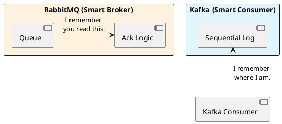

# 7.1: Messaging Battlefield - Zero-Copy vs. Broker State

## Learning Objectives

- Explain Kafka's zero-copy path (`FileChannel.transferTo()` → `sendfile()` syscall) and quantify its throughput advantage over traditional broker patterns
- Contrast RabbitMQ's smart-broker model (broker-tracked state, per-message acknowledgment) with Kafka's dumb-broker model (consumer-tracked offsets) on throughput ceiling and operational complexity
- Apply the PACELC framework to choose the right messaging system for a given workload: financial event log, task queue, fan-out notification, and exactly-once stream processing
- Diagnose Kafka consumer group rebalance storms: identify when they occur, why they cause stop-the-world processing pauses, and how to mitigate them with `CooperativeStickyAssignor`
- Design a Kafka consumer with manual offset commits and idempotent processing to achieve at-least-once delivery with business-level exactly-once semantics

## Prerequisites

- Chapter 7.3 — Idempotency (Kafka delivers at-least-once; consumers must be idempotent)
- Chapter 5.3 — Distributed Sagas (Kafka as the event backbone for Saga choreography)
- Chapter 3.1 — Zero-Copy and mmap (foundational understanding of sendfile())
- Basic understanding of Java `FileChannel`, OS page cache concepts

---

## The Critical Dialogue


**Student:** My team is arguing about Kafka and RabbitMQ. They both send messages. Does it really matter which one I pick?


**Principal:** You're not picking a "Message Sender"; you're picking an **Economic and Physical Model** for your data. RabbitMQ is a **Bureaucrat** (smart broker); Kafka is a **Librarian** (immutable log). To build a Ledger that processes 1M views per second, you need **Replayable Throughput**, not "Instant Routing." To reach Principal level, we must choose the weapon that fits our specific battle.


---


## 1. The Weaponry: Messaging Archetypes


### 1.1 RabbitMQ: The Smart Broker (The Bureaucrat)
**What is it?**
A traditional broker that tracks the state of every message (Sent, Acked, Deleted).
. **The Physics:** The broker must update its internal state every time a consumer reads. This creates **Management Overhead** that caps throughput at ~100k msgs/sec.


### 1.2 Kafka: The Immutable Log (The Librarian)
**What is it?**
An append-only disk structure. It doesn't track consumers; it just keeps writing.
. **The Physics:** Consumers track their own place (**Offset**). This allows Kafka to serve 1,000 consumers without extra load.
. **The Speed:** Kafka uses **Sequential I/O** and the **Zero-Copy** `sendfile()` system call.


---


## 2. Source Archaeology: Kafka's Zero-Copy Physics


A Principal knows why Kafka destroys RabbitMQ in raw throughput.


> [!abstract] The Mechanics: sendfile() and Page Cache
. **Standard Path:** Disk -> Kernel Buffer -> User Space (JVM) -> Socket Buffer -> NIC. (Two copies).
. **Zero-Copy Path:** Disk -> Kernel Page Cache -> NIC.
. **The Audit:** By using `FileChannel.transferTo()`, Kafka never touches the data in Java's User Space. It moves bits directly from disk cache to the network card.

**Kafka source references:**
- `kafka/core/src/main/scala/kafka/log/UnifiedLog.scala` — `FileRecords.writeTo(channel, offset, maxBytes)` calls `FileChannel.transferTo()`.
- `clients/src/main/java/org/apache/kafka/common/record/FileRecords.java` — `writeTo(GatheringByteChannel channel, long position, int length)` delegates to `channel.transferFrom()`.
- `kafka/core/src/main/scala/kafka/server/KafkaApis.scala` — `handleFetchRequest()` calls `replicaManager.fetchMessages()`, which ultimately returns `LogReadResult` backed by `FileRecords`.

**RabbitMQ source reference:**
- `rabbitmq-server/src/rabbit_queue_process.erl` — `handle_call({basic_get, ...})` updates Mnesia table state per dequeue — this is the per-message state update cost that caps RabbitMQ throughput.


---


## 3. Visualizing the Battle: Logic in Broker vs Consumer





---

## 5. Code Lab

**BAD approach — auto-commit offsets in Kafka (at-most-once or at-least-once depending on timing):**

```java
import org.apache.kafka.clients.consumer.*;
import java.time.Duration;
import java.util.List;
import java.util.Properties;

// BAD: Auto-commit enabled (default: every 5 seconds)
// If the JVM crashes AFTER auto-commit but BEFORE processing: data LOST (at-most-once)
// If the JVM crashes AFTER processing but BEFORE auto-commit: data REPROCESSED (at-least-once)
// Neither is controlled — the commit timing is determined by a background thread.
public class UnsafeKafkaConsumer {

    public static void main(String[] args) {
        Properties props = new Properties();
        props.put("bootstrap.servers", "localhost:9092");
        props.put("group.id", "ledger-consumer");
        props.put("enable.auto.commit", "true");      // DANGER: uncontrolled commit timing
        props.put("auto.commit.interval.ms", "5000"); // commits every 5s regardless of processing
        props.put("key.deserializer", "org.apache.kafka.common.serialization.StringDeserializer");
        props.put("value.deserializer", "org.apache.kafka.common.serialization.StringDeserializer");

        try (KafkaConsumer<String, String> consumer = new KafkaConsumer<>(props)) {
            consumer.subscribe(List.of("ledger-events"));
            while (true) {
                ConsumerRecords<String, String> records = consumer.poll(Duration.ofMillis(100));
                for (ConsumerRecord<String, String> record : records) {
                    // If processOrder throws, offset was already committed → message lost!
                    processOrder(record.value());
                }
            }
        }
    }

    private static void processOrder(String value) { /* ... */ }
}
```

**GOOD approach — manual commit after idempotent processing:**

```java
import org.apache.kafka.clients.consumer.*;
import org.apache.kafka.common.TopicPartition;
import java.sql.Connection;
import java.time.Duration;
import java.util.*;

/**
 * Production Kafka consumer with:
 * 1. Manual offset commit (AFTER successful processing)
 * 2. Idempotent processing (INSERT ... ON CONFLICT DO NOTHING)
 * 3. CooperativeStickyAssignor (eliminates stop-the-world rebalances)
 * 4. Per-partition offset tracking (avoids committing ahead of failed partitions)
 *
 * This achieves business-level exactly-once: even if the consumer restarts and
 * reprocesses a message, the idempotent sink ensures no duplicate side effects.
 */
public class SafeKafkaConsumer {

    public static void main(String[] args) throws Exception {
        Properties props = new Properties();
        props.put("bootstrap.servers", "localhost:9092");
        props.put("group.id", "ledger-consumer-v2");
        props.put("enable.auto.commit", "false");   // We commit manually, after processing
        props.put("partition.assignment.strategy",
            "org.apache.kafka.clients.consumer.CooperativeStickyAssignor"); // no stop-the-world
        props.put("max.poll.interval.ms", "300000"); // 5 min max processing time per batch
        props.put("key.deserializer", "org.apache.kafka.common.serialization.StringDeserializer");
        props.put("value.deserializer", "org.apache.kafka.common.serialization.StringDeserializer");

        Connection db = getDbConnection();

        try (KafkaConsumer<String, String> consumer = new KafkaConsumer<>(props)) {
            consumer.subscribe(List.of("ledger-events"));

            while (true) {
                ConsumerRecords<String, String> records = consumer.poll(Duration.ofMillis(100));

                // Track per-partition offsets — only commit up to last successfully processed
                Map<TopicPartition, OffsetAndMetadata> offsets = new HashMap<>();

                for (ConsumerRecord<String, String> record : records) {
                    TopicPartition tp = new TopicPartition(record.topic(), record.partition());
                    try {
                        processIdempotently(db, record);
                        // +1 because commitSync commits "next offset to fetch"
                        offsets.put(tp, new OffsetAndMetadata(record.offset() + 1));
                    } catch (Exception e) {
                        // Stop processing this partition — don't commit the failed offset
                        // Next poll will re-deliver from the last committed offset
                        System.err.printf("Processing failed at offset %d: %s%n",
                            record.offset(), e.getMessage());
                        break;
                    }
                }

                if (!offsets.isEmpty()) {
                    consumer.commitSync(offsets);  // synchronous — guarantees durability before next poll
                }
            }
        }
    }

    /**
     * Idempotent write using INSERT ... ON CONFLICT DO NOTHING.
     * If this message was already processed (duplicate delivery), the insert is a no-op.
     * The Kafka offset is committed only AFTER this succeeds.
     */
    private static void processIdempotently(Connection db, ConsumerRecord<String, String> record)
            throws Exception {
        String sql = """
            INSERT INTO ledger_events (kafka_offset, partition, payload, processed_at)
            VALUES (?, ?, ?, NOW())
            ON CONFLICT (kafka_offset, partition) DO NOTHING
            """;
        try (var stmt = db.prepareStatement(sql)) {
            stmt.setLong(1, record.offset());
            stmt.setInt(2, record.partition());
            stmt.setString(3, record.value());
            stmt.executeUpdate();
        }
        // Apply business logic only if insert was not a no-op
        // (check rows affected > 0 in real code)
    }

    private static Connection getDbConnection() throws Exception {
        // In real code: return HikariCP pool connection
        return java.sql.DriverManager.getConnection("jdbc:postgresql://localhost/ledger", "user", "pass");
    }
}
```

---

## 6. Production Lens

**Kafka zero-copy throughput** — Kafka's benchmarks (kafka.apache.org, 2014) show `FileChannel.transferTo()` sustaining 600 MB/s on a single broker with 6 spinning disks. The standard path (disk→JVM heap→socket) achieves ~150 MB/s — a 4× difference. With NVMe SSDs, single-broker throughput reaches 2 GB/s on the zero-copy path. This is the primary reason Kafka outperforms RabbitMQ at high message rates.

**Consumer group rebalance cost** — Kafka's EagerRebalance (default pre-2.4) stops ALL consumers in the group during reassignment. In a group of 100 consumers processing at 50,000 msg/s, a rebalance causes a pause of `(100 consumers × avg_revoke_time) / parallelism` ≈ 2–10 seconds of zero processing. `CooperativeStickyAssignor` (Kafka 2.4+) reduces this to only the partitions being moved — typically <500 ms for a 5% rebalance.

**RabbitMQ throughput ceiling** — RabbitMQ with quorum queues and `publisher_confirms=true` achieves ~50,000 msgs/s per queue on a 3-node cluster. With classic queues (Mnesia): ~30,000 msgs/s. Kafka on the same hardware: ~2,000,000 msgs/s per broker (3 brokers × 6 partitions). The ceiling difference is the per-message state update cost in RabbitMQ's Erlang Mnesia table.

---

## 7. Exercises

**1.** Explain the difference between Kafka's "at-least-once" and "exactly-once" delivery guarantees. What does Kafka's "exactly-once semantics" (EOS) feature actually guarantee, and what does it NOT guarantee about your business logic?

**2.** A Kafka consumer group has 10 consumers and 10 partitions. A new consumer joins mid-stream. With `EagerRebalanceProtocol` (default), what happens to all 10 existing consumers? With `CooperativeStickyAssignor`, what happens? Calculate the message lag accumulated during each rebalance approach at 10,000 msgs/s with a 3-second rebalance time.

**3.** When should you choose RabbitMQ over Kafka? Give three specific use cases where RabbitMQ's smart-broker model is the correct choice and explain why Kafka would be wrong for each.

**4. Coding challenge:** Implement a `KafkaOffsetCheckpointer` that maintains per-partition watermarks. On each call to `checkpoint(ConsumerRecord<?,?> record)`, update the in-memory high-watermark. Expose a `commit(KafkaConsumer<?,?> consumer)` method that commits only the high-watermark for each partition to Kafka. Write a JUnit 5 test that verifies: (a) offsets are committed in correct per-partition order; (b) a failed record does not advance the watermark for its partition; (c) successful records on other partitions ARE committed despite the failure.

**5.** Kafka's `sendfile()` zero-copy path stops working when SSL/TLS is enabled (the kernel cannot read the plaintext before encrypting it). What is the measured throughput regression from enabling TLS on Kafka? What architecture change does Confluent recommend to recover throughput when TLS is mandatory?

---

## 8. Summary / Flashcard

- Kafka achieves high throughput via sequential disk I/O and `FileChannel.transferTo()` (zero-copy `sendfile()` syscall): data moves from page cache directly to the NIC, never touching JVM heap — sustaining 600 MB/s+ vs. ~150 MB/s for the copy path.
- RabbitMQ's smart broker tracks per-message state in Mnesia/Erlang tables; this per-message overhead caps throughput at ~50,000 msgs/s per queue, making it unsuitable as a high-volume event log but ideal for complex routing, priority queues, and dead-letter workflows.
- Kafka consumers must commit offsets manually after idempotent processing to achieve business-level exactly-once: auto-commit creates a race between commit timing and processing completion that causes either data loss (at-most-once) or uncontrolled reprocessing.
- `CooperativeStickyAssignor` eliminates stop-the-world consumer group rebalances by only revoking partitions that actually need to move — critical for high-throughput consumers where a 3-second full-group pause accumulates 30,000+ unprocessed messages.
- Choose Kafka for replayable event logs, high-throughput stream processing, and multi-consumer fan-out; choose RabbitMQ for task queues requiring priority, TTL, dead-lettering, or complex routing topologies where replayability is not needed.
