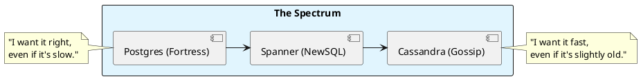

# 7.2: Database Combat - Consistency vs. Availability

## The Critical Dialogue

**Student:** I'm trying to decide between Postgres and Cassandra. Postgres has transactions, but Cassandra scales better. Is "Scalability" worth giving up my ACID guarantees?

**Principal:** You're not picking a "Database"; you're picking your **Consistency Model**. Postgres is a **Fortress** (ACID); Cassandra is a **Gossip Network** (BASE). To reach Principal level, we must master the **PACELC Trade-offs**. We move from "Trusting the Database" to **Designing for Conflict**.

---

## 1. The Weaponry: ACID vs. BASE

### 1.1 Postgres: The ACID Fortress (Consistency)
. **The Physics:** Every write must wait for the "Hot Standby" to acknowledge.
. **Pros:** Perfect for financial math, JOINs.
. **Cons:** Hard to scale across multiple regions without latency.

### 1.2 Cassandra: The BASE Fleet (Availability)
. **The Physics:** Data is replicated via **Gossip**. 
. **Pros:** Infinite horizontal scaling.
. **Cons:** "Eventual Consistency" means a user might see an old balance for milliseconds.

---

## 2. Source Archaeology: Spanner and the TrueTime wait

A Principal knows there is a third way: **NewSQL**.

> [!abstract] The Physics: TrueTime
. **Spanner:** Uses Atomic Clocks to achieve **External Consistency**.
. **The Mechanism:** By knowing the clock skew (e.g. 5ms), the database can **Wait** for 6ms before committing to ensure global order is absolute.

---

## 3. Visualizing the Consistency Spectrum

---

## 🧠 Principal's Inquiry

. **Tombstones:** In Cassandra, what happens when you "Delete" a million records? (Hint: The **Tombstone** read-penalty).

. **Sharding Penalty:** In Postgres, why does sharding (Chapter 4.2) break your ability to perform ACID JOINs?

**Principal Summary:** Database Combat is about **Managing Entropy**. We use ACID for the "Core Ledger" where correctness is law, and BASE for "Metadata" where scale is life.
 Greenlanders use the type system to prove our software invariants.
