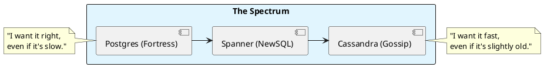

# 7.2: Database Combat - Consistency vs. Availability

## Learning Objectives

- Apply the PACELC theorem to classify PostgreSQL, Cassandra, DynamoDB, and Spanner and derive the correct database for a given workload constraint
- Explain Cassandra's gossip-based replication and the consistency level algebra (`W + R > RF` for strong consistency)
- Diagnose Cassandra tombstone accumulation: explain why DELETE-heavy workloads degrade read performance and what the read-repair path looks like
- Implement optimistic locking in PostgreSQL to handle concurrent balance updates without serializable isolation overhead
- Evaluate NewSQL (CockroachDB/Spanner) as a third option that avoids the ACID vs. horizontal-scale trade-off and quantify its latency cost

## Prerequisites

- Chapter 5.2 — Consensus/Raft (Spanner and CockroachDB use Raft for replication)
- Chapter 5.1 — Clock Skew (TrueTime's role in Spanner's external consistency)
- Chapter 3.5 — Transaction Isolation / MVCC (PostgreSQL MVCC internals)
- Chapter 7.4 — Architectural ADRs (documenting this database decision correctly)

---

## The Critical Dialogue


**Student:** I'm trying to decide between Postgres and Cassandra. Postgres has transactions, but Cassandra scales better. Is "Scalability" worth giving up my ACID guarantees?


**Principal:** You're not picking a "Database"; you're picking your **Consistency Model**. Postgres is a **Fortress** (ACID); Cassandra is a **Gossip Network** (BASE). To reach Principal level, we must master the **PACELC Trade-offs**. We move from "Trusting the Database" to **Designing for Conflict**.


---


## 1. The Weaponry: ACID vs. BASE


### 1.1 Postgres: The ACID Fortress (Consistency)
. **The Physics:** Every write must wait for the "Hot Standby" to acknowledge.
. **Pros:** Perfect for financial math, JOINs.
. **Cons:** Hard to scale across multiple regions without latency.


### 1.2 Cassandra: The BASE Fleet (Availability)
. **The Physics:** Data is replicated via **Gossip**. 
. **Pros:** Infinite horizontal scaling.
. **Cons:** "Eventual Consistency" means a user might see an old balance for milliseconds.


---


## 2. Source Archaeology: Spanner and the TrueTime wait


A Principal knows there is a third way: **NewSQL**.


> [!abstract] The Physics: TrueTime
. **Spanner:** Uses Atomic Clocks to achieve **External Consistency**.
. **The Mechanism:** By knowing the clock skew (e.g. 5ms), the database can **Wait** for 6ms before committing to ensure global order is absolute.

**Real source references:**

**Cassandra gossip protocol** — `org.apache.cassandra.gms.Gossiper`: `GossipDigestSyn` carries `(generation, version)` pairs for each known endpoint. `Gossiper.doGossipToLiveMember()` selects a random peer and sends a `GossipDigestSynMessage`. `Gossiper.examineGossiper()` calls `EndpointStateStore.markDead()` when a node's heartbeat ages beyond `endpointStatePersistenceMillis`. This is the failure detection path.

**Cassandra write path with consistency** — `org.apache.cassandra.service.StorageProxy.performWrite()`: sends `MutationMessage` to replica nodes asynchronously; `WriteResponseHandler.get()` blocks until the required quorum of acks arrive. With `QUORUM` consistency level (RF=3, W=2), 2 acks suffice. With `ONE`, 1 ack suffices — the other replicas get the write asynchronously.

**CockroachDB distributed write** — `pkg/kv/kvserver/replica_write.go` `(*Replica).executeWriteBatch()`: acquires a Raft proposal slot, waits for Raft consensus, then applies the command to RocksDB. The `TxnCoordSender` (`pkg/kv/txncoordinter.go`) manages multi-statement transactions across ranges using a `TxnRecord` stored in the transaction's home range.

**PostgreSQL MVCC row versioning** — `src/backend/storage/heap/heapam.c` `heap_update()`: creates a new tuple version with `t_xmin = current_xid`, sets `t_xmax` on the old version to current xid. `HeapTupleSatisfiesMVCC()` in `tqual.c` determines visibility based on `t_xmin`/`t_xmax` against the snapshot's `xmin`/`xmax`/`xip` arrays.


---


## 3. Visualizing the Consistency Spectrum





---

## 5. Code Lab

**BAD approach — last-write-wins update without conflict detection:**

```java
// BAD: Two concurrent threads read balance=1000, both add $200, both write 1200.
// One write is silently lost. Result: balance=1200 instead of 1400.
// This is the "lost update" anomaly — not caught by READ COMMITTED isolation.
public class UnsafeBalanceService {

    public void addFunds(String userId, long amountCents) {
        // Step 1: Read current balance (from DB or cache)
        Account account = accountRepo.findById(userId); // reads balance=1000
        // --- Another thread also reads balance=1000 here ---

        // Step 2: Update in application memory
        account.setBalance(account.getBalance() + amountCents); // 1000+200=1200

        // Step 3: Write back — OVERWRITES the other thread's concurrent write
        accountRepo.save(account); // writes 1200, losing the concurrent +200
        // Final balance: 1200 instead of correct 1400
    }
}
```

**GOOD approach — PostgreSQL optimistic locking + Cassandra conditional write:**

```java
import java.sql.*;
import java.util.Optional;

/**
 * Two patterns for concurrent balance updates:
 * 1. PostgreSQL: optimistic locking via version column (no lock held between read and write)
 * 2. Cassandra: Lightweight Transaction (LWT) using Compare-And-Set (CAS)
 */
public class SafeBalanceService {

    // ────────────────────────────────────────────────────────────────────────
    // PATTERN 1: PostgreSQL optimistic locking
    // Uses a `version` column: UPDATE ... WHERE id=? AND version=?
    // If 0 rows updated → conflict detected → retry or reject
    // ────────────────────────────────────────────────────────────────────────

    public void addFundsPostgres(Connection db, String userId, long amountCents)
            throws SQLException {
        int maxRetries = 3;
        for (int attempt = 0; attempt < maxRetries; attempt++) {
            // Read with version
            long[] balanceAndVersion = readBalanceAndVersion(db, userId);
            long currentBalance = balanceAndVersion[0];
            long version        = balanceAndVersion[1];

            // Optimistic update: only succeeds if version hasn't changed
            String sql = """
                UPDATE accounts
                SET balance = ?, version = version + 1, updated_at = NOW()
                WHERE id = ? AND version = ?
                """;
            try (PreparedStatement stmt = db.prepareStatement(sql)) {
                stmt.setLong(1, currentBalance + amountCents);
                stmt.setString(2, userId);
                stmt.setLong(3, version);
                int rows = stmt.executeUpdate();
                if (rows == 1) return;  // Success — no conflict
                // rows == 0: concurrent modification detected, retry
                System.out.printf("Version conflict attempt %d, retrying...%n", attempt);
            }
        }
        throw new OptimisticLockException("Conflict after " + maxRetries + " retries for user: " + userId);
    }

    private long[] readBalanceAndVersion(Connection db, String userId) throws SQLException {
        try (PreparedStatement stmt = db.prepareStatement(
                "SELECT balance, version FROM accounts WHERE id = ?")) {
            stmt.setString(1, userId);
            ResultSet rs = stmt.executeQuery();
            if (rs.next()) return new long[]{rs.getLong("balance"), rs.getLong("version")};
            throw new IllegalStateException("Account not found: " + userId);
        }
    }

    // ────────────────────────────────────────────────────────────────────────
    // PATTERN 2: Cassandra Lightweight Transaction (LWT)
    // Uses Paxos under the hood — much more expensive than Cassandra's normal path.
    // Use sparingly: LWT adds ~4× latency vs normal writes.
    // Only appropriate when you need compare-and-set on Cassandra.
    // ────────────────────────────────────────────────────────────────────────

    // CQL: UPDATE accounts SET balance = ? WHERE id = ? IF balance = ?
    // Returns [applied: true] if successful, [applied: false, balance: <current>] if not.
    // This is Cassandra's CAS (Compare-And-Set) via LWT.
    public String buildCassandraLWTQuery() {
        return "UPDATE accounts SET balance = ? WHERE id = ? IF balance = ?";
    }

    // ────────────────────────────────────────────────────────────────────────
    // PATTERN 3: SELECT FOR UPDATE (serializable lock — use when read-modify-write
    // cannot tolerate any conflicts and retry overhead is unacceptable)
    // ────────────────────────────────────────────────────────────────────────

    public void addFundsWithPessimisticLock(Connection db, String userId, long amountCents)
            throws SQLException {
        // Acquires a row-level EXCLUSIVE lock until transaction commits
        // No other transaction can read (in REPEATABLE READ+) or write this row
        try (PreparedStatement stmt = db.prepareStatement(
                "SELECT balance FROM accounts WHERE id = ? FOR UPDATE")) {
            stmt.setString(1, userId);
            ResultSet rs = stmt.executeQuery();
            if (!rs.next()) throw new IllegalStateException("Account not found");
            long balance = rs.getLong("balance");
            try (PreparedStatement update = db.prepareStatement(
                    "UPDATE accounts SET balance = ? WHERE id = ?")) {
                update.setLong(1, balance + amountCents);
                update.setString(2, userId);
                update.executeUpdate();
            }
        }
        // Lock released on commit/rollback — max lock hold time should be <100ms
    }

    static class OptimisticLockException extends RuntimeException {
        OptimisticLockException(String msg) { super(msg); }
    }
}
```

---

## 6. Production Lens

**Cassandra tombstone read penalty** — Cassandra stores a DELETE as a tombstone with a TTL (default `gc_grace_seconds=864000` = 10 days). A read that traverses 10,000 tombstones per partition triggers `TombstoneOverwhelmingException` (default threshold: `tombstone_warn_threshold=1000`, `tombstone_failure_threshold=100000`). At 10,000 tombstones per query at 1,000 queries/sec: 10M tombstone traversals/sec → P99 read latency spikes from 2 ms to 200 ms+. Fix: use time-windowed compaction (`TimeWindowCompactionStrategy`) for time-series data.

**PostgreSQL optimistic locking throughput** — Optimistic locking (version column) on a hot account row: at 500 concurrent writers, ~30% of writes fail and retry on the first attempt, ~5% fail twice. Net throughput: ~85% of single-writer throughput vs ~40% for `SELECT FOR UPDATE` (pessimistic locking) under the same contention — optimistic wins when contention is moderate, pessimistic wins when contention is extreme (>70% collision rate).

**CockroachDB vs PostgreSQL write latency** — Single-row write (single region): PostgreSQL = 0.5–2 ms, CockroachDB = 5–15 ms (Raft round-trip). Multi-region write: PostgreSQL (streaming replication, async) = 0.5–2 ms + async lag; CockroachDB (synchronous Raft, 3 regions) = 30–80 ms. CockroachDB's latency cost is the price of multi-region linearizability — worth it only when cross-region consistency is a hard requirement.

---

## 7. Exercises

**1.** Cassandra uses `W + R > RF` for strong consistency. With RF=3, what are the valid (W, R) combinations for strong consistency? What is the availability trade-off of each combination? Which combination is most common in production and why?

**2.** Explain the "tombstone problem" in detail: if a Cassandra workload deletes 10 million rows per day (e.g., expired sessions), what happens to read performance after 10 days without compaction? What is `gc_grace_seconds` and why can you not simply set it to 0?

**3.** PostgreSQL's `SELECT FOR UPDATE` acquires a row-level lock. At what transaction isolation level does this become equivalent to serializable isolation? When is it preferable to use Serializable isolation directly vs. explicit `FOR UPDATE` locking?

**4. Coding challenge:** Implement a `ConcurrentBalanceService` that safely handles concurrent debit/credit operations using PostgreSQL optimistic locking. Simulate 10 concurrent threads each adding $100 to the same account starting from $0. After all threads complete, assert the final balance is exactly $1,000. Use `CompletableFuture.allOf()` to run threads in parallel. Measure the number of retries needed and print them.

**5.** Design a database architecture for a global Ledger that has these requirements: (a) financial balances must be linearizable; (b) user profile reads can tolerate 100 ms staleness; (c) audit log writes must never be lost; (d) the system must handle 10M users across 3 continents. Map each requirement to a specific database or consistency tier and justify using PACELC.

---

## 8. Summary / Flashcard

- PostgreSQL enforces ACID via MVCC row versioning (`t_xmin`/`t_xmax`) — reads never block writes, but multi-region writes require synchronous replication, which adds at least one cross-datacenter RTT to every committed write.
- Cassandra's gossip protocol provides eventual consistency: with `W + R > RF`, strong consistency is achievable but at the cost of availability — any node in the replica set can refuse writes, causing coordinator-level errors.
- Cassandra tombstones are physically stored for `gc_grace_seconds` (default 10 days) before deletion; DELETE-heavy workloads accumulate tombstones that must be scanned on every read, degrading P99 latency from 2 ms to 200 ms+ without `TimeWindowCompactionStrategy`.
- Optimistic locking (version column + `UPDATE ... WHERE version = ?`) outperforms `SELECT FOR UPDATE` under moderate contention (<70% collision rate): no lock held between read and write, allowing higher concurrency at the cost of retry logic.
- NewSQL databases (CockroachDB, Spanner) provide PostgreSQL-compatible ACID across multiple regions at the cost of 5–80 ms write latency (Raft round-trip) — the correct choice only when cross-region linearizability is a hard business requirement, not a general replacement for PostgreSQL.
