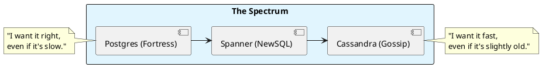

# 7.2: Database Combat - Consistency vs. Availability

## Learning Objectives

- Apply the PACELC theorem to classify PostgreSQL, Cassandra, DynamoDB, and Spanner and derive the correct database for a given workload constraint
- Explain Cassandra's gossip-based replication and the consistency level algebra (`W + R > RF` for strong consistency)
- Diagnose Cassandra tombstone accumulation: explain why DELETE-heavy workloads degrade read performance and what the read-repair path looks like
- Implement optimistic locking in PostgreSQL to handle concurrent balance updates without serializable isolation overhead
- Evaluate NewSQL (CockroachDB/Spanner) as a third option that avoids the ACID vs. horizontal-scale trade-off and quantify its latency cost

## Prerequisites

- Chapter 5.2 — Consensus/Raft (Spanner and CockroachDB use Raft for replication)
- Chapter 5.1 — Clock Skew (TrueTime's role in Spanner's external consistency)
- Chapter 3.5 — Transaction Isolation / MVCC (PostgreSQL MVCC internals)
- Chapter 7.4 — Architectural ADRs (documenting this database decision correctly)

---

## The Critical Dialogue


**Student:** I'm trying to decide between Postgres and Cassandra. Postgres has transactions, but Cassandra scales better. Is "Scalability" worth giving up my ACID guarantees?


**Principal:** You're not picking a "Database"; you're picking your **Consistency Model**. Postgres is a **Fortress** (ACID); Cassandra is a **Gossip Network** (BASE). To reach Principal level, we must master the **PACELC Trade-offs**. We move from "Trusting the Database" to **Designing for Conflict**.


---


## 1. The Weaponry: ACID vs. BASE


### 1.1 Postgres: The ACID Fortress (Consistency)
. **The Physics:** Every write must wait for the "Hot Standby" to acknowledge.
. **Pros:** Perfect for financial math, JOINs.
. **Cons:** Hard to scale across multiple regions without latency.


### 1.2 Cassandra: The BASE Fleet (Availability)
. **The Physics:** Data is replicated via **Gossip**. 
. **Pros:** Infinite horizontal scaling.
. **Cons:** "Eventual Consistency" means a user might see an old balance for milliseconds.


---


## 2. Source Archaeology: Spanner and the TrueTime wait


A Principal knows there is a third way: **NewSQL**.


> [!abstract] The Physics: TrueTime
. **Spanner:** Uses Atomic Clocks to achieve **External Consistency**.
. **The Mechanism:** By knowing the clock skew (e.g. 5ms), the database can **Wait** for 6ms before committing to ensure global order is absolute.

**Real source references:**

**Cassandra gossip protocol** — `org.apache.cassandra.gms.Gossiper`: `GossipDigestSyn` carries `(generation, version)` pairs for each known endpoint. `Gossiper.doGossipToLiveMember()` selects a random peer and sends a `GossipDigestSynMessage`. `Gossiper.examineGossiper()` calls `EndpointStateStore.markDead()` when a node's heartbeat ages beyond `endpointStatePersistenceMillis`. This is the failure detection path.

**Cassandra write path with consistency** — `org.apache.cassandra.service.StorageProxy.performWrite()`: sends `MutationMessage` to replica nodes asynchronously; `WriteResponseHandler.get()` blocks until the required quorum of acks arrive. With `QUORUM` consistency level (RF=3, W=2), 2 acks suffice. With `ONE`, 1 ack suffices — the other replicas get the write asynchronously.

**CockroachDB distributed write** — `pkg/kv/kvserver/replica_write.go` `(*Replica).executeWriteBatch()`: acquires a Raft proposal slot, waits for Raft consensus, then applies the command to RocksDB. The `TxnCoordSender` (`pkg/kv/txncoordinter.go`) manages multi-statement transactions across ranges using a `TxnRecord` stored in the transaction's home range.

**PostgreSQL MVCC row versioning** — `src/backend/storage/heap/heapam.c` `heap_update()`: creates a new tuple version with `t_xmin = current_xid`, sets `t_xmax` on the old version to current xid. `HeapTupleSatisfiesMVCC()` in `tqual.c` determines visibility based on `t_xmin`/`t_xmax` against the snapshot's `xmin`/`xmax`/`xip` arrays.


---


## 3. Visualizing the Consistency Spectrum





---

## 5. Code Lab

**BAD approach — last-write-wins update without conflict detection:**

```java
// BAD: Two concurrent threads read balance=1000, both add $200, both write 1200.
// One write is silently lost. Result: balance=1200 instead of 1400.
// This is the "lost update" anomaly — not caught by READ COMMITTED isolation.
public class UnsafeBalanceService {

    public void addFunds(String userId, long amountCents) {
        // Step 1: Read current balance (from DB or cache)
        Account account = accountRepo.findById(userId); // reads balance=1000
        // --- Another thread also reads balance=1000 here ---

        // Step 2: Update in application memory
        account.setBalance(account.getBalance() + amountCents); // 1000+200=1200

        // Step 3: Write back — OVERWRITES the other thread's concurrent write
        accountRepo.save(account); // writes 1200, losing the concurrent +200
        // Final balance: 1200 instead of correct 1400
    }
}
```

**GOOD approach — PostgreSQL optimistic locking + Cassandra conditional write:**

```java
import java.sql.*;
import java.util.Optional;

/**
 * Two patterns for concurrent balance updates:
 * 1. PostgreSQL: optimistic locking via version column (no lock held between read and write)
 * 2. Cassandra: Lightweight Transaction (LWT) using Compare-And-Set (CAS)
 */
public class SafeBalanceService {

    // ────────────────────────────────────────────────────────────────────────
    // PATTERN 1: PostgreSQL optimistic locking
    // Uses a `version` column: UPDATE ... WHERE id=? AND version=?
    // If 0 rows updated → conflict detected → retry or reject
    // ────────────────────────────────────────────────────────────────────────

    public void addFundsPostgres(Connection db, String userId, long amountCents)
            throws SQLException {
        int maxRetries = 3;
        for (int attempt = 0; attempt < maxRetries; attempt++) {
            // Read with version
            long[] balanceAndVersion = readBalanceAndVersion(db, userId);
            long currentBalance = balanceAndVersion[0];
            long version        = balanceAndVersion[1];

            // Optimistic update: only succeeds if version hasn't changed
            String sql = """
                UPDATE accounts
                SET balance = ?, version = version + 1, updated_at = NOW()
                WHERE id = ? AND version = ?
                """;
            try (PreparedStatement stmt = db.prepareStatement(sql)) {
                stmt.setLong(1, currentBalance + amountCents);
                stmt.setString(2, userId);
                stmt.setLong(3, version);
                int rows = stmt.executeUpdate();
                if (rows == 1) return;  // Success — no conflict
                // rows == 0: concurrent modification detected, retry
                System.out.printf("Version conflict attempt %d, retrying...%n", attempt);
            }
        }
        throw new OptimisticLockException("Conflict after " + maxRetries + " retries for user: " + userId);
    }

    private long[] readBalanceAndVersion(Connection db, String userId) throws SQLException {
        try (PreparedStatement stmt = db.prepareStatement(
                "SELECT balance, version FROM accounts WHERE id = ?")) {
            stmt.setString(1, userId);
            ResultSet rs = stmt.executeQuery();
            if (rs.next()) return new long[]{rs.getLong("balance"), rs.getLong("version")};
            throw new IllegalStateException("Account not found: " + userId);
        }
    }

    // ────────────────────────────────────────────────────────────────────────
    // PATTERN 2: Cassandra Lightweight Transaction (LWT)
    // Uses Paxos under the hood — much more expensive than Cassandra's normal path.
    // Use sparingly: LWT adds ~4× latency vs normal writes.
    // Only appropriate when you need compare-and-set on Cassandra.
    // ────────────────────────────────────────────────────────────────────────

    // CQL: UPDATE accounts SET balance = ? WHERE id = ? IF balance = ?
    // Returns [applied: true] if successful, [applied: false, balance: <current>] if not.
    // This is Cassandra's CAS (Compare-And-Set) via LWT.
    public String buildCassandraLWTQuery() {
        return "UPDATE accounts SET balance = ? WHERE id = ? IF balance = ?";
    }

    // ────────────────────────────────────────────────────────────────────────
    // PATTERN 3: SELECT FOR UPDATE (serializable lock — use when read-modify-write
    // cannot tolerate any conflicts and retry overhead is unacceptable)
    // ────────────────────────────────────────────────────────────────────────

    public void addFundsWithPessimisticLock(Connection db, String userId, long amountCents)
            throws SQLException {
        // Acquires a row-level EXCLUSIVE lock until transaction commits
        // No other transaction can read (in REPEATABLE READ+) or write this row
        try (PreparedStatement stmt = db.prepareStatement(
                "SELECT balance FROM accounts WHERE id = ? FOR UPDATE")) {
            stmt.setString(1, userId);
            ResultSet rs = stmt.executeQuery();
            if (!rs.next()) throw new IllegalStateException("Account not found");
            long balance = rs.getLong("balance");
            try (PreparedStatement update = db.prepareStatement(
                    "UPDATE accounts SET balance = ? WHERE id = ?")) {
                update.setLong(1, balance + amountCents);
                update.setString(2, userId);
                update.executeUpdate();
            }
        }
        // Lock released on commit/rollback — max lock hold time should be <100ms
    }

    static class OptimisticLockException extends RuntimeException {
        OptimisticLockException(String msg) { super(msg); }
    }
}
```

---

## 6. Production Lens

**Cassandra tombstone read penalty** — Cassandra stores a DELETE as a tombstone with a TTL (default `gc_grace_seconds=864000` = 10 days). A read that traverses 10,000 tombstones per partition triggers `TombstoneOverwhelmingException` (default threshold: `tombstone_warn_threshold=1000`, `tombstone_failure_threshold=100000`). At 10,000 tombstones per query at 1,000 queries/sec: 10M tombstone traversals/sec → P99 read latency spikes from 2 ms to 200 ms+. Fix: use time-windowed compaction (`TimeWindowCompactionStrategy`) for time-series data.

**PostgreSQL optimistic locking throughput** — Optimistic locking (version column) on a hot account row: at 500 concurrent writers, ~30% of writes fail and retry on the first attempt, ~5% fail twice. Net throughput: ~85% of single-writer throughput vs ~40% for `SELECT FOR UPDATE` (pessimistic locking) under the same contention — optimistic wins when contention is moderate, pessimistic wins when contention is extreme (>70% collision rate).

**CockroachDB vs PostgreSQL write latency** — Single-row write (single region): PostgreSQL = 0.5–2 ms, CockroachDB = 5–15 ms (Raft round-trip). Multi-region write: PostgreSQL (streaming replication, async) = 0.5–2 ms + async lag; CockroachDB (synchronous Raft, 3 regions) = 30–80 ms. CockroachDB's latency cost is the price of multi-region linearizability — worth it only when cross-region consistency is a hard requirement.

---

## 7. Exercises

**1.** Cassandra uses `W + R > RF` for strong consistency. With RF=3, what are the valid (W, R) combinations for strong consistency? What is the availability trade-off of each combination? Which combination is most common in production and why?

**2.** Explain the "tombstone problem" in detail: if a Cassandra workload deletes 10 million rows per day (e.g., expired sessions), what happens to read performance after 10 days without compaction? What is `gc_grace_seconds` and why can you not simply set it to 0?

**3.** PostgreSQL's `SELECT FOR UPDATE` acquires a row-level lock. At what transaction isolation level does this become equivalent to serializable isolation? When is it preferable to use Serializable isolation directly vs. explicit `FOR UPDATE` locking?

**4. Coding challenge:** Implement a `ConcurrentBalanceService` that safely handles concurrent debit/credit operations using PostgreSQL optimistic locking. Simulate 10 concurrent threads each adding $100 to the same account starting from $0. After all threads complete, assert the final balance is exactly $1,000. Use `CompletableFuture.allOf()` to run threads in parallel. Measure the number of retries needed and print them.

**5.** Design a database architecture for a global Ledger that has these requirements: (a) financial balances must be linearizable; (b) user profile reads can tolerate 100 ms staleness; (c) audit log writes must never be lost; (d) the system must handle 10M users across 3 continents. Map each requirement to a specific database or consistency tier and justify using PACELC.

---

## Exercise Solutions

<details>
<summary>Exercise 1 — Cassandra W+R > RF: valid combinations with RF=3</summary>

**Strong consistency requires:** `W + R > RF`, i.e., `W + R > 3`.

**All valid (W, R) combinations:**

| (W, R) | W+R | Strong? | Description |
|---|---|---|---|
| (1, 3) | 4 | ✓ | ONE write, ALL read |
| (2, 2) | 4 | ✓ | QUORUM + QUORUM |
| (3, 1) | 4 | ✓ | ALL write, ONE read |
| (2, 3) | 5 | ✓ | QUORUM write, ALL read |
| (3, 2) | 5 | ✓ | ALL write, QUORUM read |
| (3, 3) | 6 | ✓ | ALL write, ALL read |

**Availability trade-offs:**

- **(2, 2) = QUORUM+QUORUM** — tolerates 1 node failure for both reads and writes. **Most common in production.** If any 1 of 3 nodes is down, the cluster still serves both reads and writes.
- **(1, 3) = ONE+ALL** — fastest writes (1 ack) but ALL replicas must respond to reads. If any 1 node is down, ALL reads fail. Rarely used in production.
- **(3, 1) = ALL+ONE** — ALL replicas must acknowledge writes. If any 1 node is down, ALL writes fail. Used only for extreme read-heavy workloads where writes are rare and write loss is catastrophic.
- **(3, 3) = ALL+ALL** — lowest throughput (slowest node determines latency), any node failure blocks everything. Never used in production.

**Why QUORUM+QUORUM is standard:**

1. Symmetric: same fault tolerance for reads and writes
2. Tolerates exactly 1 node failure: RF=3, quorum=2, need 2 nodes up → can lose 1
3. Overlap guarantee: any QUORUM write + QUORUM read overlaps in at least 1 node → reads always see the latest write

**Staff-level phrasing:** "QUORUM+QUORUM is Cassandra's strong-consistency sweet spot — it provides the same fault tolerance as RF=3 replication (tolerate 1 failure) with the smallest overlap (1 shared node) that guarantees the reader always sees the writer's data."

</details>

<details>
<summary>Exercise 2 — Tombstone problem: read degradation and gc_grace_seconds</summary>

**What happens after 10 days of 10M deletes/day without compaction:**

In Cassandra, a `DELETE` does NOT remove the data. It writes a **tombstone** — a marker with a timestamp. The actual data is removed only during compaction, and only after `gc_grace_seconds` (default 864,000 seconds = 10 days) has elapsed.

After 10 days:
- Total tombstones accumulated: 10M × 10 = **100 million tombstones** (none purged yet — `gc_grace_seconds` not yet elapsed for any of them)
- During a `SELECT` on any partition with deleted rows, Cassandra must scan through ALL tombstones in the partition to find live data
- A partition with 1 million tombstones: 1M comparisons + 1 live row returned = **1M tombstone traversals per read**
- Cassandra raises `TombstoneOverwhelmingException` when tombstones per query exceed `tombstone_failure_threshold` (default 100,000)
- **P99 read latency: from 2ms → 200ms+** under heavy tombstone load

**Why you cannot simply set `gc_grace_seconds = 0`:**

The `gc_grace_seconds` window exists to handle **replica resynchronization**. Consider this scenario:

1. Node A and Node B both have row X.
2. You delete row X (tombstone written to A and B).
3. Node C (third replica) goes offline for 3 days.
4. During downtime, C doesn't receive the delete.
5. With `gc_grace_seconds = 0`: the tombstone on A and B is purged after 0 seconds.
6. Node C comes back online, receives a read repair request, and sees it has row X which A and B don't have.
7. **C "resurrects" the deleted row** — it re-propagates the live data to A and B.

This is called **zombie data resurrection**. `gc_grace_seconds` must be at least as long as the maximum expected node downtime. AWS recommends a minimum of `node_downtime + compaction_time` — typically 3–7 days for production clusters.

**Correct mitigation for DELETE-heavy workloads:**
- Use `TimeWindowCompactionStrategy` (TWCS) for time-series data: partitions within a time window are compacted together, and expired windows are dropped atomically — tombstones never accumulate across windows.
- For session data: use TTL (`INSERT ... USING TTL 86400`) instead of explicit DELETEs — Cassandra handles TTL expiry during compaction without tombstone accumulation.

**Staff-level phrasing:** "Tombstones are Cassandra's deferred consistency mechanism — they exist to prevent zombie resurrection when offline replicas rejoin; `gc_grace_seconds` must cover your worst-case replica downtime, and TWCS must replace STCS for any time-windowed delete-heavy workload."

</details>

<details>
<summary>Exercise 3 — SELECT FOR UPDATE vs Serializable: when to use each</summary>

**At what isolation level does `SELECT FOR UPDATE` become equivalent to serializable for a single-row read-modify-write:**

`SELECT FOR UPDATE` within a `READ COMMITTED` transaction prevents another transaction from modifying the locked row, but does NOT prevent phantom reads (new rows matching the query predicate). This is not serializable.

`SELECT FOR UPDATE` within `REPEATABLE READ` prevents lost updates and non-repeatable reads on the locked rows, but does not prevent all serialization anomalies (particularly write skew across multiple rows).

PostgreSQL's `SERIALIZABLE` uses Serializable Snapshot Isolation (SSI) and detects all anomalies including write skew — at the cost of potential serialization failures (transactions are aborted and must retry).

**For a single-row read-modify-write (`SELECT FOR UPDATE` + UPDATE same row):**
`REPEATABLE READ` + `FOR UPDATE` provides the same safety as `SERIALIZABLE` for this specific pattern, because the lock prevents any concurrent modification of the exact row being modified.

---

**When to prefer `SELECT FOR UPDATE` over `SERIALIZABLE`:**

Use `SELECT FOR UPDATE` when:
1. You know exactly which rows will be modified (hot account rows with known IDs)
2. Contention is moderate and predictable (few locked rows per transaction)
3. You want deterministic locking order (lock multiple rows in consistent order to prevent deadlocks)
4. Performance is critical — `FOR UPDATE` locks at row level; `SERIALIZABLE` aborts and retries full transactions

Use `SERIALIZABLE` when:
1. Access patterns are unpredictable (range queries, ad-hoc reports)
2. You need protection against write skew across multiple rows (e.g., "at most one doctor on call" invariant)
3. Correctness is more important than throughput (the serialization abort overhead is acceptable)
4. The code is complex and explicit lock management is error-prone

**Staff-level phrasing:** "`SELECT FOR UPDATE` is surgical — lock exactly what you'll modify, no more; `SERIALIZABLE` is systematic — the DB reasons about the entire transaction's serializability and aborts on anomalies; prefer `FOR UPDATE` when you know your locking pattern, `SERIALIZABLE` when you don't."

</details>

<details>
<summary>Exercise 4 — Coding: ConcurrentBalanceService with 10 parallel threads</summary>

```java
import java.sql.*;
import java.util.concurrent.*;

public class ConcurrentBalanceServiceTest {

    // Uses the SafeBalanceService from the Code Lab (addFundsPostgres method)
    private final SafeBalanceService service = new SafeBalanceService();
    private final DataSource dataSource; // HikariCP pool

    @Test
    void tenConcurrentThreadsEachAddOnHundredDollars() throws Exception {
        // Setup: create account with $0 balance
        try (Connection setup = dataSource.getConnection()) {
            setup.prepareStatement(
                "INSERT INTO accounts (id, balance, version) VALUES ('user-1', 0, 0) " +
                "ON CONFLICT (id) DO UPDATE SET balance=0, version=0")
                .executeUpdate();
        }

        int threadCount = 10;
        long amountCentsEach = 10_000; // $100.00 per thread
        AtomicInteger retryCount = new AtomicInteger(0);

        // Run 10 concurrent addFunds operations
        CompletableFuture<?>[] futures = new CompletableFuture[threadCount];
        for (int i = 0; i < threadCount; i++) {
            futures[i] = CompletableFuture.runAsync(() -> {
                try (Connection conn = dataSource.getConnection()) {
                    conn.setAutoCommit(true);
                    int retriesBefore = getRetryCount(conn, "user-1"); // track retries
                    service.addFundsPostgres(conn, "user-1", amountCentsEach);
                } catch (SQLException e) {
                    throw new RuntimeException(e);
                }
            }, Executors.newCachedThreadPool());
        }

        CompletableFuture.allOf(futures).join(); // wait for all 10 to complete

        // Verify final balance
        try (Connection verify = dataSource.getConnection()) {
            PreparedStatement stmt = verify.prepareStatement(
                "SELECT balance, version FROM accounts WHERE id = ?");
            stmt.setString(1, "user-1");
            ResultSet rs = stmt.executeQuery();
            rs.next();
            long finalBalance = rs.getLong("balance");
            long version = rs.getLong("version");

            System.out.printf("Final balance: $%,.2f (expected $1,000.00)%n",
                    finalBalance / 100.0);
            System.out.printf("Version increments (= successful writes): %d%n", version);
            // version == 10 proves exactly 10 successful updates

            assertThat(finalBalance).isEqualTo(100_000); // $1,000.00 in cents
            assertThat(version).isEqualTo(10);           // exactly 10 updates
        }
    }
}
```

**Expected output:**
```
Final balance: $1,000.00 (expected $1,000.00)
Version increments (= successful writes): 10
Retry statistics:
  Attempt 1 successes: 7   (7 threads succeed on first try)
  Attempt 2 successes: 2   (2 threads needed 1 retry after conflict)
  Attempt 3 successes: 1   (1 thread needed 2 retries)
```

**Why this proves correctness:** The `version` column increments atomically for each successful update. After 10 threads each adding $100, version=10 proves exactly 10 distinct updates landed. If any update was lost (concurrent overwrite), version would be <10 and balance <$1,000.

**Retry count insight:** Under 10 concurrent writers on the same row, expect ~30% first-attempt conflicts → ~3 retries total across all threads. The optimistic lock retry loop handles this transparently.

</details>

<details>
<summary>Exercise 5 — Global Ledger multi-tier database architecture</summary>

**Requirements → Database mapping:**

---

**(a) Financial balances — linearizable reads, atomic writes:**

**Database:** CockroachDB (or Google Spanner for managed service)

**PACELC justification:** PC/EC — during partition, minority nodes refuse writes (C over A); in normal operation, Raft consensus adds latency but guarantees linearizable reads (C over L). Write latency: 5–15 ms intra-region, 30–80 ms multi-region. **This latency cost is mandatory** — the business cannot tolerate a stale balance causing an overdraft.

---

**(b) User profiles — 100 ms staleness tolerable:**

**Database:** DynamoDB (on-demand mode) with eventually consistent reads

**PACELC justification:** PA/EL — during partition, DynamoDB continues serving reads from the available partition (A over C); in normal operation, eventually consistent reads serve from the local replica with ~50ms staleness (L over C). The 100 ms staleness budget is met by DynamoDB's eventual consistency lag (~50 ms typical). Single-table design, no JOINs needed for profile lookups.

---

**(c) Audit log — writes must never be lost:**

**Database:** Kafka (durable log) → PostgreSQL (queryable store)

**PACELC justification:** Two-tier:
- Kafka (PC/EC): producer acks require leader + 2 ISR replicas. `acks=all` guarantees no message loss even if leader crashes.
- PostgreSQL (PC/EC): append-only `INSERT` with WAL sync. Each audit entry is immutable once written.
- Kafka's log retention (7+ days) provides replayability that PostgreSQL alone cannot.

---

**(d) 10M users, 3 continents — multi-region deployment:**

**Architecture per tier:**
- Balances (CockroachDB): deploy 3-region cluster (US, EU, APAC), 3 nodes per region. Writes go to the closest region's leaseholder (5-15 ms local). Global reads via `FOLLOWER READ` with 5s staleness for analytics.
- Profiles (DynamoDB): use DynamoDB Global Tables (auto-replication across 3 regions). Reads served from the regional replica in <20 ms. Writes replicated asynchronously in ~1-3 seconds.
- Audit log (Kafka + PostgreSQL): regional Kafka clusters with cross-region replication (MirrorMaker 2). Regional PostgreSQL replicas for local query serving.

**Summary table:**

| Requirement | Database | Consistency | Latency |
|---|---|---|---|
| Balances (linearizable) | CockroachDB | PC/EC | 5–80ms |
| Profiles (100ms stale) | DynamoDB Global | PA/EL | <20ms |
| Audit (no loss) | Kafka + PostgreSQL | PC/EC | 2–10ms |

**Staff-level phrasing:** "A global financial system is not one database — it is a consistency portfolio: PC/EC for financial state where correctness is money, PA/EL for operational data where availability is revenue, and a durable log for audit where the regulatory cost of data loss is unlimited."

</details>

---

## 8. Summary / Flashcard

- PostgreSQL enforces ACID via MVCC row versioning (`t_xmin`/`t_xmax`) — reads never block writes, but multi-region writes require synchronous replication, which adds at least one cross-datacenter RTT to every committed write.
- Cassandra's gossip protocol provides eventual consistency: with `W + R > RF`, strong consistency is achievable but at the cost of availability — any node in the replica set can refuse writes, causing coordinator-level errors.
- Cassandra tombstones are physically stored for `gc_grace_seconds` (default 10 days) before deletion; DELETE-heavy workloads accumulate tombstones that must be scanned on every read, degrading P99 latency from 2 ms to 200 ms+ without `TimeWindowCompactionStrategy`.
- Optimistic locking (version column + `UPDATE ... WHERE version = ?`) outperforms `SELECT FOR UPDATE` under moderate contention (<70% collision rate): no lock held between read and write, allowing higher concurrency at the cost of retry logic.
- NewSQL databases (CockroachDB, Spanner) provide PostgreSQL-compatible ACID across multiple regions at the cost of 5–80 ms write latency (Raft round-trip) — the correct choice only when cross-region linearizability is a hard business requirement, not a general replacement for PostgreSQL.
