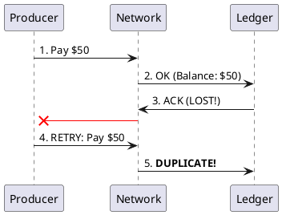

# 7.3: Idempotency and Conflict Physics

## Learning Objectives

- Implement a database-backed idempotency key store using `INSERT ... ON CONFLICT DO NOTHING` and explain why an in-memory `Set` is an anti-pattern
- Explain why "exactly-once delivery" is physically impossible in distributed systems and derive "at-least-once + idempotent receiver" as the only viable model
- Apply CRDT concepts (G-Counter, PN-Counter, LWW-Register) to merge concurrent state updates without coordination
- Identify the "ABA problem" in idempotency: when reusing an idempotency key after TTL expiry can cause incorrect state transitions
- Design the full idempotency key lifecycle: generation, storage, TTL expiry, and the response caching strategy for duplicate requests

## Prerequisites

- Chapter 5.3 — Distributed Sagas (compensations must also be idempotent)
- Chapter 7.1 — Messaging Battlefield (Kafka at-least-once delivery requires idempotent consumers)
- Chapter 3.3 — ORM Physics (database-level deduplication using unique constraints)
- Chapter 3.5 — Transaction Isolation (understanding why `ON CONFLICT DO NOTHING` is atomic)

---

## The Critical Dialogue


**Student:** Our Ledger is receiving duplicate orders. The client says they clicked "Pay" once, but our Kafka stream has three identical messages. I tried to fix it with a `Set` in RAM, but when the pod restarts, the set is wiped. Is there a "Permanent" way to stop duplicates?


**Principal:** You are fighting the **Retransmission Storm**. In a distributed system, "At-Least-Once" is the only physical guarantee. If you don't build your Ledger to be **Idempotent**, the network will steal your money through retries. To reach Principal level, we must move from "Blocking Duplicates" to **Deterministic Conflict Resolution**.


---


## 1. The Requirement: Deterministic Processing


**The Problem:** The "Exactly-Once" myth. Because network acknowledgments can be lost, a producer will retry, sending the same transaction multiple times.


### 1.1 The Double-Spend Physics
. **Producer:** Sends "User A -> User B: $50".
. **Network:** Ack lost.
. **Producer:** Retries. Sends the same message.
. **The Result:** User A loses $100 if the receiver isn't smart.





---


## 2. Solution: CRDTs and Idempotent Sinks


**The Principal Architecture:** Instead of checking for duplicates, use data structures where the **Order of Merge** doesn't matter.


. **Mechanism:** Use a **Deduplication Table** in your database.
. **Implementation:** 
```java
// Principal Level: High-Throughput Idempotency
public void process(Order order) {
    // 1. Atomic Check-and-Insert
    String sql = "INSERT INTO processed_tx (id) VALUES (?) ON CONFLICT DO NOTHING";
    int rows = db.update(sql, order.txId());

    if (rows == 0) {
        // 2. Conflict Detect: Already processed!
        return;
    }
    // 3. OK: Execute logic
}
```


---

## 4. Source Archaeology

Real idempotency and CRDT implementations in production systems:

**Stripe idempotency keys** — Stripe's API uses an `Idempotency-Key` HTTP header. Their 2018 engineering blog describes the implementation: keys are stored in a `idempotency_keys` Postgres table with `(key, user_id, created_at, request_params_hash, response_body)`. On duplicate request: compare `request_params_hash` to detect changed parameters (return 400 if params differ), return cached `response_body` if identical. TTL: 24 hours. Keys are deduplicated at the API gateway layer before reaching application logic.

**Kafka Idempotent Producer** — `org.apache.kafka.clients.producer.internals.TransactionManager`: maintains a `ProducerIdAndEpoch` (PID + epoch) assigned by the broker's `TransactionCoordinator`. Each batch has a monotonically increasing `baseSequence`. The broker (`kafka/core/.../Log.scala`) stores the last 5 sequences per PID per partition; duplicates (same PID + sequence) are silently dropped. This is the mechanism behind `enable.idempotence=true`.

**Akka Persistence (Event Sourcing deduplication)** — `akka.persistence.journal.leveldb.LeveldbRecovery`: each event has a `sequenceNr` (long). On actor restart, `replay()` re-applies events from the last snapshot forward, using `sequenceNr` as the idempotency key for event application. Actors that receive duplicate commands check `lastSequenceNr` before persisting a new event.

**Redis SETNX for distributed idempotency** — `io.lettuce.core.api.sync.RedisStringCommands.setIfAbsent(K key, V value, Duration ttl)` maps to Redis `SET key value NX EX ttl`. Returns `true` if set (first request), `false` if key already exists (duplicate). Used by many API gateways as a fast distributed lock with automatic TTL expiry for idempotency key storage.

---

## 5. Code Lab

**BAD approach — in-memory Set for deduplication (lost on restart):**

```java
import java.util.Set;
import java.util.concurrent.ConcurrentHashMap;

// BAD: In-memory deduplication — cleared on every pod restart
// In a Kubernetes environment, pods restart frequently (deployments, OOM kills, node drains)
// After restart: all processed transaction IDs are forgotten
// Any in-flight retries from producers will be processed AGAIN → double-charges
public class MemoryIdempotencyFilter {

    // Lost on restart. Lost on scale-out (other pods have their own Set).
    // Race condition: two pods can both pass the `contains()` check simultaneously.
    private final Set<String> processedIds = ConcurrentHashMap.newKeySet();

    public void processOrder(Order order) {
        // WRONG: Not durable, not distributed
        if (processedIds.contains(order.txId())) {
            return;  // This never fires after a restart
        }
        processedIds.add(order.txId());  // Race condition: add is not atomic with contains()
        executePayment(order);
    }

    private void executePayment(Order order) { /* ... */ }
    record Order(String txId, long amountCents) {}
}
```

**GOOD approach — database-backed idempotency with response caching:**

```java
import java.sql.*;
import java.time.Duration;
import java.time.Instant;
import java.util.Optional;

/**
 * Production-grade idempotency key store.
 *
 * Key design decisions (modeled after Stripe's implementation):
 * 1. INSERT ... ON CONFLICT is atomic at the DB level — no application-level race
 * 2. Response is cached: duplicate requests get the same response as the original
 * 3. Parameter hash is checked: different parameters with same key → 409 Conflict
 * 4. TTL: keys expire after 24h to prevent unbounded table growth
 * 5. Cleanup: a scheduled job removes expired rows (not the request path)
 */
public class IdempotencyKeyStore {

    private static final Duration KEY_TTL = Duration.ofHours(24);

    private final Connection db;

    public IdempotencyKeyStore(Connection db) { this.db = db; }

    public sealed interface Result permits Result.AlreadyProcessed, Result.NewRequest {
        record AlreadyProcessed(String cachedResponse) implements Result {}
        record NewRequest(String keyId) implements Result {}
    }

    /**
     * Attempt to claim an idempotency key for processing.
     *
     * Returns:
     * - NewRequest: this is the first time we've seen this key — proceed with processing
     * - AlreadyProcessed: return the cached response from the first execution
     *
     * Throws IdempotencyConflict if same key used with different parameters.
     */
    public Result claim(String idempotencyKey, String requestParamsHash) throws SQLException {
        // Atomic check-and-insert: if key exists, ON CONFLICT skips the insert
        // The RETURNING clause gives us the existing row if conflict occurred
        String insertSql = """
            INSERT INTO idempotency_keys (key, params_hash, expires_at, status)
            VALUES (?, ?, ?, 'PROCESSING')
            ON CONFLICT (key) DO NOTHING
            """;

        try (PreparedStatement stmt = db.prepareStatement(insertSql)) {
            stmt.setString(1, idempotencyKey);
            stmt.setString(2, requestParamsHash);
            stmt.setTimestamp(3, Timestamp.from(Instant.now().plus(KEY_TTL)));
            int rows = stmt.executeUpdate();

            if (rows == 1) {
                // Successfully inserted — this is a new request
                return new Result.NewRequest(idempotencyKey);
            }
        }

        // Key exists — check if it's a duplicate or a conflict
        String selectSql = """
            SELECT params_hash, status, response_body, expires_at
            FROM idempotency_keys
            WHERE key = ?
            """;
        try (PreparedStatement stmt = db.prepareStatement(selectSql)) {
            stmt.setString(1, idempotencyKey);
            ResultSet rs = stmt.executeQuery();
            if (!rs.next()) {
                // Extremely rare: key was inserted then deleted between our two queries
                // Retry the claim
                return claim(idempotencyKey, requestParamsHash);
            }

            String storedHash    = rs.getString("params_hash");
            String status        = rs.getString("status");
            String responseBody  = rs.getString("response_body");
            Timestamp expiresAt  = rs.getTimestamp("expires_at");

            // Check for ABA problem: key expired and was reused with different params
            if (expiresAt.toInstant().isBefore(Instant.now())) {
                // Key expired — treat as new request (delete and re-claim)
                deleteKey(idempotencyKey);
                return claim(idempotencyKey, requestParamsHash);
            }

            // Same key, different params → client error (Stripe returns HTTP 409)
            if (!storedHash.equals(requestParamsHash)) {
                throw new IdempotencyConflictException(
                    "Key " + idempotencyKey + " was used with different parameters");
            }

            if ("COMPLETED".equals(status) && responseBody != null) {
                return new Result.AlreadyProcessed(responseBody);
            }

            // Status is PROCESSING — original request is still in flight
            // Return 409 to tell the client to retry after the original completes
            throw new IdempotencyConflictException("Request still processing: " + idempotencyKey);
        }
    }

    /** Called after successful processing — stores the response for future duplicates. */
    public void complete(String idempotencyKey, String responseBody) throws SQLException {
        String sql = """
            UPDATE idempotency_keys
            SET status = 'COMPLETED', response_body = ?, completed_at = NOW()
            WHERE key = ?
            """;
        try (PreparedStatement stmt = db.prepareStatement(sql)) {
            stmt.setString(1, responseBody);
            stmt.setString(2, idempotencyKey);
            stmt.executeUpdate();
        }
    }

    private void deleteKey(String key) throws SQLException {
        try (PreparedStatement stmt = db.prepareStatement(
                "DELETE FROM idempotency_keys WHERE key = ?")) {
            stmt.setString(1, key);
            stmt.executeUpdate();
        }
    }

    static class IdempotencyConflictException extends RuntimeException {
        IdempotencyConflictException(String msg) { super(msg); }
    }
}

// CRDT: PN-Counter (Positive-Negative Counter) for distributed balance aggregation
// Merge is commutative and associative — order of merges doesn't matter
record PNCounter(long positive, long negative) {
    public PNCounter increment(long amount) {
        return new PNCounter(this.positive + amount, this.negative);
    }
    public PNCounter decrement(long amount) {
        return new PNCounter(this.positive, this.negative + amount);
    }
    public long value() { return positive - negative; }
    public PNCounter merge(PNCounter other) {
        // Merge: take max of each component — idempotent, commutative, associative
        return new PNCounter(
            Math.max(this.positive, other.positive),
            Math.max(this.negative, other.negative)
        );
    }
}
```

---

## 6. Production Lens

**Idempotency table throughput** — Stripe processes ~1 million API requests per day with idempotency keys. Their Postgres `idempotency_keys` table uses a unique B-tree index on `(key)` and a partial index on `(expires_at) WHERE status = 'PROCESSING'` for cleanup queries. `INSERT ... ON CONFLICT DO NOTHING` on a row with a unique index costs ~0.3 ms at 10,000 req/sec — well within the budget of a payment API with 200 ms target latency.

**Kafka exactly-once semantics overhead** — Kafka's `enable.idempotence=true` (producer-level deduplication) adds ~1.5 ms to batch latency due to the PID/sequence number handshake. Kafka Transactions (`transactional.id`) add ~10–20 ms per commit due to the two-phase commit protocol with the `TransactionCoordinator`. Confluent benchmarks (2019) show EOS reduces throughput from 2M msgs/sec to ~800K msgs/sec at the same latency target.

**Redis SETNX vs PostgreSQL for idempotency** — Redis `SET key NX EX 86400` takes ~0.1 ms per operation (in-memory, no fsync). PostgreSQL `INSERT ON CONFLICT` takes ~0.3–1 ms (WAL flush). For APIs at >50,000 req/sec, Redis is the right first-level deduplication store; PostgreSQL is the durable fallback for keys that survive Redis restarts. Stripe uses a two-level strategy: Redis for hot keys (last 1 hour), PostgreSQL for durable storage (24 hours).

---

## 7. Exercises

**1.** Explain why "exactly-once delivery" is physically impossible in a distributed system where the sender cannot distinguish between "receiver processed and ACK was lost" and "receiver never received the message." What is the minimum guarantee any distributed messaging system can provide?

**2.** The "ABA problem" in idempotency: an idempotency key expires (24h TTL), a new request reuses it with the same parameters but a different user context. Describe a concrete scenario where this causes a security vulnerability in a payment system and how the `params_hash` field mitigates it.

**3.** Describe the difference between a G-Counter (Grow-only) and a PN-Counter (Positive-Negative). Why is a PN-Counter the minimal data structure needed to represent a bank account balance in a CRDT context? What invariant is violated if you use a G-Counter for debits?

**4. Coding challenge:** Implement a `RedisIdempotencyGate` that uses a Redis `SETNX`-equivalent operation (simulate with a `ConcurrentHashMap<String, Instant>` as the Redis substitute). The gate should: (a) return `true` on first call with a given key; (b) return `false` on all subsequent calls within the TTL; (c) return `true` again after TTL expiry. Make it thread-safe. Write a JUnit 5 test that proves correctness under 10 concurrent threads all using the same key.

**5.** Kafka's `enable.idempotence=true` provides exactly-once at the broker level (no duplicate batches). But it does NOT prevent your application from processing the same record twice if your consumer commits offsets and then crashes before completing business logic. Draw the sequence diagram of this failure scenario and explain why the `IdempotencyKeyStore` above is still needed even with Kafka EOS enabled.

---

## 8. Summary / Flashcard

- Exactly-once delivery is physically impossible: the sender cannot distinguish a lost ACK from an undelivered message, so at-least-once delivery is the only achievable guarantee — idempotent receivers are the only way to make at-least-once safe.
- `INSERT ... ON CONFLICT DO NOTHING` is the correct database-level idempotency primitive: the unique constraint check and the insert are atomic — there is no race window between a `SELECT` check and an `INSERT`, unlike the application-level `contains()` + `add()` pattern.
- Response caching is as important as deduplication: a duplicate request that is processed again but returns a different response (e.g., an error) defeats the purpose — store the original response and return it verbatim for all duplicate requests within the TTL.
- The ABA problem occurs when an idempotency key expires and is reused: always include a hash of the original request parameters in the key record and reject reuse with different parameters, even after TTL expiry in security-sensitive contexts.
- CRDTs (G-Counter, PN-Counter, LWW-Register) avoid coordination by making merge commutative and associative — they are the correct choice for distributed counters, sets, and registers where eventual consistency and concurrent updates are acceptable, but cannot enforce invariants like "balance >= 0."
