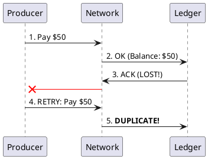

# 7.3: Idempotency and Conflict Physics


## The Critical Dialogue


**Student:** Our Ledger is receiving duplicate orders. The client says they clicked "Pay" once, but our Kafka stream has three identical messages. I tried to fix it with a `Set` in RAM, but when the pod restarts, the set is wiped. Is there a "Permanent" way to stop duplicates?


**Principal:** You are fighting the **Retransmission Storm**. In a distributed system, "At-Least-Once" is the only physical guarantee. If you don't build your Ledger to be **Idempotent**, the network will steal your money through retries. To reach Principal level, we must move from "Blocking Duplicates" to **Deterministic Conflict Resolution**.


---


## 1. The Requirement: Deterministic Processing


**The Problem:** The "Exactly-Once" myth. Because network acknowledgments can be lost, a producer will retry, sending the same transaction multiple times.


### 1.1 The Double-Spend Physics
. **Producer:** Sends "User A -> User B: $50".
. **Network:** Ack lost.
. **Producer:** Retries. Sends the same message.
. **The Result:** User A loses $100 if the receiver isn't smart.





---


## 2. Solution: CRDTs and Idempotent Sinks


**The Principal Architecture:** Instead of checking for duplicates, use data structures where the **Order of Merge** doesn't matter.


. **Mechanism:** Use a **Deduplication Table** in your database.
. **Implementation:** 
```java
// Principal Level: High-Throughput Idempotency
public void process(Order order) {
    // 1. Atomic Check-and-Insert
    String sql = "INSERT INTO processed_tx (id) VALUES (?) ON CONFLICT DO NOTHING";
    int rows = db.update(sql, order.txId());

    if (rows == 0) {
        // 2. Conflict Detect: Already processed!
        return;
    }
    // 3. OK: Execute logic
}
```


---


## 🧠 Principal's Inquiry


. **CRDTs:** What is the difference between a **G-Counter** (Grow-only) and a **PN-Counter** (Positive-Negative)?


. **LWW (Last Write Wins):** Why is LWW considered "Destructive"?


**Principal Summary:** Conflict Physics is about **Mathematical Determinism**. We stop hoping for a perfect network and start designing data structures that can survive the chaos of "At-Least-Once" delivery.
 Greenlanders use the type system to prove our software invariants.
