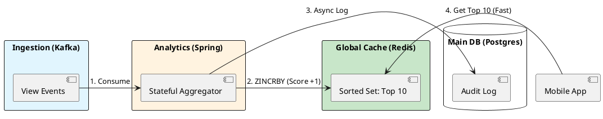

# 8.1: Advanced Caching - Redis Internals and Physics


## The Critical Dialogue


**Student:** We built the "Top 10 Trending" engine using a Postgres `GROUP BY` query. It works, but when 1M users refresh their home screen, the database CPU hits 100 percent and the app freezes. We added a standard Cache, but now users see different Top 10 lists depending on which pod they hit. How do we build a global, consistent leaderboard?


**Principal:** You are hitting the **Database Satiation Point**. A relational database is for **Deep Relationships**; a cache is for **Real-time Access**. To build a Netflix-scale Top 10, we must move to a **Distributed Global Cache (Redis)** and understand the physics of its **Single-threaded Event Loop**. We are moving from "Disk-bound Querying" to **Memory-bound Real-time Streams**.


---


## 1. Redis Physics: The Single-Threaded Speed


### 1.1 Why No Locks = High Speed


Most Java developers think "More threads = More speed." 
. **The Paradox:** Redis is single-threaded for data operations.
. **The Physics:** By removing locks (synchronized blocks, CAS) and context switches, Redis can perform **100,000+ operations/sec** on a single CPU core. It spends 100% of its time on data, 0% on "Managing Threads."


### 1.2 Redis Data Structures for the Top 10


A Principal uses the right tool for the job. To build a leaderboard, we use **Sorted Sets (ZSET)**.
. **Mechanism:** Redis maintains a Skip List + Hash Map. Adding a "View" is O(log N). Getting the Top 10 is O(log N + M). It is lightning fast regardless of the total number of movies.


---


## 2. Source Archaeology: The Cache Stampede (Thundering Herd)


A Principal Architect prepares for the moment the cache expires.


> [!abstract] The Physics: Cache Stampede
> . **The Event:** A high-traffic key (like the Top 10 list) expires.
> . **The Chaos:** 10,000 pods all see the "Cache Miss" at the same time and flood the Database to recalculate. This is a **Thundering Herd**.
> . **The Solution:** **Probabilistic Early Recomputation (PER)**. We recalculate the cache *before* it expires, with a randomized "Jitter" to ensure only one pod does the work.


---


## 3. Principal Implementation: The Leaderboard Engine


We will build a high-performance "Trending" service using Redis Sorted Sets.


```java
@Service
public class TrendingEngine {
    private final RedisTemplate(String, String) redis;

    public void recordView(String movieId) {
        // ZINCRBY: Increment score of movieId by 1 in the 'trending' set
        redis.opsForZSet().incrementScore("ledger:trending", movieId, 1);
    }

    public List(String) getTop10() {
        // ZREVRANGE: Get top 10 members by score (descending)
        return redis.opsForZSet().reverseRange("ledger:trending", 0, 9)
            .stream().toList();
    }
}
```


---


## 4. Visualizing the Real-time Pipeline


**What is it?**
The diagram shows how we move from an "Expensive Query" to a "Stream of Increments."


**Why is it useful?**
This removes the read-load from the database entirely. The database remains the "Source of Truth" for history, while Redis is the "Live Intelligence" of the fleet.





---


## 🧵 The GOL Challenge: Phase 11 (Caching)


**Context:** The "Top 10" list is causing a database crash every 10 minutes when the cache expires.


**The Task:**


. **Leaderboard Implementation:** Implement the `TrendingEngine` using Redis Sorted Sets. Populate it with 10,000 mock movies and 1,000,000 random views.


. **Stampede Mitigation:** Implement a "Soft Expiry" pattern. If the cache is older than 5 minutes, the *first* thread to hit it starts an async refresh while other threads continue to see the "Stale" data for another 30 seconds.


. **Physics Benchmark:** Compare the latency of `getTop10()` from Redis vs. a Postgres SQL query under 500 concurrent requests.


---


## 🧠 Principal's Inquiry


. **Eviction Policies:** If Redis runs out of memory, which eviction policy should the Ledger use? **LRU** (Least Recently Used) or **LFU** (Least Frequently Used)? Why?


. **The Single-Thread Bottleneck:** If Redis is single-threaded, how does it handle a 10Gbps network stream? (Hint: The **I/O Multiplexing** and **Epoll** mechanics).


. **Consistency:** Is the Redis Top 10 "Strongly Consistent" or "Eventually Consistent" with the Postgres Audit Log? Does it matter for this business case?


**Principal Summary:** Advanced Caching is about **Offloading the Source of Truth**. We use Redis internals to provide real-time intelligence at a scale that would melt any relational database.
