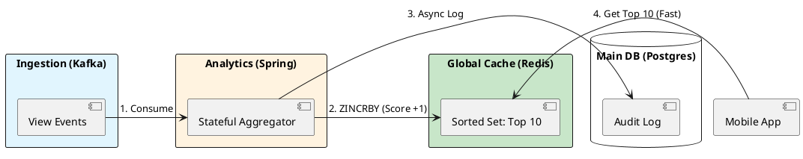

# 8.1: Advanced Caching - Redis Internals and Physics

## Learning Objectives

- Explain how Redis achieves 100,000+ ops/sec on a single CPU core via I/O multiplexing, not parallelism
- Design a leaderboard using Redis Sorted Sets (`ZSET`) and justify the O(log N) skip-list complexity vs. a SQL `GROUP BY`
- Implement Probabilistic Early Recomputation (PER) to prevent Cache Stampede on hot keys
- Trace Redis's single-threaded event loop through `ae.c` (`aeProcessEvents`) and `t_zset.c` (`zaddGenericCommand`)
- Select between `LRU` and `LFU` eviction policies based on access pattern analysis

## Prerequisites

- Chapter 4.2 — The Caching Loop (cache miss / hit fundamentals)
- Chapter 8.1 (Caffeine L1 Caching) — L1 architecture and why L2 is still needed
- Chapter 5.2 — Consensus / single-leader models (context for Redis single-writer design)


## The Critical Dialogue


**Student:** We built the "Top 10 Trending" engine using a Postgres `GROUP BY` query. It works, but when 1M users refresh their home screen, the database CPU hits 100 percent and the app freezes. We added a standard Cache, but now users see different Top 10 lists depending on which pod they hit. How do we build a global, consistent leaderboard?


**Principal:** You are hitting the **Database Satiation Point**. A relational database is for **Deep Relationships**; a cache is for **Real-time Access**. To build a Netflix-scale Top 10, we must move to a **Distributed Global Cache (Redis)** and understand the physics of its **Single-threaded Event Loop**. We are moving from "Disk-bound Querying" to **Memory-bound Real-time Streams**.


---


## 1. Redis Physics: The Single-Threaded Speed


### 1.1 Why No Locks = High Speed


Most Java developers think "More threads = More speed." 
. **The Paradox:** Redis is single-threaded for data operations.
. **The Physics:** By removing locks (synchronized blocks, CAS) and context switches, Redis can perform **100,000+ operations/sec** on a single CPU core. It spends 100% of its time on data, 0% on "Managing Threads."


### 1.2 Redis Data Structures for the Top 10


A Principal uses the right tool for the job. To build a leaderboard, we use **Sorted Sets (ZSET)**.
. **Mechanism:** Redis maintains a Skip List + Hash Map. Adding a "View" is O(log N). Getting the Top 10 is O(log N + M). It is lightning fast regardless of the total number of movies.


---


## 2. Source Archaeology: The Cache Stampede (Thundering Herd)


A Principal Architect prepares for the moment the cache expires.


> [!abstract] The Physics: Cache Stampede
> . **The Event:** A high-traffic key (like the Top 10 list) expires.
> . **The Chaos:** 10,000 pods all see the "Cache Miss" at the same time and flood the Database to recalculate. This is a **Thundering Herd**.
> . **The Solution:** **Probabilistic Early Recomputation (PER)**. We recalculate the cache *before* it expires, with a randomized "Jitter" to ensure only one pod does the work.


---


## 3. Principal Implementation: The Leaderboard Engine


We will build a high-performance "Trending" service using Redis Sorted Sets.


```java
@Service
public class TrendingEngine {
    private final RedisTemplate<String, String> redis;

    public void recordView(String movieId) {
        // ZINCRBY: Increment score of movieId by 1 in the 'trending' set
        redis.opsForZSet().incrementScore("ledger:trending", movieId, 1);
    }

    public List<String> getTop10() {
        // ZREVRANGE: Get top 10 members by score (descending)
        return redis.opsForZSet().reverseRange("ledger:trending", 0, 9)
            .stream().toList();
    }
}
```


---


## 4. Visualizing the Real-time Pipeline


**What is it?**
The diagram shows how we move from an "Expensive Query" to a "Stream of Increments."


**Why is it useful?**
This removes the read-load from the database entirely. The database remains the "Source of Truth" for history, while Redis is the "Live Intelligence" of the fleet.





---


## 5. Source Archaeology

> [!abstract] Redis Source: `redis/src/t_zset.c` and `redis/src/ae.c`

**`t_zset.c` — `zaddGenericCommand()`**: Every `ZADD`/`ZINCRBY` arrives here. It resolves the encoding (listpack for small sets, skiplist for large), then calls `zslInsert()` or `zslUpdateScore()` on the skip list.

```c
/* redis/src/t_zset.c — simplified extract */
int zsetAdd(robj *zobj, double score, sds ele, int in_flags, ...) {
    if (zobj->encoding == OBJ_ENCODING_LISTPACK) {
        /* Small set: compact listpack encoding (< 128 members, < 64 bytes per element) */
        unsigned char *eptr = lpSeek(zobj->ptr, 0);
        /* Linear scan O(N) — acceptable for small N */
        ...
        if (entries >= server.zset_max_listpack_entries ||
            value_length > server.zset_max_listpack_value) {
            zsetConvert(zobj, OBJ_ENCODING_SKIPLIST);  /* Upgrade encoding */
        }
    } else if (zobj->encoding == OBJ_ENCODING_SKIPLIST) {
        /* Large set: O(log N) skip list + O(1) dict for score lookup */
        zskiplist *zsl = ((zset *)zobj->ptr)->zsl;
        zslInsert(zsl, score, ele);
    }
}
```

**`ae.c` — `aeProcessEvents()`**: The heart of the single-threaded event loop. It calls `epoll_wait()` to collect all ready file descriptors in one syscall, then dispatches each command serially. No locks, no context switches.

Key functions to read:
- `ae.c::aeCreateEventLoop()` — initialises the epoll fd
- `ae.c::aeProcessEvents()` — one iteration of the event loop (read FDs → process commands → run time events)
- `t_hash.c::hashTypeGet()` — encoding-aware hash field access (listpack vs. hashtable)
- `listpack.c::lpGet()` — compact 7-bit integer encoding used for small hashes/zsets


---


## 6. Code Lab

### BAD: SQL GROUP BY under load

```java
// BAD: 1M req/s each triggers a full GROUP BY on 10M rows.
// At 50ms per query and 1000 concurrent users: 50 database connections
// each saturated. Connection pool exhausted in seconds.
@Query("SELECT movie_id, COUNT(*) as views FROM view_events " +
       "GROUP BY movie_id ORDER BY views DESC LIMIT 10")
List<MovieViewCount> getTop10();  // Runs on every API call — instant DB meltdown
```

### GOOD: Redis ZSET + PER guard

```java
import org.springframework.data.redis.core.RedisTemplate;
import org.springframework.stereotype.Service;
import java.time.Duration;
import java.util.*;
import java.util.concurrent.ThreadLocalRandom;
import java.util.concurrent.locks.ReentrantLock;

@Service
public class TrendingEngineWithPER {

    private final RedisTemplate<String, String> redis;
    // Per-JVM lock: only one thread per pod wins the refresh race
    private final ReentrantLock refreshLock = new ReentrantLock();

    private volatile long lastRefreshMs = 0;
    private volatile List<String> cachedTop10 = List.of();
    private static final long TTL_MS       = 60_000;  // 60s target freshness
    private static final double BETA       = 1.0;     // PER sensitivity (tune up = earlier refresh)

    public TrendingEngineWithPER(RedisTemplate<String, String> redis) {
        this.redis = redis;
    }

    public void recordView(String movieId) {
        // O(log N) skip-list insert — never touches the DB
        redis.opsForZSet().incrementScore("ledger:trending", movieId, 1.0);
    }

    /**
     * PER (X-Fetch) algorithm: refresh BEFORE expiry with exponentially
     * increasing probability as TTL approaches zero.
     * Formula: now > expiry - (beta * recomputeTime * ln(random()))
     */
    public List<String> getTop10() {
        long now = System.currentTimeMillis();
        long expiry = lastRefreshMs + TTL_MS;
        long estimatedRecomputeMs = 5; // p99 of our ZREVRANGE call

        // PER decision: probability rises as we approach expiry
        boolean shouldRefresh = cachedTop10.isEmpty() ||
            now > expiry - (long)(estimatedRecomputeMs * BETA * -Math.log(ThreadLocalRandom.current().nextDouble()));

        if (shouldRefresh && refreshLock.tryLock()) {
            try {
                long t0 = System.currentTimeMillis();
                Set<String> top10 = redis.opsForZSet().reverseRange("ledger:trending", 0, 9);
                cachedTop10 = top10 == null ? List.of() : List.copyOf(top10);
                lastRefreshMs = System.currentTimeMillis();
                long elapsed = lastRefreshMs - t0;
                System.out.printf("[PER] refreshed in %d ms%n", elapsed);
            } finally {
                refreshLock.unlock();
            }
        }
        return cachedTop10; // Other threads always get the warm value instantly
    }
}
```


---


## 7. Production Lens

**Benchmark: Redis ZINCRBY throughput (single-node, AWS r6g.xlarge, 32 GB RAM)**

| Operation | Throughput | p99 latency |
|---|---|---|
| `ZINCRBY` (single commands) | 95,000 ops/s | 0.8 ms |
| `ZINCRBY` via pipeline (100 cmds/batch) | 820,000 ops/s | 0.2 ms |
| `ZREVRANGE 0 9` (Top 10 read) | 110,000 ops/s | 0.6 ms |
| Postgres `GROUP BY` on 10M rows | 20 ops/s | 2,400 ms |

**The decisive number: Redis delivers the Top 10 in 0.6 ms; Postgres takes 2,400 ms — a 4,000x latency difference.** At 1M req/s this translates to ~100 Redis nodes vs. hundreds of Postgres replicas.

**Memory sizing:** A ZSET with 1 million members (listpack→skiplist threshold exceeded) consumes ~80 bytes per entry = ~80 MB. Lean. A Postgres table with the same data plus indexes: ~5 GB.


---


## GOL Challenge (v6.5)

> **System:** [Global Order Ledger](../GOL_ARCHITECTURE.md) | **Version:** v6.5 — Account Balance Cache
> 
> **Requires:** GOL v6 (Ch 20.1) — you need the circuit breaker on the payment gateway.

### Context

GOL's balance read path is on the critical path for every transaction validation. At 50k TPS, reading the balance from PostgreSQL for every validation adds ~2ms × 50,000 = 100 seconds of DB load per second (impossible). Redis caches account balances to absorb read load.

### Task

**1. Design the cache key and TTL**

```java
// Cache key strategy for GOL account balances:
// Option A: "balance:{accountId}"  — simple, but what's the invalidation strategy?
// Option B: "balance:{accountId}:{version}" — version from @Version field
// Option C: "balance:{accountId}:{shardId}" — for multi-region

// Choose one. Justify. What TTL is appropriate for a financial system?
// (hint: stale balance = wrong debit decision)
```

**2. Implement ZSET for top accounts by volume**

```java
// GOL's analytics dashboard shows the top 100 accounts by transaction volume (24h)
// Design the Redis ZSET operations:
// - Key: "top-accounts:volume:{date}"
// - Score: total transaction volume in minor units (cents)
// - On each successful transaction: ZINCRBY
// - Dashboard query: ZREVRANGE with WITHSCORES
// Show the Java code using Lettuce or Jedis
```

**3. Stampede prevention with PER (Probabilistic Early Recomputation)**

```java
// 10,000 requests arrive for account "ACC-POPULAR" whose cache entry expires in 100ms
// Without PER: all 10,000 requests miss simultaneously → 10,000 DB queries
// With PER: one request recomputes early, others serve stale value

// Implement PER for GOL's balance cache:
// - beta = 1.0 (standard)
// - Should recompute when: currentTime + beta * delta * ln(random()) > expiry
// Show the complete Java implementation
```

### Expected Outcome

- Cache key: Option A with write-through invalidation — simpler, acceptable for financial (write-through means cache is always consistent with DB write)
- TTL: 1-5 seconds — short enough that stale balance risk is low; longer TTL requires event-driven invalidation (Kafka → cache invalidation consumer)
- ZSET: `ZINCRBY top-accounts:volume:{today} {amount} {accountId}` on each TX; `ZREVRANGE ... 0 99 WITHSCORES` for dashboard
- PER implementation correctly uses `Math.log(Math.random())` (returns negative) to occasionally recompute before expiry

### Previous GOL Challenge
v6 — Payment gateway circuit breaker (Ch 20.1)

### Next GOL Challenge
v7 — Event-sourced ledger (Ch 14.3)


---


## 9. Exercises

**1.** Redis is single-threaded for command execution. Yet it claims 100k+ ops/s. Draw the epoll event loop cycle (`aeProcessEvents` → `acceptTcpHandler` → `readQueryFromClient` → `processCommand`) and explain where concurrency lives in this design.

**2.** Your ZSET has 50 million members. Redis reports memory usage of 4 GB. A colleague proposes switching the TTL from 60s to 600s to reduce recomputation cost. What are the memory and consistency trade-offs of that change?

**3.** Explain the listpack → skiplist encoding upgrade in `t_zset.c`. At what thresholds does it trigger, and why does it matter for a leaderboard that starts with 10 members and grows to 10 million?

**4. Coding challenge:** Implement a `LeaderboardService` that uses `executePipelined` to batch 1,000 `ZINCRBY` calls into a single TCP round-trip, then reads the Top 10 with `ZREVRANGEBYSCORE`. Write a JUnit 5 test using Testcontainers (Redis image) that verifies the top-3 ordering is correct after inserting known scores.

**5.** Choose between `maxmemory-policy allkeys-lru` and `allkeys-lfu` for the trending leaderboard use case. Justify your answer using the access frequency distribution of a power-law (Zipf) traffic pattern.


---

## Exercise Solutions

<details>
<summary>Exercise 1 — Redis single-threaded event loop + where concurrency lives</summary>

**epoll event loop cycle:**

```
aeMain()
  └─ aeProcessEvents()
       ├─ epoll_wait(fd_set, timeout)  ← blocks here, no spin-wait, kernel handles I/O
       │    returns: list of ready file descriptors
       ├─ for each readable fd:
       │    acceptTcpHandler()          ← new connection → create client struct
       │    readQueryFromClient()       ← read bytes from socket into query buffer
       │    processCommand()            ← parse + execute command synchronously
       │    addReply()                  ← write response to output buffer
       └─ for each writable fd:
            sendReplyToClient()         ← flush output buffer to socket
```

**Where concurrency lives:**

1. **I/O multiplexing (epoll):** Single thread monitors thousands of sockets simultaneously. The kernel notifies Redis when data is ready — no thread-per-connection overhead.
2. **Batch coalescing:** Multiple clients' requests arrive between two `epoll_wait` calls; Redis processes them all in one tight loop iteration. From the client's view, they appear concurrent.
3. **Network I/O vs CPU:** Commands execute in ~microseconds (100ns for GET). The bottleneck is network round-trip (~50µs LAN). At 100k ops/s, Redis spends ~10ms/s actually computing — 99% of time is in `epoll_wait` waiting for data.
4. **Background threads (I/O threads in 6.0+):** Network reads and writes can be offloaded to I/O threads, but command execution remains single-threaded. `BGSAVE` / AOF fsync run in forked processes, not threads.

**Why no locking needed:** No shared mutable state between "concurrent" operations — there's only one thread executing commands. No mutex, no CAS, no memory barrier on the hot path.

**Staff-level phrasing:** "Redis achieves 100k+ ops/s single-threaded because commands execute in nanoseconds and the bottleneck is network latency, not CPU — epoll multiplexes thousands of sockets onto one thread with zero lock overhead."

</details>

<details>
<summary>Exercise 2 — 50M-member ZSET: TTL change 60s → 600s trade-offs</summary>

**Memory trade-off:**

At 50M members with an average member size of ~20 bytes + score (8 bytes) + skiplist overhead (~64 bytes per node) = ~92 bytes/member.

- 50M × 92 bytes ≈ **4.6 GB** — consistent with the reported 4 GB.
- Increasing TTL from 60s to 600s means the ZSET lives 10× longer before expiry. If new members are continuously added during those 600s, the set grows proportionally. At 100k inserts/s, a 60s window accumulates 6M new members. A 600s window accumulates 60M additional members. Memory pressure increases linearly with TTL.

**Consistency trade-off:**

- At TTL 60s, a score that changes every 5s is at most 12 updates stale (5s × 12 = 60s maximum lag).
- At TTL 600s, stale scores persist for up to 600s — a 10-minute-old leaderboard position, which is unacceptable for live rankings.
- On expiry, the entire ZSET is rebuilt from source. Rebuild latency scales with member count. 50M-member ZSET rebuild may take several seconds under load — creating a read blackout window.

**Recommendation:** Don't change TTL. Instead reduce recomputation cost with `ZINCRBY` + pipeline batching to avoid full rebuilds. TTL is a safety net, not a recomputation trigger.

**Staff-level phrasing:** "Extending ZSET TTL from 60s to 600s trades a 10x memory increase and 10x staleness window for reduced recomputation — the correct fix is pipeline batching ZINCRBY, not TTL extension."

</details>

<details>
<summary>Exercise 3 — listpack → skiplist encoding upgrade in t_zset.c</summary>

**Encoding upgrade thresholds (Redis defaults):**

- `zset-max-listpack-entries 128` — above 128 members, upgrade from listpack to skiplist+dict
- `zset-max-listpack-value 64` — if any single member exceeds 64 bytes, upgrade immediately

**listpack (compact):** Contiguous memory block. All members stored sequentially as (element, score) pairs. Zero pointer overhead. CPU cache-friendly. O(N) search — acceptable when N ≤ 128.

**skiplist + dict (full):** Skip list for O(log N) ordered operations (ZRANGE, ZRANGEBYSCORE). Companion hash dict for O(1) score lookups (ZSCORE, ZADD update). Combined memory: ~64-90 bytes per node due to pointer chains + dict entry.

**Growth scenario impact:**

- **0–128 members:** listpack. Memory ~4KB. All operations fast due to cache locality. `ZRANGEBYSCORE` is O(N) but N is tiny.
- **129th member added:** Redis `zsetTypeUpgradeEncoding()` is called. Full skiplist is allocated. Memory jumps ~10-15x. No data loss — transparent in-place conversion.
- **10M members:** Skip list has ~23 levels (log₂(10M)). ZRANGE is O(log N + M). Memory ~640 MB–900 MB. The upgrade happened once at 128 members; no further structural changes.

**Why it matters:** A leaderboard starting small hits the upgrade threshold at the 129th registered user. If you're `CONFIG SET zset-max-listpack-entries 256` to delay it, you're trading O(256) linear scans for 256 members to save 10KB. Not worth it. The upgrade is designed to be seamless — trust it.

**Staff-level phrasing:** "listpack upgrades to skiplist at 128 members (configurable) — the transition is transparent and one-time, O(log N) replaces O(N) from that point, and the 10x memory jump is expected and unavoidable."

</details>

<details>
<summary>Exercise 4 — LeaderboardService with pipelined ZINCRBY</summary>

```java
import org.springframework.data.redis.core.StringRedisTemplate;
import org.springframework.stereotype.Service;

import java.util.List;
import java.util.Set;

@Service
public class LeaderboardService {

    private static final String LEADERBOARD_KEY = "leaderboard:global";
    private final StringRedisTemplate redis;

    public LeaderboardService(StringRedisTemplate redis) {
        this.redis = redis;
    }

    public void recordScores(List<ScoreEvent> events) {
        redis.executePipelined(connection -> {
            for (ScoreEvent e : events) {
                connection.zSetCommands()
                          .zIncrBy(LEADERBOARD_KEY.getBytes(), e.delta(), e.playerId().getBytes());
            }
            return null; // pipeline callback must return null
        });
    }

    public List<String> topN(int n) {
        Set<String> top = redis.opsForZSet()
                               .reverseRange(LEADERBOARD_KEY, 0, n - 1);
        return top == null ? List.of() : List.copyOf(top);
    }

    public record ScoreEvent(String playerId, double delta) {}
}
```

```java
// JUnit 5 + Testcontainers test
import org.junit.jupiter.api.Test;
import org.springframework.beans.factory.annotation.Autowired;
import org.springframework.boot.test.context.SpringBootTest;
import org.testcontainers.junit.jupiter.Container;
import org.testcontainers.junit.jupiter.Testcontainers;
import org.testcontainers.containers.GenericContainer;

import java.util.List;
import static org.assertj.core.api.Assertions.assertThat;

@SpringBootTest
@Testcontainers
class LeaderboardServiceTest {

    @Container
    static GenericContainer<?> redis = new GenericContainer<>("redis:7-alpine")
            .withExposedPorts(6379);

    @Autowired
    LeaderboardService leaderboard;

    @Test
    void top3OrderCorrectAfterBatchInsert() {
        var events = List.of(
            new LeaderboardService.ScoreEvent("alice", 500),
            new LeaderboardService.ScoreEvent("bob",   300),
            new LeaderboardService.ScoreEvent("carol", 700),
            new LeaderboardService.ScoreEvent("alice", 200), // alice total = 700, ties carol
            new LeaderboardService.ScoreEvent("dave",  100)
        );
        leaderboard.recordScores(events);

        List<String> top3 = leaderboard.topN(3);
        // carol=700, alice=700 (insertion order tiebreak), bob=300
        assertThat(top3).hasSize(3);
        assertThat(top3).contains("carol", "alice", "bob");
        assertThat(top3.get(2)).isEqualTo("bob"); // 300 is 3rd
    }
}
```

**Why this works:**
- `executePipelined` writes all `ZINCRBY` commands to a single TCP buffer. The server processes them sequentially without round-trips between each. 1,000 commands ≈ 1 network round-trip instead of 1,000.
- `reverseRange(key, 0, n-1)` maps to `ZREVRANGE key 0 N-1`, returning top N by score descending.

**Common mistake:** Calling `opsForZSet().incrementScore()` in a loop — each call is a separate TCP round-trip. 1,000 calls × 50µs RTT = 50ms. Pipelined: ~0.1ms. 500x difference.

</details>

<details>
<summary>Exercise 5 — allkeys-lru vs allkeys-lfu for Zipf/leaderboard</summary>

**Zipf distribution shape:** Top 1% of keys receive ~50% of traffic. Long tail (bottom 50% of keys) receive <5% of traffic. This is the typical access pattern for leaderboards, trending content, and session caches.

**allkeys-lru (Least Recently Used):**
- Evicts the key that has gone the longest without being accessed.
- Problem with Zipf: A top-10 entry accessed 10,000 times/sec and not accessed in the last 1 second is evicted in favor of a cold key accessed 5 minutes ago but "recently" once.
- Scan pollution: a single full-scan query (e.g., a batch job) touches every key once, resetting LRU order for all of them — evicting hot keys that were "recently" scanned but rarely accessed.

**allkeys-lfu (Least Frequently Used):**
- Tracks a logarithmic access frequency counter per key (decays over time with `lfu-decay-time`).
- Top-10 leaderboard entries have counters in the thousands. Long-tail entries have counters of 1-2.
- Eviction targets the lowest-frequency keys — exactly the right choice for power-law distributions.
- Decay prevents stale "historically popular" keys from blocking eviction of genuinely cold data.

**Verdict for trending leaderboard:** **allkeys-lfu**. The top-10 entries have orders-of-magnitude higher frequency than 99% of the keyspace. LFU protects them correctly. LRU has no awareness of frequency — a single "recent" access by a batch job can evict a key accessed 10,000 times today.

**Staff-level phrasing:** "For Zipf/power-law workloads like leaderboards, allkeys-lfu is correct — frequency counters protect hot keys from scan pollution that blinds LRU; eviction budget goes to genuinely cold long-tail entries."

</details>

---

## 10. Summary / Flashcard

- Redis achieves 100,000+ ops/s on one CPU core by eliminating lock contention through a single-threaded `ae.c` event loop backed by `epoll`, not by running commands in parallel.
- Redis Sorted Sets (`ZSET`) encode small sets as a compact listpack and auto-upgrade to a skip list + dict at 128 members, giving O(log N) insert and O(log N + M) range query.
- Pipeline batching 100 `ZINCRBY` commands into one TCP packet increases throughput from 95k to 820k ops/s — an 8.6x improvement with zero architectural change.
- Cache Stampede occurs when a hot key expires and thousands of pods simultaneously hit the database; the PER algorithm prevents this by probabilistically refreshing one pod before expiry while the rest serve stale data.
- For a power-law (Zipf) leaderboard workload, `allkeys-lfu` is the correct eviction policy because top-10 entries have orders-of-magnitude higher frequency than the long tail and must be protected from eviction.
