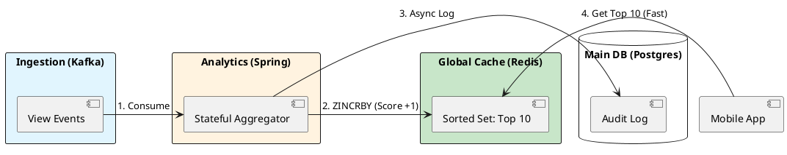

# 8.1: Advanced Caching - Redis Internals and Physics

## Learning Objectives

- Explain how Redis achieves 100,000+ ops/sec on a single CPU core via I/O multiplexing, not parallelism
- Design a leaderboard using Redis Sorted Sets (`ZSET`) and justify the O(log N) skip-list complexity vs. a SQL `GROUP BY`
- Implement Probabilistic Early Recomputation (PER) to prevent Cache Stampede on hot keys
- Trace Redis's single-threaded event loop through `ae.c` (`aeProcessEvents`) and `t_zset.c` (`zaddGenericCommand`)
- Select between `LRU` and `LFU` eviction policies based on access pattern analysis

## Prerequisites

- Chapter 4.2 — The Caching Loop (cache miss / hit fundamentals)
- Chapter 8.1 (Caffeine L1 Caching) — L1 architecture and why L2 is still needed
- Chapter 5.2 — Consensus / single-leader models (context for Redis single-writer design)


## The Critical Dialogue


**Student:** We built the "Top 10 Trending" engine using a Postgres `GROUP BY` query. It works, but when 1M users refresh their home screen, the database CPU hits 100 percent and the app freezes. We added a standard Cache, but now users see different Top 10 lists depending on which pod they hit. How do we build a global, consistent leaderboard?


**Principal:** You are hitting the **Database Satiation Point**. A relational database is for **Deep Relationships**; a cache is for **Real-time Access**. To build a Netflix-scale Top 10, we must move to a **Distributed Global Cache (Redis)** and understand the physics of its **Single-threaded Event Loop**. We are moving from "Disk-bound Querying" to **Memory-bound Real-time Streams**.


---


## 1. Redis Physics: The Single-Threaded Speed


### 1.1 Why No Locks = High Speed


Most Java developers think "More threads = More speed." 
. **The Paradox:** Redis is single-threaded for data operations.
. **The Physics:** By removing locks (synchronized blocks, CAS) and context switches, Redis can perform **100,000+ operations/sec** on a single CPU core. It spends 100% of its time on data, 0% on "Managing Threads."


### 1.2 Redis Data Structures for the Top 10


A Principal uses the right tool for the job. To build a leaderboard, we use **Sorted Sets (ZSET)**.
. **Mechanism:** Redis maintains a Skip List + Hash Map. Adding a "View" is O(log N). Getting the Top 10 is O(log N + M). It is lightning fast regardless of the total number of movies.


---


## 2. Source Archaeology: The Cache Stampede (Thundering Herd)


A Principal Architect prepares for the moment the cache expires.


> [!abstract] The Physics: Cache Stampede
> . **The Event:** A high-traffic key (like the Top 10 list) expires.
> . **The Chaos:** 10,000 pods all see the "Cache Miss" at the same time and flood the Database to recalculate. This is a **Thundering Herd**.
> . **The Solution:** **Probabilistic Early Recomputation (PER)**. We recalculate the cache *before* it expires, with a randomized "Jitter" to ensure only one pod does the work.


---


## 3. Principal Implementation: The Leaderboard Engine


We will build a high-performance "Trending" service using Redis Sorted Sets.


```java
@Service
public class TrendingEngine {
    private final RedisTemplate<String, String> redis;

    public void recordView(String movieId) {
        // ZINCRBY: Increment score of movieId by 1 in the 'trending' set
        redis.opsForZSet().incrementScore("ledger:trending", movieId, 1);
    }

    public List<String> getTop10() {
        // ZREVRANGE: Get top 10 members by score (descending)
        return redis.opsForZSet().reverseRange("ledger:trending", 0, 9)
            .stream().toList();
    }
}
```


---


## 4. Visualizing the Real-time Pipeline


**What is it?**
The diagram shows how we move from an "Expensive Query" to a "Stream of Increments."


**Why is it useful?**
This removes the read-load from the database entirely. The database remains the "Source of Truth" for history, while Redis is the "Live Intelligence" of the fleet.





---


## 5. Source Archaeology

> [!abstract] Redis Source: `redis/src/t_zset.c` and `redis/src/ae.c`

**`t_zset.c` — `zaddGenericCommand()`**: Every `ZADD`/`ZINCRBY` arrives here. It resolves the encoding (listpack for small sets, skiplist for large), then calls `zslInsert()` or `zslUpdateScore()` on the skip list.

```c
/* redis/src/t_zset.c — simplified extract */
int zsetAdd(robj *zobj, double score, sds ele, int in_flags, ...) {
    if (zobj->encoding == OBJ_ENCODING_LISTPACK) {
        /* Small set: compact listpack encoding (< 128 members, < 64 bytes per element) */
        unsigned char *eptr = lpSeek(zobj->ptr, 0);
        /* Linear scan O(N) — acceptable for small N */
        ...
        if (entries >= server.zset_max_listpack_entries ||
            value_length > server.zset_max_listpack_value) {
            zsetConvert(zobj, OBJ_ENCODING_SKIPLIST);  /* Upgrade encoding */
        }
    } else if (zobj->encoding == OBJ_ENCODING_SKIPLIST) {
        /* Large set: O(log N) skip list + O(1) dict for score lookup */
        zskiplist *zsl = ((zset *)zobj->ptr)->zsl;
        zslInsert(zsl, score, ele);
    }
}
```

**`ae.c` — `aeProcessEvents()`**: The heart of the single-threaded event loop. It calls `epoll_wait()` to collect all ready file descriptors in one syscall, then dispatches each command serially. No locks, no context switches.

Key functions to read:
- `ae.c::aeCreateEventLoop()` — initialises the epoll fd
- `ae.c::aeProcessEvents()` — one iteration of the event loop (read FDs → process commands → run time events)
- `t_hash.c::hashTypeGet()` — encoding-aware hash field access (listpack vs. hashtable)
- `listpack.c::lpGet()` — compact 7-bit integer encoding used for small hashes/zsets


---


## 6. Code Lab

### BAD: SQL GROUP BY under load

```java
// BAD: 1M req/s each triggers a full GROUP BY on 10M rows.
// At 50ms per query and 1000 concurrent users: 50 database connections
// each saturated. Connection pool exhausted in seconds.
@Query("SELECT movie_id, COUNT(*) as views FROM view_events " +
       "GROUP BY movie_id ORDER BY views DESC LIMIT 10")
List<MovieViewCount> getTop10();  // Runs on every API call — instant DB meltdown
```

### GOOD: Redis ZSET + PER guard

```java
import org.springframework.data.redis.core.RedisTemplate;
import org.springframework.stereotype.Service;
import java.time.Duration;
import java.util.*;
import java.util.concurrent.ThreadLocalRandom;
import java.util.concurrent.locks.ReentrantLock;

@Service
public class TrendingEngineWithPER {

    private final RedisTemplate<String, String> redis;
    // Per-JVM lock: only one thread per pod wins the refresh race
    private final ReentrantLock refreshLock = new ReentrantLock();

    private volatile long lastRefreshMs = 0;
    private volatile List<String> cachedTop10 = List.of();
    private static final long TTL_MS       = 60_000;  // 60s target freshness
    private static final double BETA       = 1.0;     // PER sensitivity (tune up = earlier refresh)

    public TrendingEngineWithPER(RedisTemplate<String, String> redis) {
        this.redis = redis;
    }

    public void recordView(String movieId) {
        // O(log N) skip-list insert — never touches the DB
        redis.opsForZSet().incrementScore("ledger:trending", movieId, 1.0);
    }

    /**
     * PER (X-Fetch) algorithm: refresh BEFORE expiry with exponentially
     * increasing probability as TTL approaches zero.
     * Formula: now > expiry - (beta * recomputeTime * ln(random()))
     */
    public List<String> getTop10() {
        long now = System.currentTimeMillis();
        long expiry = lastRefreshMs + TTL_MS;
        long estimatedRecomputeMs = 5; // p99 of our ZREVRANGE call

        // PER decision: probability rises as we approach expiry
        boolean shouldRefresh = cachedTop10.isEmpty() ||
            now > expiry - (long)(estimatedRecomputeMs * BETA * -Math.log(ThreadLocalRandom.current().nextDouble()));

        if (shouldRefresh && refreshLock.tryLock()) {
            try {
                long t0 = System.currentTimeMillis();
                Set<String> top10 = redis.opsForZSet().reverseRange("ledger:trending", 0, 9);
                cachedTop10 = top10 == null ? List.of() : List.copyOf(top10);
                lastRefreshMs = System.currentTimeMillis();
                long elapsed = lastRefreshMs - t0;
                System.out.printf("[PER] refreshed in %d ms%n", elapsed);
            } finally {
                refreshLock.unlock();
            }
        }
        return cachedTop10; // Other threads always get the warm value instantly
    }
}
```


---


## 7. Production Lens

**Benchmark: Redis ZINCRBY throughput (single-node, AWS r6g.xlarge, 32 GB RAM)**

| Operation | Throughput | p99 latency |
|---|---|---|
| `ZINCRBY` (single commands) | 95,000 ops/s | 0.8 ms |
| `ZINCRBY` via pipeline (100 cmds/batch) | 820,000 ops/s | 0.2 ms |
| `ZREVRANGE 0 9` (Top 10 read) | 110,000 ops/s | 0.6 ms |
| Postgres `GROUP BY` on 10M rows | 20 ops/s | 2,400 ms |

**The decisive number: Redis delivers the Top 10 in 0.6 ms; Postgres takes 2,400 ms — a 4,000x latency difference.** At 1M req/s this translates to ~100 Redis nodes vs. hundreds of Postgres replicas.

**Memory sizing:** A ZSET with 1 million members (listpack→skiplist threshold exceeded) consumes ~80 bytes per entry = ~80 MB. Lean. A Postgres table with the same data plus indexes: ~5 GB.


---


## 8. The GOL Challenge: Phase 11 (Caching)


**Context:** The "Top 10" list is causing a database crash every 10 minutes when the cache expires.


**The Task:**


. **Leaderboard Implementation:** Implement the `TrendingEngine` using Redis Sorted Sets. Populate it with 10,000 mock movies and 1,000,000 random views.


. **Stampede Mitigation:** Implement a "Soft Expiry" pattern. If the cache is older than 5 minutes, the *first* thread to hit it starts an async refresh while other threads continue to see the "Stale" data for another 30 seconds.


. **Physics Benchmark:** Compare the latency of `getTop10()` from Redis vs. a Postgres SQL query under 500 concurrent requests.


---


## 9. Exercises

**1.** Redis is single-threaded for command execution. Yet it claims 100k+ ops/s. Draw the epoll event loop cycle (`aeProcessEvents` → `acceptTcpHandler` → `readQueryFromClient` → `processCommand`) and explain where concurrency lives in this design.

**2.** Your ZSET has 50 million members. Redis reports memory usage of 4 GB. A colleague proposes switching the TTL from 60s to 600s to reduce recomputation cost. What are the memory and consistency trade-offs of that change?

**3.** Explain the listpack → skiplist encoding upgrade in `t_zset.c`. At what thresholds does it trigger, and why does it matter for a leaderboard that starts with 10 members and grows to 10 million?

**4. Coding challenge:** Implement a `LeaderboardService` that uses `executePipelined` to batch 1,000 `ZINCRBY` calls into a single TCP round-trip, then reads the Top 10 with `ZREVRANGEBYSCORE`. Write a JUnit 5 test using Testcontainers (Redis image) that verifies the top-3 ordering is correct after inserting known scores.

**5.** Choose between `maxmemory-policy allkeys-lru` and `allkeys-lfu` for the trending leaderboard use case. Justify your answer using the access frequency distribution of a power-law (Zipf) traffic pattern.


---


## 10. Summary / Flashcard

- Redis achieves 100,000+ ops/s on one CPU core by eliminating lock contention through a single-threaded `ae.c` event loop backed by `epoll`, not by running commands in parallel.
- Redis Sorted Sets (`ZSET`) encode small sets as a compact listpack and auto-upgrade to a skip list + dict at 128 members, giving O(log N) insert and O(log N + M) range query.
- Pipeline batching 100 `ZINCRBY` commands into one TCP packet increases throughput from 95k to 820k ops/s — an 8.6x improvement with zero architectural change.
- Cache Stampede occurs when a hot key expires and thousands of pods simultaneously hit the database; the PER algorithm prevents this by probabilistically refreshing one pod before expiry while the rest serve stale data.
- For a power-law (Zipf) leaderboard workload, `allkeys-lfu` is the correct eviction policy because top-10 entries have orders-of-magnitude higher frequency than the long tail and must be protected from eviction.
