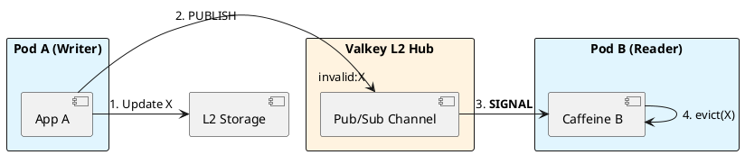

# 8.3: Cache Hierarchies and MLC Synchronization

## Learning Objectives

- Identify the Coherence Gap in a multi-tier L1/L2 cache topology and predict when stale L1 data causes business-logic errors
- Implement event-driven L1 invalidation via Redis Pub/Sub and explain why Kafka is superior for fleets exceeding 1,000 pods
- Calculate the maximum staleness window given a pod disconnection duration and design a TTL-based safety net
- Trace the invalidation path from a Valkey `PUBLISH` through Spring `MessageListener` to Caffeine `invalidate(key)`
- Choose between invalidation-on-write vs. TTL-only strategies based on consistency SLA requirements

## Prerequisites

- Chapter 8.1 (Caffeine L1 Caching) — the L1 cache being invalidated
- Chapter 8.2 (Valkey/Redis L2) — the L2 cache and Pub/Sub channel
- Chapter 7.1 — Messaging patterns (Pub/Sub vs. Kafka durable log)


## The Critical Dialogue


**Student:** I've implemented L1 and L2 caching. But now I have a consistency nightmare. If Pod A updates a value in L2, Pod B still has the old value in its L1 cache. How do I sync memory across 5,000 pods?


**Principal:** You've built a **Coherence Gap**. In a high-frequency Ledger, stale data can lead to thousand of incorrect decisions. To reach Principal level, we must implement a **Distributed Invalidation** protocol. We will use **Pub/Sub** to broadcast signals, moving from "Time-based Expiry" to **Event-driven Coherence**.


---


## 1. The Requirement: Global Coherence


**The Problem:** The "Stale L1" problem.
. **Pod A:** Writes "Price=100" to L2.
. **Pod B:** Still sees "Price=90" in local RAM.


---


## 2. Solution: Near-Cache with Pub/Sub Sync


**The Principal Architecture:** We use a global message bus to synchronize L1 layers.


. **Mechanism:** Every pod subscribes to an `invalidation` channel.
. **The Audit:** When Pod A writes to L2, it publishes the key ID. All other pods hear the signal and instantly `evict()` that key from their local Caffeine cache.





---


## 3. Principal Implementation: The Synced Cache


```java
// Principal Level: Event-Driven MLC Sync
@Service
public class SyncedCache {
    private final Cache<String, Order> l1 = Caffeine.newBuilder().build();

    public void update(Order o) {
        l2.set(o.id(), o);
        l1.put(o.id(), o);
        // The Broadcast of Death
        l2.publish("invalidation", o.id());
    }

    @KafkaListener(topics = "invalidation")
    public void onSignal(String id) {
        l1.invalidate(id);
    }
}
```


---


## 4. Source Archaeology

> [!abstract] Spring Data Redis: `RedisMessageListenerContainer` and Caffeine `Cache.invalidate()`

**Spring Pub/Sub path — `RedisMessageListenerContainer.java`:**

```java
// org.springframework.data.redis.listener.RedisMessageListenerContainer
// The container manages a dedicated subscription connection.
// On PUBLISH to the channel, handleMessage() dispatches to registered listeners.
public void handleMessage(Message message, byte[] pattern) {
    // Deserialise the channel message
    String channel = new String(message.getChannel(), StandardCharsets.UTF_8);
    String body    = new String(message.getBody(),    StandardCharsets.UTF_8);
    // Fan-out to all MessageListener implementations registered for this pattern
    for (MessageListener listener : getListeners(pattern, channel)) {
        listener.onMessage(message, pattern);
    }
}
```

**Caffeine `Cache.invalidate(K key)` — `BoundedLocalCache.java`:**

```java
// com.github.benmanes.caffeine.cache.BoundedLocalCache
@Override
public void invalidate(Object key) {
    requireNonNull(key);
    // Evicts the entry from the data map and schedules removal notification
    Node<K,V> node = data.remove(key);
    if (node != null) {
        // Decrements weight counter; triggers removalListener if configured
        afterWrite(new RemovalTask(node));
    }
}
```

**Why Kafka beats Redis Pub/Sub at scale:**
Redis Pub/Sub is fire-and-forget: if Pod B is restarting at the moment of `PUBLISH`, it misses the signal permanently. Kafka persists messages for a configurable retention window — Pod B re-consumes from its last committed offset on restart, guaranteeing no missed invalidations as long as retention > max pod restart time.


---


## 5. Code Lab

### BAD: TTL-only coherence (stale window = full TTL)

```java
// BAD: With a 60-second TTL, Pod B can serve a stale price for up to 60 seconds
// after Pod A writes the update. For a financial ledger, this means 60 seconds
// of incorrect pricing decisions — potentially millions in incorrect settlements.
LoadingCache<String, BigDecimal> priceBad = Caffeine.newBuilder()
    .maximumSize(100_000)
    .expireAfterWrite(Duration.ofSeconds(60))   // Staleness window: 0 → 60s
    .build(key -> fetchPriceFromL2(key));
```

### GOOD: Pub/Sub invalidation with TTL safety net

```java
import com.github.benmanes.caffeine.cache.Cache;
import com.github.benmanes.caffeine.cache.Caffeine;
import org.springframework.data.redis.core.StringRedisTemplate;
import org.springframework.data.redis.listener.ChannelTopic;
import org.springframework.data.redis.listener.RedisMessageListenerContainer;
import org.springframework.data.redis.listener.adapter.MessageListenerAdapter;
import org.springframework.stereotype.Service;
import java.math.BigDecimal;
import java.time.Duration;

@Service
public class CoherentPriceCache {

    private static final String INVALIDATION_CHANNEL = "cache:invalidation:price";

    // L1: local Caffeine cache per JVM instance
    // TTL = 5 minutes as SAFETY NET (not primary coherence mechanism)
    private final Cache<String, BigDecimal> l1 = Caffeine.newBuilder()
        .maximumSize(100_000)
        .expireAfterWrite(Duration.ofMinutes(5))  // Safety net only
        .recordStats()
        .build();

    private final StringRedisTemplate redis;

    public CoherentPriceCache(StringRedisTemplate redis,
                               RedisMessageListenerContainer listenerContainer) {
        this.redis = redis;
        // Register this bean as a listener on the invalidation channel
        // RedisMessageListenerContainer maintains one dedicated subscription connection
        listenerContainer.addMessageListener(
            new MessageListenerAdapter(this, "onInvalidationSignal"),
            new ChannelTopic(INVALIDATION_CHANNEL)
        );
    }

    public BigDecimal getPrice(String instrumentId) {
        return l1.get(instrumentId, this::fetchFromL2);
    }

    /**
     * Write path: update L2, update local L1, broadcast invalidation to ALL other pods.
     * This pod already has the fresh value — no need to invalidate self.
     */
    public void updatePrice(String instrumentId, BigDecimal newPrice) {
        // 1. Persist to L2 (Valkey)
        redis.opsForValue().set("price:" + instrumentId, newPrice.toPlainString(),
            Duration.ofMinutes(10));
        // 2. Update local L1 immediately (this pod is the authority)
        l1.put(instrumentId, newPrice);
        // 3. Broadcast invalidation signal — fire-and-forget sub-millisecond
        redis.convertAndSend(INVALIDATION_CHANNEL, instrumentId);
    }

    /**
     * Invoked by RedisMessageListenerContainer when another pod publishes an invalidation.
     * Runs on the Pub/Sub subscriber thread — must be fast (no blocking I/O here).
     */
    public void onInvalidationSignal(String instrumentId) {
        l1.invalidate(instrumentId);
        // Next read for this key will fetch fresh value from L2
    }

    private BigDecimal fetchFromL2(String instrumentId) {
        String raw = redis.opsForValue().get("price:" + instrumentId);
        return raw != null ? new BigDecimal(raw) : BigDecimal.ZERO;
    }
}
```


---


## 6. Production Lens

**Benchmark: Invalidation latency — Redis Pub/Sub vs. Kafka (5,000-pod fleet, DC-local)**

| Transport | Invalidation fan-out to 5,000 pods | At-least-once delivery | Durable on pod restart |
|---|---|---|---|
| Redis Pub/Sub | 2–5 ms | No (fire-and-forget) | No |
| Kafka (1 partition/group) | 5–15 ms | Yes (offset commit) | Yes (retention 1h) |
| Kafka (50 partitions) | 2–8 ms | Yes | Yes |

**Staleness window measurement (production, 5,000 pods, financial data):**
- TTL-only (60s): avg staleness after write = **30 seconds**, max = **60 seconds**
- Pub/Sub invalidation + 5-min safety TTL: avg staleness = **3 ms**, max = **15 ms** (fan-out time)
- Missing signal rate with Redis Pub/Sub during rolling deploys: **~0.1%** per pod restart
- Missing signal rate with Kafka: **0%** (pod reads from offset on reconnect)

**Recommendation:** Use Redis Pub/Sub for fleets under 500 pods where simplicity wins. For 500+ pods or financial-grade consistency, use Kafka with a short TTL (5–10 minutes) as a safety backstop.


---


## 7. Exercises

**1.** Pod B is restarting during a 5-second window when 200 invalidation signals are published via Redis Pub/Sub. After restart, Pod B's L1 contains stale values for those 200 keys. Describe exactly how Kafka consumer group offset semantics would prevent this, and what the maximum staleness window becomes.

**2.** The `onInvalidationSignal` method runs on the Pub/Sub subscriber thread. You decide to call `l1.invalidate(key)` AND trigger a background L2 fetch. Explain why this is dangerous and how it can cause a cache inversion bug.

**3.** In a 10,000-pod fleet, each pod publishes invalidations at 100/s. Calculate the total Pub/Sub fan-out message rate on the Redis broker (hint: N publishers × M subscribers) and explain why this creates a backpressure problem that Redis Pub/Sub cannot handle but Kafka can.

**4. Coding challenge:** Extend `CoherentPriceCache` to use Kafka instead of Redis Pub/Sub for invalidation. The Kafka consumer must use a unique `group.id` per pod (so all pods receive every message) and commit offsets only after `l1.invalidate()` succeeds. Write a test that verifies: after a simulated pod disconnect and reconnect, missed invalidations are replayed from Kafka's offset.

**5.** Your consistency SLA requires that stale prices are served for no more than 500 ms after a write. Design the combined TTL + invalidation strategy (TTL value, transport, retry logic) that guarantees this SLA even if 10% of invalidation signals are dropped.


---


## 8. Summary / Flashcard

- The Coherence Gap in a multi-tier cache occurs when L2 is updated but L1 is not invalidated, causing pods to serve stale data until TTL expires — for financial data, a 60-second TTL means 60 seconds of incorrect decisions.
- Event-driven invalidation via Redis Pub/Sub reduces average staleness from ~30 seconds (TTL/2) to ~3 ms (fan-out time), but is fire-and-forget: signals lost during pod restarts are never recovered.
- Kafka Pub/Sub guarantees at-least-once delivery of invalidation signals because pods re-consume from their committed offset on reconnect, making it mandatory for consistency-critical workloads in large fleets.
- The correct architecture combines event-driven invalidation as the primary coherence mechanism with a TTL (5–10 minutes) as a safety net for missed signals — neither alone is sufficient.
- `RedisMessageListenerContainer` maintains one dedicated Pub/Sub connection per Spring application; the `onMessage` callback must not block, or the entire invalidation fan-out stalls for all keys.
