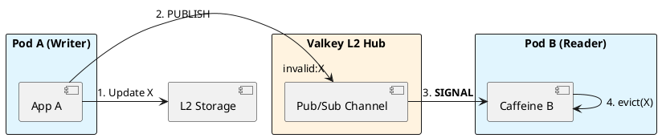

# 8.3: Cache Hierarchies and MLC Synchronization


## The Critical Dialogue


**Student:** I've implemented L1 and L2 caching. But now I have a consistency nightmare. If Pod A updates a value in L2, Pod B still has the old value in its L1 cache. How do I sync memory across 5,000 pods?


**Principal:** You've built a **Coherence Gap**. In a high-frequency Ledger, stale data can lead to thousand of incorrect decisions. To reach Principal level, we must implement a **Distributed Invalidation** protocol. We will use **Pub/Sub** to broadcast signals, moving from "Time-based Expiry" to **Event-driven Coherence**.


---


## 1. The Requirement: Global Coherence


**The Problem:** The "Stale L1" problem.
. **Pod A:** Writes "Price=100" to L2.
. **Pod B:** Still sees "Price=90" in local RAM.


---


## 2. Solution: Near-Cache with Pub/Sub Sync


**The Principal Architecture:** We use a global message bus to synchronize L1 layers.


. **Mechanism:** Every pod subscribes to an `invalidation` channel.
. **The Audit:** When Pod A writes to L2, it publishes the key ID. All other pods hear the signal and instantly `evict()` that key from their local Caffeine cache.





---


## 3. Principal Implementation: The Synced Cache


```java
// Principal Level: Event-Driven MLC Sync
@Service
public class SyncedCache {
    private final Cache(String, Order) l1 = Caffeine.newBuilder().build();

    public void update(Order o) {
        l2.set(o.id(), o);
        l1.put(o.id(), o);
        // The Broadcast of Death
        l2.publish("invalidation", o.id());
    }

    @KafkaListener(topics = "invalidation")
    public void onSignal(String id) {
        l1.invalidate(id);
    }
}
```


---


## 🧠 Principal's Inquiry


. **Missing Signal:** What happens if a pod is disconnected for 5 seconds and misses a signal?


. **Network Saturation:** Why is Kafka sometimes better than Redis for invalidation signals in a 10,000 pod fleet?


**Principal Summary:** Cache Hierarchies are about **Managing Discrepancy**. We use Event-driven Invalidation to ensure the fleet stays coherent without sacrificing L1 speed.
 Greenlanders use the type system to prove our software invariants.
