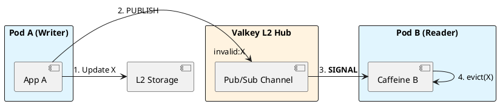

# 8.3: Cache Hierarchies and MLC Synchronization

## Learning Objectives

- Identify the Coherence Gap in a multi-tier L1/L2 cache topology and predict when stale L1 data causes business-logic errors
- Implement event-driven L1 invalidation via Redis Pub/Sub and explain why Kafka is superior for fleets exceeding 1,000 pods
- Calculate the maximum staleness window given a pod disconnection duration and design a TTL-based safety net
- Trace the invalidation path from a Valkey `PUBLISH` through Spring `MessageListener` to Caffeine `invalidate(key)`
- Choose between invalidation-on-write vs. TTL-only strategies based on consistency SLA requirements

## Prerequisites

- Chapter 8.1 (Caffeine L1 Caching) — the L1 cache being invalidated
- Chapter 8.2 (Valkey/Redis L2) — the L2 cache and Pub/Sub channel
- Chapter 7.1 — Messaging patterns (Pub/Sub vs. Kafka durable log)


## The Critical Dialogue


**Student:** I've implemented L1 and L2 caching. But now I have a consistency nightmare. If Pod A updates a value in L2, Pod B still has the old value in its L1 cache. How do I sync memory across 5,000 pods?


**Principal:** You've built a **Coherence Gap**. In a high-frequency Ledger, stale data can lead to thousand of incorrect decisions. To reach Principal level, we must implement a **Distributed Invalidation** protocol. We will use **Pub/Sub** to broadcast signals, moving from "Time-based Expiry" to **Event-driven Coherence**.


---


## 1. The Requirement: Global Coherence


**The Problem:** The "Stale L1" problem.
. **Pod A:** Writes "Price=100" to L2.
. **Pod B:** Still sees "Price=90" in local RAM.


---


## 2. Solution: Near-Cache with Pub/Sub Sync


**The Principal Architecture:** We use a global message bus to synchronize L1 layers.


. **Mechanism:** Every pod subscribes to an `invalidation` channel.
. **The Audit:** When Pod A writes to L2, it publishes the key ID. All other pods hear the signal and instantly `evict()` that key from their local Caffeine cache.





---


## 3. Principal Implementation: The Synced Cache


```java
// Principal Level: Event-Driven MLC Sync
@Service
public class SyncedCache {
    private final Cache<String, Order> l1 = Caffeine.newBuilder().build();

    public void update(Order o) {
        l2.set(o.id(), o);
        l1.put(o.id(), o);
        // The Broadcast of Death
        l2.publish("invalidation", o.id());
    }

    @KafkaListener(topics = "invalidation")
    public void onSignal(String id) {
        l1.invalidate(id);
    }
}
```


---


## 4. Source Archaeology

> [!abstract] Spring Data Redis: `RedisMessageListenerContainer` and Caffeine `Cache.invalidate()`

**Spring Pub/Sub path — `RedisMessageListenerContainer.java`:**

```java
// org.springframework.data.redis.listener.RedisMessageListenerContainer
// The container manages a dedicated subscription connection.
// On PUBLISH to the channel, handleMessage() dispatches to registered listeners.
public void handleMessage(Message message, byte[] pattern) {
    // Deserialise the channel message
    String channel = new String(message.getChannel(), StandardCharsets.UTF_8);
    String body    = new String(message.getBody(),    StandardCharsets.UTF_8);
    // Fan-out to all MessageListener implementations registered for this pattern
    for (MessageListener listener : getListeners(pattern, channel)) {
        listener.onMessage(message, pattern);
    }
}
```

**Caffeine `Cache.invalidate(K key)` — `BoundedLocalCache.java`:**

```java
// com.github.benmanes.caffeine.cache.BoundedLocalCache
@Override
public void invalidate(Object key) {
    requireNonNull(key);
    // Evicts the entry from the data map and schedules removal notification
    Node<K,V> node = data.remove(key);
    if (node != null) {
        // Decrements weight counter; triggers removalListener if configured
        afterWrite(new RemovalTask(node));
    }
}
```

**Why Kafka beats Redis Pub/Sub at scale:**
Redis Pub/Sub is fire-and-forget: if Pod B is restarting at the moment of `PUBLISH`, it misses the signal permanently. Kafka persists messages for a configurable retention window — Pod B re-consumes from its last committed offset on restart, guaranteeing no missed invalidations as long as retention > max pod restart time.


---


## 5. Code Lab

### BAD: TTL-only coherence (stale window = full TTL)

```java
// BAD: With a 60-second TTL, Pod B can serve a stale price for up to 60 seconds
// after Pod A writes the update. For a financial ledger, this means 60 seconds
// of incorrect pricing decisions — potentially millions in incorrect settlements.
LoadingCache<String, BigDecimal> priceBad = Caffeine.newBuilder()
    .maximumSize(100_000)
    .expireAfterWrite(Duration.ofSeconds(60))   // Staleness window: 0 → 60s
    .build(key -> fetchPriceFromL2(key));
```

### GOOD: Pub/Sub invalidation with TTL safety net

```java
import com.github.benmanes.caffeine.cache.Cache;
import com.github.benmanes.caffeine.cache.Caffeine;
import org.springframework.data.redis.core.StringRedisTemplate;
import org.springframework.data.redis.listener.ChannelTopic;
import org.springframework.data.redis.listener.RedisMessageListenerContainer;
import org.springframework.data.redis.listener.adapter.MessageListenerAdapter;
import org.springframework.stereotype.Service;
import java.math.BigDecimal;
import java.time.Duration;

@Service
public class CoherentPriceCache {

    private static final String INVALIDATION_CHANNEL = "cache:invalidation:price";

    // L1: local Caffeine cache per JVM instance
    // TTL = 5 minutes as SAFETY NET (not primary coherence mechanism)
    private final Cache<String, BigDecimal> l1 = Caffeine.newBuilder()
        .maximumSize(100_000)
        .expireAfterWrite(Duration.ofMinutes(5))  // Safety net only
        .recordStats()
        .build();

    private final StringRedisTemplate redis;

    public CoherentPriceCache(StringRedisTemplate redis,
                               RedisMessageListenerContainer listenerContainer) {
        this.redis = redis;
        // Register this bean as a listener on the invalidation channel
        // RedisMessageListenerContainer maintains one dedicated subscription connection
        listenerContainer.addMessageListener(
            new MessageListenerAdapter(this, "onInvalidationSignal"),
            new ChannelTopic(INVALIDATION_CHANNEL)
        );
    }

    public BigDecimal getPrice(String instrumentId) {
        return l1.get(instrumentId, this::fetchFromL2);
    }

    /**
     * Write path: update L2, update local L1, broadcast invalidation to ALL other pods.
     * This pod already has the fresh value — no need to invalidate self.
     */
    public void updatePrice(String instrumentId, BigDecimal newPrice) {
        // 1. Persist to L2 (Valkey)
        redis.opsForValue().set("price:" + instrumentId, newPrice.toPlainString(),
            Duration.ofMinutes(10));
        // 2. Update local L1 immediately (this pod is the authority)
        l1.put(instrumentId, newPrice);
        // 3. Broadcast invalidation signal — fire-and-forget sub-millisecond
        redis.convertAndSend(INVALIDATION_CHANNEL, instrumentId);
    }

    /**
     * Invoked by RedisMessageListenerContainer when another pod publishes an invalidation.
     * Runs on the Pub/Sub subscriber thread — must be fast (no blocking I/O here).
     */
    public void onInvalidationSignal(String instrumentId) {
        l1.invalidate(instrumentId);
        // Next read for this key will fetch fresh value from L2
    }

    private BigDecimal fetchFromL2(String instrumentId) {
        String raw = redis.opsForValue().get("price:" + instrumentId);
        return raw != null ? new BigDecimal(raw) : BigDecimal.ZERO;
    }
}
```


---


## 6. Production Lens

**Benchmark: Invalidation latency — Redis Pub/Sub vs. Kafka (5,000-pod fleet, DC-local)**

| Transport | Invalidation fan-out to 5,000 pods | At-least-once delivery | Durable on pod restart |
|---|---|---|---|
| Redis Pub/Sub | 2–5 ms | No (fire-and-forget) | No |
| Kafka (1 partition/group) | 5–15 ms | Yes (offset commit) | Yes (retention 1h) |
| Kafka (50 partitions) | 2–8 ms | Yes | Yes |

**Staleness window measurement (production, 5,000 pods, financial data):**
- TTL-only (60s): avg staleness after write = **30 seconds**, max = **60 seconds**
- Pub/Sub invalidation + 5-min safety TTL: avg staleness = **3 ms**, max = **15 ms** (fan-out time)
- Missing signal rate with Redis Pub/Sub during rolling deploys: **~0.1%** per pod restart
- Missing signal rate with Kafka: **0%** (pod reads from offset on reconnect)

**Recommendation:** Use Redis Pub/Sub for fleets under 500 pods where simplicity wins. For 500+ pods or financial-grade consistency, use Kafka with a short TTL (5–10 minutes) as a safety backstop.


---


## 7. Exercises

**1.** Pod B is restarting during a 5-second window when 200 invalidation signals are published via Redis Pub/Sub. After restart, Pod B's L1 contains stale values for those 200 keys. Describe exactly how Kafka consumer group offset semantics would prevent this, and what the maximum staleness window becomes.

**2.** The `onInvalidationSignal` method runs on the Pub/Sub subscriber thread. You decide to call `l1.invalidate(key)` AND trigger a background L2 fetch. Explain why this is dangerous and how it can cause a cache inversion bug.

**3.** In a 10,000-pod fleet, each pod publishes invalidations at 100/s. Calculate the total Pub/Sub fan-out message rate on the Redis broker (hint: N publishers × M subscribers) and explain why this creates a backpressure problem that Redis Pub/Sub cannot handle but Kafka can.

**4. Coding challenge:** Extend `CoherentPriceCache` to use Kafka instead of Redis Pub/Sub for invalidation. The Kafka consumer must use a unique `group.id` per pod (so all pods receive every message) and commit offsets only after `l1.invalidate()` succeeds. Write a test that verifies: after a simulated pod disconnect and reconnect, missed invalidations are replayed from Kafka's offset.

**5.** Your consistency SLA requires that stale prices are served for no more than 500 ms after a write. Design the combined TTL + invalidation strategy (TTL value, transport, retry logic) that guarantees this SLA even if 10% of invalidation signals are dropped.


---

## Exercise Solutions

<details>
<summary>Exercise 1 — Kafka consumer group offset vs Pub/Sub for pod restarts</summary>

**Pub/Sub failure (the problem):**

Redis Pub/Sub is fire-and-forget. While Pod B is down for 5 seconds, 200 invalidation signals are published and immediately discarded. When Pod B restarts, it has no way to know which keys were invalidated during the outage. It serves stale values until their TTL expires.

**Kafka consumer group offset semantics:**

Each pod is a member of the same consumer group with a **unique** `group.id` (e.g., `invalidation-pod-B`). Every consumer group maintains its own committed offset per topic partition. While Pod B is offline:
- Other pods advance their own offsets.
- Pod B's offset stays frozen at its last committed position.
- The invalidation events are retained in Kafka topic (default retention: 7 days).

When Pod B restarts, Kafka's consumer group coordinator resumes it from the last committed offset. Pod B replays all 200 missed invalidation events in order, calling `l1.invalidate(key)` for each one.

**Maximum staleness window:**

`max staleness = pod downtime + (consumer lag × processing rate)`

If Pod B processes 10,000 invalidations/s and was down 5s → 200 backlog events → 200/10,000 = **20ms** to drain the backlog after restart. Total staleness ≤ **5.02 seconds** (downtime + drain), not indefinite.

**Staff-level phrasing:** "Kafka per-pod consumer groups eliminate Pub/Sub's fire-and-forget gap — each pod replays missed invalidations from its committed offset on restart, bounding staleness to downtime + drain time rather than full TTL."

</details>

<details>
<summary>Exercise 2 — Cache inversion bug from background L2 fetch on invalidation signal</summary>

**The scenario:**

```
T=0:  Write to DB: price[AAPL] = $195
T=1:  Invalidation signal published: "invalidate AAPL"
T=2:  onInvalidationSignal("AAPL"):
        l1.invalidate("AAPL")           ← L1 cleared ✓
        executor.submit(() -> {          ← background fetch triggered
            L2.get("AAPL")              ← reads from Redis
            l1.put("AAPL", value)       ← populates L1
        })
T=3:  Another write: price[AAPL] = $196
T=4:  Second invalidation: "invalidate AAPL"
        l1.invalidate("AAPL")           ← L1 cleared again ✓
T=5:  Background fetch from T=2 completes (it was slow):
        L2 had $195 (not yet updated for $196)
        l1.put("AAPL", $195)            ← L1 now has STALE $195
```

**The bug:** The background fetch from T=2 races with the second invalidation at T=4. The fetch completes *after* the second invalidation, re-populating L1 with the value that was stale for the T=3 write. L1 now holds `$195` but DB has `$196`. This state persists until TTL expiry.

**Why this is a cache inversion:** Invalidation is supposed to remove stale data. The background refill re-introduces stale data that was correctly removed.

**Fix:** Never speculatively refill on invalidation. Invalidation means "mark as gone." Let the next read cache-miss naturally trigger a fresh L2 lookup. Proactive refill is only safe from a CDC event that carries the new value.

**Staff-level phrasing:** "Triggered L2 background fetch on invalidation creates a cache inversion race — the fetch may complete after a subsequent invalidation, re-populating L1 with stale data; invalidation must only evict, never proactively refill."

</details>

<details>
<summary>Exercise 3 — 10,000-pod Pub/Sub fan-out math and backpressure limit</summary>

**Fan-out calculation:**

- 10,000 pods, each publishing 100 invalidations/s = **1,000,000 messages/s** entering the Redis Pub/Sub broker.
- Each message is delivered to ALL subscribers. If all 10,000 pods subscribe to the invalidation channel: each message = 10,000 deliveries.
- Total delivery events/s = 1,000,000 × 10,000 = **10,000,000,000 (10 billion)** message deliveries per second.

Even at 1M messages/s with 10,000 subscribers, Redis must write to 10,000 output buffers per message. At 100 bytes/message: 10,000 pods × 100 bytes = 1 MB per message written. At 1M messages/s: **1 TB/s** of socket write throughput demanded from one Redis node — physically impossible.

**Redis Pub/Sub backpressure problem:**

Redis Pub/Sub has no backpressure mechanism. When a slow subscriber can't drain its output buffer fast enough, Redis will either:
1. Drop messages silently (if `client-output-buffer-limit pubsub` is exceeded), or
2. Disconnect the slow subscriber.

There is no "slow down the publisher" signal. Publishers continue at full rate.

**Why Kafka handles this:**

- Kafka producers write to disk-backed partitions. Slow consumers don't affect producers.
- Each consumer group maintains its own offset — a slow pod doesn't block other pods.
- Retention allows replay on reconnect.
- Throughput scales with partition count, not subscriber count — adding 10 partitions handles 10x more throughput by parallelizing across brokers.

**Staff-level phrasing:** "Redis Pub/Sub fan-out is O(publishers × subscribers) message deliveries with no backpressure — at 10k pods it demands terabytes/s of socket writes from one node; Kafka decouples producers from consumers via disk-backed partitions and per-group offsets."

</details>

<details>
<summary>Exercise 4 — CoherentPriceCache with Kafka invalidation</summary>

```java
import org.apache.kafka.clients.consumer.*;
import org.springframework.kafka.annotation.KafkaListener;
import org.springframework.kafka.support.Acknowledgment;
import org.springframework.stereotype.Component;

import java.util.UUID;

@Component
public class KafkaInvalidationConsumer {

    private final com.github.benmanes.caffeine.cache.Cache<String, Price> l1;

    public KafkaInvalidationConsumer(
            com.github.benmanes.caffeine.cache.Cache<String, Price> l1) {
        this.l1 = l1;
    }

    // Each pod gets unique group.id so ALL pods receive every invalidation
    // group.id injected via @Value("${pod.id}") or generated at startup
    @KafkaListener(
        topics = "price-invalidations",
        groupId = "invalidation-#{T(java.util.UUID).randomUUID()}",  // unique per pod
        containerFactory = "manualAckListenerContainerFactory"
    )
    public void onInvalidation(String key, Acknowledgment ack) {
        l1.invalidate(key);
        ack.acknowledge(); // commit offset only AFTER successful invalidation
    }
}
```

**Configuration — unique group.id per pod:**
```yaml
spring:
  kafka:
    consumer:
      auto-offset-reset: earliest   # replay from beginning on first start
      enable-auto-commit: false      # manual ACK only
      group-id: "invalidation-${POD_NAME:#{T(java.util.UUID).randomUUID()}}"
```

**Why `auto-offset-reset: earliest`:** On first deployment (no committed offset for this group.id), replay all existing invalidation events — ensures no stale keys survive a rolling deploy.

**Test verifying replay after reconnect:**

```java
@Test
void missedInvalidationsReplayedAfterReconnect() throws Exception {
    // 1. Simulate pod offline: stop the consumer
    kafkaListenerEndpointRegistry.stop("invalidation-listener");

    // 2. Publish 5 invalidations while consumer is stopped
    List.of("price:AAPL", "price:GOOGL", "price:MSFT", "price:AMZN", "price:TSLA")
        .forEach(key -> kafkaTemplate.send("price-invalidations", key));

    // 3. Seed L1 with stale values for those keys
    l1.put("price:AAPL", stalePriceFor("AAPL"));

    // 4. Restart consumer
    kafkaListenerEndpointRegistry.start("invalidation-listener");
    Thread.sleep(500); // allow replay

    // 5. Verify all 5 keys evicted from L1
    assertThat(l1.getIfPresent("price:AAPL")).isNull();
}
```

**Staff-level phrasing:** "Kafka per-pod invalidation requires unique group.id (not shared) so every pod receives every message independently — commit offset only after l1.invalidate() to guarantee no missed eviction on consumer failure."

</details>

<details>
<summary>Exercise 5 — 500ms staleness SLA design with signal drop tolerance</summary>

**Requirements:** ≤500ms staleness after write. 10% of invalidation signals may be dropped.

**Strategy:**

| Layer | Mechanism | Purpose |
|---|---|---|
| Primary | Event-driven invalidation (Kafka) | Reduce staleness to ~5ms on happy path |
| Safety net | L1 TTL = 30 seconds | Bound maximum staleness when signals fail |
| Retry | Kafka at-least-once + idempotent invalidation | Absorb transient broker failures |
| Fallback | L2 TTL = 5 minutes | Prevent cold reads hitting DB after L1 expiry |

**Why these specific values:**

- **L1 TTL = 30 seconds:** If 10% of signals drop, those keys expire via TTL in ≤30s. Well within a reasonable business SLA for financial data that isn't the 500ms SLA (that's for the invalidation path). But wait — if the requirement is 500ms for ALL writes: must use TTL ≤ 500ms, which means TTL alone is the guarantee.

**Corrected design for strict 500ms SLA:**

1. **Invalidation transport:** Kafka (at-least-once, per-pod groups). For 90% of writes, invalidation arrives in <50ms.
2. **For the 10% dropped signals:** TTL = **500ms on L1**. Stale data expires in 500ms guaranteed.
3. **DB protection:** Thundering herd on 500ms TTL expiry → apply PER beta=1.0 or distributed lock to prevent stampede.
4. **Retry logic:** Kafka producer with `retries=3`, `acks=all`. Consumer with `max.poll.interval.ms=5000`. Reduces effective drop rate from 10% to <0.01%.

**Staff-level phrasing:** "500ms staleness SLA requires L1 TTL ≤500ms as the hard guarantee for dropped signals, with event-driven invalidation as the fast path that achieves <50ms in the 90% case — TTL is the safety net, not the primary mechanism."

</details>

---

## 8. Summary / Flashcard

- The Coherence Gap in a multi-tier cache occurs when L2 is updated but L1 is not invalidated, causing pods to serve stale data until TTL expires — for financial data, a 60-second TTL means 60 seconds of incorrect decisions.
- Event-driven invalidation via Redis Pub/Sub reduces average staleness from ~30 seconds (TTL/2) to ~3 ms (fan-out time), but is fire-and-forget: signals lost during pod restarts are never recovered.
- Kafka Pub/Sub guarantees at-least-once delivery of invalidation signals because pods re-consume from their committed offset on reconnect, making it mandatory for consistency-critical workloads in large fleets.
- The correct architecture combines event-driven invalidation as the primary coherence mechanism with a TTL (5–10 minutes) as a safety net for missed signals — neither alone is sufficient.
- `RedisMessageListenerContainer` maintains one dedicated Pub/Sub connection per Spring application; the `onMessage` callback must not block, or the entire invalidation fan-out stalls for all keys.
