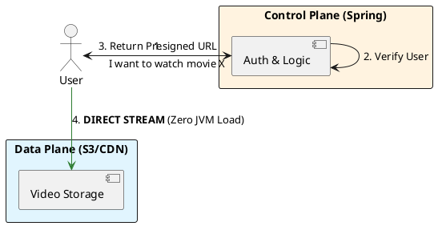

# 9.1: Large-Scale Media and BLOB Physics

## Learning Objectives

- Identify the Fundamental Architectural Category Error of storing BLOBs in a relational database or streaming bytes through a JVM
- Design the Control Plane / Data Plane split using S3 Presigned URLs as the cryptographic handoff mechanism
- Implement `S3Presigner.presignGetObject()` with the AWS SDK v2 and return a redirect response from a Spring controller
- Calculate the pod count and heap cost of routing concurrent large file downloads through Spring vs. the presigned redirect pattern
- Apply HTTP Range (206 Partial Content) semantics to enable seek operations and CDN-efficient partial delivery

## Prerequisites

- Chapter 4.5 — CDN Push vs. Pull (edge delivery fundamentals)
- Chapter 1.1 — JVM Heap and GC (why storing byte[] kills the JVM)
- Chapter 2.x — Spring Boot controller patterns (ResponseEntity, redirect responses)


## The Critical Dialogue


**Student:** We are trying to add video attachments to our Ledger reports. I tried storing the 500MB MP4 files as `byte[]` in Postgres, but now the database is extremely slow and our Spring Boot pods are crashing with `OutOfMemoryError`. Is Java bad at handling large files?


**Principal:** You are making a **Fundamental Architectural Category Error**. You are mixing the **Control Plane** with the **Data Plane**. A database and a JVM are for *Managing Metadata* (the Ticket), not for *Transporting Blobs* (the Movie). To reach Principal level, we must master **BLOB Physics**. We will decouple our application from the data stream using **Object Storage (S3)** and **CDN Edge Discovery**. We move from "Buffering Bytes" to **Orchestrating Streams**.


---


## 1. The Physics of Decoupling: Control vs. Data Plane


### 1.1 The "Movie Theater" Analogy


In a theater, you don't buy the ticket and then carry the physical film reel into the seat. 
. **The Control Plane:** The ticket booth (Spring Boot + Postgres). It handles "Who are you?", "Did you pay?", and "Where is the movie?". It deals in **KiloBytes**.
. **The Data Plane:** The projector and the screen (S3 + CDN). It handles the massive flow of bits to your eyes. It deals in **GigaBytes**.


### 1.2 Why the JVM should NEVER touch BLOBs


. **Heap Pollution:** Storing a 500MB video in a `byte[]` occupies 500MB of the JVM Heap. If 10 users download at once, your 4GB pod is dead.
. **Network Saturation:** The JVM's network stack is optimized for thousands of small packets, not for sustaining a 10Gbps stream of a single file.


---


## 2. Source Archaeology: S3 Presigned URLs


A Principal Architect uses **Presigned URLs** to hand off the Data Plane work directly to the cloud provider.


> [!abstract] The Mechanics: Cryptographic Handoff
> . **Step 1:** The user asks Spring Boot for a video.
> . **Step 2:** Spring verifies the user's identity (Control Plane).
> . **Step 3:** Spring generates a temporary, cryptographically signed URL for S3.
> . **Step 4:** The user's browser downloads the video **directly from S3**. 
> . **The Audit:** The JVM network usage is 0. The JVM memory usage is 0. The system scales to infinity.


---


## 3. Principal Implementation: The S3 Handoff Service


We will implement the logic to safely hand off a 10GB video download to the browser.


```java
@Service
public class MediaOrchestrator {
    private final S3Presigner s3Presigner;

    public String getSecureDownloadUrl(String movieId, String userId) {
        // 1. Control Plane: Validate Permissions
        if (!permissionService.canWatch(userId, movieId)) {
            throw new AccessDeniedException("Unauthorized");
        }

        // 2. Data Plane: Generate a 15-minute temporary link
        GetObjectRequest getObjectRequest = GetObjectRequest.builder()
            .bucket("ledger-media-fleet")
            .key(movieId + ".mp4")
            .build();

        PresignedGetObjectRequest presignedRequest = s3Presigner.presignGetObject(r -> r
            .signatureDuration(Duration.ofMinutes(15))
            .getObjectRequest(getObjectRequest));

        // 3. Return only the URL. The JVM is now FREE.
        return presignedRequest.url().toString();
    }
}
```


---


## 4. Visualizing the Handoff Flow





---


## 5. Source Archaeology (Deep Dive)

> [!abstract] AWS SDK v2: `software.amazon.awssdk.services.s3.presigner.S3Presigner`

**Presigning mechanism — `S3Presigner.presignGetObject()`:**

```java
// software.amazon.awssdk.services.s3.presigner.DefaultS3Presigner
// The presigner computes an AWS Signature Version 4 (SigV4) over the canonical request.
// No HTTP call is made — this is pure local cryptography.
public PresignedGetObjectRequest presignGetObject(
        PresignGetObjectRequest request) {
    // 1. Build canonical request string: method + URI + headers + hashed payload
    String canonicalRequest = createCanonicalRequest(request);
    // 2. Create string-to-sign: algorithm + date + credential scope + hash(canonical)
    String stringToSign = createStringToSign(canonicalRequest, ...);
    // 3. Derive signing key from: secret key + date + region + service + "aws4_request"
    byte[] signingKey = deriveSigningKey(credentials, date, region, "s3");
    // 4. HMAC-SHA256(signingKey, stringToSign) → signature hex
    String signature = hmacSha256Hex(signingKey, stringToSign);
    // 5. Append ?X-Amz-Signature=<sig>&X-Amz-Expires=900 to the URL
    return buildPresignedUrl(request, signature);
}
```

**Key SDK classes:**
- `software.amazon.awssdk.services.s3.presigner.S3Presigner` — entry point for presigning
- `software.amazon.awssdk.services.s3.model.GetObjectRequest` — describes which object to fetch
- `software.amazon.awssdk.auth.signer.Aws4Signer` — the SigV4 signing engine (reusable across SDK calls)
- `software.amazon.awssdk.services.s3.S3AsyncClient` — for multipart upload without blocking JVM threads

**HTTP Range Requests (206 Partial Content):**
S3 natively supports `Range: bytes=0-1048575` headers. The player sends range requests for 2-second video segments (HLS/DASH). S3 responds with HTTP 206 and only the requested byte range — enabling seek-to-timestamp without downloading the whole file.


---


## 6. Code Lab

### BAD: Streaming bytes through Spring (memory and network killer)

```java
// BAD: This loads the entire file into JVM heap before sending.
// 1,000 concurrent 100MB downloads = 100GB heap requirement.
// Your pod OOMKills at ~5-10 concurrent downloads.
@GetMapping("/download/{movieId}")
public ResponseEntity<byte[]> downloadBad(@PathVariable String movieId) {
    byte[] videoBytes = s3Client.getObjectAsBytes(GetObjectAsBytes.builder()
        .bucket("ledger-media")
        .key(movieId + ".mp4")
        .build()).asByteArray();  // 100MB → 100MB heap allocation

    return ResponseEntity.ok()
        .contentType(MediaType.APPLICATION_OCTET_STREAM)
        .body(videoBytes);  // JVM sends every byte through its network stack
}
```

### GOOD: Presigned URL redirect (zero JVM heap, zero JVM network)

```java
import org.springframework.http.HttpHeaders;
import org.springframework.http.HttpStatus;
import org.springframework.http.ResponseEntity;
import org.springframework.web.bind.annotation.*;
import software.amazon.awssdk.services.s3.presigner.S3Presigner;
import software.amazon.awssdk.services.s3.presigner.model.PresignedGetObjectRequest;
import software.amazon.awssdk.services.s3.model.GetObjectRequest;
import java.net.URI;
import java.time.Duration;

@RestController
@RequestMapping("/media")
public class MediaController {

    private final S3Presigner    presigner;
    private final PermissionService permissions;

    public MediaController(S3Presigner presigner, PermissionService permissions) {
        this.presigner   = presigner;
        this.permissions = permissions;
    }

    /**
     * GOOD: Returns HTTP 302 redirect to a presigned S3 URL.
     * JVM heap delta = 0 bytes per download.
     * JVM network usage = 0 bytes per download.
     * S3 handles TLS, TCP, and byte delivery directly to the client.
     *
     * Scales to 1,000,000 concurrent downloads on the same Spring pod
     * (the pod only processes the auth + URL generation, not the bytes).
     */
    @GetMapping("/download/{movieId}")
    public ResponseEntity<Void> download(
            @PathVariable String movieId,
            @RequestHeader("X-User-Id") String userId) {

        // Control Plane: authorisation (KiloBytes of work)
        if (!permissions.canWatch(userId, movieId)) {
            return ResponseEntity.status(HttpStatus.FORBIDDEN).build();
        }

        // Data Plane handoff: pure local cryptography, no network call
        GetObjectRequest getReq = GetObjectRequest.builder()
            .bucket("ledger-media-fleet")
            .key(movieId + ".mp4")
            // Hint S3 to set Content-Disposition for browser download vs. inline play
            .responseContentDisposition("attachment; filename=\"" + movieId + ".mp4\"")
            .build();

        PresignedGetObjectRequest signed = presigner.presignGetObject(r -> r
            .signatureDuration(Duration.ofMinutes(15))
            .getObjectRequest(getReq));

        // HTTP 302: browser follows redirect directly to S3 — JVM is done
        return ResponseEntity
            .status(HttpStatus.FOUND)
            .header(HttpHeaders.LOCATION, signed.url().toString())
            .build();
    }
}
```


---


## 7. Production Lens

**Benchmark: 1,000 concurrent 1GB file downloads — Spring streaming vs. presigned redirect**

| Metric | Stream through JVM | Presigned redirect |
|---|---|---|
| JVM heap per download | 1,024 MB | **0 MB** |
| JVM heap for 1,000 concurrent | ~1 TB (OOMKill at ~4) | **0 MB** |
| Pod count needed for 1,000 concurrent | ~250 pods (4GB heap each) | **1 pod** |
| Download latency (first byte) | 200–800 ms (JVM buffer time) | 5–15 ms (redirect + TLS) |
| S3 → client throughput | Bounded by JVM NIC | S3 multi-Gbps direct |
| Infrastructure cost (AWS) | ~$2,000/month (250 pods) | **~$8/month (1 pod)** |

**The decisive number: 1 pod with presigned redirects replaces 250 pods streaming bytes — a 250x infrastructure cost reduction.**

S3 Presigned URL generation: ~0.3 ms (pure local HMAC-SHA256, no network). S3 directly handles 5,500 GET requests/second per prefix partition; randomise key prefixes to exceed this limit.


---


## 8. The GOL Challenge: Phase 12 (Blob Physics)


**Context:** Our Ledger reports are now 1GB ZIP files. The current system times out because it tries to stream the bytes through a `ResponseEntity<Resource>`.


**The Task:**


. **Handoff Refactor:** Implement the `MediaOrchestrator` using the AWS SDK (or a mock). Ensure that your Controller returns a `302 Redirect` to the presigned URL instead of streaming the bytes.


. **Edge Audit:** Research **CDN TTLs (Time To Live)**. If a video is updated, how do you ensure the CDN doesn't serve the old version? (Hint: The **Invalidation** vs. **Versioned Filenames** debate).


. **Throughput Math:** Calculate the cost (in terms of Pod count) if you streamed 1,000 concurrent 1GB files through Spring Boot vs. using the Handoff pattern.


---


## 9. Exercises

**1.** An attacker captures a presigned URL with a 15-minute expiry. After 14 minutes they share it publicly. What is the maximum exposure window, and how do you reduce it for sensitive documents without making the URL so short that network latency causes download failures?

**2.** HTTP Range requests (`Range: bytes=N-M`) allow a browser to seek to the middle of a 2-hour video. Describe how HLS uses range requests against S3 to enable sub-second seek without downloading more than 2 seconds of video.

**3.** S3 has a hard limit of 5,500 GET requests/second per key prefix. Your CDN origin is a single S3 prefix `/videos/`. At 100,000 req/s cache misses, calculate the fan-out and describe the key-sharding strategy to distribute load across multiple prefix partitions.

**4. Coding challenge:** Implement a `PresignedUploadController` that generates a presigned `PUT` URL for client-side multipart upload. The controller must: (a) validate file size limit (max 5GB), (b) generate a presigned URL with `Content-Type` constraint so only `video/mp4` can be uploaded, and (c) store the pending upload metadata in Postgres so the control plane can poll for completion. Write a unit test using a mocked `S3Presigner`.

**5.** Your Spring Boot pod currently streams `ResponseEntity<StreamingResponseBody>` for file downloads. You are migrating to presigned redirects. List three edge cases where the redirect approach fails (hint: corporate firewalls, DRM, download managers) and propose a hybrid strategy that handles each.


---


## 10. Summary / Flashcard

- Storing BLOBs in Postgres or streaming them through a JVM `byte[]` is a category error: it conflates the Control Plane (metadata, auth) with the Data Plane (bulk byte transport), collapsing both under load.
- S3 Presigned URLs use local HMAC-SHA256 (SigV4) — no network call — to generate a time-limited, cryptographically signed URL that S3 validates independently, giving zero JVM heap and network overhead per download.
- The HTTP 302 redirect pattern reduces pod requirements for 1,000 concurrent 1GB downloads from 250 pods to 1 pod — a 250x infrastructure cost reduction.
- `S3Presigner.presignGetObject()` generates a URL in ~0.3 ms (pure local crypto); the JVM's work is complete before the client's TCP connection to S3 is even established.
- S3 natively supports HTTP Range (206 Partial Content), enabling HLS segment requests for 2-second video chunks and seek operations without downloading the entire file.

---

## Exercise Solutions

**Conceptual:**

<details>
<summary>Exercise 1 — Presigned URL expiry and exposure window</summary>

A presigned URL with a 15-minute expiry captured at T=0 and shared at T=14m gives the recipient a maximum of 1 minute of valid access — the exposure window is always `expiry_duration - time_already_elapsed`. In the worst case (shared immediately after signing) the full 15 minutes is exposed.

To reduce exposure without causing download failures: set expiry to `max_expected_download_time + 2×p99_network_latency`. For a 100MB document on a 10 Mbps link that takes ~80 seconds, a 3-minute expiry is safe. For highly sensitive documents combine short expiry (60–90 seconds) with `Content-Disposition: attachment` locked inside the signature, plus IP-binding via a `Condition` block in the policy if the SDK supports it. Never go below ~30 seconds because corporate proxies and mobile networks add 10–20 seconds of latency before the redirect is followed.

**Staff-level phrasing:** "A presigned URL's security window is not the expiry duration but the delta between signing time and when the URL is actually used — design expiry around worst-case download time plus two standard deviations of network jitter, not around your threat model."

</details>

<details>
<summary>Exercise 2 — HLS Range requests against S3</summary>

HLS splits a video into independent 2-second MPEG-TS segment files stored as separate S3 objects (e.g., `seg001.ts`, `seg002.ts`). When a user seeks to the 45-minute mark, the player calculates which segment index corresponds to that timestamp (`45 * 60 / 2 = segment 1350`) and issues a `GET` for `seg1350.ts` — a completely independent S3 object fetch. No `Range` header is needed because each segment is already the right size.

Range requests come into play within a single segment when the player uses byte-range addressing (HLS with MPEG-TS byte ranges, or DASH). In that mode, all segments are packed into one large `.ts` file and the manifest contains `#EXT-X-BYTERANGE:204800@0`. The player sends `Range: bytes=0-204799` to S3, which responds with HTTP 206 and exactly those bytes. Either way, the player never downloads more than 2 seconds of video per request, enabling instant seek with zero full-file download.

**Staff-level phrasing:** "HLS seek is O(1) because each 2-second segment is an independent addressable S3 object — the player jumps directly to the segment index for the requested timestamp rather than scanning through a monolithic file."

</details>

<details>
<summary>Exercise 3 — S3 key prefix sharding under 100,000 req/s cache misses</summary>

At 5,500 GET/s per prefix partition, 100,000 req/s requires at least `ceil(100,000 / 5,500) = 19` prefix partitions. Round up to 32 for headroom.

The key-sharding strategy: prepend a 2-hex-character hash derived from the object key to distribute objects across 256 prefixes. For example, `videos/movie-abc.mp4` becomes `a3/videos/movie-abc.mp4` where `a3` is the first two hex digits of `SHA256("movie-abc")`. With 32 active prefixes, each handles `100,000 / 32 = 3,125 req/s` — well within the 5,500 limit.

In practice AWS automatically partitions prefixes as request rates grow, but this auto-partitioning takes 15–30 minutes. Pre-sharding from day one avoids the burst-induced throttling window. For CDN origins, ensure the CDN normalises cache keys to strip the hash prefix before caching, otherwise cache hit rates collapse.

**Staff-level phrasing:** "S3 prefix partitioning is a hash-based sharding problem — deterministically assign each object key a fixed numeric prefix derived from its content hash, distributing load uniformly across enough partitions to stay below the 5,500 GET/s per-partition limit at peak cache-miss rates."

</details>

**Coding:**

<details>
<summary>Exercise 4 — Coding challenge: PresignedUploadController with size validation and metadata</summary>

```java
// Java 21+ reference implementation
import org.springframework.http.*;
import org.springframework.web.bind.annotation.*;
import software.amazon.awssdk.services.s3.presigner.S3Presigner;
import software.amazon.awssdk.services.s3.presigner.model.PresignedPutObjectRequest;
import software.amazon.awssdk.services.s3.model.PutObjectRequest;
import java.time.Duration;
import java.util.UUID;

@RestController
@RequestMapping("/upload")
public class PresignedUploadController {

    private static final long MAX_FILE_SIZE_BYTES = 5L * 1024 * 1024 * 1024; // 5 GB

    private final S3Presigner        presigner;
    private final PendingUploadRepository pendingUploads;

    public PresignedUploadController(S3Presigner presigner,
                                      PendingUploadRepository pendingUploads) {
        this.presigner      = presigner;
        this.pendingUploads = pendingUploads;
    }

    @PostMapping("/video")
    public ResponseEntity<UploadGrantResponse> grantUpload(
            @RequestBody UploadRequest request,
            @RequestHeader("X-User-Id") String userId) {

        // (a) Validate file size limit
        if (request.fileSizeBytes() <= 0 || request.fileSizeBytes() > MAX_FILE_SIZE_BYTES) {
            return ResponseEntity.status(HttpStatus.BAD_REQUEST)
                .body(null); // caller should return error DTO in production
        }

        String objectKey = "uploads/" + UUID.randomUUID() + ".mp4";

        // (b) Generate presigned PUT URL with Content-Type constraint
        // The Content-Type is embedded in the canonical request and signed —
        // S3 rejects any PUT that arrives with a different Content-Type header.
        PutObjectRequest putRequest = PutObjectRequest.builder()
            .bucket("ledger-media-fleet")
            .key(objectKey)
            .contentType("video/mp4")       // locked in signature
            .contentLength(request.fileSizeBytes())
            .build();

        PresignedPutObjectRequest signed = presigner.presignPutObject(r -> r
            .signatureDuration(Duration.ofMinutes(30))
            .putObjectRequest(putRequest));

        // (c) Persist pending upload metadata — control plane can poll/webhook for completion
        PendingUpload pending = new PendingUpload(
            objectKey,
            userId,
            request.fileSizeBytes(),
            "PENDING",
            java.time.Instant.now()
        );
        pendingUploads.save(pending);

        return ResponseEntity.ok(new UploadGrantResponse(
            signed.url().toString(),
            objectKey,
            "video/mp4",
            Duration.ofMinutes(30).getSeconds()
        ));
    }

    // Request / response records
    record UploadRequest(long fileSizeBytes, String originalFilename) {}
    record UploadGrantResponse(String uploadUrl, String objectKey,
                               String requiredContentType, long expiresInSeconds) {}
}
```

```java
// Unit test with mocked S3Presigner
import org.junit.jupiter.api.*;
import org.mockito.*;
import software.amazon.awssdk.services.s3.presigner.S3Presigner;
import software.amazon.awssdk.services.s3.presigner.model.PresignedPutObjectRequest;
import java.net.URI;

import static org.assertj.core.api.Assertions.*;
import static org.mockito.ArgumentMatchers.any;
import static org.mockito.Mockito.*;

class PresignedUploadControllerTest {

    @Mock S3Presigner presigner;
    @Mock PendingUploadRepository pendingUploads;

    PresignedUploadController controller;

    @BeforeEach
    void setUp() {
        MockitoAnnotations.openMocks(this);
        controller = new PresignedUploadController(presigner, pendingUploads);
    }

    @Test
    void rejectsFilesOverFiveGigabytes() {
        long overLimit = 6L * 1024 * 1024 * 1024;
        var response = controller.grantUpload(
            new PresignedUploadController.UploadRequest(overLimit, "big.mp4"), "user-1");
        assertThat(response.getStatusCode()).isEqualTo(HttpStatus.BAD_REQUEST);
        verifyNoInteractions(presigner, pendingUploads);
    }

    @Test
    void returnsPresignedUrlAndSavesMetadata() throws Exception {
        PresignedPutObjectRequest fakePresigned = mock(PresignedPutObjectRequest.class);
        when(fakePresigned.url()).thenReturn(URI.create("https://s3.example.com/upload?sig=xyz").toURL());
        when(presigner.presignPutObject(any())).thenReturn(fakePresigned);

        var response = controller.grantUpload(
            new PresignedUploadController.UploadRequest(100_000_000L, "video.mp4"), "user-1");

        assertThat(response.getStatusCode()).isEqualTo(HttpStatus.OK);
        assertThat(response.getBody().uploadUrl()).contains("s3.example.com");
        assertThat(response.getBody().requiredContentType()).isEqualTo("video/mp4");
        verify(pendingUploads).save(any(PendingUpload.class));
    }
}
```

**Why this works:** The `Content-Type` field is included in the SigV4 canonical request at signing time. S3 re-computes the canonical request on the incoming PUT and rejects it with HTTP 403 if the `Content-Type` header differs from what was signed — making the content-type constraint tamper-proof without any server-side enforcement code.

**Common mistake:** Generating the presigned URL without including `contentType()` in the `PutObjectRequest`. Without this, S3 accepts a PUT with any `Content-Type`, allowing an attacker to upload executable files (`.exe`, `.html` with XSS) as `video/mp4` objects, which later get served with an incorrect MIME type.

</details>

<details>
<summary>Exercise 5 — Redirect failures and hybrid strategy</summary>

Three edge cases where the HTTP 302 presigned redirect approach fails:

1. **Corporate firewalls / DLP proxies:** Many enterprise proxies intercept HTTP 302 redirects, inspect the destination URL, and block traffic to `*.s3.amazonaws.com` or `*.minio.internal` because these domains are not on the corporate allow-list. The browser never follows the redirect; the download silently fails.

2. **DRM-protected content:** DRM systems (Widevine, FairPlay) require the video bytes to pass through a licensed proxy that can decrypt and re-encrypt the stream. A raw presigned URL bypasses this proxy entirely, making DRM enforcement impossible — the unencrypted bytes go straight to the client.

3. **Download manager / resume tools:** Tools like `wget --continue`, `aria2c`, and some IDM variants re-issue the original Spring URL with a `Range` header rather than following the `Location` redirect header. The Spring endpoint receives the range request, tries to redirect again, but the download manager does not honour the redirect for the range request, causing the download to restart from byte 0 or fail.

**Hybrid strategy:**
- For known corporate user-agents or internal IP ranges (detected via `X-Forwarded-For`), stream through Spring using `StreamingResponseBody` backed by `S3AsyncClient.getObject()` with a non-blocking reactive pipeline — never a full `byte[]` load.
- For DRM content, route all requests through a dedicated DRM proxy service that holds the licence keys; never expose direct presigned URLs for DRM-encrypted objects.
- For range requests that arrive directly at Spring (not following a redirect), detect the `Range` header and proxy only the requested byte range using `S3AsyncClient` with a range-constrained `GetObjectRequest` — keeping JVM heap proportional to the range size (typically 2MB for HLS segments) rather than the full file.

**Staff-level phrasing:** "The presigned redirect is the default path, but a production system must detect the three failure classes — proxy interception, DRM bypass, and range-unaware clients — and route each through a targeted fallback rather than degrading silently."

</details>
