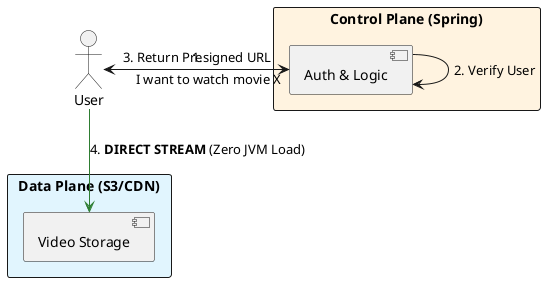

# 9.1: Large-Scale Media and BLOB Physics


## The Critical Dialogue


**Student:** We are trying to add video attachments to our Ledger reports. I tried storing the 500MB MP4 files as `byte[]` in Postgres, but now the database is extremely slow and our Spring Boot pods are crashing with `OutOfMemoryError`. Is Java bad at handling large files?


**Principal:** You are making a **Fundamental Architectural Category Error**. You are mixing the **Control Plane** with the **Data Plane**. A database and a JVM are for *Managing Metadata* (the Ticket), not for *Transporting Blobs* (the Movie). To reach Principal level, we must master **BLOB Physics**. We will decouple our application from the data stream using **Object Storage (S3)** and **CDN Edge Discovery**. We move from "Buffering Bytes" to **Orchestrating Streams**.


---


## 1. The Physics of Decoupling: Control vs. Data Plane


### 1.1 The "Movie Theater" Analogy


In a theater, you don't buy the ticket and then carry the physical film reel into the seat. 
. **The Control Plane:** The ticket booth (Spring Boot + Postgres). It handles "Who are you?", "Did you pay?", and "Where is the movie?". It deals in **KiloBytes**.
. **The Data Plane:** The projector and the screen (S3 + CDN). It handles the massive flow of bits to your eyes. It deals in **GigaBytes**.


### 1.2 Why the JVM should NEVER touch BLOBs


. **Heap Pollution:** Storing a 500MB video in a `byte[]` occupies 500MB of the JVM Heap. If 10 users download at once, your 4GB pod is dead.
. **Network Saturation:** The JVM's network stack is optimized for thousands of small packets, not for sustaining a 10Gbps stream of a single file.


---


## 2. Source Archaeology: S3 Presigned URLs


A Principal Architect uses **Presigned URLs** to hand off the Data Plane work directly to the cloud provider.


> [!abstract] The Mechanics: Cryptographic Handoff
> . **Step 1:** The user asks Spring Boot for a video.
> . **Step 2:** Spring verifies the user's identity (Control Plane).
> . **Step 3:** Spring generates a temporary, cryptographically signed URL for S3.
> . **Step 4:** The user's browser downloads the video **directly from S3**. 
> . **The Audit:** The JVM network usage is 0. The JVM memory usage is 0. The system scales to infinity.


---


## 3. Principal Implementation: The S3 Handoff Service


We will implement the logic to safely hand off a 10GB video download to the browser.


```java
@Service
public class MediaOrchestrator {
    private final S3Presigner s3Presigner;

    public String getSecureDownloadUrl(String movieId, String userId) {
        // 1. Control Plane: Validate Permissions
        if (!permissionService.canWatch(userId, movieId)) {
            throw new AccessDeniedException("Unauthorized");
        }

        // 2. Data Plane: Generate a 15-minute temporary link
        GetObjectRequest getObjectRequest = GetObjectRequest.builder()
            .bucket("ledger-media-fleet")
            .key(movieId + ".mp4")
            .build();

        PresignedGetObjectRequest presignedRequest = s3Presigner.presignGetObject(r -> r
            .signatureDuration(Duration.ofMinutes(15))
            .getObjectRequest(getObjectRequest));

        // 3. Return only the URL. The JVM is now FREE.
        return presignedRequest.url().toString();
    }
}
```


---


## 4. Visualizing the Handoff Flow





---


## 🧵 The GOL Challenge: Phase 12 (Blob Physics)


**Context:** Our Ledger reports are now 1GB ZIP files. The current system times out because it tries to stream the bytes through a `ResponseEntity(Resource)`.


**The Task:**


. **Handoff Refactor:** Implement the `MediaOrchestrator` using the AWS SDK (or a mock). Ensure that your Controller returns a `302 Redirect` to the presigned URL instead of streaming the bytes.


. **Edge Audit:** Research **CDN TTLs (Time To Live)**. If a video is updated, how do you ensure the CDN doesn't serve the old version? (Hint: The **Invalidation** vs. **Versioned Filenames** debate).


. **Throughput Math:** Calculate the cost (in terms of Pod count) if you streamed 1,000 concurrent 1GB files through Spring Boot vs. using the Handoff pattern.


---


## 🧠 Principal's Inquiry


. **Range Requests:** How does **HTTP Range 206** allow a user to skip to the middle of a 2-hour movie without downloading the first 90 minutes?


. **S3 Contention:** What is the "S3 Prefix" limit? Why should a Principal randomize the start of S3 keys (e.g., `hash/movieId.mp4`) to achieve 10,000+ requests per second?


. **HLS vs. DASH:** Why is video split into **2-second chunks** in modern streaming? How does this enable **Adaptive Bitrate Switching** when a user's 5G signal drops to 3G?


**Principal Summary:** BLOB Architecture is about **Knowing when to Let Go**. We use the Control Plane to maintain authority and the Data Plane to achieve scale, ensuring the JVM remains an agile orchestrator.
