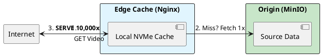

# 9.2: Edge Delivery: Envoy and Nginx Physics

## The Critical Dialogue

**Student:** We have our MinIO cluster. But when 10,000 users download reports at once, our internal network switch is saturated. Our app becomes unresponsive. How do we protect the datacenter?

**Principal:** You are trying to serve the world through a **Single Straw**. Even with Object Storage, if every request hits your core network, you fail. To reach Principal level, we must master **Edge Physics**. We will deploy **Nginx** as an internal CDN Cache and **Envoy** as an Edge Proxy. We move from "Centralized Delivery" to **Distributed Edge Presence**.

---

## 1. The Requirement: Global Data Planes

**The Problem:** The "Inbound Saturation."
. **Scenario:** 10,000 users download a 100MB file. Total bandwidth: **1 Terabit**.
. **The Result:** Your network core is wiped out. No one can log in.

---

## 2. Solution: Nginx as an Internal CDN

**The Principal Architecture:** We use Nginx to "Absorb" the load.

. **Mechanism:** The first user requests a file. Nginx fetches it from MinIO and stores it on a local **NVMe disk**.
. **The Magic:** The next 9,999 users get the file from the local Nginx disk at 100Gbps.
. **The Outcome:** MinIO only sees **1 request**, instead of 10,000.

---

## 🧠 Principal's Inquiry

. **Cache Invalidation:** If a Ledger report is updated in MinIO, how do you "Purge" the 50 Edge Nginx caches instantly?

. **DSR (Direct Server Return):** How can a Principal allow the Edge node to talk directly to the user's browser, bypassing the Envoy load balancer on the return path?

**Principal Summary:** Edge Delivery is about **Protecting the Origin**. We use Nginx to absorb volume and Envoy to manage health, ensuring our Data Plane is as fast as the local network of the user.
 Greenlanders use the type system to prove our software invariants.
