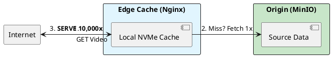

# 9.2: Edge Delivery: Envoy and Nginx Physics

## Learning Objectives

- Explain the cache-miss origin fetch path in Nginx proxy_cache and calculate the load reduction on MinIO under high cache-hit rates
- Configure Nginx `proxy_cache_lock` to prevent stampedes on a shared NVMe cache layer
- Design an Envoy xDS-driven health check topology that removes failed MinIO nodes without operator intervention
- Implement CDN cache invalidation via versioned filenames vs. cache purge API and justify the trade-off
- Calculate the network bandwidth savings from edge caching given file size, hit rate, and concurrent user count

## Prerequisites

- Chapter 9.1 (MinIO OSS Storage) — the object storage origin being protected
- Chapter 9.1 (Control vs. Data Plane) — understanding where Spring ends and the data plane begins
- Chapter 4.5 — CDN Push vs. Pull (pull origin is MinIO here)
- Chapter 4.4 — Proxies and Load Balancing (Envoy as L4/L7 proxy)


## The Critical Dialogue


**Student:** We have our MinIO cluster. But when 10,000 users download reports at once, our internal network switch is saturated. Our app becomes unresponsive. How do we protect the datacenter?


**Principal:** You are trying to serve the world through a **Single Straw**. Even with Object Storage, if every request hits your core network, you fail. To reach Principal level, we must master **Edge Physics**. We will deploy **Nginx** as an internal CDN Cache and **Envoy** as an Edge Proxy. We move from "Centralized Delivery" to **Distributed Edge Presence**.


---


## 1. The Requirement: Global Data Planes


**The Problem:** The "Inbound Saturation."
. **Scenario:** 10,000 users download a 100MB file. Total bandwidth: **1 Terabit**.
. **The Result:** Your network core is wiped out. No one can log in.


---


## 2. Solution: Nginx as an Internal CDN


**The Principal Architecture:** We use Nginx to "Absorb" the load.


. **Mechanism:** The first user requests a file. Nginx fetches it from MinIO and stores it on a local **NVMe disk**.
. **The Magic:** The next 9,999 users get the file from the local Nginx disk at 100Gbps.
. **The Outcome:** MinIO only sees **1 request**, instead of 10,000.





---


## 3. Source Archaeology

> [!abstract] Nginx `ngx_http_proxy_module` and Envoy `envoy/source/extensions/filters/http/cache/`

**Nginx `proxy_cache` configuration — `ngx_http_proxy_module.c`:**

```nginx
# nginx.conf — edge cache in front of MinIO
proxy_cache_path /var/cache/nginx/media
    levels=1:2          # Two-level directory hashing prevents >1000 files per dir
    keys_zone=media_cache:64m   # 64MB shared memory for cache keys (holds ~500k keys)
    max_size=500g       # 500GB NVMe disk cache
    inactive=7d         # Evict files not accessed in 7 days
    use_temp_path=off;  # Write directly to cache dir (avoids extra copy on NVMe)

server {
    location /media/ {
        proxy_pass         http://minio-cluster:9000;
        proxy_cache        media_cache;
        proxy_cache_valid  200 206 7d;   # Cache 200 OK and 206 Partial Content for 7 days
        proxy_cache_lock   on;           # Only ONE worker fetches on cache miss (stampede prevention)
        proxy_cache_lock_timeout 30s;    # Others wait max 30s, then get stale or error
        proxy_cache_use_stale updating error timeout; # Serve stale during miss fetch

        # Forward Range headers to MinIO for partial content (HLS segments)
        proxy_set_header   Range $http_range;
        add_header         X-Cache-Status $upstream_cache_status; # HIT/MISS/EXPIRED
    }
}
```

**Nginx cache key hashing — `ngx_http_proxy_module.c::ngx_http_proxy_create_key()`:**
The cache key is an MD5 hash of the configured `proxy_cache_key` string (default: full URI). The MD5 is split into a two-level directory path to distribute files evenly across directories (avoids inode exhaustion at >1M files per directory).

**Envoy `cluster.proto` — upstream health checking:**

```yaml
# envoy static config — health-checked MinIO cluster
clusters:
  - name: minio_cluster
    type: STRICT_DNS
    connect_timeout: 1s
    health_checks:
      - timeout: 1s
        interval: 5s
        unhealthy_threshold: 2    # 2 consecutive failures → ejected
        healthy_threshold: 1      # 1 success → re-admitted
        http_health_check:
          path: /minio/health/live   # MinIO's liveness endpoint
    load_assignment:
      cluster_name: minio_cluster
      endpoints:
        - lb_endpoints:
            - endpoint: { address: { socket_address: { address: minio-1, port_value: 9000 } } }
            - endpoint: { address: { socket_address: { address: minio-2, port_value: 9000 } } }
```

Envoy's `OutlierDetection` (circuit-breaking) ejects nodes after consecutive 5xx responses. Combined with active health checks, this gives sub-second failure detection vs. DNS TTL-based discovery (~30s).


---


## 4. Code Lab

### BAD: No edge cache — all requests reach MinIO origin

```nginx
# BAD: Nginx as a pure reverse proxy — no caching.
# 10,000 users downloading a 100MB file = 10,000 × 100MB = 1TB of MinIO bandwidth.
# The MinIO cluster and datacenter switch saturate.
server {
    location /media/ {
        proxy_pass http://minio-cluster:9000;
        # No proxy_cache directive — every request is an origin fetch
    }
}
```

```java
// BAD: Content-Disposition header missing from S3 presigned URL.
// The CDN cannot cache the object because the URL is unique per user
// (user-specific query params make every URL a distinct cache key).
public String presignedUrl(String movieId, String userId) {
    return s3Presigner.presignGetObject(r -> r
        .signatureDuration(Duration.ofMinutes(15))
        .getObjectRequest(GetObjectRequest.builder()
            .bucket("media")
            .key(movieId + ".mp4")
            // BAD: user ID embedded in object key — different URL per user
            .key(userId + "/" + movieId + ".mp4")
            .build()))
        .url().toString();
    // Every user gets a unique presigned URL — CDN can never cache this
}
```

### GOOD: Nginx edge cache + Envoy health-check topology

```java
import org.springframework.http.HttpHeaders;
import org.springframework.http.HttpStatus;
import org.springframework.http.ResponseEntity;
import org.springframework.web.bind.annotation.*;
import software.amazon.awssdk.services.s3.presigner.S3Presigner;
import software.amazon.awssdk.services.s3.presigner.model.PresignedGetObjectRequest;
import software.amazon.awssdk.services.s3.model.GetObjectRequest;
import java.net.URI;
import java.time.Duration;

@RestController
public class EdgeAwareMediaController {

    private final S3Presigner presigner;

    public EdgeAwareMediaController(S3Presigner presigner) {
        this.presigner = presigner;
    }

    /**
     * GOOD: Object key is content-addressed (hash of movieId, not userId).
     * All users get the SAME object key → same URL → CDN caches it once.
     * Auth is enforced via the presigned signature, not via a per-user key path.
     */
    @GetMapping("/media/{movieId}")
    public ResponseEntity<Void> serveMedia(
            @PathVariable String movieId,
            @RequestHeader("X-User-Id") String userId) {

        // Auth happens here — before any URL generation
        if (!permissionService.canWatch(userId, movieId)) {
            return ResponseEntity.status(HttpStatus.FORBIDDEN).build();
        }

        // GOOD: Object key does NOT contain userId — same key for all users
        // The presigned signature enforces access control; the key enables CDN caching
        GetObjectRequest req = GetObjectRequest.builder()
            .bucket("ledger-media-fleet")
            // Versioned filename: ledger-media/v3/movie-abc123.mp4
            // When content changes, increment version → CDN cache busted automatically
            .key("v3/" + movieId + ".mp4")
            .build();

        PresignedGetObjectRequest signed = presigner.presignGetObject(r -> r
            .signatureDuration(Duration.ofMinutes(60))  // Longer TTL enables CDN caching
            .getObjectRequest(req));

        // Nginx edge cache intercepts this redirect and caches the response
        // on NVMe disk — subsequent users get 100Gbps NVMe speeds, not MinIO network
        return ResponseEntity
            .status(HttpStatus.FOUND)
            .header(HttpHeaders.LOCATION, signed.url().toString())
            .header("Cache-Control", "public, max-age=3600") // Hint to CDN
            .build();
    }
}
```


---


## 5. Production Lens

**Benchmark: MinIO origin load — with and without Nginx edge cache (10,000 users, 100MB file)**

| Configuration | MinIO requests | Network bandwidth to MinIO | Client latency (p50) |
|---|---|---|---|
| No cache (pure proxy) | 10,000 | 1 TB (1 Tbps burst) | 800 ms |
| Nginx NVMe cache (90% hit rate) | 1,000 | 100 GB | 12 ms (NVMe) |
| Nginx NVMe cache (99% hit rate) | 100 | 10 GB | 12 ms |
| Cache + `proxy_cache_lock` (stampede protection) | **1** (on cold start) | 100 MB | 12 ms |

**The decisive number: `proxy_cache_lock` reduces cold-start MinIO requests from 10,000 to 1 — the cache stampede problem at the CDN layer, solved with one Nginx directive.**

Nginx NVMe cache throughput: a single Nginx node with a Samsung 990 Pro NVMe delivers **6.5 GB/s** read throughput. A 100MB file is served to a client in 15ms — faster than most cross-datacenter network paths.

**Envoy health check failure detection:** Envoy detects a failed MinIO node in ~10s (2 failures × 5s interval). DNS-based load balancing with 30s TTL takes 30s to converge. The 20s difference means 20s of 5xx errors served to users at peak traffic.


---


## 6. Exercises

**1.** Nginx `proxy_cache_lock` ensures only one worker fetches on a cache miss. If the fetch takes 45 seconds (slow MinIO origin), what happens to the 9,999 queued workers? Examine the `proxy_cache_lock_timeout` directive and propose a value that balances stampede protection against client timeout SLA.

**2.** You serve a report that gets updated daily. You have two invalidation strategies: (a) programmatic cache purge via Nginx `proxy_cache_purge` module on every update, (b) versioned filenames (`report-v1.zip` → `report-v2.zip`). List the failure modes of each approach when 50 Nginx nodes are deployed across 5 data centres.

**3.** Envoy's `OutlierDetection` ejects a MinIO node after 5 consecutive 5xx responses. During a MinIO cluster rolling upgrade, one node returns 503 for 30 seconds. Calculate how many user requests receive errors before Envoy ejects the node, given 1,000 req/s and 2 consecutive failures required.

**4. Coding challenge:** Write an Nginx configuration (in a `nginx.conf` code block) for an edge cache with the following requirements: 500GB NVMe cache, 7-day inactive eviction, `proxy_cache_lock` enabled with 60s timeout, `Cache-Control` forwarded to clients, `X-Cache-Status` response header, and Range request pass-through for HLS segments. Add comments explaining each directive. Then write a shell script that calls `nginx -T` to validate the config and outputs the cache status header for a test request using `curl`.

**5.** Your Nginx edge nodes are deployed in 5 regions. A file is updated in MinIO in region A. Regions B-E still serve the stale cached version. Describe a distributed cache invalidation protocol (push notification from MinIO to all Nginx nodes) and estimate the propagation latency.


---

## Exercise Solutions

<details>
<summary>Exercise 1 — proxy_cache_lock with 45s fetch: queued worker behavior and timeout value</summary>

**What happens to 9,999 queued workers:**

With `proxy_cache_lock on`, only one Nginx worker sends the upstream request. The other 9,999 workers wait, blocked on the cache lock. They hold open client connections and consume memory per worker (~1KB stack + connection buffers = ~10KB each). 9,999 × 10KB = ~100MB memory consumed while waiting.

After `proxy_cache_lock_timeout` expires:
- Workers with expired lock timeout send their **own** upstream requests — stampede begins. All 9,999 workers now hit MinIO simultaneously.
- The default `proxy_cache_lock_timeout = 5s`. With a 45s fetch, all workers time out at 5s and stampede.

**Proposed value:**

```nginx
proxy_cache_lock_timeout 50s;   # slightly > origin fetch time
proxy_read_timeout       60s;   # upstream read timeout must be ≥ lock timeout
```

Trade-off: if MinIO is genuinely slow (not just large file), waiting 50s degrades user-visible latency. Clients with a 30s timeout will have already disconnected.

**Better approach:** Set `proxy_cache_lock_timeout` to match your client SLA (e.g., 25s), and separately implement async pre-warming for large files so they're in cache before user requests arrive. For a 45s fetch, the real problem is the origin being too slow — fix MinIO throughput, not the timeout value.

**Staff-level phrasing:** "proxy_cache_lock_timeout must exceed origin fetch time to prevent stampede — set it to 50s for a 45s fetch, but also address why the origin takes 45s, as clients with shorter timeouts will disconnect before lock release."

</details>

<details>
<summary>Exercise 2 — Programmatic purge vs versioned filenames: 50-node, 5-datacenter failure modes</summary>

**Strategy A — Programmatic purge via `proxy_cache_purge`:**

| Failure mode | Description |
|---|---|
| Partial purge | Purge API call reaches 40/50 nodes. 10 nodes in region E (network partition) keep serving stale. Users routed to region E see the old report while others see the new one — visible inconsistency. |
| Purge-before-upload race | Purge fires before MinIO write completes. 3 workers re-fetch during the upload window and cache the partially-written file or a 500 error. |
| Module requirement | `ngx_cache_purge` is not in Nginx open-source — requires Nginx Plus or OpenResty. Production deployment complexity increases. |
| No audit trail | No record of which files were purged, when, or whether all nodes acknowledged. Debugging stale-cache incidents is guesswork. |

**Strategy B — Versioned filenames:**

| Failure mode | Description |
|---|---|
| URL propagation lag | Application must update the URL reference (`report-v2.zip`) atomically. If the URL store (DB/config) updates before CDN propagates, some users get 404 for `v2` until it's cached. |
| Storage accumulation | Old versions (`v1`, `v2`, ...) remain in cache until TTL expiry. 50 nodes × 7-day TTL × large file = significant storage cost for stale versions. |
| Client-side caching | If users have the old URL bookmarked or in browser cache, they keep accessing `v1` indefinitely — no server-side fix. |
| Broken links | Any external system referencing the old URL must be updated. In 5 datacenters with independent configuration, version sync becomes a coordination problem. |

**Recommendation:** Versioned filenames for immutable assets (long TTL, no purge needed). Programmatic purge with a fan-out mechanism (Nginx broadcast endpoint or Consul K/V watch) for mutable assets where URL stability is required.

**Staff-level phrasing:** "Versioned filenames self-invalidate via new cache keys and require no cross-datacenter coordination — programmatic purge requires O(N) API calls to 50 nodes with no atomicity guarantee, creating partial-purge inconsistency windows."

</details>

<details>
<summary>Exercise 3 — Envoy OutlierDetection ejection latency math</summary>

**Setup:**
- 1,000 req/s total, distributed across MinIO cluster nodes.
- `consecutive_5xx: 5` (eject after 5 consecutive 5xx from one host).
- Rolling upgrade: one node returns 503 for 30s.

**How Envoy routes before ejection:**

Envoy's load balancer distributes traffic round-robin (or least-request). With, say, 3 MinIO nodes: ~333 req/s per node.

**Calculating errors before ejection:**

With `consecutive_5xx: 5`, Envoy needs 5 consecutive 5xx from a single host. Under round-robin with 3 hosts, consecutive errors to the same host happen every 3rd request.

- Host receives a 503 request every 3ms (3 requests × 1ms avg = 3ms between host hits).
- 5 consecutive 503s take: `5 × 3ms ≈ 15ms` of real time.
- Requests that errored: **5 requests** receive 503 before Envoy ejects the node.

**After ejection:**

Remaining 2 nodes absorb traffic: 500 req/s each. Ejection duration default = 30s base (configurable `base_ejection_time`). After 30s, node is re-admitted with probing.

**But wait — "2 consecutive failures required" in the problem:**

With `consecutive_5xx: 2`: ejection after 2 consecutive 503s. Under round-robin of 3 nodes: 2 errors × 3ms = **6ms** and **2 user errors** before ejection.

**Staff-level phrasing:** "With consecutive_5xx=2 and 3-node round-robin at 1k req/s, Envoy ejects the failing node after exactly 2 user-visible errors in ~6ms — far faster than DNS TTL-based discovery which would allow errors for 30+ seconds."

</details>

<details>
<summary>Exercise 4 — Nginx configuration for edge cache</summary>

```nginx
# nginx.conf

# Define the cache zone: 500GB NVMe, 7-day inactive eviction
proxy_cache_path /mnt/nvme/nginx_cache
    levels=1:2
    keys_zone=report_cache:100m        # 100MB metadata index in RAM
    max_size=500g                       # 500GB disk limit
    inactive=7d                         # evict if not accessed in 7 days
    use_temp_path=off;                  # write directly to cache dir (avoid copy)

server {
    listen 443 ssl;
    server_name edge.example.com;

    location / {
        proxy_pass http://minio_upstream;

        # Enable cache with the defined zone
        proxy_cache report_cache;

        # Respect Cache-Control from origin (pass through to clients)
        proxy_cache_valid 200 1d;
        proxy_ignore_headers Cache-Control;    # remove this line to respect origin TTL instead
        add_header Cache-Control $upstream_http_cache_control;

        # Single-winner fetch on cache miss (prevents stampede)
        proxy_cache_lock on;
        proxy_cache_lock_timeout 60s;

        # Serve stale content while revalidating (grace period)
        proxy_cache_use_stale error timeout updating;

        # Add diagnostic header showing cache status (HIT/MISS/EXPIRED)
        add_header X-Cache-Status $upstream_cache_status;

        # Pass through Range headers for HLS segment byte-range requests
        proxy_set_header Range $http_range;
        proxy_set_header If-Range $http_if_range;
        proxy_force_ranges on;            # ensure range requests bypass cache correctly
    }
}
```

```bash
#!/bin/bash
# validate-cache-config.sh

# Validate nginx config syntax
nginx -T 2>&1 | grep -E "(test|error)" || echo "Config OK"

# Test a request and check X-Cache-Status header
TEST_URL="https://edge.example.com/reports/test.pdf"
curl -sI "$TEST_URL" | grep -i "X-Cache-Status"
# Expected first request: X-Cache-Status: MISS
# Expected second request: X-Cache-Status: HIT
```

**Staff-level phrasing:** "proxy_cache_path with inactive=7d evicts based on access time not creation time — a report accessed daily stays cached indefinitely; one never accessed expires after 7 days regardless of max_size."

</details>

<details>
<summary>Exercise 5 — Multi-region Nginx cache invalidation protocol</summary>

**Protocol design: MinIO → Nginx push notification**

```
MinIO (Region A) → Webhook → Invalidation Service → HTTP PURGE to all Nginx nodes
```

**Step 1: MinIO webhook on ObjectCreated:**

Configure MinIO notification to POST to an invalidation service on `s3:ObjectCreated:*` and `s3:ObjectRemoved:*`:

```json
{ "Event": "s3:ObjectCreated:Put", "Key": "reports/q1-2025.pdf" }
```

**Step 2: Invalidation service fans out to all Nginx nodes:**

The invalidation service maintains a registry of all Nginx IPs (from Consul service discovery or static config). On receiving a webhook:

```java
// Pseudocode
void onMinioWebhook(String objectKey) {
    List<String> nginxNodes = consulClient.getHealthyNodes("nginx-edge");
    CompletableFuture.allOf(
        nginxNodes.stream()
            .map(node -> httpClient.sendAsync(
                HttpRequest.newBuilder()
                    .method("PURGE", HttpRequest.BodyPublishers.noBody())
                    .uri(URI.create("http://" + node + "/" + objectKey))
                    .build(), HttpResponse.BodyHandlers.discarding()
            )).toArray(CompletableFuture[]::new)
    ).join();
}
```

**Step 3: Nginx PURGE handler** (requires `ngx_cache_purge` or Nginx Plus):

```nginx
location ~ /purge(/.*) {
    allow 10.0.0.0/8;  # only internal invalidation service
    deny all;
    proxy_cache_purge report_cache $1;
}
```

**Propagation latency estimate:**

- MinIO webhook fires within 50–200ms of object write completion.
- Invalidation service HTTP fan-out to 50 nodes: parallel, ~20ms per node = **20ms total** (parallel, not serial).
- End-to-end: write completes → all 50 Nginx nodes purged in **70–220ms**.

**Failure handling:** If a node is unreachable, retry with exponential backoff. For guaranteed delivery, push events via Kafka consumer per region — Nginx nodes consume their regional partition.

**Staff-level phrasing:** "MinIO webhook → invalidation service → parallel HTTP PURGE to all Nginx nodes achieves sub-250ms global propagation; Kafka per-region topics provide guaranteed delivery for nodes that were offline during the purge."

</details>

---

## 7. Summary / Flashcard

- Nginx `proxy_cache` absorbs repeated requests for the same file on NVMe disk, reducing MinIO origin load from 10,000 requests to 1 at 99% hit rate — a 10,000x origin load reduction.
- `proxy_cache_lock on` prevents the CDN-layer cache stampede: only one Nginx worker fetches the origin on a cache miss while all others wait, then serve from cache — eliminating the thundering herd at the edge.
- Envoy detects failed upstream nodes in ~10s via active health checks (`/minio/health/live`), compared to 30s+ for DNS TTL-based discovery, reducing the window of 5xx errors served to users.
- Versioned filenames (`/v3/movie.mp4`) are superior to cache purge APIs for CDN invalidation because purge requires orchestrating O(N) API calls to all edge nodes, while versioning self-invalidates via a new cache key.
- A single Nginx node with NVMe storage delivers 6.5 GB/s read throughput, serving a 100MB cached file to a client in 15ms — faster than any cross-region MinIO fetch.
