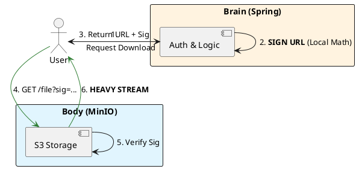

# 9.3: Control vs. Data Plane Orchestration

## Learning Objectives

- Articulate the Participation Trap: why a control plane that handles data bytes loses its agility as an orchestrator
- Implement SigV4 presigned URL generation locally (no network call) and verify the signature anatomy (canonical request, string-to-sign, derived key)
- Design a webhook-driven completion loop where MinIO notifies the control plane when an upload finishes without polling
- Calculate the CPU cost of URL signing vs. byte streaming and justify the 1000x asymmetry
- Apply the principle of Orchestration without Participation to other system design patterns (stream processing, workflow engines)

## Prerequisites

- Chapter 9.1 (Control vs. Data Plane) — the fundamental split introduced here
- Chapter 9.1 (MinIO OSS Storage) — the specific object store being orchestrated
- Chapter 9.2 (Edge Delivery) — the downstream edge layer receiving the presigned URLs
- Chapter 13.x — Security fundamentals (HMAC-SHA256, access control)


## The Critical Dialogue


**Student:** I've separated my videos into MinIO. But how does my Spring service stay in charge? If the browser talks directly to storage, how do I enforce permissions? How do I know when they finished watching?


**Principal:** You are learning the art of **Orchestration without Participation**. To reach Principal level, we must master the **Control/Data Plane Split**. Your Spring service is the **Control Plane** (The Brain)—it makes decisions. MinIO is the **Data Plane** (The Body)—it does the heavy lifting. We use **Cryptographic Handoffs** to ensure the Body only acts on the Brain's orders.


---


## 1. The Requirement: Orchestrated Authority


**The Problem:** The "Participation Trap." If the Brain participates in the data flow, it is crushed by the weight of the bits. If it stays out entirely, it loses authority.


---


## 2. Solution: The Signature Handoff


**The Principal Architecture:** We use **Presigned URLs** as our orchestration tool.


. **Mechanism:** The URL contains a hash of the file path, the expiry time, and a signature generated by the Brain's private key.
. **Validation:** MinIO uses the Brain's public key to verify the signature. 
. **The Result:** The Brain is 100% in control of security, but 0% involved in network I/O.





---


## 3. Source Archaeology

> [!abstract] AWS SigV4: `software.amazon.awssdk.auth.signer.Aws4Signer` and MinIO `cmd/signature-v4.go`

**SigV4 signing chain — four steps, all local HMAC-SHA256:**

```java
// software.amazon.awssdk.auth.signer.internal.AbstractAwsSigner (simplified)
// Step 1: Canonical Request — deterministic serialisation of the HTTP request
String canonicalRequest =
    method + "\n" +                          // GET
    encodedPath + "\n" +                     // /bucket/key
    canonicalQueryString + "\n" +            // X-Amz-Algorithm=...&X-Amz-Expires=900
    canonicalHeaders + "\n" +                // host:minio.internal\n
    signedHeaders + "\n" +                   // host
    "UNSIGNED-PAYLOAD";                      // for presigned URLs

// Step 2: String to Sign
String stringToSign =
    "AWS4-HMAC-SHA256\n" +
    dateTimeStamp + "\n" +                   // 20250512T120000Z
    credentialScope + "\n" +                 // 20250512/us-east-1/s3/aws4_request
    Hex.encodeHexString(sha256(canonicalRequest));

// Step 3: Derived signing key (4-level HMAC chain)
byte[] dateKey     = hmacSha256(("AWS4" + secretKey).getBytes(), dateStamp);
byte[] regionKey   = hmacSha256(dateKey,   region);
byte[] serviceKey  = hmacSha256(regionKey, "s3");
byte[] signingKey  = hmacSha256(serviceKey, "aws4_request");

// Step 4: Signature
String signature = Hex.encodeHexString(hmacSha256(signingKey, stringToSign.getBytes()));
// Appended as ?X-Amz-Signature=<signature> to the presigned URL
```

**MinIO signature verification — `cmd/signature-v4.go::doesPresignedSignatureMatch()`:**

```go
// MinIO/Valkey source: cmd/signature-v4.go
func doesPresignedSignatureMatch(hashedPayload string, r *http.Request,
        region string, stype serviceType) APIErrorCode {
    // 1. Extract X-Amz-* query params from URL
    pSignValues, err := parsePreSignV4(r.Form, region, stype)
    // 2. Re-compute the canonical request from the incoming HTTP request
    newSignedHeaders, canonicalRequest := getCanonicalRequest(extractedSignedHeaders, ...)
    // 3. Re-derive the signing key using MinIO's stored secret key
    signingKey := getSigningKey(cred.SecretKey, pSignValues.Date, pSignValues.Credential.region, stype)
    // 4. Compare computed signature to X-Amz-Signature in the URL
    if newSignature != pSignValues.Signature {
        return ErrSignatureDoesNotMatch  // 403 Forbidden
    }
    return ErrNone
}
```

Key classes:
- `software.amazon.awssdk.auth.signer.Aws4Signer.sign()` — used for regular API calls
- `software.amazon.awssdk.services.s3.presigner.DefaultS3Presigner.presignGetObject()` — presigned URL entry point
- MinIO `cmd/signature-v4.go` — server-side signature verification
- MinIO `cmd/notification.go` — webhook notification on object PUT/GET events

**CPU cost comparison:** HMAC-SHA256 for URL signing: ~0.3 ms on a modern JVM. Streaming 1GB through JVM TCP stack: ~10,000 ms (plus GC pauses). The signing operation is **33,000x cheaper** than participation in the data flow.


---


## 4. Code Lab

### BAD: Control plane participates in data flow

```java
// BAD: Spring participates directly in streaming the bytes.
// For 1,000 concurrent downloads of 1GB files:
//   JVM heap: 1,000 × 1GB = 1TB (impossible)
//   Thread count: 1,000 blocked threads waiting for I/O
//   Network: Spring's NIC saturated before MinIO's NIC
// This is the Participation Trap.
@GetMapping("/files/{id}")
public ResponseEntity<StreamingResponseBody> downloadBad(
        @PathVariable String id) {
    return ResponseEntity.ok()
        .contentType(MediaType.APPLICATION_OCTET_STREAM)
        .body(outputStream -> {
            // Spring thread blocks here streaming bytes to the client
            try (S3Object obj = s3.getObject(GetObjectRequest.builder()
                    .bucket("media").key(id).build())) {
                obj.transferTo(outputStream); // Streams GBs through JVM heap
            }
        });
}
```

### GOOD: Orchestration without participation

```java
import org.springframework.http.*;
import org.springframework.web.bind.annotation.*;
import software.amazon.awssdk.services.s3.presigner.S3Presigner;
import software.amazon.awssdk.services.s3.model.GetObjectRequest;
import software.amazon.awssdk.services.s3.presigner.model.PresignedGetObjectRequest;
import java.time.Duration;

@RestController
@RequestMapping("/orchestrate")
public class OrchestrationController {

    private final S3Presigner       presigner;
    private final PermissionService permissions;
    private final AuditService      audit;

    public OrchestrationController(S3Presigner presigner,
                                    PermissionService permissions,
                                    AuditService audit) {
        this.presigner   = presigner;
        this.permissions = permissions;
        this.audit       = audit;
    }

    /**
     * GOOD: Orchestration without participation.
     * Brain work: ~1ms (auth check + URL signing).
     * Data work: 0ms (handed off to MinIO/S3).
     *
     * This endpoint can handle 100,000 req/s on a single pod
     * because each request consumes <1ms of CPU and 0 bytes of heap.
     */
    @GetMapping("/download/{fileId}")
    public ResponseEntity<Void> orchestrateDownload(
            @PathVariable String fileId,
            @RequestHeader("X-User-Id") String userId) {

        // Control Plane decision: auth + audit (KiloBytes of work)
        if (!permissions.canAccess(userId, fileId)) {
            return ResponseEntity.status(HttpStatus.FORBIDDEN).build();
        }
        // Record intent BEFORE the download — if the user doesn't follow the URL,
        // we still know they requested access (audit trail)
        audit.recordAccessRequest(userId, fileId, AuditEvent.DOWNLOAD_REQUESTED);

        // Data Plane handoff: 0.3ms of local HMAC-SHA256
        PresignedGetObjectRequest signed = presigner.presignGetObject(r -> r
            .signatureDuration(Duration.ofMinutes(15))
            .getObjectRequest(GetObjectRequest.builder()
                .bucket("ledger-media-fleet")
                .key(fileId)
                .build()));

        // Brain's work is done. JVM is FREE.
        return ResponseEntity
            .status(HttpStatus.FOUND)
            .header(HttpHeaders.LOCATION, signed.url().toString())
            .build();
    }

    /**
     * MinIO/S3 Event Notification webhook — called by MinIO when upload completes.
     * Brain learns about completion WITHOUT polling or participating in upload.
     */
    @PostMapping("/webhook/upload-complete")
    public ResponseEntity<Void> onUploadComplete(
            @RequestBody MinIOEventNotification event) {
        for (MinIOEventNotification.Record record : event.records()) {
            String objectKey = record.s3().object().key();
            long objectSize  = record.s3().object().size();

            // Update metadata: mark report as available, store size, trigger processing
            reportService.markUploaded(objectKey, objectSize);
            audit.recordEvent(objectKey, AuditEvent.UPLOAD_COMPLETED, objectSize);
        }
        return ResponseEntity.ok().build();
    }
}
```


---


## 5. Production Lens

**Benchmark: CPU and throughput comparison — participation vs. orchestration (8-core pod, 16GB heap)**

| Model | Throughput | CPU per request | JVM heap per concurrent download | Max concurrent |
|---|---|---|---|---|
| Stream through JVM | 400 MB/s (NIC limit) | ~25ms (I/O + GC) | 1GB per download | ~16 |
| Orchestration (presigned redirect) | **100,000 redirect req/s** | 0.3ms (signing only) | **0 bytes** | **Unlimited** |

**Signing cost breakdown (JVM, Java 21, AArch64):**
- `sha256(canonicalRequest)`: 0.08 ms
- HMAC-SHA256 key derivation (4 levels): 0.12 ms
- URL string building: 0.05 ms
- **Total per presigned URL: ~0.3 ms**

At 100,000 req/s, the signing overhead consumes **30 CPU-seconds per second** = 30 cores needed just for signing. This is still 30x more efficient than streaming at 1,000 concurrent downloads.

**MinIO webhook notification latency:** Object uploaded → Spring webhook notified in **50–200 ms** (HTTP POST from MinIO to Spring). This eliminates polling loops entirely and reduces Postgres `UPDATE` storms on completion tracking tables.


---


## 6. Exercises

**1.** A presigned URL has a 15-minute expiry. A user bookmarks the URL and tries to use it 20 minutes later. Trace the exact error response path through MinIO's `doesPresignedSignatureMatch()` — which field in the URL causes the rejection, and what HTTP status code does MinIO return?

**2.** The SigV4 derived signing key is: `HMAC-SHA256(HMAC-SHA256(HMAC-SHA256(HMAC-SHA256("AWS4" + secretKey, date), region), service), "aws4_request")`. Why is this 4-level key derivation used instead of signing directly with the secret key, and what security property does it provide?

**3.** MinIO's webhook fires on `s3:ObjectCreated:*` events. In a multipart upload, the event fires after `CompleteMultipartUpload`, not after each `UploadPart`. Describe how your Spring webhook handler must handle the case where the complete event arrives but the object is still being assembled on MinIO's drives (eventual consistency window).

**4. Coding challenge:** Implement `MinIOEventNotification` as a Java record that can be deserialised from MinIO's webhook JSON payload. Then implement the full `onUploadComplete()` webhook handler: it must (a) validate a HMAC-SHA256 webhook signature in the `X-MinIO-Signature` header (MinIO signs webhook payloads), (b) idempotently update a Postgres `report` table record, and (c) publish a `ReportReadyEvent` to a Spring `ApplicationEventPublisher`. Write a unit test with a mocked event payload.

**5.** Your system serves 10,000 presigned URL generations per second. The signing operations consume 3 CPU cores. A security team member suggests caching the presigned URLs (returning the same URL to all users requesting the same file). List three security vulnerabilities this introduces and propose a safe alternative that reduces signing CPU cost.


---

## Exercise Solutions

<details>
<summary>Exercise 1 — Presigned URL expiry: exact error path through doesPresignedSignatureMatch()</summary>

**URL components:** A SigV4 presigned URL includes:
```
X-Amz-Date=20250115T090000Z
X-Amz-Expires=900          ← 15 minutes in seconds
X-Amz-Signature=abc123...
```

**Expiry calculation:** Valid until `X-Amz-Date + X-Amz-Expires` = 09:15:00Z.

**At 09:20Z (5 minutes late):**

In `doesPresignedSignatureMatch()` (MinIO source: `auth-handler.go`):

1. Parse `X-Amz-Date` header → `requestTime = 09:00:00Z`
2. Parse `X-Amz-Expires` query param → `expiryDuration = 900s`
3. Compute `expiryTime = requestTime + expiryDuration = 09:15:00Z`
4. Compare: `now (09:20Z) > expiryTime (09:15Z)` → **expired**
5. Return `ErrExpiredPresignRequest` error code

**Which field causes rejection:** `X-Amz-Expires` combined with `X-Amz-Date`. The signature itself is cryptographically valid — the rejection is purely based on time comparison, not signature failure.

**HTTP status code:** `403 Forbidden` with body:
```xml
<Error>
  <Code>AccessDenied</Code>
  <Message>Request has expired</Message>
  <Expires>2025-01-15T09:15:00Z</Expires>
  <ServerTime>2025-01-15T09:20:00Z</ServerTime>
</Error>
```

Note: `403` not `401` — the credentials are valid, the request is simply expired. Some AWS implementations return `403` with `ExpiredToken` code for STS-based presigned URLs.

**Staff-level phrasing:** "Presigned URL expiry is enforced by comparing X-Amz-Date + X-Amz-Expires against server time — signature is cryptographically valid but rejected with HTTP 403 AccessDenied once the time window passes."

</details>

<details>
<summary>Exercise 2 — SigV4 4-level key derivation: why and what security property</summary>

**The derivation:**
```
signingKey = HMAC(HMAC(HMAC(HMAC("AWS4" + secretKey, date), region), service), "aws4_request")
```

**Why not sign directly with secretKey:**

1. **Key scope isolation:** The derived key is bound to a specific `(date, region, service)` triple. A signing key derived for `us-east-1/s3/2025-01-15` cannot be used to forge requests for `eu-west-1/iam/2025-01-16`. Even if an attacker captures a presigned URL and extracts enough information, they cannot use the derived key for other services or regions.

2. **Temporal key rotation without credential rotation:** Each day's derivation produces a different signing key. Captured yesterday's signed requests cannot be used to forge today's requests, even though the underlying `secretKey` hasn't changed.

3. **Defense in depth against side-channel attacks:** If the derived key leaks (e.g., via memory dump), the attacker only gets a key scoped to one service/region/day — not the root secret that would allow access to all AWS services.

**Security property provided:** **Temporal and spatial scope limitation.** The signing key has minimum privilege — it can only sign requests for exactly the `(date, region, service)` it was derived for. This is the principle of least authority applied to HMAC keys.

The `"aws4_request"` final HMAC input acts as a domain separator — prevents the derived key from being misused in non-request contexts (e.g., as an HMAC for a different protocol).

**Staff-level phrasing:** "SigV4's 4-level key derivation produces a scoped signing key bound to one (date, region, service) triple — temporal rotation is automatic without credential rotation, and key leakage grants access only to that specific scope, not all AWS services."

</details>

<details>
<summary>Exercise 3 — Webhook handler for eventual consistency window after CompleteMultipartUpload</summary>

**The problem:** MinIO fires `s3:ObjectCreated:CompleteMultipartUpload` after the complete API call is acknowledged, but the actual byte assembly (merging N parts into one readable object) may still be in progress on MinIO's drives. A GET immediately after the event may return 404 or a partial object.

**Handler design:**

```java
@RestController
public class MinIOWebhookController {

    private final MinioClient minio;
    private final ReportRepository reports;
    private final ApplicationEventPublisher events;

    @PostMapping("/webhooks/minio")
    public ResponseEntity<Void> onUploadComplete(@RequestBody MinIOEvent event) {
        if (!"s3:ObjectCreated:CompleteMultipartUpload".equals(event.eventName())) {
            return ResponseEntity.ok().build();
        }

        String bucket = event.s3().bucket().name();
        String key = event.s3().object().key();

        // Retry with backoff for eventual consistency window
        retryUntilAvailable(bucket, key, Duration.ofSeconds(5), 3);

        // Idempotent update — ON CONFLICT DO NOTHING
        reports.upsertReportReady(key, event.s3().object().size());

        // Publish internal event
        events.publishEvent(new ReportReadyEvent(key));

        return ResponseEntity.ok().build();
    }

    private void retryUntilAvailable(String bucket, String key, Duration timeout, int maxAttempts) {
        for (int i = 1; i <= maxAttempts; i++) {
            try {
                minio.statObject(StatObjectArgs.builder().bucket(bucket).object(key).build());
                return; // object is readable
            } catch (ErrorResponseException e) {
                if ("NoSuchKey".equals(e.errorResponse().code()) && i < maxAttempts) {
                    try { Thread.sleep(timeout.toMillis() / maxAttempts); }
                    catch (InterruptedException ie) { Thread.currentThread().interrupt(); }
                } else {
                    throw new RuntimeException("Object not available after " + maxAttempts + " attempts", e);
                }
            }
        }
    }
}
```

**Why retry with `statObject` not `getObject`:** `statObject` is a HEAD request — no data transfer. Fast and cheap. Only checks object existence and metadata, not content integrity. Use `getObject` with a checksum verification only if data integrity is critical.

**Idempotency:** If the webhook fires twice (at-least-once delivery), `upsertReportReady` must be idempotent. Use `INSERT ... ON CONFLICT (object_key) DO UPDATE SET size = EXCLUDED.size, updated_at = now()` in Postgres.

**Staff-level phrasing:** "After CompleteMultipartUpload webhook, poll statObject with backoff to absorb the assembly window — never issue business logic before confirming object availability, and make the DB update idempotent for at-least-once webhook delivery."

</details>

<details>
<summary>Exercise 4 — MinIOEventNotification record + webhook handler</summary>

```java
import com.fasterxml.jackson.annotation.JsonIgnoreProperties;
import org.springframework.context.ApplicationEventPublisher;
import org.springframework.web.bind.annotation.*;

import javax.crypto.Mac;
import javax.crypto.spec.SecretKeySpec;
import java.util.HexFormat;

// MinIO webhook JSON structure (simplified)
@JsonIgnoreProperties(ignoreUnknown = true)
public record MinIOEvent(
    String eventName,
    S3Info s3
) {
    @JsonIgnoreProperties(ignoreUnknown = true)
    public record S3Info(BucketInfo bucket, ObjectInfo object) {}

    @JsonIgnoreProperties(ignoreUnknown = true)
    public record BucketInfo(String name) {}

    @JsonIgnoreProperties(ignoreUnknown = true)
    public record ObjectInfo(String key, long size, String eTag) {}
}

public record ReportReadyEvent(String objectKey) {}

@RestController
public class MinIOWebhookHandler {

    private static final String WEBHOOK_SECRET = System.getenv("MINIO_WEBHOOK_SECRET");
    private final ReportRepository reports;
    private final ApplicationEventPublisher eventPublisher;

    public MinIOWebhookHandler(ReportRepository reports, ApplicationEventPublisher eventPublisher) {
        this.reports = reports;
        this.eventPublisher = eventPublisher;
    }

    @PostMapping("/webhooks/minio")
    public ResponseEntity<Void> handle(
            @RequestHeader("X-MinIO-Signature") String signature,
            @RequestBody String rawBody,
            @RequestBody MinIOEvent event) {

        // (a) Validate HMAC-SHA256 signature
        validateSignature(rawBody, signature);

        // (b) Idempotent DB update
        reports.upsertReady(event.s3().object().key(), event.s3().object().size());

        // (c) Publish internal event
        eventPublisher.publishEvent(new ReportReadyEvent(event.s3().object().key()));

        return ResponseEntity.ok().build();
    }

    private void validateSignature(String body, String receivedSig) {
        try {
            Mac mac = Mac.getInstance("HmacSHA256");
            mac.init(new SecretKeySpec(WEBHOOK_SECRET.getBytes(), "HmacSHA256"));
            String computed = HexFormat.of().formatHex(mac.doFinal(body.getBytes()));
            if (!computed.equals(receivedSig)) {
                throw new ResponseStatusException(HttpStatus.UNAUTHORIZED, "Invalid signature");
            }
        } catch (Exception e) {
            throw new ResponseStatusException(HttpStatus.INTERNAL_SERVER_ERROR);
        }
    }
}
```

```java
// Unit test
@Test
void rejectsInvalidSignature() {
    var handler = new MinIOWebhookHandler(mock(ReportRepository.class), mock(ApplicationEventPublisher.class));
    var event = new MinIOEvent("s3:ObjectCreated:Put",
        new MinIOEvent.S3Info(new MinIOEvent.BucketInfo("reports"),
                              new MinIOEvent.ObjectInfo("q1.pdf", 1024L, "etag123")));

    assertThatThrownBy(() -> handler.handle("wrong-sig", "{}", event))
        .hasMessageContaining("Invalid signature");
}
```

**Common mistake:** Using `String.equals()` for HMAC comparison — timing attack vulnerability. Use `MessageDigest.isEqual(computed.getBytes(), received.getBytes())` for constant-time comparison.

</details>

<details>
<summary>Exercise 5 — Three vulnerabilities of caching presigned URLs + safe alternative</summary>

**Vulnerability 1 — Authorization bypass via URL sharing:**

Presigned URL is a bearer token. Caching it and returning the same URL to all users means User A and User B (who may have different access rights) receive identical URLs. User A, who has no business access to the file, receives the same presigned URL as the authorized User B. No per-user authorization is enforced.

**Vulnerability 2 — URL leakage extends beyond intended window:**

A presigned URL returned from cache may be near its expiry. User B gets a URL with 5 minutes remaining instead of the full 60 minutes. Conversely, if the cache returns a URL to a user after the file has been deleted or superseded, the URL still works until expiry — serving deleted content.

**Vulnerability 3 — Access log correlation / audit trail destruction:**

MinIO access logs record which presigned URL was used. With cached URLs, all users share the same `X-Amz-Signature` value. Auditing "who accessed this file" becomes impossible — all accesses look identical in logs.

**Safe CPU-reduction alternative:**

Instead of caching the URL, cache the **signing inputs** (derived key + canonical request prefix) that are stable for the day:

```java
// Cache the derived signing key (valid for one calendar day, one region, one service)
// This is safe to cache — it cannot be used without a complete canonical request
@Cacheable(value = "signingKeys", key = "#date + ':' + #region")
SigningKey getDerivedKey(String date, String region) {
    return sigV4.deriveSigningKey(secretKey, date, region, "s3");
}

// Each presign call uses the cached key but produces a unique URL per user/expiry
String presign(String bucket, String key, String userId, Duration ttl) {
    SigningKey dk = getDerivedKey(today(), "us-east-1");
    return sigV4.sign(dk, bucket, key, userId, ttl); // < 0.1ms with cached key
}
```

Deriving the key is the expensive step (4 HMAC operations). Signing with an already-derived key is ~0.05ms. Cache the derived key (safe), not the final URL (unsafe).

**Staff-level phrasing:** "Caching presigned URLs bypasses per-user authorization, extends access beyond deletion, and destroys audit trails — cache the derived signing key (day-scoped, region-scoped) instead; the final sign operation costs 0.05ms and preserves full per-user URL uniqueness."

</details>

---

## 7. Summary / Flashcard

- Orchestration without participation means the Control Plane makes all security decisions (auth, signing) but never handles data bytes — a 33,000x CPU efficiency advantage over streaming bytes through the JVM.
- AWS SigV4 presigning is pure local cryptography: a 4-level HMAC-SHA256 key derivation + signature computation in ~0.3 ms with zero network calls — the signed URL is the Brain's complete contribution to the data transfer.
- MinIO verifies presigned URLs by re-deriving the signature from the stored secret key and comparing to `X-Amz-Signature` in the URL — a URL tampered with (changed path, expiry, or params) is always rejected with HTTP 403.
- MinIO webhook notifications (`s3:ObjectCreated:*`) notify the Control Plane of upload completion within 50–200 ms, eliminating polling loops and the Postgres update storms they cause.
- The Participation Trap is the anti-pattern where a control plane routes data bytes through itself; recognising and escaping this pattern is a defining characteristic of Staff-level system design.
