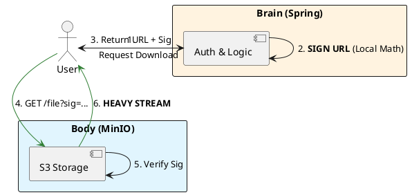

# 9.3: Control vs. Data Plane Orchestration

## The Critical Dialogue

**Student:** I've separated my videos into MinIO. But how does my Spring service stay in charge? If the browser talks directly to storage, how do I enforce permissions? How do I know when they finished watching?

**Principal:** You are learning the art of **Orchestration without Participation**. To reach Principal level, we must master the **Control/Data Plane Split**. Your Spring service is the **Control Plane** (The Brain)—it makes decisions. MinIO is the **Data Plane** (The Body)—it does the heavy lifting. We use **Cryptographic Handoffs** to ensure the Body only acts on the Brain's orders.

---

## 1. The Requirement: Orchestrated Authority

**The Problem:** The "Participation Trap." If the Brain participates in the data flow, it is crushed by the weight of the bits. If it stays out entirely, it loses authority.

---

## 2. Solution: The Signature Handoff

**The Principal Architecture:** We use **Presigned URLs** as our orchestration tool.

. **Mechanism:** The URL contains a hash of the file path, the expiry time, and a signature generated by the Brain's private key.
. **Validation:** MinIO uses the Brain's public key to verify the signature. 
. **The Result:** The Brain is 100% in control of security, but 0% involved in network I/O.

---

## 🧠 Principal's Inquiry

. **The Signature Tax:** How does the CPU cost of signing a URL compare to the CPU cost of streaming 1GB of bytes?

. **Webhook Integration:** How can you configure MinIO to notify the Brain when an object access finishes, so the Brain can update the "Last Viewed" metadata?

**Principal Summary:** Control/Data Orchestration is about **Strategic Delegation**. We keep logic in the nimble Control Plane and delegate the massive bits to the industrial Data Plane.
 Greenlanders use the type system to prove our software invariants.
