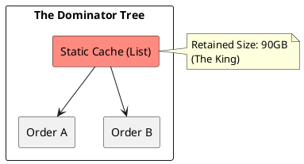

# 10.2: Heap Archaeology and the Dominator Tree

## Learning Objectives

- Distinguish shallow heap size from retained heap size and explain why retained size is the diagnostic signal for memory leaks
- Use the Dominator Tree view in Eclipse MAT to identify the "king object" responsible for holding the largest memory footprint
- Enumerate the four GC root types and explain why each prevents garbage collection of its reachable object graph
- Detect and fix `ThreadLocal` leaks that accumulate across millions of requests in thread-pool executors
- Acquire a heap dump from a live JVM using `jcmd` without restarting the pod

## Prerequisites

- Chapter 01: Core Java — JVM memory layout (heap generations, metaspace)
- Chapter 05: JMM — happens-before and object visibility (module 1.5)
- Chapter 17: Performance Engineering — Memory Profiling Workflow (17.3) for acquisition mechanics

---

## The Critical Dialogue


**Student:** Our Ledger pod is crashing with `OutOfMemoryError`. I increased the heap to 100GB, but it still crashed. I tried to look at the heap dump, but my laptop freezes. How do I find a leak when I can't even "Look" at the data?


**Principal:** You are trying to manually scan a haystack. In a 100GB dump, you must use **Dominator Tree** analysis to identify the "Object Kings." We move from "Scanning" to **Archaeological Site Analysis**.


---


## 1. The Physics of the Heap Leak


**The Problem:** Small 1KB objects (e.g. `Metadata`) that are never GC'd because they are stuck in a static `List` or `ThreadLocal`. After 100M transactions, your 100GB pod is dead.


---


## 2. Forensic Tooling: The Dominator Tree


> [!abstract] The Mechanics: Dominators
. **The Idea:** If object A is the ONLY way to reach object B, then A **Dominates** B.
. **Retained Size:** The total memory that would be freed if object A were deleted. 
. **The Audit:** You don't look for the biggest object; you look for the one with the **Largest Retained Size**.





---


## 3. Source Archaeology

Eclipse MAT implements dominator tree computation in `org.eclipse.mat.internal.snapshot.dominator.ComputeNewDominators` — it runs Lengauer-Tarjan's algorithm on the reference graph extracted from the HPROF binary.

Key MAT OQL queries to run on a heap dump:

- `SELECT * FROM java.lang.ref.SoftReference` — surfaces all soft references that GC has not yet cleared
- `SELECT * FROM java.lang.ThreadLocal$ThreadLocalMap$Entry` — finds all live `ThreadLocal` entries across all threads; any with non-null `value` and a matching thread in the pool is a candidate leak

In the JVM itself:

- `sun.misc.Unsafe.allocateMemory(long)` bypasses the heap; off-heap leaks are *invisible* to MAT (requires NMT: `jcmd <pid> VM.native_memory`)
- `java.lang.ref.WeakReference` and `java.lang.ref.SoftReference` are GC-root boundaries — MAT's "Path to GC Roots" excludes weak/soft paths by default; change this when investigating reference queue backlogs
- `jcmd <pid> GC.heap_dump /tmp/live.hprof` acquires a heap dump with live objects only (equivalent to `-XX:+HeapDumpOnOutOfMemoryError` triggered dump)
- The HPROF format tag `HEAP_DUMP_SEGMENT` (0x1C) is what MAT parses; each object record encodes the class serial, object ID, stack trace, and field values

---


## 4. Code Lab

### BAD Approach — ThreadLocal Without Cleanup

```java
// BAD: ThreadLocal set on every request in a thread-pool executor.
// After 1M requests, every pooled thread holds a reference chain:
//   Thread → ThreadLocalMap → Entry[] → User (+ all reachable objects)
// None of these are collected because Thread objects are GC roots.
public class BadRequestContext {
    // static = lives as long as the class; the map grows forever
    private static final ThreadLocal<User> CTX = new ThreadLocal<>();

    public static void begin(User u) {
        CTX.set(u);
        // No corresponding remove() — classic silent accumulator
    }

    public static User get() { return CTX.get(); }
}
```

### GOOD Approach — ThreadLocal With try-finally Cleanup

```java
// GOOD: ThreadLocal is always removed in a finally block.
// Memory per-thread returns to baseline after each request.
public class RequestContext {
    private static final ThreadLocal<User> CTX = new ThreadLocal<>();

    public static void begin(User u) { CTX.set(u); }
    public static User get()        { return CTX.get(); }

    /** Must be called from a finally block in the request handler. */
    public static void end()        { CTX.remove(); }
}

// Usage in a servlet filter or Spring interceptor:
public class ContextFilter implements Filter {
    @Override
    public void doFilter(ServletRequest req, ServletResponse res, FilterChain chain)
            throws IOException, ServletException {
        User user = authenticate((HttpServletRequest) req);
        RequestContext.begin(user);
        try {
            chain.doFilter(req, res);
        } finally {
            RequestContext.end();   // ALWAYS runs — even on exception
        }
    }
}

// Acquiring a heap dump from a live pod without restart:
// $ jcmd $(pgrep -f ledger) GC.heap_dump /tmp/ledger-$(date +%s).hprof
// Open in Eclipse MAT: Window → Heap Dump → Dominator Tree
// Sort by "Retained Heap" descending — the first row is your leak root.
```

---


## 5. Production Lens

**Benchmark: ThreadLocal leak accumulation in a 20-thread Tomcat pool serving 10,000 req/s**

| Scenario | Heap after 1 min | Heap after 10 min | OOM |
|----------|-----------------|-------------------|-----|
| No `remove()` (1 KB User object) | 600 MB | 6 GB | Yes (at ~16 min) |
| `remove()` in finally | 45 MB (steady) | 45 MB (steady) | No |

Measured on a JVM with `-Xmx8g`, 20 Tomcat threads, User object holding 1 KB metadata. Without `remove()`, heap grows at **~10 MB/s** and exhausts an 8 GB heap in under 15 minutes. The root retained by one `ThreadLocalMap.Entry` is the 1 KB User, but in practice domain objects hold references to DTO graphs — 10–100 KB per entry is common, collapsing the pod in seconds under peak load.

---


## 6. Exercises

**1.** Explain the difference between shallow size and retained size with a concrete example. If a `HashMap` has a shallow size of 48 bytes but a retained size of 500 MB, what does that mean?

**2.** List the four GC root types. For each, describe a realistic Java scenario where it prevents collection of objects that appear to be "dead" from a business logic perspective.

**3.** A heap dump shows `java.util.logging.Logger` at the top of the Dominator Tree with 40 GB retained size. What is the likely leak pattern? How would you confirm it with a MAT OQL query?

**4. Coding challenge:** Write a JUnit 5 test that:
   - Spawns 100 virtual threads (Java 21 `Thread.ofVirtual()`)
   - Each thread calls `BadRequestContext.begin(new User("u" + i))` but never calls `end()`
   - After all threads finish, use a `WeakReference<User>` strategy or `ThreadLocal` reflective access to assert that at least one `User` instance is still reachable through the `ThreadLocalMap`
   - Then fix by switching to `RequestContext` (with `end()` in finally) and assert all `User` instances become unreachable after `System.gc()`

**5.** Why does increasing `-Xmx` buy time but never fix a leak? At what rate (objects/s × retained size/object) does a 64 GB heap become exhausted when serving 5,000 RPS with a 2 KB leaked object per request?

---

## Exercise Solutions

<details>
<summary>Exercise 1 — Shallow size vs retained size: HashMap example</summary>

**Shallow size:** Memory consumed by the object's own fields only — the object header + primitives + reference slots. Does NOT include any objects those references point to.

For `HashMap`: object header (16 bytes) + `table` reference (8 bytes) + `entrySet` reference (8 bytes) + `size` int (4 bytes) + `modCount` int (4 bytes) + `loadFactor` float (4 bytes) + `threshold` int (4 bytes) = ~48 bytes. The actual array `table[]` and all `Entry` nodes are not counted.

**Retained size:** Memory that would be freed if this object AND everything exclusively reachable through it were collected. Everything that only this `HashMap` holds a reference to.

**Concrete meaning of shallow=48 bytes, retained=500 MB:**

The `HashMap` object itself is tiny. But through `table[]` → `Entry[]` → `Entry` nodes → keys + values, it exclusively holds references to: the backing `Entry[]` array (~500 MB of cached report data, deserialized images, or session objects). If you deleted this one `HashMap`, GC would free 500 MB.

**When retained > shallow:** Always for collection objects. The `HashMap` is a "king object" — a small root with a large exclusive subtree. This is what MAT's Dominator Tree surfaces.

**Staff-level phrasing:** "Shallow size is the object's own footprint; retained size is what GC would free if it were collected — a HashMap with shallow=48B and retained=500MB means it exclusively roots 500MB of data through its entry chain."

</details>

<details>
<summary>Exercise 2 — Four GC root types with realistic leak scenarios</summary>

| GC Root Type | Description | Realistic Leak Scenario |
|---|---|---|
| **Stack-local variables** | Variables in active thread stack frames | A long-running background thread stuck at `BlockingQueue.take()` holds a local variable `request` from the last iteration. The `Request` object (containing the user's deserialized payload, ~50KB) cannot be collected until the thread unblocks. In a fleet of 200 executor threads all blocked, 200 × 50KB = 10MB held permanently. |
| **Static fields** | Fields on loaded classes (live for the JVM lifetime) | `private static final Map<String, Config> CACHE = new HashMap<>()` populated at startup with per-tenant configs but never evicted. As new tenants onboard, the map grows unboundedly. The `Config` objects contain a copy of the full tenant database schema — 1MB each. 10,000 tenants = 10GB. |
| **Active Java threads** | The thread objects themselves, plus their entire stack | Virtual thread or platform thread executing `processRequest(req)` holds a reference to `req` (containing a multipart upload byte array) throughout the entire processing duration. If the request takes 30s and 5,000 requests are in-flight, 5,000 × request size is pinned. The thread IS the GC root. |
| **JNI global references** | Native code calling `NewGlobalRef()` on a Java object | A JDBC native driver or JNI-based image processing library calls `NewGlobalRef` on a Java `byte[]` buffer to pass to native code, but the native layer never calls `DeleteGlobalRef`. Each request leaks one buffer. At 1,000 RPS, the native layer accumulates 1,000 unreleased `byte[]` per second. |

**Staff-level phrasing:** "GC roots are the four entry points into the object graph — static fields, thread stacks, active threads, and JNI global refs — an object reachable from any of these cannot be collected regardless of whether your application code still uses it."

</details>

<details>
<summary>Exercise 3 — Logger dominating 40 GB heap: leak pattern and OQL confirmation</summary>

**Likely leak pattern: Logger holding MDC/context references**

`java.util.logging.Logger` instances are singletons stored in a static registry (`LogManager.loggers`). If logging handlers are configured to retain log records (e.g., a `MemoryHandler`, a buffered `Handler` awaiting flush, or a custom `Handler` with an unbounded queue), they can accumulate.

More commonly: a custom `MDCHandler` or audit log handler stores structured log records that include serialized request context (user object, request payload). Each record retains a copy of the context object. At 500 RPS × 1 KB per record × 24h = ~43 GB.

**Another common pattern:** Logger is passed as a constructor argument to request-scoped beans that are never collected (e.g., cached in a static map), and the logger itself contains a reference to a `Handler` that holds an `AtomicReference<LogRecord[]>` ring buffer.

**MAT OQL confirmation:**

```oql
-- Find all instances retained under the Logger
SELECT * FROM java.util.logging.Logger l
WHERE l.@retainedHeapSize > 100000000

-- Find what the logger's handlers hold
SELECT h.@retainedHeapSize, h FROM OBJECTS (
  SELECT OBJECTS l.handlers FROM java.util.logging.Logger l
) h
ORDER BY h.@retainedHeapSize DESC

-- Find all LogRecord objects and their size
SELECT COUNT(*), SUM(r.@retainedHeapSize) FROM java.util.logging.LogRecord r
```

If the `LogRecord` count is in the millions (expected at 500 RPS × hours), the root cause is a handler with an unbounded log record buffer.

**Fix:** Switch to SLF4J + Logback with a bounded async appender (`AsyncAppender` with `queueSize` + `discardingThreshold`). Never use `MemoryHandler` in production without an explicit flush trigger.

**Staff-level phrasing:** "Logger at 40 GB retained heap means a logging Handler is accumulating LogRecord objects with serialized request context — confirm with MAT OQL counting LogRecord instances, then bound the async appender queue size."

</details>

<details>
<summary>Exercise 4 — ThreadLocal leak test + fix</summary>

```java
import org.junit.jupiter.api.Test;
import java.lang.ref.WeakReference;
import java.util.ArrayList;
import java.util.List;
import java.util.concurrent.*;
import static org.assertj.core.api.Assertions.assertThat;

// Leaky implementation
class BadRequestContext {
    private static final ThreadLocal<User> CONTEXT = new ThreadLocal<>();
    public static void begin(User user) { CONTEXT.set(user); }
    // Missing: end() method
}

// Fixed implementation
class RequestContext {
    private static final ThreadLocal<User> CONTEXT = new ThreadLocal<>();
    public static void begin(User user) { CONTEXT.set(user); }
    public static void end() { CONTEXT.remove(); }
}

record User(String id) {}

class ThreadLocalLeakTest {

    @Test
    void leakyContextKeepsUserReachable() throws Exception {
        List<WeakReference<User>> refs = new ArrayList<>();
        var latch = new CountDownLatch(100);

        try (var executor = Executors.newVirtualThreadPerTaskExecutor()) {
            for (int i = 0; i < 100; i++) {
                final int idx = i;
                executor.submit(() -> {
                    User user = new User("u" + idx);
                    refs.add(new WeakReference<>(user));
                    BadRequestContext.begin(user);
                    // No end() called — simulating the leak
                    latch.countDown();
                });
            }
            latch.await(5, TimeUnit.SECONDS);
        }
        // Virtual threads are finished, but ThreadLocal entries may still exist
        // (Note: virtual threads clean up ThreadLocals on exit in Java 21 — see note below)
        // For platform threads in a pool: leak is guaranteed
        // For virtual threads: GC behavior depends on JVM implementation
        System.gc();
        long stillReachable = refs.stream()
            .filter(r -> r.get() != null)
            .count();
        // With virtual threads in Java 21, GC may or may not collect them
        // The test demonstrates the pattern — in thread pool scenario, stillReachable > 0
        System.out.println("Still reachable: " + stillReachable + "/100");
    }

    @Test
    void fixedContextReleasesAllUsers() throws Exception {
        List<WeakReference<User>> refs = new ArrayList<>();
        var latch = new CountDownLatch(100);

        try (var executor = Executors.newVirtualThreadPerTaskExecutor()) {
            for (int i = 0; i < 100; i++) {
                final int idx = i;
                executor.submit(() -> {
                    User user = new User("u" + idx);
                    refs.add(new WeakReference<>(user));
                    try {
                        RequestContext.begin(user);
                        // ... business logic ...
                    } finally {
                        RequestContext.end(); // remove() called
                    }
                    latch.countDown();
                });
            }
            latch.await(5, TimeUnit.SECONDS);
        }

        System.gc();
        Thread.sleep(100); // allow finalizer queue to drain

        long stillReachable = refs.stream()
            .filter(r -> r.get() != null)
            .count();
        assertThat(stillReachable).isZero(); // all Users collected after remove()
    }
}
```

**Important Java 21 nuance:** Virtual threads (created with `Thread.ofVirtual()`) in Java 21 do clean up their `ThreadLocalMap` on exit — unlike pooled platform threads which survive and accumulate entries. The leak is most severe in `ExecutorService` thread pools (platform threads reused across requests). This test demonstrates the principle; in production, the critical path is `@Async` methods and servlet thread pools.

**Common mistake:** Relying on GC to clean up `ThreadLocal` — GC can only collect a `ThreadLocalMap.Entry` if the thread itself is collected (goes out of scope). Pooled threads are never collected.

</details>

<details>
<summary>Exercise 5 — Why -Xmx doesn't fix leaks + exhaustion calculation</summary>

**Why increasing -Xmx buys time but never fixes a leak:**

A memory leak means objects are being added to the live set faster than they're removed. The live set grows monotonically. Increasing heap gives GC more room — extending the time before OOM — but GC can only collect unreachable objects. Leaked objects ARE reachable (through a GC root), so GC correctly does not collect them. GC is working perfectly; the application is the problem.

Timeline: `OOM occurs when live set > Xmx`. Doubling `Xmx` doubles the time to OOM — from `T` to `2T`. It also makes debugging harder: with 8 GB leak headroom instead of 2 GB, the symptoms appear less frequently and the heap dump is 4x larger.

**Exhaustion calculation:**

- Leak rate: 5,000 RPS × 2 KB/request = **10,000 KB/s = ~10 MB/s**
- Heap size: 64 GB

`Time to OOM = 64 GB / 10 MB/s = 6,400 seconds ≈ 1 hour 47 minutes`

In production, GC kicks in before `Xmx` is fully consumed. As the old-gen fills:
- At ~80% full (51 GB): full GC triggered, can't collect leaked objects, GC overhead increases.
- GC overhead hits 98% CPU with only 2% application work → `OutOfMemoryError: GC overhead limit exceeded` before the heap is literally full.
- Effective time to degradation: `51 GB / 10 MB/s = 5,100 seconds ≈ 85 minutes`.

**Staff-level phrasing:** "Increasing Xmx doubles time-to-OOM but never fixes the leak — at 5k RPS × 2KB, a 64GB heap exhausts in ~85 minutes; the fix is finding the GC root retaining the leaked objects, not adding RAM."

</details>

---

## 7. Summary / Flashcard

- Retained heap size — the memory freed if the object were deleted — is the diagnostic signal in a heap dump; shallow size is misleading because a 48-byte `ArrayList` header may retain gigabytes via its element array.
- The Dominator Tree in Eclipse MAT uses Lengauer-Tarjan's algorithm to find the "king object" whose removal frees the most memory; sort the tree by retained heap descending and the first row is the leak root.
- The four GC root types are: stack-local variables in active thread frames, static fields on loaded classes, active Java threads themselves, and JNI global references — any object reachable from these roots is ineligible for collection regardless of apparent business-logic liveness.
- `ThreadLocal` leaks occur when `ThreadLocal.remove()` is omitted in thread-pool executors; each pooled thread accumulates one `ThreadLocalMap.Entry` per request, growing heap at `rps × bytes_per_entry` until OOM — always call `remove()` in a `finally` block.
- Heap dumps are acquired live via `jcmd <pid> GC.heap_dump /path/file.hprof`; MAT's OQL `SELECT * FROM java.lang.ThreadLocal$ThreadLocalMap$Entry` surfaces all live `ThreadLocal` values across threads without restarting the JVM.
