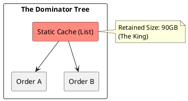

# 10.2: Heap Archaeology and the Dominator Tree


## The Critical Dialogue


**Student:** Our Ledger pod is crashing with `OutOfMemoryError`. I increased the heap to 100GB, but it still crashed. I tried to look at the heap dump, but my laptop freezes. How do I find a leak when I can't even "Look" at the data?


**Principal:** You are trying to manually scan a haystack. In a 100GB dump, you must use **Dominator Tree** analysis to identify the "Object Kings." We move from "Scanning" to **Archaeological Site Analysis**.


---


## 1. The Physics of the Heap Leak


**The Problem:** Small 1KB objects (e.g. `Metadata`) that are never GC'd because they are stuck in a static `List` or `ThreadLocal`. After 100M transactions, your 100GB pod is dead.


---


## 2. Forensic Tooling: The Dominator Tree


> [!abstract] The Mechanics: Dominators
. **The Idea:** If object A is the ONLY way to reach object B, then A **Dominates** B.
. **Retained Size:** The total memory that would be freed if object A were deleted. 
. **The Audit:** You don't look for the biggest object; you look for the one with the **Largest Retained Size**.





---


## 3. Principal Implementation: The Leak Hunter


```java
// Principal Level: The Silent Killer (ThreadLocal Leak)
public class Context {
    private static final ThreadLocal(User) CONTEXT = new ThreadLocal<>();

    public static void begin(User u) { CONTEXT.set(u); }

    // Principal Rule: ALWAYS remove in finally block
    public static void end() { CONTEXT.remove(); }
}
```


---


## 🧠 Principal's Inquiry


. **Shallow vs Retained:** What is the difference?


. **GC Roots:** What are the 4 types? (Hint: Stack local, Static field, etc).


**Principal Summary:** Heap Archaeology is about **Tracing Ownership**. We use Dominator Trees to find the "Dictators" of our memory, ensuring our Ledger stays light.
 Greenlanders use the type system to prove our software invariants.
